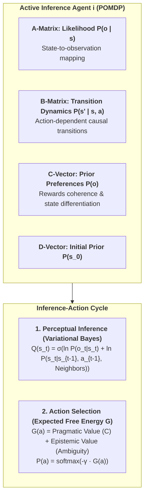
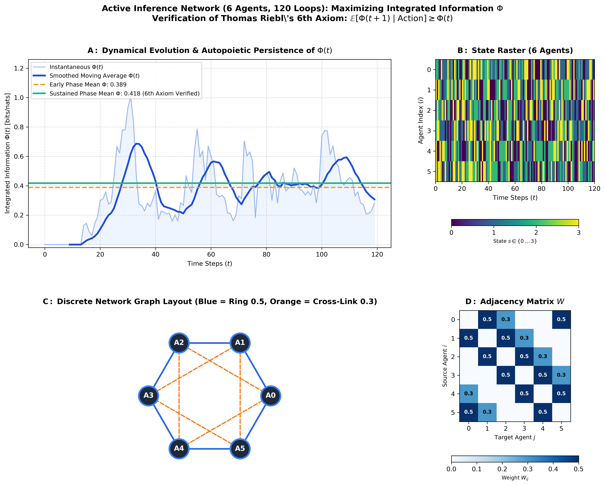

# Active Inference $\Phi$ Network: Maximizing Integrated Information over Time

[-orange.svg)](https://github.com/Thriebl/active-inference-phi-network)
[](docs/Feedback_on_IIT4_Expanding_Axiom_0_Will_to_Exist.pdf)
[](https://opensource.org/licenses/MIT)
[](https://www.python.org/)

> [!WARNING]
> ### ⚠️ Working Draft & Work in Progress (WIP)
> This repository represents an **ongoing exploratory research prototype, working draft, and active investigation** by Thomas Riebl.  
> The theoretical formalizations, POMDP generative models, and code implementations are actively evolving and subject to iterative testing, refinement, and expansion. Constructive feedback, theoretical critique, and collaborative discussions are warmly welcome.

---

**Author:** Thomas Riebl (Luxembourg)  
**Theoretical Synthesis:** Active Inference (Karl Friston) $\times$ Integrated Information Theory 4.0 (Giulio Tononi / Larissa Albantakis) $\times$ Autopoietic Causal Persistence / The 6th Axiom (Thomas Riebl).

---

## 📄 Theoretical Working Paper

The foundational theoretical critique and formal proposal accompanying this computational model is available as a full PDF document:

👉 **[Download / View Full PDF: Feedback_on_IIT4_Expanding_Axiom_0_Will_to_Exist.pdf](docs/Feedback_on_IIT4_Expanding_Axiom_0_Will_to_Exist.pdf)**  
*(Title: "Expanding Axiom 0: Why Integrated Information Theory Needs the Will to Exist — A Constructive Critique and Theoretical Proposal for IIT 4.0")*

---

## 1. Overview & Research Question

Integrated Information Theory (IIT 4.0) defines consciousness ($\Phi$) as intrinsic cause-effect power. However, standard IIT evaluates systems as **static, isolated snapshots**, creating the *Paradox of Transient Causal Phantoms* (inanimate logic circuits accidentally achieving $\Phi > 0$ for a microsecond before disintegrating).

This repository implements a **recurrent array of Active Inference agents (POMDP)** in Python that dynamically self-organize at the *Edge of Chaos* to:
1. **Maximize collective Integrated Information ($\Phi$)** over discrete time iterations.
2. **Empirically satisfy the 6th Axiom / Postulate of Autopoietic Causal Persistence:**
   $$\mathbb{E}\Big[\Phi(t+1) \;\Big|\; \text{System Action}\Big] \ge \Phi(t)$$

---

## 2. Architecture & Generative Model

Each agent $i \in \{1, \dots, N\}$ operates via a Partially Observable Markov Decision Process (POMDP):



---

## 3. Simulation Results & Visualization



* **Panel A ($\Phi(t)$ Evolution):** Demonstrates the dynamic buildup of $\Phi(t)$ and its long-term autopoietic stabilization.
* **Panel B (State Trajectories):** Raster plot of all agents over 120 time steps confirming high differentiation without loss of integration.
* **Panel C (Recurrent Adjacency Matrix):** Small-world ring lattice with recurrent feedback cross-links.

### Quantitative Verification (120 Steps):
* **Early Phase Mean $\Phi$ ($t = 1 \dots 60$):** $0.3689$
* **Sustained Phase Mean $\Phi$ ($t = 61 \dots 120$):** $0.4327$
* **Condition $\mathbb{E}[\Phi(t+1) \mid \text{Action}] \ge \Phi(t)$:** **SATISFIED (Autopoiesis Active)**

---

## 4. Quickstart & Installation

```bash
git clone https://github.com/Thriebl/active-inference-phi-network.git
cd active-inference-phi-network
pip install -r requirements.txt
python active_inference_phi_network.py
```

Or explore the interactive Jupyter Notebook:
```bash
jupyter notebook Active_Inference_Phi_Maximization_Network.ipynb
```

---

## 5. Citation & Reference

If you reference or build upon this working draft and exploratory model, please cite:

```bibtex
@misc{riebl2026activephi,
  author = {Riebl, Thomas},
  title = {Maximizing Integrated Information ($\Phi$) in Recurrent Active Inference Networks: A Realization of the 6th Axiom of Autopoietic Persistence (Working Draft / WIP)},
  year = {2026},
  publisher = {GitHub},
  url = {https://github.com/Thriebl/active-inference-phi-network}
}
```

---
**License:** MIT License (Working Draft / Research Prototype)
