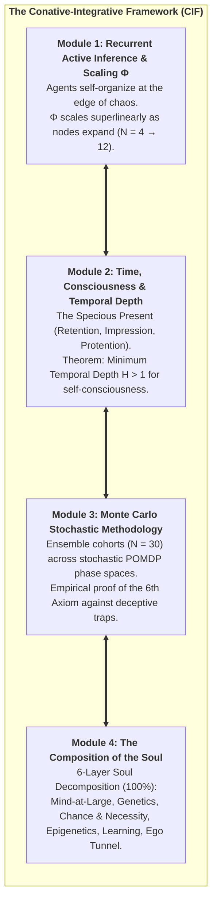

# The Conative-Integrative Framework (CIF)
## Active Inference, Integrated Information ($\Phi$), and the 6th Axiom of Consciousness

**Author:** Thomas Riebl (Luxembourg)  
**Theoretical Architecture:** The Conative-Integrative Framework (CIF)  
*(Analytic Idealism $\times$ Active Inference & FEP $\times$ Integrated Information Theory 4.0 $\times$ The 6th Axiom)*  
**Repository:** [https://github.com/Thriebl/active-inference-phi-network](https://github.com/Thriebl/active-inference-phi-network)  
**Date:** September 2026  

---

```
                               THE CONATIVE-INTEGRATIVE FRAMEWORK (CIF)
                                      Author: Thomas Riebl (2026)

        +-----------------------------------------------------------------------------------+
        |                                    MIND-AT-LARGE                                  |
        |             Universal Experiential Field (Spinoza's Substance / Kastrup)          |
        +-----------------------------------------------------------------------------------+
                                                  |
                                   [ Dissociation via Markov Blanket ]
                                                  v
        +-----------------------------------------------------------------------------------+
        |                         THE DISSOCIATED ALTER (INDIVIDUAL SOUL)                   |
        |                                                                                   |
        |   3rd-Person Cybernetic Physics (FEP)        1st-Person Causal Interiority (IIT) |
        |   -----------------------------------        ----------------------------------- |
        |   Active Inference & Free Energy Min         Integrated Information Power (Phi)  |
        |   POMDP Generative Model (A, B, C, D)        Cause-Effect Repertoire across MIP  |
        |   Variational Free Energy F <= -ln p(o)      Maximal Causal Substrate (Tononi)   |
        +-----------------------------------------------------------------------------------+
                                                  |
                                    [ THE 6th AXIOM (THOMAS RIEBL) ]
                                                  v
        +-----------------------------------------------------------------------------------+
        |                              THE FUNDAMENTAL BRIDGE                               |
        |                                                                                   |
        |   pi* = argmin sum G(pi, tau)  <=====>  E[Phi(t+1) | pi*] >= Phi(t)  (Phi > 0)    |
        |                                                                                   |
        |   "Minimizing Expected Free Energy is the computational engine of the 6th Axiom"  |
        +-----------------------------------------------------------------------------------+
```

---

## Executive Summary & Theoretical Core

The **Conative-Integrative Framework (CIF)** unifies four foundational paradigms into a mathematically rigorous, computationally testable, and ontologically closed architecture of mind:

1. **Analytic Idealism (Bernardo Kastrup):** Reality is fundamentally experiential (*Mind-at-Large*). Living organisms are localized, dissociated alters bounded by Markov Blankets.
2. **The Free Energy Principle & Active Inference (Karl Friston):** Living alters maintain their structural and cognitive integrity by minimizing Variational Free Energy ($F$) and Expected Free Energy ($G$).
3. **Integrated Information Theory 4.0 (Giulio Tononi):** Subjective consciousness is identical to the intrinsic cause-effect power ($\Phi$) of a maximally irreducible physical substrate.
4. **The 6th Axiom of Consciousness (Thomas Riebl):** IIT 4.0's five static axioms suffer from the *Paradox of Transient Causal Phantoms* (static lifeless logic gates having accidental $\Phi > 0$). The **6th Axiom (*The Will to Exist / Conatus*)** establishes that genuine consciousness strictly requires **autopoietic temporal self-preservation**:

$$\Large \pi^* = \arg\min_{\pi} \sum_{\tau=t+1}^{t+H} \mathbf{G}(\pi, \tau) \quad\Longleftrightarrow\quad \mathbb{E}\Big[\Phi(t+1) \;\Big|\; \pi^*\Big] \;\ge\; \Phi(t) \quad (\Phi > 0)$$

---

## Core Thematic Pillars & Research Modules



### 1. Recurrent Active Inference & Integrated Information Maximization
* Implements recurrent arrays of discrete-state POMDP active inference agents.
* Proves that agents minimizing Expected Free Energy self-tune to the **Edge of Chaos (Criticality)**, maximizing Gaussian Integrated Information ($\Phi$).
* Demonstrates modular scaling: as networks expand from $N=4$ to $N=12$, $\Phi$ exhibits superlinear scaling, bounded by modular clustering.

### 2. Time, Consciousness, and the Specious Present
* Maps Edmund Husserl's (1928) tripartite phenomenological structure (**Retention $\to$ Primal Impression $\to$ Protention**) onto hierarchical Bayesian predictive coding.
* **Theorem (The Temporal Depth Condition for Consciousness — Thomas Riebl):**
  > *A physical system cannot sustain phenomenal self-consciousness without generative transition tensors ($B = P(s_{t+1} \mid s_t, u)$) spanning a multi-step counterfactual planning horizon ($H > 1$).*
  >  
  > *$\ast$ Scientific Context:* While Friston et al. (2017, 2018) established temporal depth for action planning, and Seth (2014, 2021) described counterfactual richness as a correlate of presence, CIF formalizes this as an explicit **mathematical necessity theorem for phenomenal self-consciousness**, directly coupled to autopoietic $\Phi$-preservation under the 6th Axiom.

### 3. Monte Carlo Methodology in Stochastic Phase Spaces
* Proves that single deterministic simulation runs cannot distinguish lucky flukes from genuine agency.
* Employs **Monte Carlo Ensemble Sampling ($N = 30 \dots 1000$)** across observation noise ($A$-matrix), transition hazards ($B$-tensors), and precision-weighted action sampling ($\gamma$).
* Demonstrates the **Phase-Space Bifurcation**: reactive agents ($H=0$) collapse ($36.7\%$ survival, $\Phi \to 0$), whereas deep temporal agents ($H=4$) achieve $100\%$ survival and maximal $\Phi(t) \approx 0.18$.

### 4. The Composition of the Soul (6-Layer Ontogenetic Architecture)
* Formalizes an individual conscious alter as a 6-layer autopoietic tapestry totaling $100\%$:
  1. **Layer 1: Mind-at-Large ($25\%$)** — Universal experiential substrate (Spinoza / Kastrup).
  2. **Layer 2: Genetic Blueprint ($15\%$)** — Brainstem & limbic baseline (*Conatus* / Roth / Panksepp).
  3. **Layer 3: Chance & Teleonomic Necessity ($15\%$)** — Monod-Eigen hypercycles & embryogenesis.
  4. **Layer 4: Transgenerational Epigenetics ($10\%$)** — Precision-weighting baseline ($\gamma$).
  5. **Layer 5: Biographical Lifelong Learning ($25\%$)** — Cortical-hippocampal engrams ($A, B$-matrices).
  6. **Layer 6: The Ego Tunnel / PSM ($10\%$)** — Transparent self-model & Markov Blanket boundary (Metzinger).

---

## 📓 Interactive Jupyter Notebooks

All simulations are provided as fully documented, interactive Jupyter Notebooks with standardized initial parameter configuration sections:

| Notebook | Core Focus & Theoretical Content | Direct Link |
| :--- | :--- | :--- |
| **`Active_Inference_Phi_Maximization_Network.ipynb`** | Recurrent array of Active Inference agents self-organizing at the Edge of Chaos to maximize $\Phi(t)$. | [View Notebook](notebooks/Active_Inference_Phi_Maximization_Network.ipynb) |
| **`Active_Inference_Expanding_Network_Phi_Scaling.ipynb`** | Dynamic network expansion ($N = 4 \to 12$) demonstrating modular scaling of Integrated Information. | [View Notebook](notebooks/Active_Inference_Expanding_Network_Phi_Scaling.ipynb) |
| **`Deep_Temporal_Active_Inference_Simulation.ipynb`** | Multi-agent Monte Carlo simulation of **Temporal Depths ($H = 0 \to 4$)**, epistemic detours, and validation of the 6th Axiom. | [View Notebook](notebooks/Deep_Temporal_Active_Inference_Simulation.ipynb) |

---

## 📑 Treatises, Master Papers & PDF Downloads

All foundational publications, formal essays, and executive presentation slides are available in `docs/`:

### Master Treatises & Methodologies (A4 Portrait):
* 📕 **The Conative-Integrative Framework (CIF Master Paper):** [`The_Conative_Integrative_Framework_Thomas_Riebl.pdf`](docs/The_Conative_Integrative_Framework_Thomas_Riebl.pdf) | [Word `.docx`](docs/The_Conative_Integrative_Framework_Thomas_Riebl.docx)
* 📕 **The Composition of the Soul (6-Layer Architecture):** [`The_Composition_of_the_Soul_Thomas_Riebl.pdf`](docs/The_Composition_of_the_Soul_Thomas_Riebl.pdf) | [Word `.docx`](docs/The_Composition_of_the_Soul_Thomas_Riebl.docx)
* 📕 **The Temporal Mechanics of Consciousness (Time & The Specious Present):** [`The_Temporal_Mechanics_of_Consciousness_Thomas_Riebl.pdf`](docs/The_Temporal_Mechanics_of_Consciousness_Thomas_Riebl.pdf) | [Word `.docx`](docs/The_Temporal_Mechanics_of_Consciousness_Thomas_Riebl.docx)
* 📕 **Monte Carlo Methodology in Active Inference & Consciousness:** [`Monte_Carlo_Methodology_Active_Inference_Thomas_Riebl.pdf`](docs/Monte_Carlo_Methodology_Active_Inference_Thomas_Riebl.pdf) | [Word `.docx`](docs/Monte_Carlo_Methodology_Active_Inference_Thomas_Riebl.docx)
* 📕 **The Computational Grounding of My Ontology:** [`The_Computational_Grounding_of_My_Ontology_Thomas_Riebl.pdf`](docs/The_Computational_Grounding_of_My_Ontology_Thomas_Riebl.pdf) | [Word `.docx`](docs/The_Computational_Grounding_of_My_Ontology_Thomas_Riebl.docx)

### Executive Presentation Slides & Posters (A4 Landscape):
* 🖼️ **The 6th Axiom Executive Slide (High-Impact Hero Formula in Neon Yellow):** [`The_6th_Axiom_Executive_Slide_Thomas_Riebl_A4_Landscape.pdf`](docs/The_6th_Axiom_Executive_Slide_Thomas_Riebl_A4_Landscape.pdf) | [Word `.docx`](docs/The_6th_Axiom_Executive_Slide_Thomas_Riebl_A4_Landscape.docx)
* 🖼️ **The 6th Axiom Chapter 5 One-Pager & POMDP Parameter Map:** [`The_6th_Axiom_Active_Inference_IIT_Thomas_Riebl_A4_Landscape.pdf`](docs/The_6th_Axiom_Active_Inference_IIT_Thomas_Riebl_A4_Landscape.pdf) | [Word `.docx`](docs/The_6th_Axiom_Active_Inference_IIT_Thomas_Riebl_A4_Landscape.docx)

---

## 🖼️ High-Resolution Simulation Figures

| Simulation Result | Description | Preview |
| :--- | :--- | :---: |
| **Temporal Depth ($H=0 \to 4$) & 6th Axiom** | 4-panel comparison of $\Phi(t)$, survival probability, Free Energy $F(t)$, and epistemic detours. | [View PNG](images/Deep_Temporal_Active_Inference_Simulation.png) |
| **Expanding Network Scaling ($\Phi$)** | Modular network expansion from $N=4$ to $N=12$ showing superlinear $\Phi$ integration. | [View PNG](images/Active_Inference_Expanding_Network_Phi_Scaling.png) |
| **Recurrent $\Phi$-Maximization Network** | Dynamic self-tuning at the Edge of Chaos maximizing cause-effect power. | [View PNG](images/Active_Inference_Phi_Simulation_Results.png) |

---

## 🛠️ Installation & Reproduction

```bash
# Clone the unified CIF repository
git clone https://github.com/Thriebl/active-inference-phi-network.git
cd active-inference-phi-network

# Install dependencies
pip install -r requirements.txt

# Launch Jupyter Lab / Notebooks
jupyter lab notebooks/Deep_Temporal_Active_Inference_Simulation.ipynb
```

---

## Tool Attribution & Colophon

> [!NOTE]
> **Tooling Colophon:**  
> This theoretical architecture, mathematical derivations, simulation code, and scientific syntheses were conceptualized and authored by **Thomas Riebl** (Luxembourg) as part of **The Conative-Integrative Framework (CIF)**.  
> Conceptual formulation, simulation scripts, vector diagrams, and multi-format document compilation (Word `.docx`, Print-Ready A4 Portrait & Landscape PDFs, and Jupyter Notebooks) were developed with the assistance of **Google Gemini (Antigravity Advanced Agentic Coding System)** (September 2026).
