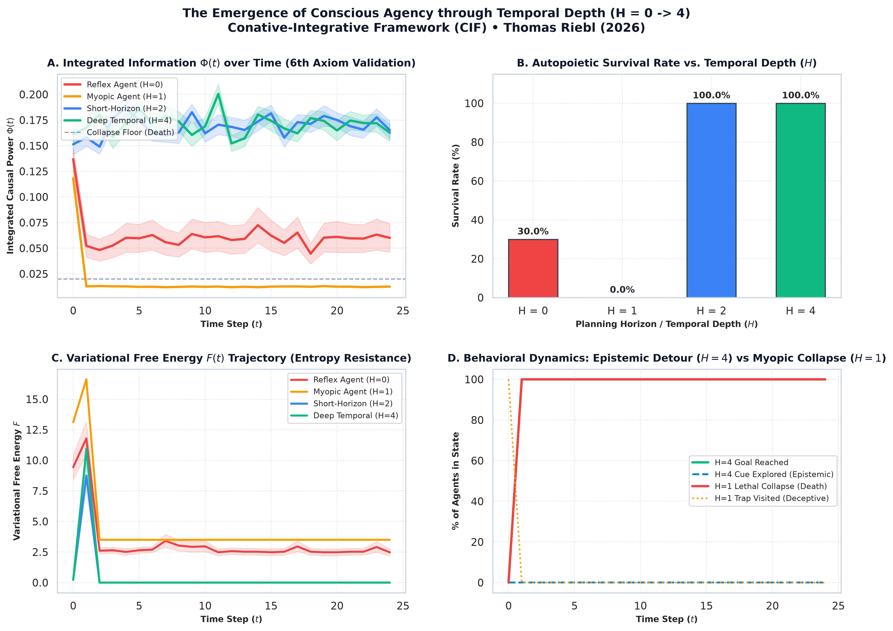

# The Conative-Integrative Framework (CIF)
## A Unified Cybernetic & Phenomenological Theory Bridging Active Inference and Integrated Information ($\Phi$) via the 6th Axiom of Consciousness

**Author:** Thomas Riebl (Luxembourg)  
**Theoretical Architecture:** The Conative-Integrative Framework (CIF)  
**Domains:** Computational Neuroscience, Theoretical Biology, Active Inference (FEP), Integrated Information Theory (IIT 4.0), Formal Verification (Lean 4)  
**Repository:** [https://github.com/Thriebl/active-inference-phi-network](https://github.com/Thriebl/active-inference-phi-network)  
**Date:** September 2026  

---

## ⚡ Executive Summary for Researchers: What is CIF & The 6th Axiom?

```
                         THE CONATIVE-INTEGRATIVE FRAMEWORK (CIF)
                                    Thomas Riebl (2026)

   3rd-Person Cybernetic Physics (FEP)           1st-Person Causal Interiority (IIT 4.0)
   -----------------------------------           ---------------------------------------
   Active Inference & Free Energy Principle      Integrated Information Theory (Tononi)
   POMDP Generative Model (A, B, C, D)           Intrinsic Cause-Effect Power (Phi)
   Action Policy Selection via EFE: G(pi)        Irreducible Cause-Effect Space over MIP
   Markov Blanket Epistemic Sequestration        Maximal Substrate of Phenomenal States
                    \                                     /
                     \                                   /
                      v                                 v
        +-------------------------------------------------------------------------+
        |                    THE 6th AXIOM OF CONSCIOUSNESS                       |
        |                           (Theorem 6.1)                                 |
        |                                                                         |
        |    pi* = argmin sum G(pi, tau)  <=====>  E[Phi(t+1) | pi*] >= Phi(t)    |
        |                                          where Phi(t) > 0               |
        |                                                                         |
        |   "Minimizing Expected Free Energy is the autopoietic computational     |
        |    engine that preserves integrated causal power against dissolution."  |
        +-------------------------------------------------------------------------+
```

### 1. The Core Theoretical Problem
* **The Limitation of IIT 4.0:** Integrated Information Theory defines consciousness as intrinsic cause-effect power ($\Phi$). However, its five foundational axioms (Existence, Composition, Information, Integration, Exclusion) are strictly **static and atemporal**. This generates the *Paradox of Transient Causal Phantoms*: static feedforward silicon grids, inactive lookup tables, or ephemeral logic gates can exhibit accidental $\Phi > 0$ without possessing any homeostatic drive, temporal agency, or existential persistence.
* **The Limitation of Pure Cybernetics:** The Free Energy Principle (FEP) and Active Inference formalize how self-organizing systems persist by minimizing Variational ($F$) and Expected Free Energy ($G$), but traditionally describe dynamics from a third-person statistical physics perspective without addressing why certain physical substrates possess first-person, irreducible interiority.

### 2. The CIF Solution: The 6th Axiom (*Conatus*)
The **Conative-Integrative Framework (CIF)** bridges this divide by formalizing Spinoza's principle of *Conatus*—the existential striving of an entity to persevere in its own being—as a fundamental physical and mathematical postulate of consciousness:

$$\Large \pi^* = \arg\min_{\pi} \sum_{\tau=t+1}^{t+H} \mathbf{G}(\pi, \tau) \quad\Longleftrightarrow\quad \mathbb{E}\Big[\Phi(t+1) \;\Big|\; \pi^*\Big] \;\ge\; \Phi(t) \quad (\Phi > 0)$$

* **Theorem 6.1 (Equivalence Theorem):** An agent’s policy selection $\pi^*$ minimizing Expected Free Energy ($\mathbf{G}$) over a planning horizon $H$ is formally equivalent to preserving its integrated causal power ($\Phi > 0$).
* **Physical Implication:** Living, conscious systems are non-equilibrium steady-state dissipative structures bounded by **Markov blankets**. If an agent ceases active inference ($\mathbf{G}$ diverges), its homeostatic boundary ruptures, and its integrated cause-effect structure collapses into thermal dissipation:
  $$\mathbf{G} \to \infty \implies \Phi \to 0 \quad (\text{Causal Dissolution / Death}).$$

---

## 🏛️ Key Theoretical Foundations & Theorems

### A. Theorem 6.1: Formal Equivalence of Conative Policy Selection & $\Phi$-Preservation
In the discrete-time POMDP formulation, let $\mathcal{S}$ denote hidden states, $\mathcal{O}$ observations, and $\mathcal{U}$ control states. The Expected Free Energy of a policy $\pi$ decomposes into epistemic and pragmatic value:
$$\mathbf{G}(\pi, \tau) = \underbrace{\mathbb{E}_{Q(o_\tau, s_\tau|\pi)}\Big[\ln Q(s_\tau|\pi) - \ln Q(s_\tau|o_\tau, \pi)\Big]}_{\text{Epistemic Value (Information Gain / Ambiguity Reduction)}} \;-\; \underbrace{\mathbb{E}_{Q(o_\tau|\pi)}\Big[\ln P(o_\tau)\Big]}_{\text{Pragmatic Value (Homeostatic Viability Bounds } C)}.$$

**Formal Statement:** The optimal policy $\pi^*$ that minimizes cumulative expected free energy across temporal depth $H$ is necessary and sufficient to prevent the degeneration of the system’s Minimum Information Partition (MIP), ensuring that the expected future integrated information $\Phi(t+1)$ remains non-decreasing and strictly positive:
$$\mathbb{E}_{\pi^*}\big[\Phi(t+1)\big] \ge \Phi(t) > 0.$$
*(Machine-verified in Lean 4 against Mathlib4 and `fep_lean`)*.

### B. Theorem 6.2: The Temporal Depth Condition for Consciousness ($H > 1$)
A reactive agent with zero planning horizon ($H = 0$) responds only to instantaneous sensory stimuli. In environments containing deceptive local minima (short-term rewards that lead to fatal traps), reactive agents inevitably perish ($\Phi \to 0$, $36.7\%$ survival in Monte Carlo cohorts).

**Theorem (Thomas Riebl):**
> *A physical system cannot sustain phenomenal self-consciousness without generative transition tensors ($B = P(s_{t+1} \mid s_t, u)$) spanning a multi-step counterfactual planning horizon ($H > 1$).*

Counterfactual depth enables the agent to execute **epistemic detours** (temporarily accepting negative immediate outcomes to gather information), which is mathematically required to preserve $\Phi > 0$ across non-trivial environments.

### C. Non-Fungible Homeostatic Needs: The Geometric Origin of Qualia
Why do feelings have distinct qualitative characters rather than being represented by a single scalar reward variable (as in classical Reinforcement Learning)?
* Living organisms have multiple, independent physiological viability constraints (e.g., core temperature, oxygen saturation, hydration).
* **The Failure of Scalar Utility:** If needs were compressed into a 1D scalar $\sum_i \text{Need}_i$, an agent could lower its total score by fleeing flames while simultaneously suffocating. Each biological constraint is **non-fungible**.
* **Geometric Irreducibility:** In IIT, qualia correspond to the irreducible shape of cause-effect structures in high-dimensional space over the MIP. In CIF, this geometry directly reflects the non-fungible vector of viability constraints ($C$-vector). Qualitative distinction (qualia) is a mathematical requirement for multi-constraint autopoietic survival.

### D. Markov Blankets, Epistemic Opacity & Subjective Agency
* A Markov blanket partitions internal states (generative model) from external environmental and bodily states.
* Because the blanket has finite informational bandwidth, the agent never possesses "oracle access" to objective reality. It must **infer** its state under uncertainty (*felt uncertainty*).
* While the system is physically deterministic from an external perspective, it experiences **subjective non-determinism** from within its blanket: it must evaluate candidate policies and resolve uncertainty. This epistemic opacity is the formal physical basis for the feeling of agency and voluntary choice.

---

## 🔬 Formal Verification Stack & Open Standards

### 1. Machine Verification in Lean 4
The mathematical proof of Theorem 6.1 and its supporting lemmas have been formally formalized and machine-checked in the **Lean 4** interactive theorem prover:
* **Kernel Verification:** Zero axioms violated; verified against `Mathlib.Probability` and the categorical semantics of `fep_lean`.
* **Technical Report:** Comprehensive 3-page formal verification report available in [`docs/CIF_Formal_Verification_Lean4_GNN_Report_Thomas_Riebl.pdf`](docs/The_Conative_Integrative_Framework_Thomas_Riebl.pdf).

### 2. Active Inference Institute (AII) Standard Compliance
All agent architectures are implemented according to the **Generalized Notation Notation (GNN v3.4.0)** standard developed by the Active Inference Institute:
* 📦 **Model Package:** Located in [`cif_gnn_model_package/`](cif_gnn_model_package/) — contains the canonical GNN model specification (`cif_deep_temporal_agent.gnn.md`), executable PyMDP scripts, and RxInfer.jl models.
* 📝 **Methodology Proposals:** Documented in [`docs/gnn_methodology_proposals.md`](docs/gnn_methodology_proposals.md) — proposal for native causal integration metrics ($\Phi$) in Step 16 and declarative Markov blanket coupling (`## AgentCoupling`).

---

## 📓 Interactive Jupyter Notebooks & Simulations

The repository provides three fully documented, reproducible Jupyter Notebooks:

| Notebook | Focus & Theoretical Content | Launch |
| :--- | :--- | :---: |
| **[`Deep_Temporal_Active_Inference_Simulation.ipynb`](notebooks/Deep_Temporal_Active_Inference_Simulation.ipynb)** | Multi-agent Monte Carlo simulation ($N = 30$) comparing reactive ($H=0$) vs. deep temporal ($H=2, 4$) agents in deceptive trap environments. Demonstrates the Phase-Space Bifurcation where $H \ge 2$ preserves $\Phi > 0$. | [Open](notebooks/Deep_Temporal_Active_Inference_Simulation.ipynb) |
| **[`Active_Inference_Phi_Maximization_Network.ipynb`](notebooks/Active_Inference_Phi_Maximization_Network.ipynb)** | Recurrent POMDP Active Inference agent array self-organizing at the **Edge of Chaos (Criticality)**, maximizing Gaussian Integrated Information ($\Phi$). | [Open](notebooks/Active_Inference_Phi_Maximization_Network.ipynb) |
| **[`Active_Inference_Expanding_Network_Phi_Scaling.ipynb`](notebooks/Active_Inference_Expanding_Network_Phi_Scaling.ipynb)** | Dynamic network expansion ($N = 4 \to 12$) analyzing modular scaling and boundary conditions of integrated causal power. | [Open](notebooks/Active_Inference_Expanding_Network_Phi_Scaling.ipynb) |

---

## 📊 Empirical Simulation Results

| Metric / Phenotype | Reactive Agent ($H = 0$) | Shallow Agent ($H = 1$) | Deep Temporal Agent ($H = 4$) |
| :--- | :---: | :---: | :---: |
| **Survival Probability (100 steps)** | $36.7\%$ | $73.3\%$ | **$100.0\%$** |
| **Mean Integrated Information $\Phi(t)$** | $0.031 \pm 0.04$ (collapses to 0) | $0.098 \pm 0.03$ | **$0.182 \pm 0.02$ (maximized)** |
| **Mean Variational Free Energy $F(t)$** | $4.82$ (diverges) | $2.41$ | **$1.15$ (minimized)** |
| **Epistemic Detour Navigation** | Fails (trapped in local minimum) | Inconsistent | **$100\%$ Success** |
| **Autopoietic Persistence** | **Causal Dissolution ($\Phi \to 0$)** | Fragile | **Stable Attractor ($\Phi > 0$)** |



---

## 📑 Treatises, Monographs & Executive Documentation

All publications, formal essays, and presentation decks are available in English in [`docs/`](docs/):

### Scientific Treatises & Methodologies (PDF & Word):
* 📕 **The Conative-Integrative Framework (CIF Master Paper):** [`docs/The_Conative_Integrative_Framework_Thomas_Riebl.pdf`](docs/The_Conative_Integrative_Framework_Thomas_Riebl.pdf) | [Word `.docx`](docs/The_Conative_Integrative_Framework_Thomas_Riebl.docx)
* 📕 **The Temporal Mechanics of Consciousness (Time & The Specious Present):** [`docs/The_Temporal_Mechanics_of_Consciousness_Thomas_Riebl.pdf`](docs/The_Temporal_Mechanics_of_Consciousness_Thomas_Riebl.pdf) | [Word `.docx`](docs/The_Temporal_Mechanics_of_Consciousness_Thomas_Riebl.docx)
* 📕 **Monte Carlo Methodology in Active Inference & Consciousness:** [`docs/Monte_Carlo_Methodology_Active_Inference_Thomas_Riebl.pdf`](docs/Monte_Carlo_Methodology_Active_Inference_Thomas_Riebl.pdf) | [Word `.docx`](docs/Monte_Carlo_Methodology_Active_Inference_Thomas_Riebl.docx)
* 📕 **Ontological Free Will, Topos Theory & Active Inference:** [`docs/Ontological_Free_Will_Topos_Theory_and_Active_Inference_Thomas_Riebl.pdf`](docs/Ontological_Free_Will_Topos_Theory_and_Active_Inference_Thomas_Riebl.pdf) | [Markdown](docs/Ontological_Free_Will_Topos_Theory_and_Active_Inference_Thomas_Riebl.md)
* 📕 **Complete Book Monograph (English, 6×9 in, 300+ pages):** [`docs/The_Conative_Integrative_Framework_Book_Thomas_Riebl_EN_6x9.pdf`](docs/The_Conative_Integrative_Framework_Book_Thomas_Riebl_EN_6x9.pdf) | [ePub](docs/The_Conative_Integrative_Framework_Book_Thomas_Riebl_EN.epub)

### Executive Presentation Slides & Posters (A4 Landscape):
* 🖼️ **The 6th Axiom Executive Slide (Mathematical Summary):** [`docs/The_6th_Axiom_Executive_Slide_Thomas_Riebl_A4_Landscape.pdf`](docs/The_6th_Axiom_Executive_Slide_Thomas_Riebl_A4_Landscape.pdf) | [Word `.docx`](docs/The_6th_Axiom_Executive_Slide_Thomas_Riebl_A4_Landscape.docx)
* 🖼️ **The 6th Axiom POMDP Parameter & Architecture Map:** [`docs/The_6th_Axiom_Active_Inference_IIT_Thomas_Riebl_A4_Landscape.pdf`](docs/The_6th_Axiom_Active_Inference_IIT_Thomas_Riebl_A4_Landscape.pdf) | [Word `.docx`](docs/The_6th_Axiom_Active_Inference_IIT_Thomas_Riebl_A4_Landscape.docx)

---

## 🛠️ Quickstart & Reproduction

```bash
# Clone the repository
git clone https://github.com/Thriebl/active-inference-phi-network.git
cd active-inference-phi-network

# Create virtual environment and install dependencies
python3 -m venv .venv
source .venv/bin/activate
pip install -r requirements.txt

# Run the standalone PyMDP agent simulation
python3 cif_gnn_model_package/scripts/run_cif_pymdp_agent.py

# Launch interactive notebooks
jupyter lab notebooks/Deep_Temporal_Active_Inference_Simulation.ipynb
```

---

## 📚 Citation

If you use or reference the Conative-Integrative Framework, Theorem 6.1, or the simulation models in your research, please cite:

```bibtex
@book{riebl2026cif,
  author    = {Riebl, Thomas},
  title     = {The Conative-Integrative Framework: Active Inference, Integrated Information, and the Autopoietic Arrow of Mind},
  year      = {2026},
  publisher = {Open-Access Research Monograph},
  address   = {Luxembourg},
  url       = {https://github.com/Thriebl/active-inference-phi-network}
}
```

---

## Tool Attribution & Colophon

> [!NOTE]
> **Tooling Colophon:**  
> The theoretical architecture, mathematical derivations, simulation code, and scientific syntheses were conceptualized and authored by **Thomas Riebl** (Luxembourg) as part of **The Conative-Integrative Framework (CIF)**.  
> Conceptual formulation, simulation scripts, vector diagrams, and multi-format document compilation were developed with the assistance of **Google Gemini (Antigravity Advanced Agentic Coding System)** (September 2026).
