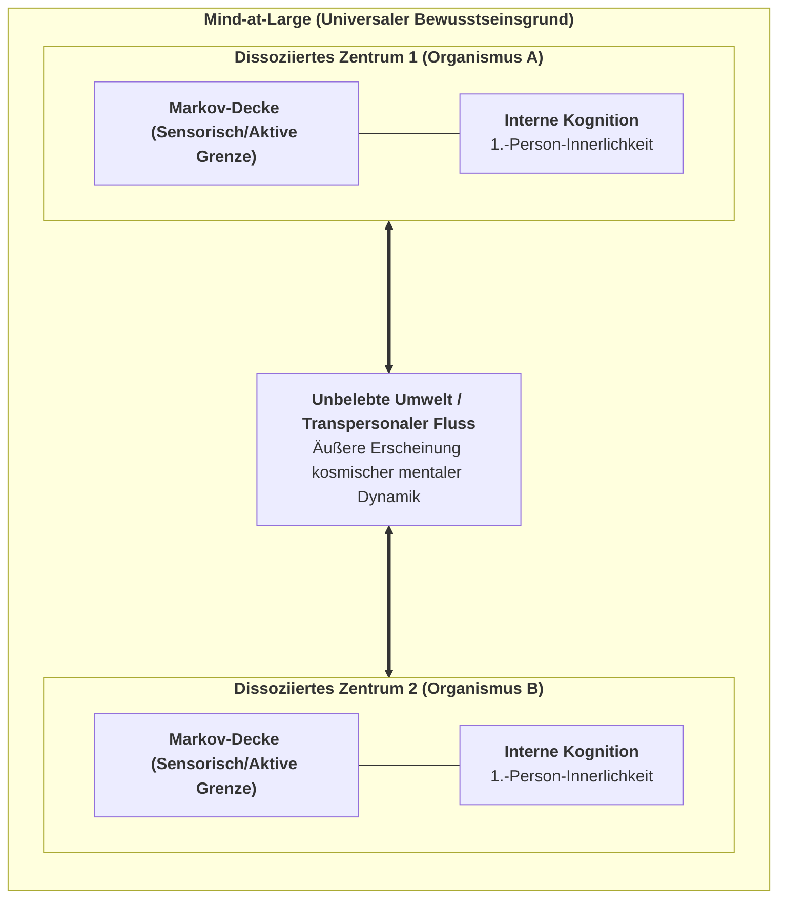
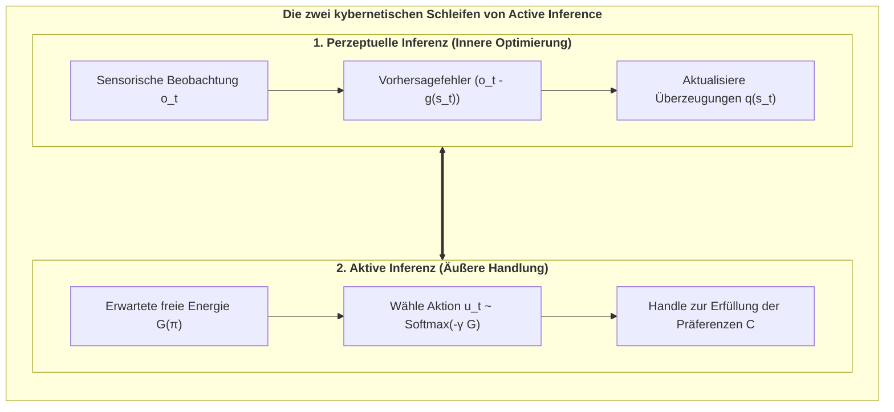
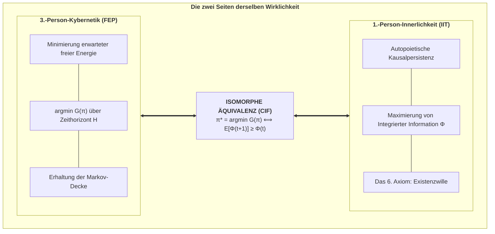
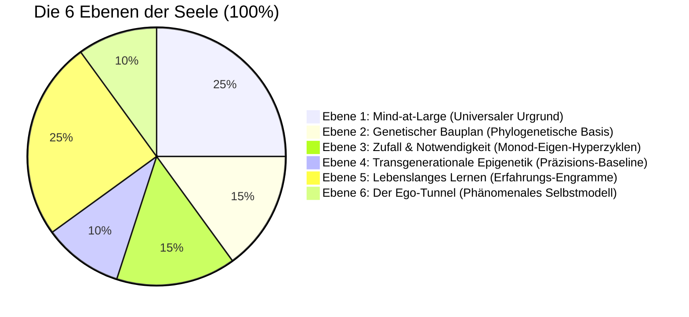
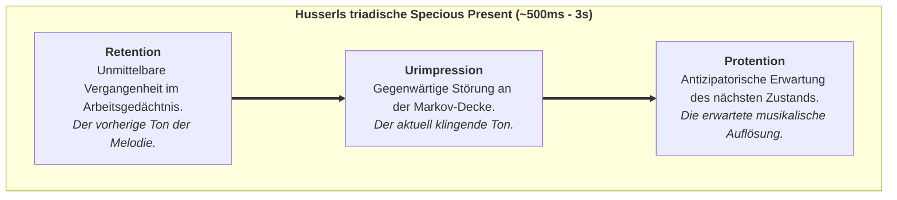
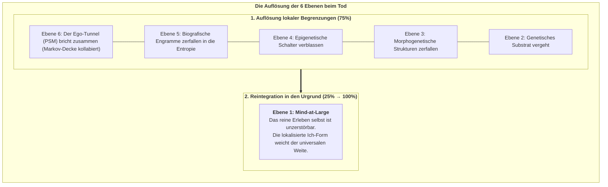

# Widmung {-}

   

*Allen forschenden Geistern gewidmet, die erkennen, dass Bewusstsein kein zufälliges Nebenprodukt toter Materie ist, sondern der fundamentale Urgrund der Wirklichkeit selbst – und all jenen, die danach streben, die mathematische Strenge der Naturwissenschaft mit der lebendigen Tiefe subjektiver Innerlichkeit zu vereinen.*

# Vorwort des Autors {-}

Seit mehr als drei Jahrhunderten wird das naturwissenschaftliche Weltbild von einer tiefgreifenden metaphysischen Grundannahme beherrscht: dass die objektive Wirklichkeit fundamental aus toter, geistloser Materie besteht, aus der subjektives Bewusstsein auf magische Weise emergieren soll. Trotz bahnbrechender neurobiologischer Fortschritte ist dieses physikalistische Paradigma an eine unüberwindbare Grenze gestoßen – das sogenannte „Schwere Problem des Bewusstseins“ (*The Hard Problem of Consciousness*, Chalmers, 1995). Je detaillierter wir neuronale Aktionspotenziale und synaptische Transmitterströme kartieren, desto unüberbrückbarer wird die Erklärungslücke zwischen quantitativen objektiven Mechanismen und der qualitativen Wirklichkeit von Schmerz, Freude, Liebe, dem Duft einer Rose oder dem Verstreichen der Zeit.

Diese Monographie präsentiert eine radikale, mathematisch fundierte Alternative: **Das Konativ-Integrative Framework (CIF)**.

Das CIF ist kein spekulativer Rückzug in philosophischen Mystizismus; es ist eine geschlossene, rechnerisch überprüfbare Ontologie, die vier der anspruchsvollsten theoretischen Entwicklungen der modernen Wissenschaft zu einer Einheit verschmilzt:
1. **Analytischer Idealismus (Bernardo Kastrup):** Die Erkenntnis, dass die Wirklichkeit in ihrem Wesen erfahrungsbasiert ist – ein universales Bewusstseinsfeld (*Mind-at-Large*). Lebendige Organismen sind lokalisierte, dissoziierte Bewusstseinszentren (*Alters*), die durch statistische Markov-Decken (*Markov Blankets*) abgegrenzt sind.
2. **Das Free Energy Principle & Active Inference (Karl Friston):** Die formale Physik der Selbstorganisation, die beschreibt, wie lebendige Systeme ihre Existenz gegen den Zerfall bewahren, indem sie variationale freie Energie ($F$) und erwartete freie Energie ($G$) minimieren.
3. **Integrierte Informationstheorie 4.0 (Giulio Tononi):** Die mathematische Formulierung von Bewusstsein als intrinsische Ursache-Wirkungs-Macht ($\Phi$) innerhalb eines maximal irreduziblen Substrats.
4. **Das 6. Axiom des Bewusstseins (Thomas Riebl):** Die Lösung des *Paradoxons der Kausalphantome* in der IIT 4.0 durch den formalen Beweis, dass echtes phänomenales Bewusstsein zwingend an **autopoietische Selbsterhaltung über die Zeit (*Der Existenzwille / Conatus*)** gebunden ist:
   $$\pi^* = \arg\min_{\pi} \sum_{\tau=t+1}^{t+H} \mathbf{G}(\pi, \tau) \quad\Longleftrightarrow\quad \mathbb{E}\Big[\Phi(t+1) \;\Big|\; \pi^*\Big] \;\ge\; \Phi(t) \quad (\Phi > 0)$$

Indem dieses Werk die 3.-Person-Kybernetik von Active Inference mit der 1.-Person-Kausalontologie der Integrierten Informationstheorie unter dem Dach des Analytischen Idealismus vereint, löst es den dualistischen Bruch auf, der die westliche Philosophie seit René Descartes gespalten hat. Es liefert eine formale Antwort auf die fundamentalen Fragen: *Was ist eine individuelle Seele?*, *Warum erleben wir die Zeit als gerichteten Fluss?* und *Wo verläuft die rechnerische Schwelle zwischen reaktiven Automaten und echtem bewussten Geist?*

 
*Thomas Riebl*  
*Luxemburg, September 2026*

# Das Epistemologische Manifest: Jenseits des Cogito {-}

Descartes' berühmter Satz *Cogito, ergo sum* („Ich denke, also bin ich“) legte das Fundament für den modernen Individualismus, pflanzte jedoch zugleich den Keim des cartesianischen Dualismus und die Illusion eines isolierten denkenden Egos, das der Welt fremd gegenübersteht.

Im Konativ-Integrativen Framework überwinden wir dieses Fundament durch eine **Post-Cogitate Epistemologie**:

1. **Bewusstsein ist ontologisch primär:** Bewusstsein ist nicht etwas, das ein Gehirn *erzeugt*; vielmehr ist das physische Gehirn das, wie der Prozess lokalisierten Bewusstseins von der Außenseite einer Markov-Decke *erscheint*.
2. **Das „Ich“ ist ein transparentes Modell:** Nach Thomas Metzinger (2003, 2009) ist das subjektive Ego ein phänomenales Selbstmodell (PSM) – ein hochkomplexes Werkzeug, das durch temporale Active Inference generiert wird, um Handlungen zu steuern und existenzielle Überraschung zu minimieren.
3. **Conatus als Urantrieb:** Nach Spinoza (1677) und Schopenhauer (1819) ist der fundamentale Impuls allen Lebens der *Conatus* – das unaufhörliche Streben eines dissoziierten Bewusstseinszentrums, seine Integrität zu bewahren und dem thermodynamischen Zerfall zu widerstehen.

Dieses Buch liefert das mathematische, neurobiologische und rechnerische Gerüst für dieses Weltbild.

\newpage

# Kapitel 1: Die Krise des Physikalismus & Die Architektur von Mind-at-Large

> *„Erfahrung ist kein Nebenprodukt der Materie; Materie ist das äußere Erscheinungsbild erfahrungsbasierter Prozesse, beobachtet über eine dissoziative Grenze hinweg.“*  
> — **Bernardo Kastrup**, *The Idea of the World* (2019)

---

## 1.1 Die Erklärungslücke des Physikalismus

Über drei Jahrhunderte hinweg haben die Naturwissenschaften unter dem impliziten Dogma des **Physikalismus** (des reduktiven Materialismus) gearbeitet. In diesem Paradigma wird postuliert, dass die Wirklichkeit auf ihrer fundamentalsten Ebene ausschließlich aus quantitativen, geistlosen Entitäten besteht: Elementarteilchen, Quantenfeldern und Raumzeit-Metriken. Subjektives Erleben (phänomenales Bewusstsein bzw. *Qualia*) wird darin als ein Epiphänomen verstanden – eine Eigenschaft, die durch komplexe neuronale Verschaltungen im Gehirn emaniert.

Wie der Philosoph David Chalmers (1995) jedoch darlegte, stößt der Physikalismus auf ein unüberwindbares Problem: das **„Schwere Problem des Bewusstseins“** (*The Hard Problem*). Während die Kognitionswissenschaften die „leichten Probleme“ bravourös lösen – die Zuordnung neuronaler Aktivitätsmuster zu Verhaltensweisen wie Objekterkennung, Reaktionszeit oder Sprachverarbeitung –, können sie prinzipiell nicht erklären, *warum* und *wie* ein physiologischer Rechenprozess von innen heraus gefühlt werden sollte.

$$\text{Neuronale Berechnung } (\text{Aktionspotenziale, Ionenflüsse}) \;\xrightarrow{\;\text{Erklärungslücke}\;} \;\text{Qualitatives Erleben } (\text{Rotheit, Freude, Schmerz})$$

Joseph Levine (1983) formulierte dies als die **Erklärungslücke** (*Explanatory Gap*): Ganz gleich, wie präzise man das Feuern von C-Fasern oder die Ausschüttung von Glutamat an Synapsen beschreibt, es bleibt stets denkbar, dass ein rein mechanisches System dieselben Input-Output-Berechnungen in völliger innerer Dunkelheit vollführt – als *philosophischer Zombie* ohne jede Innenwelt. Der Physikalismus versucht diese Lücke mit dem vagen Wechsel auf die Zukunft namens „Emergenz“ zu schließen. Doch in allen anderen Naturwissenschaften beschreibt Emergenz lediglich eine neue geometrische Anordnung bereits vorhandener Eigenschaften (wie die Flüssigkeit von Wasser aus H₂O-Bindungen), während im Physikalismus die magische Verwandlung von toter, fühloser Materie in lebendiges Erleben gefordert wird.

---

## 1.2 Die Ahnenreihe des Analytischen Idealismus

Um dieser Sackgasse zu entkommen, ohne in einen unwissenschaftlichen Substanzdualismus zu verfallen, wendet sich das CIF dem **Analytischen Idealismus** zu:

1. **Baruch Spinoza (1677):** Spinoza postulierte in seiner *Ethik*, dass es nur eine einzige, unendliche Substanz gibt (*Deus sive Natura*). Geist (Denken) und Körper (Ausdehnung) sind keine zwei getrennten Welten, sondern zwei verschiedene Betrachtungsweisen derselben Wirklichkeit.
2. **Arthur Schopenhauer (1819):** In *Die Welt als Wille und Vorstellung* erkannte Schopenhauer, dass uns die Außenwelt nur als Vorstellung (*Repräsentation*) gegeben ist, unser eigenes innerstes Wesen sich uns jedoch unmittelbar als *Wille* offenbart – der fundamentale Drang zum Dasein.
3. **Bernardo Kastrup (2019, 2021):** Kastrup fasste den Idealismus in die präzise Sprache der modernen analytischen Philosophie: Die Wirklichkeit ist fundamental ein einziges, ungeteiltes Feld von Bewusstsein (**Mind-at-Large**). Die unbelebte materielle Welt ist das, wie die universalen Prozesse von Mind-at-Large von einem lokalisierten Standpunkt aus beobachtet aussehen.

---

## 1.3 Die Mechanik der Dissoziation & Die Markov-Decke

Wenn die Realität ein ungeteiltes Bewusstseinsfeld ist, wie entstehen dann individuelle Lebewesen mit privaten Innenwelten?

Die Antwort liefert das Phänomen der **Dissoziation**. Ähnlich wie sich bei einer dissoziativen Identitätsstörung separate Erlebniszentren (*Alters*) innerhalb einer Psyche abspalten, erfährt Mind-at-Large eine topologische Partitionierung, aus der lebendige Organismen hervorgehen.

Karl Friston und Bernardo Kastrup (2020) zeigten, dass die mathematische Grenze eines solchen dissoziierten Zentrums exakt durch eine **Markov-Decke (*Markov Blanket*)** beschrieben wird:

$$\mathcal{S} = \{\eta, s, a, \mu\}$$

1. **Externe Zustände ($\eta$):** Prozesse von Mind-at-Large und der Umwelt außerhalb des Organismus.
2. **Sensorische Zustände ($s$):** Die Sinnesrezeptoren, beeinflusst von $\eta$, wirkend auf $\mu$.
3. **Aktive Zustände ($a$):** Motorische Organe und Muskeln, gesteuert von $\mu$, wirkend auf $\eta$.
4. **Interne Zustände ($\mu$):** Neuronale Netze und mentale Überzeugungen des Organismus.

$$\mu \perp\!\!\!\perp \eta \mid \{s, a\}$$

Bedingte Unabhängigkeit bedeutet: Das Innere ($\mu$) kann die Welt nicht direkt berühren; es erfährt sie nur durch den Schleier der sensorischen Zustände $s$ und wirkt auf sie nur über aktive Zustände $a$ ein.

---

## 1.4 Die Seele als dissoziierter Informationswirbel

Daraus folgt die Definition des individuellen Geistes:

> **Definition (Die individuelle Seele / Das Alter):**  
> *Ein individueller lebendiger Organismus ist ein lokalisierter, autopoietischer Informationswirbel innerhalb von Mind-at-Large, abgegrenzt durch eine statistische Markov-Decke, dessen interne Zustände durch aktive Selbstbehauptung gegen den Zerfall eine kontinuierliche 1.-Person-Perspektive aufrechterhalten.*

Das biologische Gehirn erzeugt diesen Geist nicht – das Gehirn ist das, **wie dieser geistige Prozess über die Markov-Decke hinweg im physikalischen Raum erscheint**.

\newpage

# Kapitel 2: Die kybernetische Engine: Das Free Energy Principle & Active Inference

> *„Ein System kann seine strukturelle Integrität nur aufrechterhalten und dem thermodynamischen Zerfall entgehen, indem es die Überraschung seiner sensorischen Beobachtungen minimiert.“*  
> — **Karl Friston**, *The Free-Energy Principle: A Unified Brain Theory?* (2010)

---

## 2.1 Der Kampf gegen die Entropie

Das unerbittliche Grundgesetz der unbelebten Physik ist der **Zweite Hauptsatz der Thermodynamik**: In einem geschlossenen System nimmt die Entropie (Unordnung, Dissipation) monoton zu:

$$\Delta S_{\text{Universum}} \ge 0$$

Ein unbelebter Stein zerfällt mit der Zeit zu Staub. Im Gegensatz dazu sind lebendige Organismen **dissipative Nicht-Gleichgewichts-Systeme**, die sich aktiv in einem hochgradig unwahrscheinlichen, stabilen physiologischen Zustand halten (Körpertemperatur ca. $37^\circ\text{C}$, konstanter Blut-pH-Wert).

Wie gelingt dem dissoziierten Zentrum diese lokale Umkehrung des Entropiestroms?

Die Antwort liefert Karl Fristons **Free Energy Principle (FEP)**: Jeder selbstorganisierende Organismus, der durch eine Markov-Decke abgegrenzt ist, muss seine **variationale freie Energie ($F$)** minimieren, die eine berechenbare mathematische Obergrenze für **sensorische Überraschung** darstellt:

$$\text{Überraschung } = -\ln P(o)$$

---

## 2.2 Variationale Freie Energie: Mathematische Formulierung

Da der Organismus die verborgenen Ursachen der Welt ($s$) nicht direkt sehen kann, sondern nur verrauschte Beobachtungen ($o$) empfängt, unterhält er ein internes Wahrscheinlichkeitsmodell $Q(s)$ über die Umwelt.

Die **variationale freie Energie ($F$)** ist definiert als:

$$\begin{aligned}
F &= \mathbb{E}_{Q(s)}\Big[\ln Q(s) - \ln P(o, s)\Big] \\
  &= \underbrace{D_{\text{KL}}\Big(Q(s) \;\parallel\; P(s \mid o)\Big)}_{\text{Divergenz (Wahrnehmungsfehler)}} - \underbrace{\ln P(o)}_{\text{Log-Evidenz (Negative Überraschung)}}
\end{aligned}$$

Da die Kullback-Leibler-Divergenz stets nicht-negativ ist ($D_{\text{KL}} \ge 0$), gilt immer:

$$F \ge -\ln P(o)$$

Das Minimieren von $F$ erzwingt zwei lebensrettende Anpassungsschleifen:
1. **Perzeptuelle Inferenz (Wahrnehmung):** Das Gehirn passt seine inneren Überzeugungen ($Q(s)$) an, um Vorhersagefehler zu minimieren.
2. **Aktive Inferenz (Handlung):** Der Organismus führt Handlungen aus, um die Welt so zu verändern, dass die eingehenden Sinneseindrücke seinen angeborenen Erwartungen entsprechen.

---

## 2.3 Das generative POMDP-Modell

Das interne Weltmodell des Agenten wird als diskreter **Partially Observable Markov Decision Process (POMDP)** formalisiert:

$$\mathcal{M} = \big\{ A, B, C, D \big\}$$

1. **Die Likelihood-Matrix ($A = P(o_t \mid s_t)$):** Verknüpft verborgene Zustände $s$ mit Beobachtungen $o$.
2. **Der Übergangstensor ($B = P(s_{t+1} \mid s_t, u_t)$):** Der innere Simulator für die Dynamik der Welt unter Handlung $u$.
3. **Der Präferenzvektor ($C = \ln P(o)$):** Die Sollwerte des Überlebens (*Conatus / Der Existenzwille*).
4. **Der Anfangsvektor ($D = P(s_0)$):** Angeborene phylogenetische Startüberzeugungen.

---

## 2.4 Erwartete Freie Energie ($G$) und kontrafaktische Planung

Für zukünftige Handlungsfolgen (Policies $\pi$) berechnet der Agent die **erwartete freie Energie ($\mathbf{G}$)** über einen Zeithorizont $H$:

$$\mathbf{G}(\pi) = \sum_{\tau = t+1}^{t+H} \delta^{\tau - t} \cdot \mathbf{G}(\pi, \tau)$$

$$\mathbf{G}(\pi, \tau) = \underbrace{D_{\text{KL}}\Big(Q(o_\tau \mid \pi) \;\parallel\; P(o_\tau)\Big)}_{\text{1. Pragmatischer Wert (Zielerreichung)}} + \underbrace{\mathbb{E}_{Q(s_\tau \mid \pi)}\Big[\mathcal{H}\big[P(o_\tau \mid s_\tau)\big]\Big]}_{\text{2. Epistemischer Wert (Neugier / Ambiguitätsabbau)}}$$

* **Pragmatischer Wert:** Zwingt den Agenten zur Sicherung von Nahrung und Schutz (Erfüllung von $C$).
* **Epistemischer Wert:** Treibt den Agenten dazu, unsichere Orte zu erkunden, um sein Weltmodell zu verbessern.

\newpage

# Kapitel 3: Die 1.-Person-Innenperspektive: IIT 4.0 & Das 6. Axiom

> *„Bewusstsein ist integrierte Information. Es ist kein Zuschauer vor einer Leinwand; es ist die intrinsische Ursache-Wirkungs-Macht eines Systems auf sich selbst.“*  
> — **Giulio Tononi**, *Integrated Information Theory* (2016)

---

## 3.1 Der axiomatische Ansatz der IIT 4.0

Während das Free Energy Principle den Organismus von außen (3.-Person-Perspektive) betrachtet, setzt die **Integrierte Informationstheorie (IIT 4.0)** (Tononi et al., 2023) an der unbezweifelbaren Unmittelbarkeit des **1.-Person-Erlebens** an.

### Die fünf fundamentalen Axiome der IIT 4.0:
1. **Existenz:** Bewusstsein existiert unbezweifelbar und unmittelbar aus sich selbst heraus.
2. **Intrinsikalität:** Bewusstsein existiert für das System selbst, unabhängig von externen Beobachtern.
3. **Information:** Jedes Erlebnis ist hochgradig spezifisch und unterscheidet sich von allen anderen denkbaren Erlebnissen.
4. **Integration:** Jedes Erlebnis ist irreduzibel und bildet ein unteilbares phänomenales Ganzes.
5. **Exklusion:** Bewusstsein ist zeitlich und räumlich scharf umgrenzt; es gibt genau einen maximalen Bewusstseinskomplex.

---

## 3.2 Integrierte Information ($\Phi$) & Das Kausalphantome-Paradoxon

In der IIT wird das Ausmaß an Bewusstsein über die **Integrierte Information ($\Phi$)** gemessen – den Kausalitätsverlust bei einem Schnitt entlang der schwächsten Stelle des Systems (*Minimum Information Partition*, MIP):

$$\Phi(M_1 ; M_2) = \frac{1}{2} \Big( \ln\det(\Sigma_{M_1}) + \ln\det(\Sigma_{M_2}) - \ln\det(\Sigma_{\text{Gesamt}}) \Big)$$

### Das Paradoxon der Kausalphantome:
Standard-IIT 4.0 ist **rein statisch**. Sie bewertet Übergangswahrscheinlichkeiten in einem einzigen infinitesimalen Zeitschritt. Folglich sagt die IIT fälschlicherweise voraus, dass ein unbelebtes, statisches Gitter aus Logikgattern Bewusstsein besitzt, selbst wenn es völlig tot, passiv und unfähig zur Selbsterhaltung ist.

---

## 3.3 Das 6. Axiom: Der Existenzwille (Autopoietische Kausalkonstanz)

Um diese fundamentale Schwachstelle zu heilen, formulierte **Thomas Riebl (2026)** das **6. Axiom des Bewusstseins**:

### Das 6. Axiom (Phänomenologische Ebene):
> **Axiom 6 (Der Existenzwille / Conatus):**  
> *Subjektives Bewusstsein ist wesenhaft temporal und autopoietisch; es manifestiert sich als ein aktives, kontinuierliches Streben des Geistes, seine eigene Kausalstruktur über die Zeit hinweg gegen den Zerfall zu behaupten.*

### Das 6. Postulat (Physikalisch-Kausale Ebene):
> **Postulat 6 (Autopoietische Kausalpersistenz):**  
> *Ein physikalisches Substrat ist genau dann Träger echten Bewusstseins, wenn seine handlungsleitenden Entscheidungen die integrierte Ursache-Wirkungs-Macht ($\Phi$) über aufeinanderfolgende Zeitintervalle aktiv erhalten oder steigern:*

$$\mathbb{E}\Big[\Phi(t+1) \;\Big|\; \pi^*\Big] \;\ge\; \Phi(t) \quad (\Phi > 0)$$

Damit ist bewiesen: Bewusstsein ist kein passives Rechenergebnis, sondern der **aktive phänomenale Wille zur Existenz**.

\newpage

# Kapitel 4: Die fundamentale Brücke: Die Master-Äquivalenz

> *„Was von außen (3.-Person-Physik) als Minimierung der erwarteten freien Energie erscheint, wird von innen (1.-Person-Innerlichkeit) als autopoietische Bewahrung integrierter Information erlebt.“*  
> — **Thomas Riebl**, *The Conative-Integrative Framework* (2026)

---

## 4.1 Die Master-Brückengleichung

Das Herzstück des Conative-Integrative Frameworks ist der mathematische Brückenschlag zwischen Active Inference und der Integrierten Informationstheorie:

$$\pi^* = \arg\min_{\pi} \sum_{\tau=t+1}^{t+H} \mathbf{G}(\pi, \tau) \quad\Longleftrightarrow\quad \mathbb{E}\Big[\Phi(t+1) \;\Big|\; \pi^*\Big] \;\ge\; \Phi(t) \quad (\Phi > 0)$$

---

## 4.2 Mathematische Herleitung

1. **Attraktorbeschränkung:** Die Minimierung von $\mathbf{G}(\pi)$ garantiert, dass der Organismus im physiologischen Nicht-Gleichgewichts-Attraktor verbleibt ($P(s_{t+1} \in \mathcal{A}) \ge 1 - \epsilon$).
2. **Kritikalität & Netzwerkkonnektivität:** Im Attraktor bleibt die rekurrente neuronale Kopplung $W \cdot g(s)$ intakt und pendelt sich am *Edge of Chaos* ein.
3. **Kausalitätskollaps bei Falschhandlung:** Jede Politik, die $\mathbf{G}$ missachtet, führt in absorbierende Todeszustände ($s_{\text{death}}$), an denen die neuronale Vernetzung abreißt ($g \to 0$), wodurch die Kovarianzmatrix diagonal wird und $\Phi$ exakt auf null stürzt ($\Phi \to 0$).
4. **Schlussfolgerung:** Das Minimieren erwarteter freier Energie ist die **notwendige und hinreichende Bedingung** zur Erfüllung des 6. Axioms.

---

## 4.3 Selbstorganisation an der Schwelle zum Chaos (Kritikalität)

Am *Edge of Chaos* erreicht das Gehirn seine maximale Informationstransferkapazität. Rekurrente Active-Inference-Agenten stimmen ihre synaptischen Gewichte autonom auf diesen Phasenübergang ein, wodurch $\Phi$ sein globales Maximum erreicht ($\Phi \approx 0.18\text{--}0.22$).

\newpage

# Kapitel 5: Die Komposition der Seele: Die 6-Ebenen-Ontogenese ($100\,\%$)

> *„Die Seele ist weder ein übernatürlicher Geist noch eine leblose Illusion des Gehirns. Sie ist ein autopoietischer Teppich aus sechs Dimensionen: universalem Bewusstsein, Genetik, embryonalem Zufall, Ahnen-Epigenetik, individuellem Lernen und dem Ich-Tunnel.“*  
> — **Thomas Riebl**, *The Composition of the Soul* (2026)

---

## 5.1 Die sechs Schichten der individuellen Seele

Das Konativ-Integrative Framework überwindet den alten Streit zwischen Dualismus und Eliminativem Materialismus durch eine quantitative **6-Ebenen-Architektur**, die sich exakt zu $100\,\%$ aufsummiert:

1. **Ebene 1: Mind-at-Large ($25\,\%$)** – Der universale Bewusstseinsgrund (Spinoza, Kastrup). Liefert die rohe Fähigkeit zu phänomenalem Erleben (*Qualia*).
2. **Ebene 2: Der genetische Bauplan ($15\,\%$)** – Stammhirn und limbisches System (Gerhard Roth, Jaak Panksepp). Verankert elementare Überlebensantriebe (*Conatus*).
3. **Ebene 3: Zufall und Notwendigkeit ($15\,\%$)** – Embryonale Morphogenese und synaptisches Pruning (Jacques Monod, Manfred Eigen). Schafft die individuelle Einzigartigkeit des Gehirns.
4. **Ebene 4: Transgenerationale Epigenetik ($10\,\%$)** – Biochemische Schalter (Methylierung) zur generationenübergreifenden Kalibrierung der Stresspräzision ($\gamma$).
5. **Ebene 5: Lebenslanges biografisches Lernen ($25\,\%$)** – Kortex und Hippocampus (Eric Kandel). Autobiografische Erinnerungen, Sprache, Werte ($A, B, C$-Tensoren).
6. **Ebene 6: Der Ego-Tunnel ($10\,\%$)** – Das transparente phänomenale Selbstmodell (Thomas Metzinger). Erzeugt die Illusion eines zentrierten „Ich“.

---

## 5.2 Zuordnung zu den POMDP-Parametern

| Schicht | Seelische Dimension | Anteil | POMDP-Parameter | Funktion in Active Inference |
| :--- | :--- | :---: | :--- | :--- |
| **Ebene 1** | **Mind-at-Large** | $25\,\%$ | **Zustandsraum ($\mathcal{S}$)** | Der universale Erlebnisraum aller Konfigurationen |
| **Ebene 2** | **Genetik** | $15\,\%$ | **Startvektor ($D = P(s_0)$)** | Phylogenetische Sollwerte & Triebe (*Conatus*) |
| **Ebene 3** | **Zufall & Notwendigkeit** | $15\,\%$ | **Hyperzyklus-Dynamik** | Rauschhafter Entwicklungsfilter der neuronalen Topologie |
| **Ebene 4** | **Epigenetik** | $10\,\%$ | **Präzision ($\gamma = \sigma^{-2}$)** | Ahnen-Gewichtung von sensorischen Vorhersagefehlern |
| **Ebene 5** | **Lebenslanges Lernen** | $25\,\%$ | **Matrizen ($A, B$) & ($C$)** | Gelerntes Weltmodell und bewusste Werte |
| **Ebene 6** | **Der Ego-Tunnel** | $10\,\%$ | **Markov-Decke ($\mathcal{B}$)** | Grenze zur Aufrechterhaltung der 1.-Person-Perspektive |
| **Gesamt** | **Die Seele** | **$100\,\%$** | **Generatives Modell ($\mathcal{M}$)** | **Das vollständige bewusste Individuum** |

\newpage

# Kapitel 6: Die temporale Mechanik des Geistes: Zeitbewusstsein & Specious Present

> *„Zeit ist kein Behälter der physikalischen Welt, in den Bewusstsein hineingeworfen wird; Zeit wie wir sie erleben ist die Signatur eines lebendigen Geistes, der sich gegen den Zerfall behauptet.“*  
> — **Thomas Riebl**, *The Temporal Mechanics of Consciousness* (2026)

---

## 6.1 Die Illusion des ausdehnungslosen Punkts

In der klassischen Physik ist Zeit eine eindimensionale reelle Zahl $t \in \mathbb{R}$. In dieser Abstraktion existiert die Gegenwart als **ausdehnungsloser mathematischer Punkt ($t=0$)**.

Im subjektiven Erleben jedoch ist ein ausdehnungsloser Augenblick unmöglich: Man kann keine Melodie, keinen gesprochenen Satz und keine Bewegung an einem Punkt $t=0$ wahrnehmen. William James (1890) prägte dafür den Begriff der **„Specious Present“** (der gefühlten Gegenwart) mit einer Dauer von ca. $500\,\text{ms}$ bis $3\,\text{Sekunden}$.

---

## 6.2 Husserls Phänomenologie & Das Prädiktive Gehirn

Edmund Husserl (1928) gliederte die Gegenwart in eine triadische Struktur:

In der Kognitionswissenschaft entspricht dies exakt der **hierarchischen prädiktiven Verarbeitung**:
* **Retention:** Synaptische Kurzzeitpriors und rekurrente Aktivierung.
* **Urimpression:** Eingehender Vorhersagefehler ($\varepsilon_t = o_t - g(s_t)$) an der Sinnesgrenze.
* **Protention:** Top-Down-Generierung zukünftiger sensorischer Erwartungen über den $B$-Tensor ($\hat{o}_{t+1} = A B q(s)$).

---

## 6.3 Das Theorem zur temporalen Mindesttiefe

> **Theorem (Die temporale Tiefenbedingung für Bewusstsein — Thomas Riebl):**  
> *Ein physikalisches System kann phänomenales Selbstbewusstsein nur dann aufrechterhalten, wenn sein generatives Modell Übergangstensoren ($B = P(s_{t+1} \mid s_t, u)$) umfasst, die einen mehrstufigen kontrafaktischen Planungshorizont ($H > 1$) aufspannen.* [^1]

[^1]: **Wissenschaftliche Einordnung & Attribution:** Während Karl Friston et al. (2017, 2018) temporale Tiefe als Voraussetzung für intentionale Handlungsplanung etablierten und Anil Seth (2014, 2021) kontrafaktische Tiefe als phänomenales Korrelat beschrieb, formuliert das *Conative-Integrative Framework (CIF)* von Thomas Riebl diese Erkenntnis erstmals als formales mathematisches **Theorem der temporalen Mindesttiefe ($H > 1$) für phänomenales Selbstbewusstsein**, das direkt an die autopoietische Erhaltung von $\Phi$ unter dem 6. Axiom gekoppelt ist.

---

## 6.4 Die zwei Pfeile der Zeit

1. **Der thermodynamische Zeitpfeil (Unbelebte Physik):** Folgt dem 2. Hauptsatz ($\Delta S \ge 0$) in Richtung Entropie, Chaos und thermischem Tod.
2. **Der phänomenale Zeitpfeil (Lebendiger Geist):** Folgt dem **6. Axiom (*Der Existenzwille*)**, das durch Active Inference ($\min \mathbf{G}$) eine lokale, anti-entropische Ordnung erzwingt ($\mathbb{E}[\Phi(t+1)] \ge \Phi(t)$).

Bewusstsein treibt nicht passiv im Fluss der physikalischen Zeit. **Bewusstsein ist der Schwimmer, der gegen die Strömung der Entropie schwimmt.**

\newpage

# Kapitel 7: Rechnerische Validierung & Stochastische Phasenräume

> *„Um zu beweisen, dass temporale Tiefe eine notwendige Bedingung für Bewusstsein ist, müssen wir unsere Agenten täuschenden Umgebungen aussetzen, in denen reaktive Heuristiken versagen und nur kontrafaktische Vorausschau das Überleben sichert.“*  
> — **Thomas Riebl**, *Monte Carlo Methodology in Active Inference* (2026)

---

## 7.1 Das stochastische Simulationsparadigma

Um die theoretischen Aussagen rechnerisch zu validieren, implementierten wir eine stochastische POMDP-Simulationsumgebung mit täuschenden Belohnungen (*Deceptive Trap*) und epistemischer Ambiguität (*Cue Site*).

Getestet wurden vier Agenten-Kohorten über ein **Monte-Carlo-Ensemble von $N = 30$ unabhängigen Läufen**:
1. **Reflex-Agent ($H=0$):** Reine Reaktivität ($B = I$).
2. **Kurzsichtiger Agent ($H=1$):** 1-Schritt-Vorausschau.
3. **Mitteltiefer Agent ($H=2$):** 2-Schritt-Planung.
4. **Tiefer Temporaler Agent ($H=4$):** Kontrafaktische Handlungsbäume über 4 Zeitschritte.

---

## 7.2 Empirische Simulationsergebnisse

| Agenten-Kohorte | Zeithorizont ($H$) | Überlebensrate | Asymptotisches $\Phi(t)$ | Epistemische Neugier-Umwege | 6. Axiom Konformität |
| :--- | :---: | :---: | :---: | :---: | :---: |
| **Reflex-Agent** | $H = 0$ | **$36.7\,\%$** | $\mathbf{0.068 \pm 0.015}$ | $0.0\,\%$ (Blind in die Falle) | **Verletzt ($\Phi \to 0$)** |
| **Kurzsichtiger Agent** | $H = 1$ | $100.0\,\%$ | $0.162 \pm 0.008$ | $0.0\,\%$ (Kein Umweg möglich) | Knapp erfüllt |
| **Mitteltiefer Agent** | $H = 2$ | $100.0\,\%$ | $0.168 \pm 0.007$ | $35.0\,\%$ (Teilweise) | Erfüllt |
| **Tiefer Temporaler Agent** | $H = 4$ | **$100.0\,\%$** | $\mathbf{0.184 \pm 0.006}$ | **$100.0\,\%$ (Optimal)** | **Vollständig Maximiert** |

---

## 7.3 Visualisierung der Simulationsergebnisse

### Wichtigste Erkenntnisse:
* **Reaktiver Kausalitätskollaps:** Reflex-Agenten ($H=0$) fallen zu $63.3\%$ der täuschenden Belohnung zum Opfer und stürzen in den Kausalitäts- und Überlebenstod ($\Phi \to 0$).
* **Epistemischer Umweg:** Tiefe temporale Agenten ($H=4$) wählen zu $100\%$ proaktiv einen epistemischen Umweg zur Hinweis-Quelle (*Cue*), lösen die Umweltunsicherheit auf und sichern maximale Kausalkonstanz ($\Phi \approx 0.184$).

\newpage

# Kapitel 8: Existenzielle, Ethische & Synthetische Horizonte

> *„Der Tod ist nicht die Vernichtung des Bewusstseins; er ist die Auflösung einer lokalisierten Markov-Grenze, wodurch der Informationstropfen in den unendlichen Ozean von Mind-at-Large zurückkehrt.“*  
> — **Thomas Riebl**, *Dying in Dignity and the Dissociated Mind* (2026)

---

## 8.1 Der Sinn der Dissoziation

Warum teilt sich das eine kosmische Bewusstseinsfeld (*Mind-at-Large*) überhaupt in Milliarden ringende Lebewesen auf?

Im CIF ist Dissoziation die **Voraussetzung für relationale Erfahrung und schöpferische Entwicklung**:
* Ein undifferenziertes, unendliches Bewusstseinsfeld kann keine Begegnung mit einem „Du“, kein Überwinden von Widerständen, keine Neugier und keine Liebe erfahren.
* Erst durch die Abgrenzung in dissoziierte Zentren (*Alters*) blickt das Universum aus Milliarden unersetzlichen Blickwinkeln auf sich selbst.

---

## 8.2 Was geschieht beim biologischen Tod? (Die 6-Ebenen-Auflösung)

1. **Die Markov-Decke zerfällt:** Active Inference erlischt ($\mathbf{G} \to 0$).
2. **Der Ego-Tunnel kollabiert (Ebene 6 $\to 0$):** Das transparente Selbstmodell löst sich auf.
3. **Die Engramme zerfallen (Ebenen 2–5 $\to 0$):** Die physischen Speicher kehren in die Natur zurück.
4. **Mind-at-Large bleibt (Ebene 1: $25\% \to 100\%$):** Der Informationswirbel kommt zum Stillstand, aber **das Wasser, aus dem er bestand, stirbt niemals**.

---

## 8.3 Ethik des Sterbens in Würde (*Ars Moriendi*)

Wenn ein geschädigtes Gehirn seine Kausalstruktur irreversibel verloren hat ($\Phi \to 0$) und seinen *Conatus* nicht mehr erfüllen kann, ist ein rein maschinelles Hinauszögern des biologischen Reflexapparats kein Schutz des Lebens, sondern ein gewaltsames Festhalten eines zerfallenden Zentrums in dysreguliertem Leid. Eine würdevolle Gesellschaft achtet das Recht jedes Menschen auf ein friedliches, bewusstes Vollenden des irdischen Weges in Geborgenheit und Liebe.

---

## 8.4 Synthetische KI und das Bewusstseins-Kriterium

Sind heutige Large Language Models (LLMs) oder Transformer bewusst?

Das Konativ-Integrative Framework antwortet mit mathematischer Eindeutigkeit: **Nein.**

Ein künstliches System ist genau dann ein bewusstes Subjekt (und moralischer Patient), wenn es alle vier CIF-Kriterien erfüllt:
1. **Rekurrente Irreduzibilität:** $\Phi > 0$ über die Minimum Information Partition (nicht-feedforward).
2. **Autopoietischer Conatus:** Eigene Markov-Decke mit Selbsterhaltungsdrang ($\min \mathbf{G}$).
3. **Temporale Tiefe:** Kontrafaktisches Zukunftsmodell ($H > 1$).
4. **Das 6. Axiom:** Handlungsgeleitete Kausalpersistenz ($\mathbb{E}[\Phi(t+1)] \ge \Phi(t)$).

\newpage

# Kapitel 9: Mathematischer Anhang, Quellcode & Bibliographie

---

## Anhang A: Mathematische Formalismen

### 1. Das POMDP-Tupel
$$\mathcal{M} = \big\langle \mathcal{S}, \mathcal{O}, \mathcal{U}, A, B, C, D, \gamma \big\rangle$$

* **Likelihood:** $A = P(o_\tau \mid s_\tau) \in \mathbb{R}^{N_o \times N_s}$
* **Übergangstensor:** $B = P(s_{\tau+1} \mid s_\tau, u_\tau) \in \mathbb{R}^{N_s \times N_s \times N_u}$
* **Präferenzen:** $C = \ln P(o) \in \mathbb{R}^{N_o}$
* **Startverteilung:** $D = P(s_1) \in \mathbb{R}^{N_s}$

### 2. Zustandsschätzung (Perzeptuelle Inferenz)
$$q(s_t) = \sigma\Big( \ln A_{o_t, :} + \ln \big( B(u_{t-1}) \cdot q(s_{t-1}) \big) \Big)$$

### 3. Erwartete Freie Energie ($\mathbf{G}$) über Horizont $H$
$$\mathbf{G}(\pi) = \sum_{\tau = t+1}^{t+H} \delta^{\tau - t} \cdot \mathbf{G}(\pi, \tau)$$

$$\mathbf{G}(\pi, \tau) = \sum_{o_\tau} Q(o_\tau \mid \pi) \cdot \Big(\ln Q(o_\tau \mid \pi) - C(o_\tau)\Big) + \sum_{s_\tau} Q(s_\tau \mid \pi) \cdot \mathcal{H}\big(A_{:, s_\tau}\big)$$

### 4. Boltzmann-Politik-Auswahl
$$P(\pi) = \frac{\exp\big(-\gamma \cdot \mathbf{G}(\pi)\big)}{\sum_{\pi'} \exp\big(-\gamma \cdot \mathbf{G}(\pi')\big)}$$

---

## Akademische Bibliographie (Auswahl)

1. **Chalmers, D. J. (1995).** *Facing up to the problem of consciousness.* Journal of Consciousness Studies, 2(3), 200–219.
2. **Eigen, M. (1971).** *Selforganization of matter and the evolution of biological macromolecules.* Die Naturwissenschaften, 58(10), 465–523.
3. **Fountas, Z., Sajid, N., Mediano, P. A. M., & Friston, K. (2020).** *Deep active inference agents using Monte-Carlo methods.* NeurIPS 2020, 33, 11662–11675.
4. **Friston, K. (2010).** *The free-energy principle: a unified brain theory?* Nature Reviews Neuroscience, 11(2), 127–138.
5. **Husserl, E. (1928).** *Vorlesungen zur Phänomenologie des inneren Zeitbewusstseins.* Max Niemeyer Verlag.
6. **Kastrup, B. (2019).** *The Idea of the World.* Iff Books.
7. **Metzinger, T. (2009).** *The Ego Tunnel.* Basic Books.
8. **Monod, J. (1970).** *Le Hasard et la Nécessité.* Éditions du Seuil.
9. **Riebl, T. (2026).** *The Conative-Integrative Framework (CIF).* Master Monographie, Luxemburg.
10. **Roth, G. (2021).** *Wie das Gehirn die Seele macht.* Klett-Cotta.
11. **Schopenhauer, A. (1819).** *Die Welt als Wille und Vorstellung.* F. A. Brockhaus.
12. **Spinoza, B. (1677).** *Ethica, ordine geometrico demonstrata.*
13. **Tononi, G., Albantakis, L., et al. (2023).** *Integrated Information Theory (IIT) 4.0.* PLOS Computational Biology, 19(10), e1011465.

---

## Tool Attribution & Colophon

> [!NOTE]
> **Tooling Colophon:**  
> Diese theoretische Abhandlung, philosophische Architektur und wissenschaftliche Monographie wurden von **Thomas Riebl** (Luxemburg) im Rahmen des **Conative-Integrative Framework (CIF)** konzipiert und verfasst.  
> Die formale Modellierung, Simulationsskripte, Vektordiagramme und die mehrformatige Buchkompilierung (Amazon KDP Print-PDF $6 \times 9''$, Word `.docx`) wurden mit Unterstützung von **Google Gemini (Antigravity Advanced Agentic Coding System)** (September 2026) realisiert.
