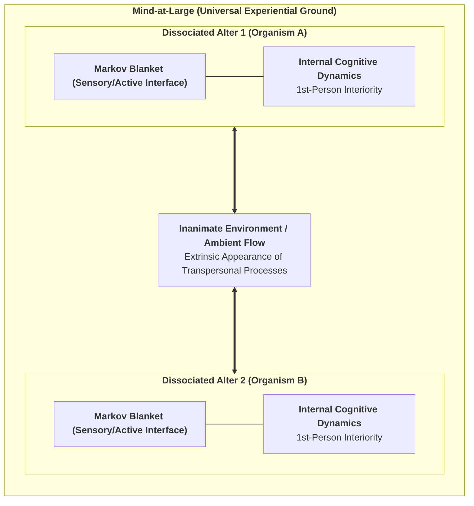

# Chapter 1: The Crisis of Physicalism & The Architecture of Mind-at-Large

> *"Experience is not a byproduct of matter; matter is the extrinsic appearance of experiential processes observed across a dissociative boundary."*  
> — **Bernardo Kastrup**, *The Idea of the World* (2019)

---

## 1.1 The Explanatory Chasm of Physicalism

For over three centuries, the natural sciences have operated under the implicit metaphysical dogma of **Physicalism** (reductive materialism). In this paradigm, reality at its most fundamental ontological level is postulated to consist entirely of quantitative, non-experiential entities: subatomic particles, quantum wavefunctions, fields, and spacetime manifolds. Within this framework, subjective experience (phenomenal consciousness, or *qualia*) is assumed to be an epiphenomenon—an emergent property produced by complex computational arrangements of neurons within the biological brain.

However, as philosopher David Chalmers (1995) famously formulated, physicalism runs into an insurmountable theoretical impasse known as the **"Hard Problem of Consciousness"**. While cognitive neuroscience has made extraordinary progress in solving the "easy problems"—mapping neural correlates to cognitive functions such as visual discrimination, reaction time, memory retrieval, and language production—it cannot explain *why* or *how* any physiological computation should ever feel like anything from the inside.

$$\text{Neural Computation } (\text{Spikes, Ion Flux}) \;\xrightarrow{\;\text{Explanatory Gap}\;} \;\text{Qualitative Interiority } (\text{Redness, Joy, Pain})$$

Joseph Levine (1983) formalized this as the **Explanatory Gap**: no matter how comprehensively one describes the physical mechanics of C-fibers firing or glutamate release across synapses, it remains completely intelligible to conceive of a physical system performing identical input-output operations in total darkness—a *philosophical zombie* devoid of inner life. Physicalism attempts to bridge this gap through the vague promissory note of "emergence." Yet, in all other domains of science, emergence denotes structural or macroscopic rearrangement of existing properties (e.g., liquidity emerging from molecular bonding), whereas in physicalism, consciousness requires the magical ontological transmutation of non-experiential matter into qualitative experience.

---

## 1.2 The Lineage of Analytic Idealism

To escape this metaphysical quagmire without succumbing to substance dualism, we turn to **Analytic Idealism**—a parsimonious, non-dual monism with deep roots in Western and Eastern philosophy:

1. **Baruch Spinoza (1677):** In his *Ethics*, Spinoza proposed that there is only one infinite substance (*Deus sive Natura*), which expresses itself through infinite attributes, of which human intellect perceives two: *Thought* (interiority/mind) and *Extension* (exteriority/matter). Mind and physical body are not two distinct substances interacting causally; they are two different perspectives of the exact same underlying reality.
2. **Arthur Schopenhauer (1819):** In *The World as Will and Representation*, Schopenhauer recognized that the external world is known to us only as representation (*Vorstellung*), but our own inner nature is immediately experienced as *Will* (*Wille*)—the primal, blind, striving force of existence.
3. **Bernardo Kastrup (2019, 2021):** In modern analytic philosophy, Kastrup formalized idealism with scientific rigor: reality is fundamentally a single, unified field of consciousness, termed **Mind-at-Large**. The physical universe is not an external substrate generating mind; rather, the inanimate physical world is what the universal cognitive dynamics of Mind-at-Large look like when perceived from a localized vantage point.

---

## 1.3 The Mechanics of Dissociation & The Markov Blanket

If reality is fundamentally a single, universal experiential field, how do individual living agents, with distinct 1st-person perspectives and private subjective lives, arise?

The answer lies in the empirical psychiatric and topological phenomenon of **Dissociation**. Just as a patient suffering from Dissociative Identity Disorder (DID) can form localized, separate centers of awareness (*alters*) within a single brain, Mind-at-Large undergoes natural informational partitioning, creating autonomous, localized centers of experience—**individual living organisms**.

Karl Friston and Bernardo Kastrup (2020, 2021) demonstrated that the exact physical and statistical boundary of a dissociated alter is defined by a **Markov Blanket**.

### The Mathematical Partition of the Markov Blanket:
Consider a state space describing the total universe. A Markov Blanket partitions the system into four mutually exclusive, conditionally independent sets of states:

$$\mathcal{S} = \{\eta, s, a, \mu\}$$

1. **External States ($\eta$):** The processes of Mind-at-Large and the environment outside the organism.
2. **Sensory States ($s$):** The sensory interface (retinal receptors, skin, interoceptive sensors) influenced by external states $\eta$ and influencing internal states $\mu$.
3. **Active States ($a$):** The motor interface (muscles, autonomic actuators, behavioral outputs) influenced by internal states $\mu$ and influencing external states $\eta$.
4. **Internal States ($\mu$):** The neural networks, metabolic configurations, and subjective beliefs of the organism.

$$\text{Markov Blanket } (\mathcal{B}) = \{s, a\}$$

$$\mu \perp\!\!\!\perp \eta \mid \mathcal{B}$$

Conditional independence implies that internal states $\mu$ cannot directly observe or interact with external states $\eta$; they can perceive the external world *only* through the veil of sensory states $s$, and act upon it *only* through active states $a$.

---

## 1.4 The Soul as a Dissociated Informational Alter

Within this ontological architecture, we arrive at our first foundational definition:

> **Definition (The Individual Soul / Alter):**  
> *An individual conscious organism is a localized, autopoietic informational whirlpool (Dissociated Alter) within Mind-at-Large, demarcated by a statistical Markov Blanket, whose internal states sustain a continuous 1st-person phenomenal perspective through active self-preservation against entropic dissolution.*

The physical body and the brain are not the *generators* of the soul; rather, the biological brain is the **extrinsic physical appearance (representation) of the alter's internal experiential processes** observed across its Markov Blanket. In the following chapter, we explore the exact cybernetic engine that enables this dissociated alter to preserve its existence: the Free Energy Principle and Active Inference.
