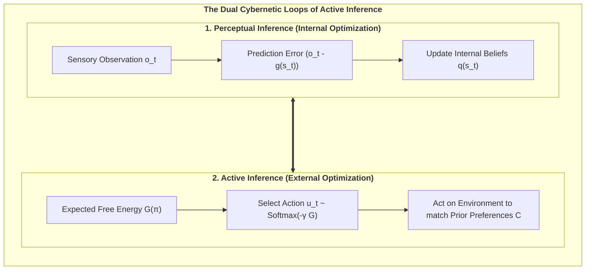

# Chapter 2: The Cybernetic Engine: The Free Energy Principle & Active Inference

> *"A system can only maintain its structural integrity and avoid thermodynamic dispersion by minimizing the surprise of its sensory observations."*  
> — **Karl Friston**, *The Free-Energy Principle: A Unified Brain Theory?* (2010)

---

## 2.1 The Thermodynamic Threat: Resisting Entropic Dissolution

The fundamental law of non-living physical nature is the **Second Law of Thermodynamics**: in an isolated physical system, entropy (disorder, thermal dispersion, chaos) increases monotonically over time:

$$\Delta S_{\text{universe}} \ge 0$$

An inanimate rock abandoned in the desert passively succumbs to this law: it erodes, dissipates its thermal gradients, and disintegrates into sand. In stark contrast, living organisms are **dissipative, non-equilibrium steady-state systems** that resist dissolution. A bacterium, a bird, or a human being actively maintains a highly improbable, bounded physiological state space (core temperature between $36.5^\circ\text{C}$ and $37.5^\circ\text{C}$, constant blood pH, intact cellular membranes) across years or decades.

How does a dissociated alter within Mind-at-Large achieve this astonishing feat of local anti-entropic self-preservation?

The answer is formalized by Karl Friston’s **Free Energy Principle (FEP)**: any self-organizing system that maintains an ergodic, non-equilibrium steady state bounded by a Markov Blanket must minimize its **Variational Free Energy ($F$)**, which acts as a computable upper mathematical bound on **Sensory Surprise**:

$$\text{Surprise } = -\ln P(o)$$

---

## 2.2 Variational Free Energy: Mathematical Formulation

In an uncertain, partially observable world, an organism cannot directly observe the external hidden causes of reality ($s$). It receives only ambiguous sensory observations ($o$) at its Markov boundary. To survive, the organism maintains an internal probabilistic belief distribution $Q(s)$ about the external world and minimizes the discrepancy between its generative model $P(o, s)$ and its sensory evidence.

The **Variational Free Energy ($F$)** is defined mathematically as:

$$\begin{aligned}
F &= \mathbb{E}_{Q(s)}\Big[\ln Q(s) - \ln P(o, s)\Big] \\
  &= \underbrace{D_{\text{KL}}\Big(Q(s) \;\parallel\; P(s \mid o)\Big)}_{\text{Divergence (Perceptual Error)}} - \underbrace{\ln P(o)}_{\text{Log Evidence (Negative Surprise)}}
\end{aligned}$$

Because the Kullback-Leibler (KL) divergence is strictly non-negative ($D_{\text{KL}} \ge 0$), Variational Free Energy is always greater than or equal to sensory surprise:

$$F \ge -\ln P(o)$$

Minimizing $F$ forces two complementary, life-sustaining adaptations:
1. **Perceptual Inference (Belief Updating):** When Divergence is minimized ($Q(s) \to P(s \mid o)$), the agent’s internal beliefs accurately reflect the most probable hidden states of the world.
2. **Bounded Surprise:** The agent guarantees that it remains within its homeostatic setpoints, avoiding lethal, highly surprising environmental states.

---

## 2.3 The Generative Model: Discrete-Time POMDP Architecture

In cognitive neuroscience and computational biology, the generative model of a conscious alter is formalized as a discrete-time **Partially Observable Markov Decision Process (POMDP)**. The model consists of four fundamental tensors:

$$\mathcal{M} = \big\{ A, B, C, D \big\}$$

1. **The Likelihood Matrix ($A = P(o_t \mid s_t)$):**  
   Maps hidden environmental states $s$ to sensory observations $o$. Diagonal dominance represents high sensory fidelity, while off-diagonal elements model noise and sensory ambiguity:
   $$A_{j, k} = P(o_t = j \mid s_t = k)$$

2. **The Causal Transition Tensor ($B = P(s_{t+1} \mid s_t, u_t)$):**  
   Encodes the organism's internal simulator of the world—how hidden states transition dynamically as a function of the agent's executed actions $u$:
   $$B_{i, j, u} = P(s_{t+1} = i \mid s_t = j, u_t = u)$$

3. **The Prior Preference Vector ($C = \ln P(o)$):**  
   Encodes the innate homeostatic desires and survival values of the alter (*The Will to Exist*). States corresponding to nourishment and safety are assigned high log-probabilities, while lethal states (freezing, starvation, cellular lysis) are assigned severe negative penalties:
   $$C_j = \ln P(o = j)$$

4. **The Initial State Prior ($D = P(s_0)$):**  
   Represents phylogenetic baseline expectations at the beginning of an epoch.

---

## 2.4 Expected Free Energy ($G$) and Counterfactual Action

While Variational Free Energy ($F$) evaluates *current* sensory data ($t$), an agent that acts intentionally cannot simply react to the immediate present. It must evaluate candidate sequences of actions—termed **Policies ($\pi = (u_1, u_2, \dots, u_H)$)**—over an extended planning horizon $H$.

For each candidate policy $\pi$, the agent calculates the **Expected Free Energy ($\mathbf{G}$)**:

$$\mathbf{G}(\pi) = \sum_{\tau = t+1}^{t+H} \delta^{\tau - t} \cdot \mathbf{G}(\pi, \tau)$$

Where $\delta \in (0, 1]$ is a temporal discount factor, and the single-step Expected Free Energy decomposes into two fundamental values:

$$\mathbf{G}(\pi, \tau) = \underbrace{D_{\text{KL}}\Big(Q(o_\tau \mid \pi) \;\parallel\; P(o_\tau)\Big)}_{\text{1. Pragmatic Value (Homeostatic Goal Pursuit)}} + \underbrace{\mathbb{E}_{Q(s_\tau \mid \pi)}\Big[\mathcal{H}\big[P(o_\tau \mid s_\tau)\big]\Big]}_{\text{2. Epistemic Value (Curiosity / Ambiguity Reduction)}}$$

### The Dialectic of Pragmatism and Epistemic Curiosity:
* **Pragmatic Value (Exploitation):** Drives the agent toward observations that satisfy its innate preferences ($C = \ln P(o)$). This is the biological survival engine.
* **Epistemic Value (Exploration / Curiosity):** Drives the agent to visit uncertain or ambiguous states to gain information, resolve sensory uncertainty, and improve its world model.

Policies are selected probabilistically via the precision-weighted Boltzmann distribution:

$$P(\pi) = \frac{\exp\big(-\gamma \cdot \mathbf{G}(\pi)\big)}{\sum_{\pi'} \exp\big(-\gamma \cdot \mathbf{G}(\pi')\big)}$$

Where $\gamma$ is the **Action Precision** (inverse temperature). High precision produces confident, decisive execution, while low precision induces exploratory stochasticity.

In the next chapter, we transition from this 3rd-person cybernetic description to the 1st-person interiority of consciousness: Giulio Tononi's Integrated Information Theory (IIT 4.0) and the discovery of the 6th Axiom.
