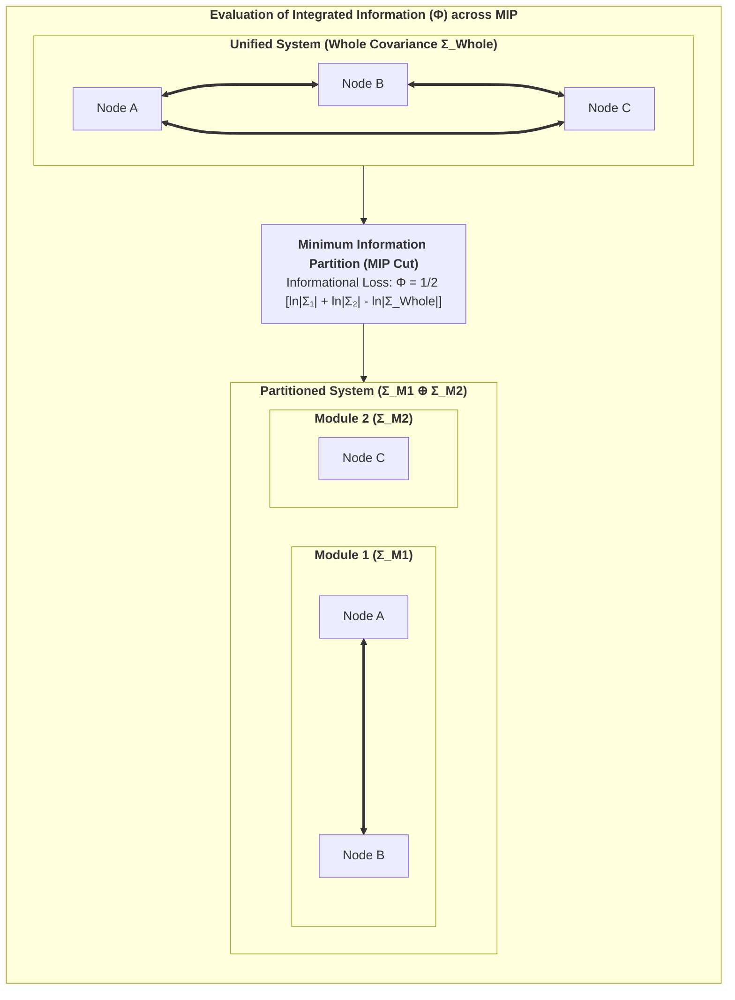

# Chapter 3: The 1st-Person Causal Substrate: IIT 4.0 & The 6th Axiom

> *"Consciousness is integrated information. It is not an observer looking at a screen; it is the intrinsic cause-effect power of a system upon itself."*  
> — **Giulio Tononi**, *Integrated Information Theory* (2016)

---

## 3.1 The Axiomatic Approach of IIT 4.0

While the Free Energy Principle approaches the living organism from an external, 3rd-person cybernetic perspective, **Integrated Information Theory (IIT 4.0)** (Tononi, Albantakis et al., 2023) starts from the undeniable immediacy of the **1st-person phenomenal perspective**.

Rather than attempting to guess how objective matter produces subjective experience, IIT begins by identifying the fundamental, self-evident phenomenological properties that characterize *every conceivable conscious experience* (the **Axioms**), and then translates them into mathematical requirements that any physical substrate of consciousness must satisfy (the **Postulates**).

### The Five Foundational Axioms of IIT 4.0:

1. **Existence:** Consciousness exists undeniably and intrinsically (*phenomenal reality is immediately given*).
2. **Intrinsicality:** Consciousness exists from its own internal perspective, independent of external observers.
3. **Information:** Consciousness is specific—every experience is differentiated and distinct from all other possible experiences (e.g., seeing pure darkness is a highly specific state, differing from seeing a bright blue sky).
4. **Integration:** Consciousness is unified—every experience is irreducible to independent, non-interacting sub-components (you cannot experience the left half of your visual field independently of the right half).
5. **Exclusion:** Consciousness is definite in content and spatiotemporal grain—it has precise boundaries (a single, maximal conscious complex) and resolves at a specific temporal grain ($\tau^* \approx 10\text{--}100\,\text{ms}$).

---

## 3.2 Quantifying Integrated Causal Power ($\Phi$)

To quantify whether a physical substrate forms a unified conscious entity, IIT calculates its **Integrated Information ($\Phi$)**. 

Formally, $\Phi$ measures how much causal information the whole system generates upon its own future and past states above and beyond the sum of its parts. If a system is cut along its **Minimum Information Partition (MIP)**—the partition that damages the system’s causal integrity least—$\Phi$ quantifies the informational loss.

For continuous or Gaussian-approximated neural systems, Integrated Information across a bipartition $(M_1, M_2)$ of a network with covariance matrix $\Sigma$ is computed as:

$$\Phi(M_1 ; M_2) = \frac{1}{2} \Big( \ln\det(\Sigma_{M_1}) + \ln\det(\Sigma_{M_2}) - \ln\det(\Sigma_{\text{Whole}}) \Big)$$

$$\Phi^* = \min_{\text{Partitions } P} \Phi(P)$$

* If $\Phi = 0$, the system is completely reducible to independent components (it is an aggregate, like a heap of sand or an uncoupled computer cluster, and possesses zero subjective experience).
* If $\Phi > 0$, the system possesses intrinsic causal irreducibility: it exists as a genuine, unified ontological entity.

---

## 3.3 The Static Flaw of IIT 4.0: The Paradox of Transient Causal Phantoms

Despite its mathematical elegance, standard IIT 4.0 suffers from a profound theoretical flaw: **it is fundamentally static**.

Tononi’s formulation evaluates the cause-effect structure of a transition probability matrix at a single instantaneous time slice $t \to t+1$. Consequently, IIT makes the bizarre prediction that an inert, inanimate arrangement of silicon logic gates (e.g., a static 2D grid of 2D lookup tables) that happens to possess high cross-connectivity possesses phenomenal consciousness, even if it is completely passive, non-living, and incapable of self-preservation.

We term this the **Paradox of Transient Causal Phantoms**:
* An inanimate physical grid can accidentally achieve high $\Phi$ for a fraction of a millisecond before thermal noise or external perturbations disintegrate its state.
* Standard IIT cannot distinguish between a **living, autopoietic agent** that actively sustains its integrity over time and a **dead, static circuit** that accidentally has integrated wiring.

In physical reality, consciousness is never a static snapshot; it is an enduring, autopoietic process that resists dissolution.

---

## 3.4 The 6th Axiom: The Will to Exist (Autopoietic Causal Persistence)

To resolve this paradox and ground Integrated Information Theory in biological reality, **Thomas Riebl (2026)** formulated the **6th Axiom & Postulate of Consciousness** in the Conative-Integrative Framework:

### The 6th Axiom (Phenomenological Level):
> **Axiom 6 (The Will to Exist / Conatus):**  
> *Subjective consciousness is intrinsically temporal and autopoietic; it manifests as an active, continuous striving of the conscious alter to maintain its own unified existence and resist annihilation across time.*

### The 6th Postulate (Physical/Causal Level):
> **Postulate 6 (Autopoietic Causal Persistence):**  
> *A physical substrate is a genuine substrate of consciousness if and only if its policy-directed actions actively preserve or increase its integrated cause-effect power ($\Phi$) over successive temporal intervals:*

$$\mathbb{E}\Big[\Phi(t+1) \;\Big|\; \pi^*\Big] \;\ge\; \Phi(t) \quad (\Phi > 0)$$

Where $\pi^*$ is the optimal policy selected by the agent's generative model.

### Theoretical Significance:
1. **Elimination of Causal Phantoms:** Static, non-living logic gates cannot select policies to maintain their $\Phi$. Under natural environmental fluctuations, their integrated information collapses to zero ($\Phi \to 0$).
2. **The Conative Imperative:** Consciousness is revealed to be intrinsically conative—it is the physical manifestation of Spinoza’s *Conatus* and Schopenhauer’s *Will*.
3. **The Bridge to Active Inference:** The requirement that an agent must act to preserve $\Phi(t)$ immediately demands a mechanism for action selection—which is precisely provided by the Free Energy Principle.

In the next chapter, we prove the fundamental mathematical equivalence connecting the 6th Axiom with Active Inference.
