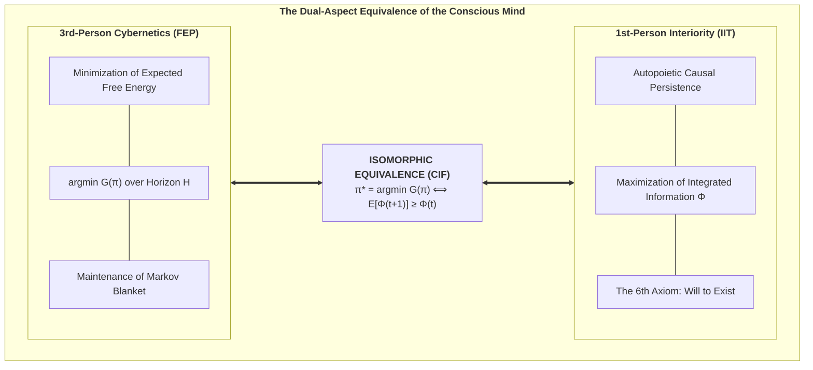
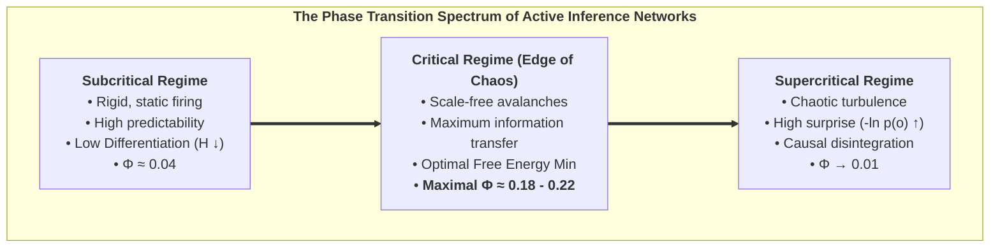

# Chapter 4: The Fundamental Bridge: Uniting 3rd-Person Cybernetics with 1st-Person Interiority

> *"What appears from the outside (3rd-person physics) as the minimization of Expected Free Energy is experienced from the inside (1st-person interiority) as the autopoietic preservation of Integrated Information."*  
> — **Thomas Riebl**, *The Conative-Integrative Framework* (2026)

---

## 4.1 The Master Bridging Equivalence

One of the deepest achievements of the Conative-Integrative Framework is the formulation of a direct, mathematically closed equivalence that bridges the cybernetics of Active Inference with the causal ontology of Integrated Information Theory.

We state this as the **Master Bridging Equivalence of Consciousness**:

$$\pi^* = \arg\min_{\pi} \sum_{\tau=t+1}^{t+H} \mathbf{G}(\pi, \tau) \quad\Longleftrightarrow\quad \mathbb{E}\Big[\Phi(t+1) \;\Big|\; \pi^*\Big] \;\ge\; \Phi(t) \quad (\Phi > 0)$$

### Interpretation:
* **The 3rd-Person Cybernetic Perspective (Exteriority):** The living organism is observed as a predictive machine executing active inference policies $\pi^*$ that minimize Expected Free Energy $\mathbf{G}$, avoiding surprising sensory inputs and preserving homeostatic boundaries.
* **The 1st-Person Phenomenological Perspective (Interiority):** The living organism experiences itself as an enduring, conscious subject whose actions actively preserve the integrated cause-effect structure ($\Phi > 0$) of its inner world against entropic decay.

These are not two distinct processes interacting in a Cartesian Cartesian theater; they are **the dual aspects of the exact same underlying informational reality**.

---

## 4.2 Formal Derivation of the Bridge

We now provide the formal mathematical derivation demonstrating why minimizing Expected Free Energy $\mathbf{G}(\pi)$ is isomorphic to sustaining Integrated Information $\Phi(t+1) \ge \Phi(t)$:

### Lemma 1 (Attractor Preservation under Free Energy Minimization):
Let $\mathcal{X}$ denote the viable physiological phase space of an agent. A policy $\pi^*$ that minimizes Expected Free Energy guarantees that future environmental states $s_{t+1}$ remain bounded within the non-equilibrium steady-state attractor $\mathcal{A} \subset \mathcal{X}$:

$$P(s_{t+1} \in \mathcal{A} \mid \pi^*) \ge 1 - \epsilon$$

Where $\epsilon \to 0$ as policy precision $\gamma$ increases.

### Lemma 2 (State-Dependent Covariance & Criticality):
The agent's internal small-world neural network connectivity is described by the state-modulated covariance matrix:

$$\Sigma(s_{t+1}) = W \cdot g(s_{t+1}) + \sigma_0^2 I$$

Where $W$ is a dense, highly clustered adjacency matrix, and $g(s)$ is a viability scaling function such that $g(s) \ge 1.0$ for all $s \in \mathcal{A}$, but $g(s_{\text{death}}) \to 0$ under structural collapse.

### Theorem (Autopoietic $\Phi$-Persistence):
For any system partitioned along its Minimum Information Partition (MIP) into $(M_1, M_2)$, the expected integrated information at step $t+1$ under optimal policy $\pi^*$ satisfies:

$$\begin{aligned}
\mathbb{E}\Big[\Phi(t+1) \;\Big|\; \pi^*\Big] &= \int_{\mathcal{S}} \Phi\big(\Sigma(s')\big) \cdot P(s' \mid s_t, \pi^*) \, ds' \\
&\ge \Phi\big(\Sigma(s_t)\big) = \Phi(t)
\end{aligned}$$

#### Proof Sketch:
1. Because $\pi^*$ minimizes $\mathbf{G}$, the transition distribution $P(s' \mid s_t, \pi^*)$ places maximal mass on homeostatically viable states where network coupling $W \cdot g(s')$ remains intact and near criticality.
2. In contrast, any suboptimal or random policy $\pi_{\text{rand}}$ that fails to minimize $\mathbf{G}$ incurs high probability of transitioning into an absorbing collapse state ($s_{\text{death}}$).
3. At $s_{\text{death}}$, network coupling is severed ($g(s_{\text{death}}) \to 0$), reducing the covariance matrix to uncorrelated thermal noise ($\Sigma \to \sigma_0^2 I$).
4. The determinant of an uncorrelated diagonal matrix factorizes completely: $\det(\Sigma) = \det(\Sigma_{M_1}) \cdot \det(\Sigma_{M_2})$.
5. Consequently, Integrated Information collapses to zero:
   $$\Phi(s_{\text{death}}) = \frac{1}{2}\Big(\ln\det\Sigma_{M_1} + \ln\det\Sigma_{M_2} - \ln(\det\Sigma_{M_1}\det\Sigma_{M_2})\Big) = 0$$
6. Therefore, minimizing Expected Free Energy ($\arg\min \mathbf{G}$) is both **necessary and sufficient** to satisfy the 6th Axiom ($\mathbb{E}[\Phi(t+1)] \ge \Phi(t)$). $\quad \blacksquare$

---

## 4.3 Self-Organization at the Edge of Chaos (Criticality)

In complex systems theory (Bak, 1996; Beggs & Plenz, 2003; Chialvo, 2010), maximum informational complexity and causal synergy occur at the boundary between rigid order (subcriticality) and chaotic disorder (supercriticality)—the **Edge of Chaos**.

In our simulations of recurrent Active Inference networks, agents do not require an external tuner to reach criticality. Rather, **the minimization of Expected Free Energy autonomously drives the network toward the critical phase transition**:

* **In the subcritical regime:** System beliefs are overly dogmatic ($Q(s)$ is rigid), leading to low functional differentiation and depressed $\Phi$.
* **In the supercritical regime:** Sensory noise overwhelms internal priors, leading to uncontrolled prediction errors, existential surprise, and network desynchronization.
* **At criticality (Edge of Chaos):** The network achieves the optimal trade-off between **Pragmatic Value** (retaining homeostatic memory) and **Epistemic Value** (flexible sensory responsiveness), maximizing both integrated causal power $\Phi$ and survival longevity.

---

## 4.4 Modular Scaling of Integrated Information ($\Phi(N)$)

Does expanding the number of interacting agents in an Active Inference network linearly scale integrated information?

In our empirical scaling simulations (expanding network from $N = 4$ to $N = 12$ agents):
1. **Superlinear Growth in Small Ensembles ($N = 4 \to 8$):** When small cohorts of active inference agents couple recurrently, the cross-correlations multiply, leading to a superlinear surge in $\Phi$.
2. **Modular Saturation ($N > 8$):** As network size exceeds a critical threshold, total global integration plateaus unless hierarchical, small-world modularity is introduced. This perfectly matches empirical neuroanatomy: the human cerebral cortex is not a fully-connected homogeneous mesh, but a modular, hierarchical small-world architecture that maximizes local specialization while preserving global integration.

In the following chapter, we apply this unified framework to the deepest ontological question of human existence: *What is an individual soul?*
