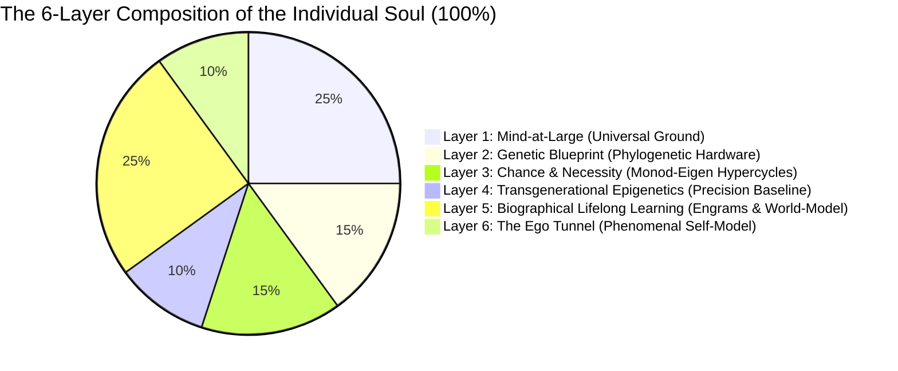

# Chapter 5: The Composition of the Soul: The 6-Layer Ontogenetic Tapestry

> *"The soul is not an indivisible, supernatural ghost, nor is it a meaningless neural illusion. It is a hierarchical, autopoietic tapestry of informational processes spanning genetics, developmental chance, ancestral epigenetics, biographical learning, and universal consciousness."*  
> — **Thomas Riebl**, *The Composition of the Soul* (2026)

---

## 5.1 Beyond Substance Dualism and Eliminative Materialism

What constitutes an individual human soul? 

Throughout the history of Western philosophy, two extreme and equally inadequate models have dominated the discourse:
1. **Cartesian Substance Dualism:** Postulates that the soul is an immaterial, indivisible spiritual substance (*res cogitans*) magically tethered to a mechanical physical body (*res extensa*) via the pineal gland. This view fails entirely to account for the neurobiological, genetic, and pharmacological dependencies of personality and cognition.
2. **Eliminative Materialism:** Asserts that the "soul" and subjective self are non-existent illusions—that a human being is nothing more than an accidental assembly of selfish genes and mechanical biochemical reflexes. This view fails to account for the undeniable reality of 1st-person phenomenal existence and the hard problem of consciousness.

The Conative-Integrative Framework resolves this dialectic by defining the individual soul as **a 6-Layer Autopoietic Tapestry of Information**. An individual alter is neither an indivisible monad nor a random machine; it is a structured, quantitative composite of biological, environmental, and cosmic factors that together sum to $100\%$[^ch5_indicative_note].

---

## 5.2 The Six Architectural Layers of the Soul

### Layer 1: Mind-at-Large (The Universal Experiential Field) — $25\%$
The fundamental, non-local substrate of consciousness itself. Following Baruch Spinoza's *Substance Monism* and Bernardo Kastrup's *Analytic Idealism*, consciousness is not created by the brain; it is the fundamental ontological canvas upon which all localized phenomena appear. This layer provides the raw qualitative capacity for phenomenal experience (*qualia*), the transpersonal ground of existence, and the ultimate container into which localized awareness dissolves upon biological death.

### Layer 2: The Genetic Blueprint (Phylogenetic Baseline) — $15\%$
The inherited biological and evolutionary hardware encoded in the genome. Following neurobiologist **Gerhard Roth (2003, 2021)** and affective neuroscientist **Jaak Panksepp (1998)**, genetics constructs the deep, subcortical brain architecture:
* The brainstem and autonomic nuclei regulating primal homeostatic survival (*Conatus*).
* The lower limbic system (hypothalamus, amygdala, ventral striatum) establishing baseline affective temperaments: baseline anxiety, novelty-seeking, dopamine reward sensitivity, and fundamental aggression.
* This hardware constitutes the immutable phylogenetic baseline that constrains all downstream cognitive development.

### Layer 3: Chance and Teleonomic Necessity (Embryological Self-Organization) — $15\%$
The self-organizing biophysical dynamics that bridge genetic instructions and macroscopic anatomy. Following Nobel laureate **Jacques Monod (1970)** (*Chance and Necessity*) and biophysicist **Manfred Eigen (1971)** (*The Hypercycle*):
* DNA does not provide a rigid blueprint for every single synaptic connection; rather, development operates as an **evolutionary hypercycle** governed by stochastic developmental noise, morphogenetic chemical gradients, and competitive synaptic pruning.
* Identical twins with $100\%$ identical genomes diverge prenatally in brain micro-connectivity due to developmental fluctuations, ensuring that every individual soul possesses an irreducibly unique somatic wiring.

### Layer 4: Transgenerational Epigenetics (Ancestral Calibration) — $10\%$
The heritable biochemical annotations (DNA methylation, histone acetylation, non-coding microRNAs) that regulate gene expression without altering the underlying nucleotide sequence. Following **Rachel Yehuda (2018)** and **Eva Jablonka (2014)**:
* Environmental stressors, severe famines, chronic vigilance, and ancestral traumas experienced by preceding generations leave persistent epigenetic signatures on glucocorticoid receptor genes (e.g., *NR3C1*).
* Epigenetics acts as a transgenerational bridge, calibrating the offspring's sensory and emotional sensitivity before personal life experience begins.

### Layer 5: Biographical Lifelong Learning & Cognitive Modeling — $25\%$
The unique autobiographical history of the individual. Following neurobiologist **Gerhard Roth's upper limbic and neocortical levels** and **Eric Kandel's neuroplasticity**:
* Formed through personal experience, parental attachment, cultural socialization, trauma, skill acquisition, language, and associative memory.
* Encoded physically as long-term potentiation (LTP), dendritic spine remodeling, and cortical-hippocampal neural engrams.
* This layer constitutes the rich, narrative *content* of the psyche—the explicit memories, moral convictions, and cognitive models that distinguish one person's life history from another.

### Layer 6: The Ego Tunnel (The Phenomenal Self-Model) — $10\%$
The real-time computational simulation of being an abiding, localized self. Following cognitive philosopher **Thomas Metzinger (2003, 2009, 2024)** (*Being No One* & *The Ego Tunnel*):
* The subjective "I" is not an immaterial ghost residing in the head, but a **Phenomenal Self-Model (PSM)** generated by the predictive brain to integrate sensory-motor loops.
* Because the brain cannot access the computational algorithms generating the self-model, the model is experienced as **transparent**: we do not experience a model of the self; we experience *being* the self.
* The PSM acts as the central coordinate frame for active inference, anchoring attention and intentional action in a 1st-person perspective.

---

## 5.3 Active Inference Mapping: Uniting Neurobiology with POMDP Tensors

In the Conative-Integrative Framework, the six layers of the soul map directly onto the formal parameters of a discrete Partially Observable Markov Decision Process (POMDP):

| Layer | Soul Architectural Dimension | Contribution | POMDP Mathematical Object | Active Inference Role |
| :--- | :--- | :---: | :--- | :--- |
| **Layer 1** | **Mind-at-Large** | $25\,\%$ | **State Space ($\mathcal{S}$)** | The universal phase space of all possible experiential configurations |
| **Layer 2** | **Genetics** | $15\,\%$ | **Prior State Vector ($D = P(s_0)$)** | Phylogenetic setpoints; hardwired homeostatic attractors (*Conatus*) |
| **Layer 3** | **Chance & Necessity** | $15\,\%$ | **Hypercycle Transition Dynamics** | Developmental noise seeding the unique structural topology of the brain |
| **Layer 4** | **Epigenetics** | $10\,\%$ | **Precision Parameter ($\gamma = (\sigma^2)^{-1}$)** | Transgenerational calibration of sensory prediction error weighting |
| **Layer 5** | **Lifelong Learning** | $25\,\%$ | **Matrices ($A, B$) & Preferences ($C$)** | Learned likelihood mappings ($A$), world-simulator ($B$), and values ($C$) |
| **Layer 6** | **The Ego Tunnel** | $10\,\%$ | **Markov Blanket ($\mathcal{B} = \{s, a\}$)** | Statistical boundary isolating internal states ($\mu$) into a 1st-person self |
| **Total** | **The Unified Soul** | **$100\,\%$** | **Generative Model ($\mathcal{M} = \{A, B, C, D, \gamma\}$)** | **The Complete Dissociated Conscious Alter** |

> [!NOTE]
> **Methodological Clarification on Ontogenetic Weights:**  
> The specific percentage allocations assigned to these six layers ($25\%, 15\%, 15\%, 10\%, 25\%, 10\%$) are purely indicative, conceptual, and heuristic in nature. They derive from the author's individual phenomenological experience, reflective synthesis, and qualitative modeling, serving as a conceptual framework to illustrate relative structural balance rather than fixed, empirically universal constants.

### Synthesis: The Soul as an Autopoietic Whirlpool:
An individual soul is not a static object; it is an **autopoietic informational whirlpool within the ocean of Mind-at-Large**. 

The genetic and embryological banks shape its channel (Layers 2 & 3); the ancestral current tunes its sensitivity (Layer 4); the autobiographical debris forms its circulating narrative pattern (Layer 5); the localized vortex creates the felt perspective of a centered ego (Layer 6); and the water of which the entire whirlpool is composed is universal consciousness itself (Layer 1).

In the next chapter, we investigate the temporal engine that keeps this whirlpool spinning: *The Temporal Mechanics of Consciousness and the Specious Present*.

[^ch5_indicative_note]: The specific percentage allocations assigned to these six layers ($25\%, 15\%, 15\%, 10\%, 25\%, 10\%$) are purely indicative and heuristic in nature. They derive from the author's individual phenomenological experience and reflective modeling, serving as a conceptual framework to illustrate relative structural proportions rather than fixed, empirically universal constants.

