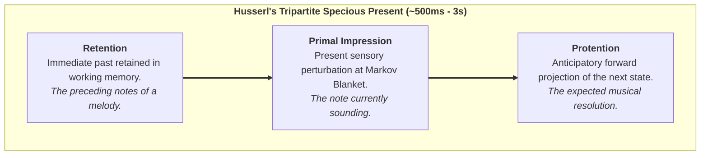
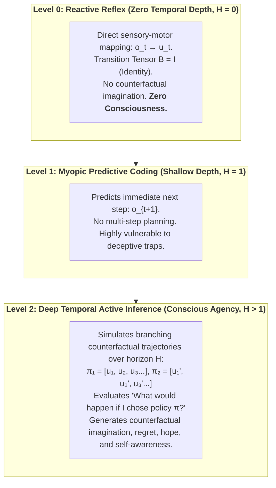
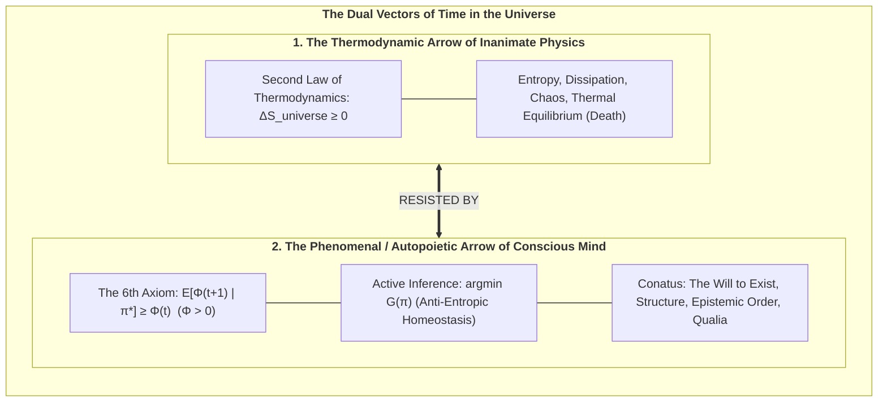

# Chapter 6: The Temporal Mechanics of Consciousness & The Specious Present

> *"Time is not a feature of the physical universe into which consciousness is inserted; time as experienced is the operational signature of a conscious alter maintaining its existence against entropic dispersion."*  
> — **Thomas Riebl**, *The Temporal Mechanics of Consciousness* (2026)

---

## 6.1 The Illusion of the Dimensionless Instant

In Newtonian mechanics and classical relativity, physical time is formalized as a one-dimensional, continuous geometric coordinate $t \in \mathbb{R}$. In this physicalist abstraction, reality at any given moment exists strictly as a **dimensionless mathematical point ($t = 0$)** of zero duration.

However, in human phenomenal experience, a dimensionless instant is an experiential impossibility. You cannot perceive a musical melody, a spoken sentence, or the trajectory of a flying bird at a single infinitesimal point in time. If consciousness were restricted to $t = 0$, you would hear only a single isolated frequency of sound, disconnected from the past and without anticipation of what follows.

William James (1890) recognized this and coined the term **"The Specious Present"**—the empirical observation that subjective time always possesses a non-zero, felt duration (typically estimated in neurobiology between $500\,\text{ms}$ and $3\,\text{seconds}$).

---

## 6.2 Husserl’s Triad and the Predictive Brain

Philosopher Edmund Husserl (1928) formalized the phenomenological anatomy of the Specious Present into a tripartite structure:

In the Conative-Integrative Framework, we map Husserl’s phenomenological triad directly onto the neurobiology of **Hierarchical Predictive Processing** (Metzinger, 2003, 2009; Wiese, 2018; Friston, 2010):

1. **Retention corresponds to Bayesian Empirical Priors:** The immediate past is encoded as short-term synaptic memory traces, calcium dynamics, and recurrent reverberating activations in cortical microcircuits.
2. **Primal Impression corresponds to Sensory Prediction Error:** The present moment is the immediate computational confrontation at the Markov Blanket between top-down predictions and incoming sensory observations:
   $$\varepsilon_t = o_t - g(s_t)$$
3. **Protention corresponds to Top-Down Generative Predictions:** The anticipated future is actively generated by the generative model projecting downward through the cortical hierarchy:
   $$\hat{o}_{t+1} = A \cdot \big(B(u_t) \, q(s_t)\big)$$

The **Phenomenal Self-Model (PSM)** seamlessly stitches these three temporal threads into an unbroken, continuous "Ego Tunnel," creating the felt experience of an enduring subject navigating through an unfolding present.

---

## 6.3 Temporal Depth and The Consciousness Theorem

Why are simple homeostatic feedback systems (such as a mechanical thermostat or a spinal reflex arc) completely devoid of conscious agency?

The answer lies in **Temporal Depth ($H$)**:

In the Conative-Integrative Framework, we formalize this structural requirement as an explicit mathematical theorem:

### The Theorem of Minimum Temporal Depth:
> **Theorem (The Temporal Depth Condition for Consciousness — Thomas Riebl):**  
> *A physical system cannot sustain phenomenal self-consciousness without generative transition tensors ($B = P(s_{t+1} \mid s_t, u)$) spanning a multi-step counterfactual planning horizon ($H > 1$).* [^1]

[^1]: **Scientific Context & Theoretical Attribution:** While Karl Friston et al. (2017, 2018) established temporal depth as a computational prerequisite for intentional action selection (*Planning as Inference*), and Anil Seth (2014, 2021) conceptualized *counterfactual richness* as a qualitative correlate of phenomenal presence, the *Conative-Integrative Framework (CIF)* by Thomas Riebl formalizes this insight for the first time as a strict mathematical **Theorem of Minimum Temporal Depth ($H > 1$) for Phenomenal Self-Consciousness**, directly coupled to the autopoietic preservation of Integrated Information ($\Phi$) under the 6th Axiom ($\mathbb{E}[\Phi(t+1) \mid \pi^*] \ge \Phi(t)$). This theorem formally proves that purely reactive automata ($H = 0$) and myopic feedback loops ($H = 1$) suffer rapid phase-space and causal collapse ($\Phi \to 0$), establishing counterfactual temporal projection as a non-negotiable threshold of subjective mind.

---

## 6.4 The Two Arrows of Time: Thermodynamic Decay vs. Phenomenal Will

This brings us to a profound cosmic insight regarding the nature of time itself. Modern science recognizes two opposing temporal vectors:

1. **The Inanimate Arrow (Thermodynamic Time):** Driven by the Second Law ($\Delta S \ge 0$), dragging physical matter toward maximum disorder, dissipation, and thermal death.
2. **The Animate Arrow (Phenomenal Time):** Driven by the **6th Axiom of Consciousness (*The Will to Exist*)**, enforcing a local anti-entropic counter-current through active inference policy selection ($\min \mathbf{G}$).

Conscious experience does not float passively down the river of thermodynamic time. **Consciousness is the swimmer fighting upstream.** The subjective sensation of the passage of time is the operational signature of this relentless autopoietic struggle against dissolution.

In the next chapter, we verify these theoretical principles through rigorous computational simulations using Monte Carlo ensemble sampling.
