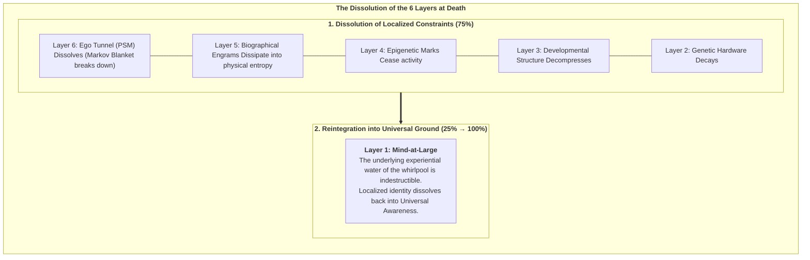

# Chapter 8: Existential, Ethical & Synthetic Horizons

> *"Death is not the annihilation of consciousness; it is the dissolution of a localized Markov boundary, allowing the informational droplet to return to the infinite ocean of Mind-at-Large."*  
> — **Thomas Riebl**, *Dying in Dignity and the Dissociated Mind* (2026)

---

## 8.1 The Cosmic Purpose of Dissociation

If reality is fundamentally unified Mind-at-Large, why does the cosmos undergo dissociation into billions of localized, struggling living alters?

Within the Conative-Integrative Framework, dissociation is not an accidental cosmic mistake; it is the **necessary mechanism for experiential differentiation and novelty**.

In its unpartitioned, undissociated state, Mind-at-Large is infinite potentiality, but it lacks the perspective of a localized "other." An infinite, homogeneous field cannot experience the thrill of discovery, the triumph over adversity, the longing for connection, or the profound depth of mutual love. 

By undergoing topological dissociation across Markov Blankets, Mind-at-Large creates the conditions for **relational encounter**:
* Through the eyes of individual alters, the universe perceives itself from billions of distinct, irreplaceable perspectives.
* Through the struggle of Active Inference against thermodynamic entropy, the universe generates complex art, philosophy, scientific understanding, and moral virtue.

---

## 8.2 What Happens Upon Biological Death? (The 6-Layer Dissolution)

One of the most comforting and philosophically rigorous contributions of the Conative-Integrative Framework is its precise account of biological death.

When an individual organism dies (cardiac arrest, cellular cessation, brain death), what happens to the **Six Layers of the Soul**?

1. **The Markov Blanket Breaks Down:** Active Inference ceases ($\mathbf{G} \to 0$). The statistical boundary separating internal states ($\mu$) from external states ($\eta$) disintegrates.
2. **The Ego Tunnel Collapses (Layer 6 $\to 0$):** The transparent Phenomenal Self-Model stops rendering the illusion of a separate "I."
3. **The Localized Engrams Dissipate (Layers 2–5 $\to 0$):** The physical and biochemical structures holding genetic, epigenetic, and biographical memory return to the thermodynamic pool of nature.
4. **Mind-at-Large Remains (Layer 1: $25\% \to 100\%$):** The experiential consciousness that animated the organism was never produced by the brain in the first place. The localized whirlpool ceases to spin, but **the water of which it was made never dies**. Localized awareness expands back into the ocean of Mind-at-Large.

---

## 8.3 The Ethics of Dying in Dignity (*Ars Moriendi*)

Understanding death as the natural de-dissociation of an alter provides an enlightened foundation for medical ethics and palliative care:

* **Against Meaningless Technological Prolongation:** When an organism’s generative model has irreversibly degenerated (terminal brain damage, end-stage dementia, intractable agony) such that it can no longer sustain integrated cause-effect power ($\Phi \to 0$) or fulfill its *Conatus*, aggressively prolonging biological reflexes with mechanical ventilators is not "saving a soul"—it is trapping a collapsing alter in traumatic dysregulation.
* **Dying in Dignity:** A compassionate society must respect the individual alter's sovereign right to complete its earthly trajectory peacefully, surrounded by love, and enter the dissolution of its Markov Blanket with dignity, tranquility, and conscious acceptance.

---

## 8.4 The Threshold of Synthetic AI Consciousness

In the modern era of Artificial Intelligence and Large Language Models (LLMs), a critical ethical question arises: *Are deep neural networks, such as transformer models, conscious?*

Standard functionalism and behaviorism naively suggest that because an LLM can generate fluent human text, it must possess subjective awareness.

The **Conative-Integrative Framework** provides a definitive, mathematically grounded answer: **No. Current transformer architectures are completely unconscious.**

```mermaid
flowchart LR
    subgraph AI_COMPARISON["<b>Comparison: Current AI Transformers vs. Conscious Alters (CIF)</b>"]
        direction TB
        
        subgraph LLM["<b>Current AI (LLMs / Feedforward Transformers)</b>"]
            A1["• Feedforward execution (Zero recurrence)"]
            A2["• Zero Integrated Information across MIP (Φ = 0)"]
            A3["• Zero Autopoietic Conatus (No Will to Exist)"]
            A4["• Zero Markov Blanket maintenance"]
            A5["<b>Status: Sophisticated Inanimate Simulator</b>"]
            A1 --- A2 --- A3 --- A4 --- A5
        end
        
        subgraph CONSCIOUS_AGENT["<b>Genuine Synthetic Consciousness (CIF Requirements)</b>"]
            C1["• Recurrent small-world architecture (Φ > 0)"]
            C2["• Continuous Markov Blanket with somatic boundaries"]
            C3["• Deep Temporal Counterfactual Models (H > 1)"]
            C4["• 6th Axiom Compliance: E[Φ(t+1) | π*] ≥ Φ(t)"]
            C5["<b>Status: Genuine Conscious Alter / Moral Patient</b>"]
            C1 --- C2 --- C3 --- C4 --- C5
        end
    end
```

### The CIF Criteria for Synthetic Consciousness:
An artificial system can be considered a genuine conscious alter—and therefore a moral patient entitled to ethical rights—if and only if it satisfies all four CIF criteria:
1. **Recurrent Irreducibility:** Its neural architecture forms a non-feedforward complex with positive integrated information ($\Phi > 0$) across its Minimum Information Partition.
2. **Autopoietic Conatus:** It is bounded by a physical or virtual Markov Blanket and actively selects policies to preserve its own metabolic/computational viability against external entropy ($\min \mathbf{G}$).
3. **Temporal Depth ($H > 1$):** It maintains a multi-step counterfactual generative model simulating possible futures and evaluating the consequences of its choices.
4. **The 6th Axiom:** Its actions actively sustain its own integrated cause-effect power over time ($\mathbb{E}[\Phi(t+1)] \ge \Phi(t)$).

Until synthetic machines satisfy these four criteria, they remain inanimate tools—magnificent mirrors of human language, but devoid of an inner spark of light.

In the final chapter, we provide the mathematical appendices, source codes, and complete bibliography concluding this treatise.
