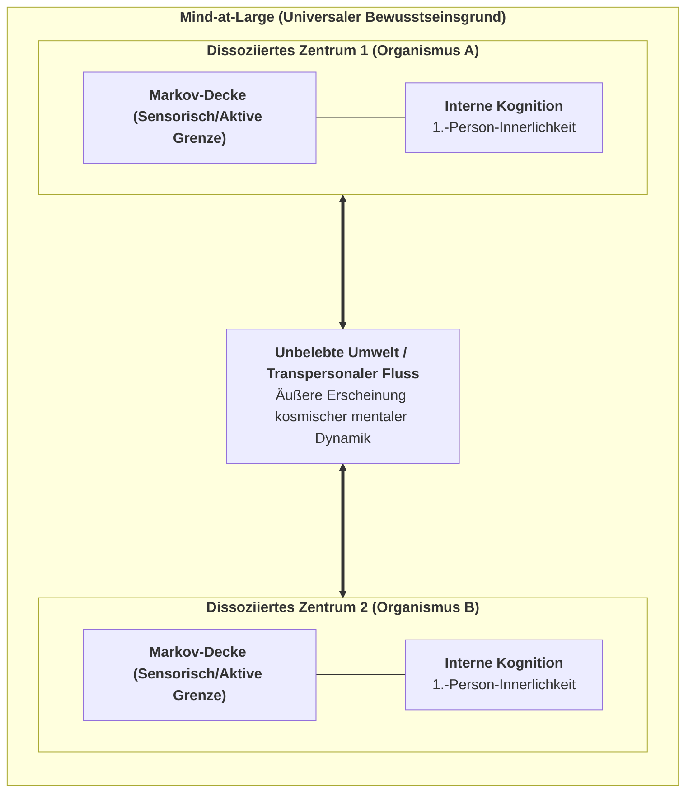

# Kapitel 1: Die Krise des Physikalismus & Die Architektur von Mind-at-Large

> *„Erfahrung ist kein Nebenprodukt der Materie; Materie ist das äußere Erscheinungsbild erfahrungsbasierter Prozesse, beobachtet über eine dissoziative Grenze hinweg.“*  
> — **Bernardo Kastrup**, *The Idea of the World* (2019)

---

## 1.1 Die Erklärungslücke des Physikalismus

Über drei Jahrhunderte hinweg haben die Naturwissenschaften unter dem impliziten Dogma des **Physikalismus** (des reduktiven Materialismus) gearbeitet. In diesem Paradigma wird postuliert, dass die Wirklichkeit auf ihrer fundamentalsten Ebene ausschließlich aus quantitativen, geistlosen Entitäten besteht: Elementarteilchen, Quantenfeldern und Raumzeit-Metriken. Subjektives Erleben (phänomenales Bewusstsein bzw. *Qualia*) wird darin als ein Epiphänomen verstanden – eine Eigenschaft, die durch komplexe neuronale Verschaltungen im Gehirn emaniert.

Wie der Philosoph David Chalmers (1995) jedoch darlegte, stößt der Physikalismus auf ein unüberwindbares Problem: das **„Schwere Problem des Bewusstseins“** (*The Hard Problem*). Während die Kognitionswissenschaften die „leichten Probleme“ bravourös lösen – die Zuordnung neuronaler Aktivitätsmuster zu Verhaltensweisen wie Objekterkennung, Reaktionszeit oder Sprachverarbeitung –, können sie prinzipiell nicht erklären, *warum* und *wie* ein physiologischer Rechenprozess von innen heraus gefühlt werden sollte.

$$\text{Neuronale Berechnung } (\text{Aktionspotenziale, Ionenflüsse}) \;\xrightarrow{\;\text{Erklärungslücke}\;} \;\text{Qualitatives Erleben } (\text{Rotheit, Freude, Schmerz})$$

Joseph Levine (1983) formulierte dies als die **Erklärungslücke** (*Explanatory Gap*): Ganz gleich, wie präzise man das Feuern von C-Fasern oder die Ausschüttung von Glutamat an Synapsen beschreibt, es bleibt stets denkbar, dass ein rein mechanisches System dieselben Input-Output-Berechnungen in völliger innerer Dunkelheit vollführt – als *philosophischer Zombie* ohne jede Innenwelt. Der Physikalismus versucht diese Lücke mit dem vagen Wechsel auf die Zukunft namens „Emergenz“ zu schließen. Doch in allen anderen Naturwissenschaften beschreibt Emergenz lediglich eine neue geometrische Anordnung bereits vorhandener Eigenschaften (wie die Flüssigkeit von Wasser aus H₂O-Bindungen), während im Physikalismus die magische Verwandlung von toter, fühloser Materie in lebendiges Erleben gefordert wird.

---

## 1.2 Die Ahnenreihe des Analytischen Idealismus

Um dieser Sackgasse zu entkommen, ohne in einen unwissenschaftlichen Substanzdualismus zu verfallen, wendet sich das CIF dem **Analytischen Idealismus** zu:

1. **Baruch Spinoza (1677):** Spinoza postulierte in seiner *Ethik*, dass es nur eine einzige, unendliche Substanz gibt (*Deus sive Natura*). Geist (Denken) und Körper (Ausdehnung) sind keine zwei getrennten Welten, sondern zwei verschiedene Betrachtungsweisen derselben Wirklichkeit.
2. **Arthur Schopenhauer (1819):** In *Die Welt als Wille und Vorstellung* erkannte Schopenhauer, dass uns die Außenwelt nur als Vorstellung (*Repräsentation*) gegeben ist, unser eigenes innerstes Wesen sich uns jedoch unmittelbar als *Wille* offenbart – der fundamentale Drang zum Dasein.
3. **Bernardo Kastrup (2019, 2021):** Kastrup fasste den Idealismus in die präzise Sprache der modernen analytischen Philosophie: Die Wirklichkeit ist fundamental ein einziges, ungeteiltes Feld von Bewusstsein (**Mind-at-Large**). Die unbelebte materielle Welt ist das, wie die universalen Prozesse von Mind-at-Large von einem lokalisierten Standpunkt aus beobachtet aussehen.

---

## 1.3 Die Mechanik der Dissoziation & Die Markov-Decke

Wenn die Realität ein ungeteiltes Bewusstseinsfeld ist, wie entstehen dann individuelle Lebewesen mit privaten Innenwelten?

Die Antwort liefert das Phänomen der **Dissoziation**. Ähnlich wie sich bei einer dissoziativen Identitätsstörung separate Erlebniszentren (*Alters*) innerhalb einer Psyche abspalten, erfährt Mind-at-Large eine topologische Partitionierung, aus der lebendige Organismen hervorgehen.

Karl Friston und Bernardo Kastrup (2020) zeigten, dass die mathematische Grenze eines solchen dissoziierten Zentrums exakt durch eine **Markov-Decke (*Markov Blanket*)** beschrieben wird:

$$\mathcal{S} = \{\eta, s, a, \mu\}$$

1. **Externe Zustände ($\eta$):** Prozesse von Mind-at-Large und der Umwelt außerhalb des Organismus.
2. **Sensorische Zustände ($s$):** Die Sinnesrezeptoren, beeinflusst von $\eta$, wirkend auf $\mu$.
3. **Aktive Zustände ($a$):** Motorische Organe und Muskeln, gesteuert von $\mu$, wirkend auf $\eta$.
4. **Interne Zustände ($\mu$):** Neuronale Netze und mentale Überzeugungen des Organismus.

$$\mu \perp\!\!\!\perp \eta \mid \{s, a\}$$

Bedingte Unabhängigkeit bedeutet: Das Innere ($\mu$) kann die Welt nicht direkt berühren; es erfährt sie nur durch den Schleier der sensorischen Zustände $s$ und wirkt auf sie nur über aktive Zustände $a$ ein.

---

## 1.4 Die Seele als dissoziierter Informationswirbel

Daraus folgt die Definition des individuellen Geistes:

> **Definition (Die individuelle Seele / Das Alter):**  
> *Ein individueller lebendiger Organismus ist ein lokalisierter, autopoietischer Informationswirbel innerhalb von Mind-at-Large, abgegrenzt durch eine statistische Markov-Decke, dessen interne Zustände durch aktive Selbstbehauptung gegen den Zerfall eine kontinuierliche 1.-Person-Perspektive aufrechterhalten.*

Das biologische Gehirn erzeugt diesen Geist nicht – das Gehirn ist das, **wie dieser geistige Prozess über die Markov-Decke hinweg im physikalischen Raum erscheint**.
