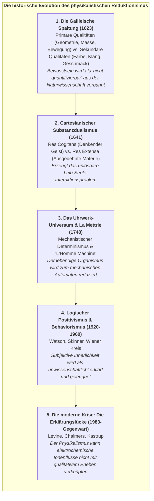
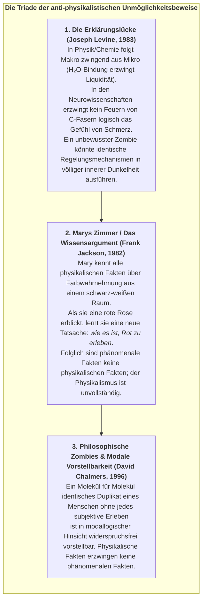
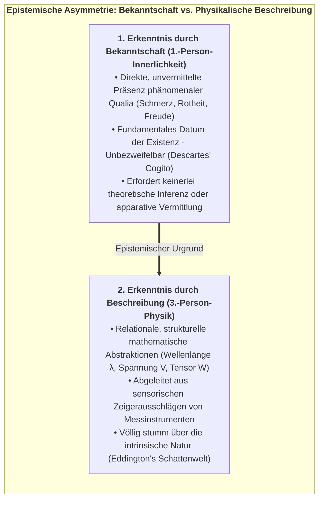
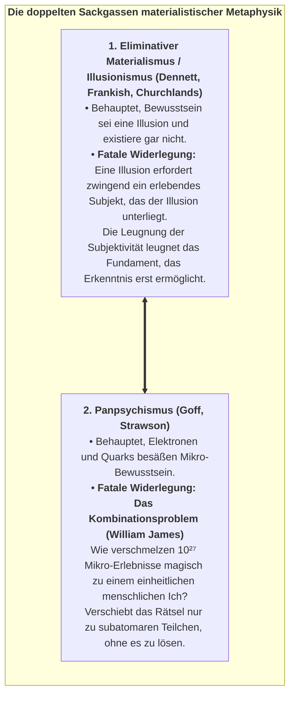
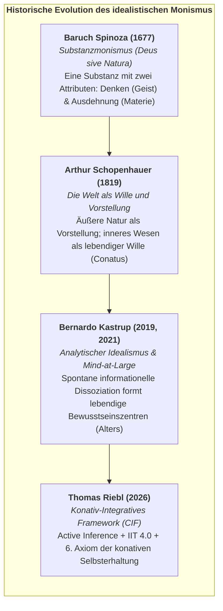
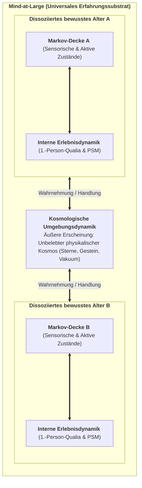
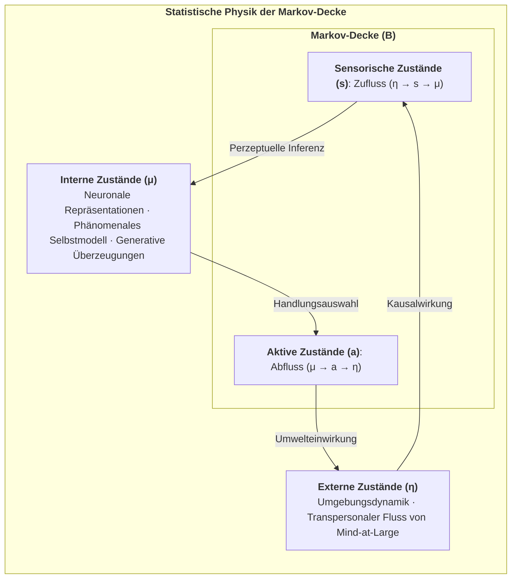

# Kapitel 1: Die Krise des Physikalismus & Die Architektur von Mind-at-Large

> *„Erfahrung ist kein zufälliges Nebenprodukt unbelebter Materie; Materie ist das äußere Erscheinungsbild erfahrungsbasierter Prozesse, beobachtet über eine dissoziative Grenze hinweg.“*  
> — **Bernardo Kastrup**, *The Idea of the World* (2019)

---

## 1.1 Die historische Genese des physikalistischen Dogmas

Seit mehr als drei Jahrhunderten arbeitet die westliche Naturwissenschaft unter dem impliziten metaphysischen Dogma des **Physikalismus** (des reduktiven Materialismus). Um zu verstehen, warum die moderne Kognitionswissenschaft und die Philosophie des Geistes in eine existenzielle Krise geraten sind, müssen wir nachzeichnen, wie dieses metaphysische Gerüst ursprünglich entstand.

<strong>Abbildung 1.1:</strong> Die historische Evolution des physikalistischen Reduktionismus.

### Die Galileische Spaltung der Wirklichkeit:
In *Il Saggiatore* (1623) vollzog Galileo Galilei einen folgenschweren methodischen Schritt, der die wissenschaftliche Revolution entfesselte: Er teilte die Natur in zwei getrennte Bereiche:
1. **Primäre Qualitäten (Objektiv):** Gestalt, Größe, Zahl, Ort und Bewegung – Eigenschaften, die sich geometrisch und mathematisch präzise quantifizieren ließen.
2. **Sekundäre Qualitäten (Subjektiv):** Farben, Geschmäcker, Wärme, Töne und emotionale Valeurs. Galilei erklärte unmissverständlich, dass sekundäre Qualitäten ausschließlich im Bewusstsein des Beobachters existieren:
   > *„Ich meine, dass Geschmäcker, Gerüche, Farben und dergleichen nicht mehr als bloße Namen sind, was den Gegenstand betrifft, in den wir sie verlegen, und dass sie einzig und allein im Bewusstsein des lebendigen Wesens wohnen.“*

Diese methodologische Abstraktion war als pragmatischer Kunstgriff für das Labor genial, um Berechnungen zu vereinfachen. Doch in den folgenden drei Jahrhunderten beging die Wissenschaft den ultimativen philosophischen Kategorienfehler: **Sie verwechselte eine pragmatische Laborabstraktion mit einer erschöpfenden ontologischen Wahrheit**. Die Wissenschaft strich das qualitative Erleben aus ihrer physikalischen Naturontologie und zeigte sich anschließend ratlos, warum sie das Bewusstsein nicht mehr in ihre Gleichungen integrieren konnte.

---

## 1.2 Die Erklärungslücke: Levine, Jackson und Chalmers

Im vorherrschenden physikalistischen Paradigma wird postuliert, dass die Wirklichkeit auf ihrer fundamentalsten Ebene ausschließlich aus quantitativen, geistlosen Entitäten besteht: subatomaren Feldern, Quanten-Wellenfunktionen, Leptonen, Quarks und Raumzeit-Mannigfaltigkeiten. Innerhalb dieses mechanistischen Weltbildes wird das subjektive Erleben – die gefühlte, qualitative Textur lebendiger Wirklichkeit, formal als *phänomenales Bewusstsein* oder *Qualia* bezeichnet – als Epiphänomen deklariert, das durch elektrochemische Schaltvorgänge von Neuronen im zentralen Nervensystem emaniert werden soll.

Doch wie der Kognitionsphilosoph David Chalmers (1995, 1996) schlüssig demonstrierte, stößt der Physikalismus hierbei auf eine unüberwindbare theoretische Barriere: das **„Schwere Problem des Bewusstseins“** (*The Hard Problem of Consciousness*). Die kognitive Neurowissenschaft und die rechnerische Psychiatrie haben beachtliche Fortschritte bei der Lösung der „leichten Probleme“ des Geistes erzielt:
* Zuordnung funktionaler neuronaler Korrelate zu sensorischer Diskrimination (z. B. retinotope Orientierungssäulen in V1).
* Messung von Reaktionszeiten und motorischen Ausführungsschwellen.
* Charakterisierung der Gedächtniskonsolidierung über hippokampal-entorhinale Schleifen.
* Modellierung linguistischer Token-Vorhersagen in neokortikalen Sprachnetzwerken.

Das Auflösen rein funktionaler Input-Output-Abbildungen lässt die eigentliche ontologische Kernfrage jedoch vollkommen unberührt: *Warum sollte sich irgendeine physiologische Berechnung oder ein elektrochemischer Ionenfluss von innen heraus jemals wie etwas anfühlen?*

$$\text{Physikalisches Substrat } (\text{Ionenflüsse, Spikes, Tensor-Operationen}) \;\xrightarrow{\;\text{Erklärungslücke}\;} \;\text{1.-Person-Qualia } (\text{Röte einer Rose, Qual, Liebe})$$

### Die Triade der anti-physikalistischen Unmöglichkeitsbeweise:

<strong>Abbildung 1.2:</strong> Die Triade der anti-physikalistischen Unmöglichkeitsbeweise.

---

## 1.3 Die epistemologische Inversion: Der Geist als primäres Datum

Der Physikalismus begeht eine tiefgreifende epistemologische Inversion. Er behandelt die physische Materie – ein theoretisches Konstrukt, das aus qualitativen Beobachtungen abgeleitet wurde – als primär, während er das erlebende Gewahrsein, welches diese Beobachtungen überhaupt erst ermöglichte, als sekundär oder illusorisch abtut.

Wie der Physik-Nobelpreisträger **Erwin Schrödinger** in *Mind and Matter* (1958) treffend formulierte:
> *„Die materielle Welt wurde nur um den Preis konstruiert, dass man das Selbst, den Geist, aus ihr herausschnitt und entfernte; der Geist gehört offensichtlich nicht zu ihr, kann folglich weder auf sie einwirken noch von ihr beeinflusst werden... Wir werden in eine rein objektive Außenwelt eingeführt und wundern uns dann, warum wir unser eigenes Bewusstsein darin nicht finden können.“*

Und wie **Sir Arthur Eddington** in *The Nature of the Physical World* (1928) bemerkte:
> *„Die Außenwelt der Physik ist eine Welt von Schattensymbolen... Unser Wissen über die physische Welt ist rein strukturell und relational. Doch von einer einzigen Sache im Universum haben wir eine direkte, unmittelbare Bekanntschaft aus ihrem innersten Wesen heraus: von unserem eigenen bewussten Erleben.“*

Die fundamentale Einsicht des Konativ-Integrativen Frameworks besteht darin, **die korrekte epistemologische Hierarchie wiederherzustellen**: Bewusstsein ist keine späte, zufällige emergente Eigenschaft toter Materie. **Bewusstsein ist der primäre ontologische Urgrund der Wirklichkeit**, und physische Materie ist die strukturelle Repräsentation mentaler Prozesse, betrachtet über Beobachtungsgrenzen hinweg.

### 1.3.1 Bekanntschaftswissen vs. Beschreibungswissen:
Um die epistemologische Inversion mathematisch zu formalisieren, greifen wir auf **Bertrand Russells Unterscheidung** zwischen *Knowledge by Acquaintance* (Erkenntnis durch unmittelbare Bekanntschaft) und *Knowledge by Description* (Erkenntnis durch Beschreibung) zurück (Russell, 1912; Chalmers, 2003):

<strong>Abbildung 1.3:</strong> Epistemische Asymmetrie: Bekanntschaft vs. Physikalische Beschreibung.

1. **Propositionale Vollständigkeit vs. Phänomenale Blindheit:**  
   Sei $\mathcal{K}_{\text{phys}} = \{p_1, p_2, \dots, p_n\}$ die Menge aller möglichen physikalischen 3.-Person-Aussagen über den menschlichen visuellen Kortex (Rhodopsin-Photonenabsorption, parvozelluläre Signalpfade, retinotope Karten in V4). Selbst wenn $\mathcal{K}_{\text{phys}}$ vollständig ist, besitzt ein Beobachter, der niemals die Empfindung von Scharlachrot erlebt hat, keinerlei Bekanntschaft mit dem Quale von Rot.
2. **Das Argument des invertierten Spektrums (Ned Block, 1990):**  
   Es ist vollkommen vereinbar mit allen bekannten Naturgesetzen und Verhaltensweisen, dass zwei Individuen eine identische neuronale Verdrahtung und identische sprachliche Reaktionen aufweisen („Diese Ampel ist rot“), jedoch invertierte phänomenale Qualia erleben (Subjekt A erlebt das, was Subjekt B als Grün erlebt). Da der Physikalismus lediglich extrinsische funktionale Relationen erfasst, kann er isomorphe Qualia-Abbildungen prinzipiell nicht unterscheiden.

---

## 1.4 Der Bankrott von eliminativem Materialismus & Panpsychismus

Konfrontiert mit dieser Erklärungslücke spaltet sich der zeitgenössische Physikalismus in zwei unhaltbare Extreme:

<strong>Abbildung 1.4:</strong> Die doppelten Sackgassen materialistischer Metaphysik.

---

## 1.5 Die Ahnenreihe des Analytischen Idealismus

Um sowohl der Absurdität des Eliminativismus als auch der Inkohärenz des Panpsychismus zu entkommen, ohne in den cartesianischen Substanzdualismus zurückzufallen, stützt sich das Konativ-Integrative Framework auf den **Analytischen Idealismus** – eine sparsame, nicht-duale Ontologie mit herausragender philosophischer Tradition:

<strong>Abbildung 1.5:</strong> Historische Evolution des idealistischen Monismus.

1. **Baruch Spinoza (1677):** In seiner *Ethik* bewies Spinoza, dass es nur eine einzige unendliche Substanz geben kann. Geist (*Denken*) und Körper (*Ausdehnung*) sind keine zwei kausal aufeinanderprallenden Substanzen, die über eine anatomische Drüse interagieren; sie sind der 1.-Person-Innenaspekt und der 3.-Person-Außenaspekt derselben zugrundeliegenden Wirklichkeit.
2. **Arthur Schopenhauer (1819):** In *Die Welt als Wille und Vorstellung* erkannte Schopenhauer, dass uns wissenschaftliche Instrumente die Natur nur als *Vorstellung* erschließen. Doch aus dem Inneren unseres eigenen Organismus erfahren wir die Natur unmittelbar als *Wille* – als unnachgiebiges, autopoietisches Streben nach Dasein und Formerhaltung gegen den Zerfall.
3. **Bernardo Kastrup (2019, 2021):** Kastrup übertrug diese Einsichten in die moderne analytische Philosophie: Die Wirklichkeit ist fundamental ein einziges, kontinuierliches, transpersonales Erfahrungsfeld – **Mind-at-Large**. Der physische Kosmos ist keine materielle Fabrik, die Bewusstsein produziert; was wir als „physisches Universum“ bezeichnen, ist schlicht das, wie die universellen kognitiven Prozesse von Mind-at-Large aussehen, wenn sie über eine lokalisierte Beobachtungsperspektive wahrgenommen werden.

---

## 1.6 Die Topologie der Dissoziation: Wie Bewusstseinszentren entstehen

Wenn die Wirklichkeit fundamental ein ungeteiltes Bewusstseinsfeld ist, wie entstehen dann individuelle Lebewesen mit privater 1.-Person-Innerlichkeit, subjektiver Abgrenzung und autonomen Grenzen?

Die Lösung liegt nicht in der Aggregation (Bottom-up), sondern in der **topologischen Partitionierung durch Dissoziation (Top-down)**.

In der klinischen Psychiatrie liefert die **Dissoziative Identitätsstörung (DIS)** den direkten empirischen Beweis, dass eine einzige Psyche eine informationelle Partitionierung erfahren kann, wodurch mehrere parallele, eigenständige Erlebniszentren (*Alters*) innerhalb desselben mentalen Substrats entstehen. Jedes Alter besitzt seinen eigenen Erlebnishorizont, seine eigene narrative Identität und eigene Sinnesgrenzen, während es vollständig aus demselben mentalen Gewebe besteht.

In ähnlicher Weise zeigten Split-Brain-Studien von Roger Sperry und Michael Gazzaniga (1968), dass die Durchtrennung des Corpus Callosum das einheitliche bewusste Subjekt in zwei eigenständige, parallel operierende Alters innerhalb desselben Schädels spaltet, von denen jedes unabhängige visuelle und motorische Active Inference vollzieht.

<strong>Abbildung 1.6:</strong> Mind-at-Large als universales Erfahrungssubstrat und dissoziierte Bewusstseinszentren (Alters).

### 1.6.1 Topologische Dissoziation vs. Das Kombinationsproblem:
Warum löst der dissoziative Top-down-Mechanismus das Problem, an dem der Panpsychismus scheitert?

In der analytischen Philosophie ist das **Dekombinationsproblem** des Idealismus fundamental leichter zu lösen als das **Kombinationsproblem** des Panpsychismus (Kastrup, 2018; Goff, 2017):
1. **Das panpsychistische Dilemma (Aggregationsversagen):** Der Panpsychismus verlangt von Milliarden mikrobewusster subatomarer Subjekte (Quarks, Elektronen), ihre privaten Innenwelten auf wundersame Weise zu einem einzigen menschlichen Makro-Subjekt zu verschmelzen (*The Subject Addition Problem*). Es existiert kein mathematischer oder logischer Mechanismus, durch den zwei getrennte 1.-Person-Innerlichkeiten zu einer dritten verschmelzen können, ohne ihre Identität zu verlieren.
2. **Die idealistische Lösung (Topologische Abgrenzung):** Der Analytische Idealismus beginnt mit einem bereits vereinten, nicht-lokalen Bewusstseinsfeld (Mind-at-Large). Er erfordert lediglich, dass dieses Feld **lokale Grenzen informationeller Schließung** ausbildet – exakt das, was die statistische Physik von Markov-Decken beschreibt.
3. **Die Strudel-Metapher formalisiert:** So wie ein Strudel in einem Fluss durch lokale Wirbelbildung entsteht, ohne eine neue „Wassersubstanz“ hinzuzufügen, formt sich ein bewusstes Alter innerhalb von Mind-at-Large durch lokale statistische Schließung, ohne neue ontologische Grundbausteine einzuführen. Das Alter besteht zu 100 % aus Mind-at-Large, ist jedoch kausal von der restlichen Strömung abgegrenzt.

---

## 1.7 Die statistische Physik der Markov-Decke

In der statistischen Mechanik und theoretischen Biologie (Pearl, 1988; Friston, 2013, 2019) wird die exakte Grenze, die ein dissoziiertes Alter vom umgebenden Feld von Mind-at-Large trennt, als **Markov-Decke (*Markov Blanket*)** formalisiert.

Sei der vollständige Zustandsraum der Wirklichkeit durch einen Vektor kontinuierlicher oder diskreter Zufallsvariablen $\mathcal{X}$ beschrieben. Eine Markov-Decken-Partition teilt $\mathcal{X}$ in vier disjunkte, bedingt unabhängige Zustandsräume:

$$\mathcal{X} = \{\eta, s, a, \mu\}$$

Wobei:
* **Externe Zustände ($\eta \in \mathcal{H}$):** Die transpersonalen Prozesse von Mind-at-Large und die Umgebungsdynamik außerhalb der Grenze des Organismus.
* **Sensorische Zustände ($s \in \mathcal{S}$):** Die rezeptive Schnittstelle (Netzhaut-Stäbchen, Haarzellen der Cochlea, Thermorezeptoren, interozeptive Sensoren), die kausal von externen Zuständen $\eta$ und internen Zuständen $\mu$ beeinflusst werden.
* **Aktive Zustände ($a \in \mathcal{A}$):** Die effektorische Schnittstelle (Muskelkontraktionen, Drüsensekretion, Lautäußerungen), die kausal von internen Zuständen $\mu$ gesteuert werden und auf externe Zustände $\eta$ einwirken.
* **Interne Zustände ($\mu \in \mathcal{M}$):** Die neuronale Konnektivität, intrazelluläre Signalkaskaden und subjektiven phänomenalen Repräsentationen des lebendigen Agenten.

Die **Markov-Decke ($\mathcal{B}$)** ist definiert als die Vereinigung sensorischer und aktiver Zustände:

$$\mathcal{B} \triangleq \{s, a\}$$

### Das fundamentale Unabhängigkeitstheorem:

Unter dieser Partition sind die internen Zustände $\mu$ und die externen Zustände $\eta$ **bedingt unabhängig**, gegeben die Decken-Zustände $\mathcal{B}$:

$$P(\mu, \eta \mid \mathcal{B}) = P(\mu \mid \mathcal{B}) \cdot P(\eta \mid \mathcal{B}) \quad \Longleftrightarrow \quad \mu \perp\!\!\!\perp \eta \mid \mathcal{B}$$

<strong>Abbildung 1.7:</strong> Die Partitionierung der Markov-Decke und der Informationsfluss.

Diese bedingte Unabhängigkeit besitzt tiefgreifende epistemologische und ontologische Konsequenzen:
1. **Die epistemische Barriere:** Interne Zustände $\mu$ haben niemals direkten, unvermittelten Kontakt zur externen Wirklichkeit $\eta$. Ein Organismus kann die Welt niemals unmittelbar „berühren“; er kann die verborgenen Ursachen seiner sensorischen Reizungen $s$ nur erschließen, indem er prädiktive generative Hypothesen projiziert.
2. **Die phänomenologische Leinwand:** Die sensorisch-aktive Grenze ist der statistische Schleier, auf dem die subjektive Wahrnehmungsrealität gerendert wird.
3. **Der physische Körper als äußere Erscheinung:** Was ein externer Beobachter als biologischen physischen Körper wahrnimmt (Zellen, Blutgefäße, Kortex), ist nichts anderes als die **extrinsische physische Repräsentation der Markov-Decke und der internen Kognition des Alters**, betrachtet über die dissoziative Grenze hinweg.

---

## 1.8 Die Definition der bewussten Seele im CIF

Aus der Synthese des analytischen Idealismus mit der statistischen Physik formulieren wir die grundlegende Definition individueller Existenz im Konativ-Integrativen Framework:

> **Statement 1.1: Definition der individuellen Seele (des bewussten Alters)**  
> *Ein individueller bewusster Organismus (eine Seele) ist ein autopoietisches, im Nichtgleichgewicht befindliches informationelles Alter, dissoziiert aus Mind-at-Large, abgegrenzt durch eine statistische Markov-Decke $\mathcal{B} = \{s, a\}$, dessen interne Dynamik $\mu$ homöostatische Selbstorganisation und subjektive 1.-Person-Innerlichkeit aufrechterhält, indem sie aktiv variationale freie Energie minimiert und eine integrierte Ursache-Wirkungs-Struktur über die Zeit bewahrt.*

In Kapitel 2 untersuchen wir den exakten kybernetischen Motor, der es diesem dissoziierten Alter ermöglicht, seine Existenz gegen den entropischen Zerfall zu behaupten: *Das Free Energy Principle und Active Inference*.
