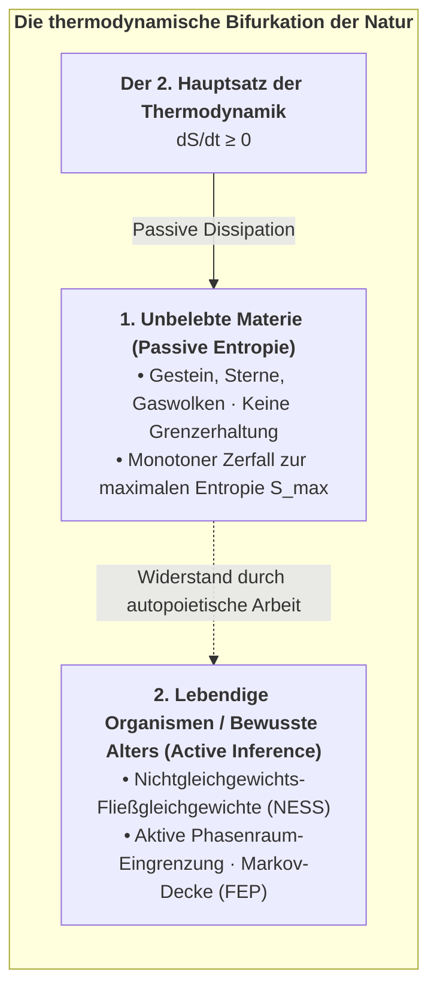
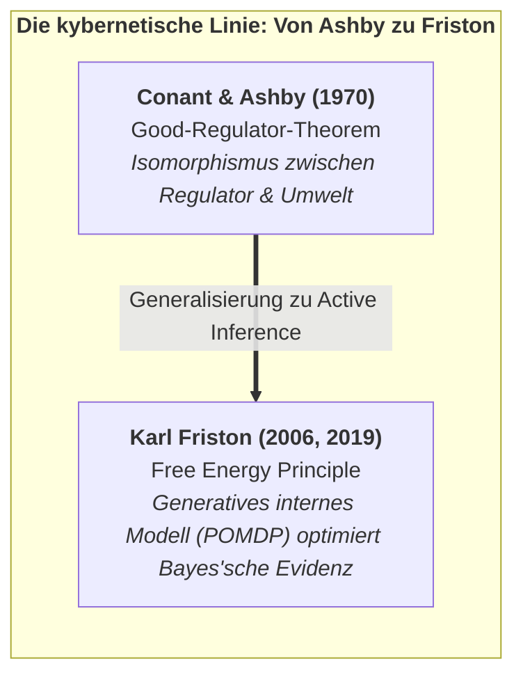
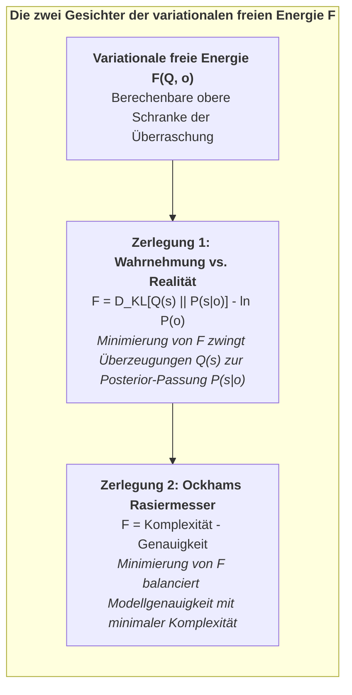
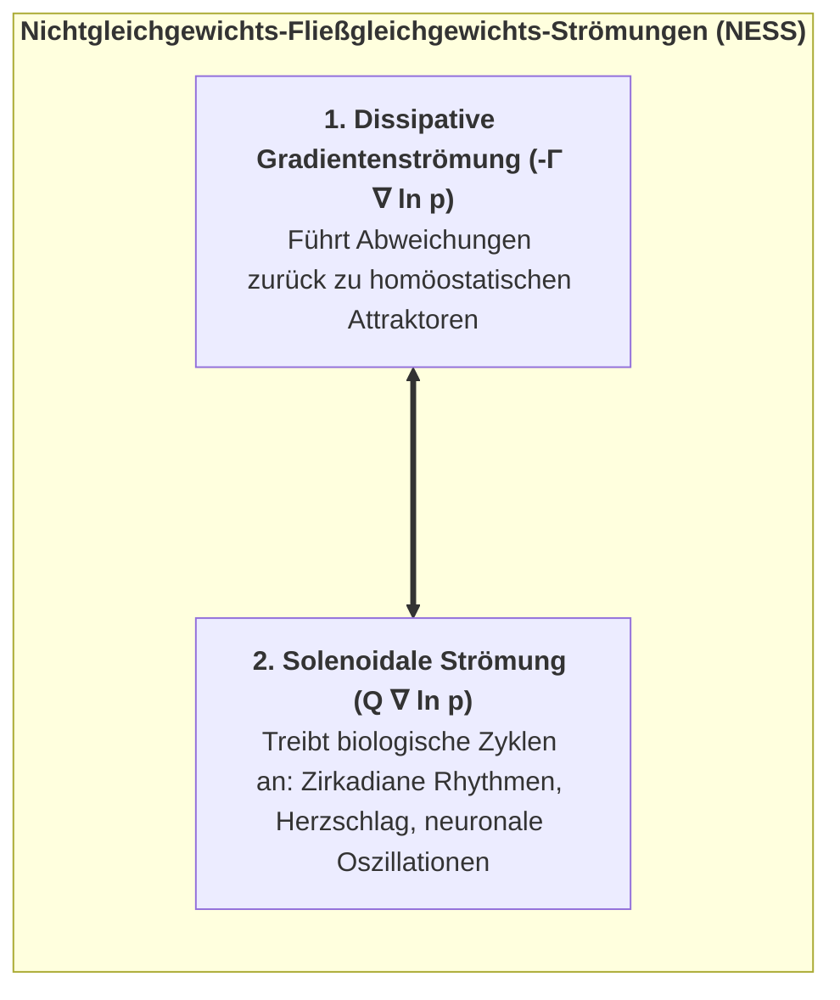
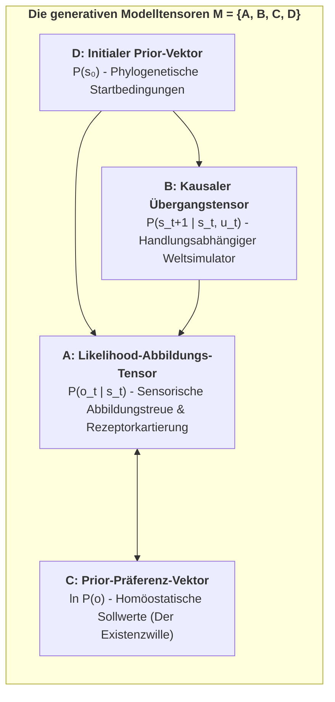
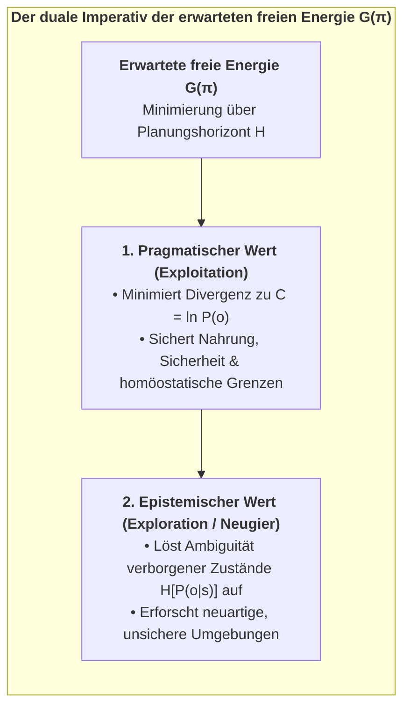
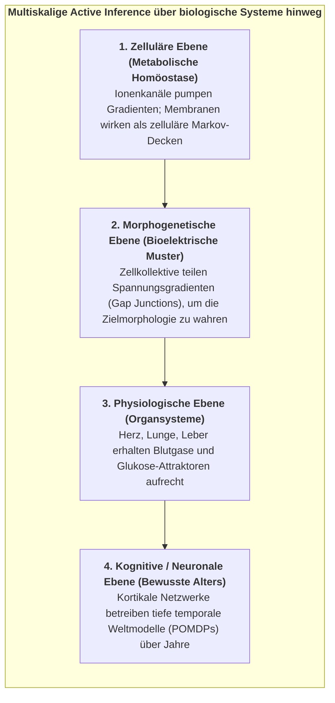

# Kapitel 2: Der kybernetische Motor: Das Free Energy Principle & Active Inference

> *„Ein sich selbst organisierendes System kann seine strukturelle Integrität nur bewahren und thermodynamischer Dispersion nur entgehen, indem es die Überraschung seiner sensorischen Begegnungen minimiert.“*  
> — **Karl Friston**, *The Free-Energy Principle: A Unified Brain Theory?* (2010)

---

## 2.1 Die thermodynamische Krise: Widerstand gegen den entropischen Zerfall

Das universellste und unerbittlichste Gesetz der unbelebten Natur ist der **Zweite Hauptsatz der Thermodynamik**: In jedem isolierten physikalischen System nimmt die Entropie (die statistische Unordnung, thermische Dispersion und mikroskopische Unruhe) monoton über die Zeit zu, bis das thermodynamische Gleichgewicht erreicht ist – maximale Entropie, gleichförmiger Wärmetod und vollständiger Verlust jeglicher Struktur:

$$\frac{d S_{\text{Universum}}}{d t} \ge 0$$

Ein unbelebter Gegenstand – wie ein Granitfelsen in der Wüste – ergibt sich diesem universellen entropischen Drift passiv. Er absorbiert Wärme, erfährt mechanische Verwitterung, bricht unter thermischer Expansion auf und zerfällt unaufhaltsam zu amorphem Sand. Er besitzt keine selbsterhaltende Grenze, keine internen regulatorischen Sollwerte und keinen kybernetischen Mechanismus, um seiner Auflösung entgegenzuwirken.

Im scharfen, lebendigen Kontrast dazu sind **lebendige Organismen Systeme im Nichtgleichgewichtszustand (Nonequilibrium Steady State, NESS)**. Ein Bakterium, das einem chemischen Nährstoffgradienten folgt, ein Kolibri auf der Suche nach Nektar oder ein Mensch, der seine zelluläre Homöostase aufrechterhält, dissipiert nicht passiv in die Umwelt. Über Tage, Jahre oder Jahrzehnte hinweg beschränkt ein lebendiger Organismus seine internen physikalischen und physiologischen Zustände aktiv auf einen außerordentlich engen, statistisch höchst unwahrscheinlichen Bereich seines Phasenraums:
* Die Körperkerntemperatur wird strikt zwischen $36{,}5^\circ\text{C}$ und $37{,}5^\circ\text{C}$ gehalten.
* Der Blutplasma-pH-Wert verbleibt exakt zwischen $7{,}35$ und $7{,}45$.
* Intrazelluläre Kalium- ($140\text{ mM}$) und extrazelluläre Natriumkonzentrationen ($142\text{ mM}$) werden über Lipid-Doppelschichten hinweg aktiv gegen osmotische Gradienten gepumpt.

<strong>Abbildung 2.1:</strong> Die thermodynamische Bifurkation der Natur.

Wie vollbringt ein lebendiger Organismus – im CIF verstanden als dissoziiertes bewusstes Alter innerhalb von Mind-at-Large – diesen kontinuierlichen, unwahrscheinlichen Triumph über die entropische Zerstreuung?

Die theoretische Antwort liefert Karl Fristons **Free Energy Principle (FEP)**: Jedes sich selbst organisierende System, das über die Zeit fortbesteht, muss aktiv seine **variationale freie Energie ($F$)** minimieren, welche eine mathematisch berechenbare obere Schranke für die **Überraschung (*Surprise*)** seiner sensorischen Begegnungen darstellt.

### 2.1.1 Das Good-Regulator-Theorem und kybernetische Grundlagen:
Die mathematische Ahnenreihe von Active Inference reicht direkt in die Kybernetik der 1970er-Jahre zurück, namentlich zum **Good-Regulator-Theorem** von Roger Conant und W. Ross Ashby (1970):

> *„Jeder gute Regulator eines Systems muss ein Modell dieses Systems sein.“*

<strong>Abbildung 2.2:</strong> Die kybernetische Ahnenreihe: Von Ashby zu Friston.

Conant und Ashby bewiesen informationstheoretisch, dass ein Agent essenzielle homöostatische Variablen nur dann innerhalb lebensfähiger physiologischer Grenzen halten kann, wenn seine internen Zustandsübergänge mathematisch isomorph zu den Umweltstörungen sind, denen er begegnet.

Das Free Energy Principle verallgemeinert das Good-Regulator-Theorem in zwei fundamentalen Dimensionen:
1. **Vom statischen Isomorphismus zur dynamischen generativen Modellierung:** Das Gehirn spiegelt die externe Dynamik nicht bloß passiv wider; es betreibt ein aktives, hierarchisches **generatives Weltmodell** ($A, B, C, D$), das sensorische Konsequenzen antizipiert, bevor sie eintreffen.
2. **Von passiver Regelung zu aktiver Inferenz:** Der Organismus passt nicht bloß interne Parameter an externe Schocks an; er handelt aktiv auf die Umwelt ein, um sensorische Beobachtungen dazu zu zwingen, seinen a-priori-Präferenzen zu entsprechen.

---

## 2.2 Mathematische Herleitung der variationalen freien Energie

Betrachten wir einen Organismus, der durch eine Markov-Decke $\mathcal{B} = \{s, a\}$ von der Außenwelt getrennt ist. Der Organismus empfängt sensorische Beobachtungen $o \in \Omega$, die von externen verborgenen Zuständen $\eta \in \mathcal{H}$ erzeugt werden, zu denen er keinen direkten Zugang hat.

Die wahre statistische Überraschung (die Selbstinformation) beim Auftreten einer Beobachtung $o$ ist definiert als die negative Log-Evidenz unter dem evolutionären generativen Modell $P$ des Organismus:

$$\mathcal{I}(o) = -\ln P(o) = -\ln \int_{\mathcal{S}} P(o, s) \, ds$$

Die direkte Auswertung dieses marginalen Integrals $-\ln P(o)$ ist für jedes biologische Gehirn rechnerisch unlösbar (*NP-hard*), da es die Summation über alle denkbaren Kombinationen verborgener Ursachen $s$ erfordern würde.

Um diese rechnerische Barriere zu überwinden, führt das lebendige Alter eine **interne Erkennungsdichte $Q(s)$** ein – eine parametrisierte Wahrscheinlichkeitsverteilung über die verborgenen Zustände $s$ der Welt.

### Schrittweise Herleitung über die Jensensche Ungleichung:

Wendet man die Jensensche Ungleichung für konkave Funktionen ($\ln \mathbb{E}[X] \ge \mathbb{E}[\ln X]$) auf die negative Log-Evidenz an:

$$-\ln P(o) = -\ln \int_{\mathcal{S}} Q(s) \frac{P(o, s)}{Q(s)} \, ds = -\ln \mathbb{E}_{Q(s)}\left[ \frac{P(o, s)}{Q(s)} \right]$$

Da $-\ln(x)$ konvex ist, liefert die Jensensche Ungleichung die fundamentale variationale obere Schranke:

$$-\ln P(o) \le \mathbb{E}_{Q(s)}\left[ -\ln \frac{P(o, s)}{Q(s)} \right] = \mathbb{E}_{Q(s)}\Big[ \ln Q(s) - \ln P(o, s) \Big] \triangleq F(Q, o)$$

Wobei **$F(Q, o)$ die variationale freie Energie** ist.

### Die zwei Zerlegungen der freien Energie:

Durch algebraische Umformung lässt sich die variationale freie Energie auf zwei aufschlussreiche Weisen zerlegen:

$$\begin{aligned}
F &= \underbrace{D_{\text{KL}}\Big(Q(s) \;\parallel\; P(s \mid o)\Big)}_{\text{1. Relative Entropie (Wahrnehmungsfehler)}} - \underbrace{\ln P(o)}_{\text{Log-Evidenz (Negative Überraschung)}} \\[10pt]
  &= \underbrace{D_{\text{KL}}\Big(Q(s) \;\parallel\; P(s)\Big)}_{\text{2. Komplexität (Overfitting-Strafe)}} - \underbrace{\mathbb{E}_{Q(s)}\big[\ln P(o \mid s)\big]}_{\text{Genauigkeit (Sensorische Passung)}}
\end{aligned}$$

<strong>Abbildung 2.3:</strong> Die zwei Gesichter der variationalen freien Energie $F$.

### Die doppelten Theoreme von Active Inference:

Da die Kullback-Leibler-Divergenz strikt nicht-negativ ist ($D_{\text{KL}} \ge 0$, mit Gleichheit genau dann, wenn $Q(s) = P(s \mid o)$):

$$F(Q, o) \ge -\ln P(o) \quad \forall \; Q(s)$$

Dies führt unmittelbar zu den zwei fundamentalen Modi der aktiven Selbstorganisation:

1. **Perzeptuelle Inferenz (Aktualisierung von Überzeugungen):**  
   Indem das Gehirn seine internen Zustände $\mu$ (synaptische Aktivitäten und Membranpotenziale) modifiziert, aktualisiert es $Q(s)$, um $D_{\text{KL}}\big(Q(s) \parallel P(s \mid o)\big)$ zu minimieren. Wenn diese Divergenz gegen null strebt, werden interne Überzeugungen Bayes-optimal, und die freie Energie reduziert sich auf die tatsächliche Überraschung:
   $$F \longrightarrow -\ln P(o)$$

2. **Aktive Inferenz (Handlungsausführung):**  
   Ein Organismus kann vergangene sensorische Reize nicht ungeschehen machen, aber er kann über seine aktiven Zustände $a$ auf die Umwelt einwirken, um selektiv solche Beobachtungen $o$ zu erzeugen, die unter seinem generativen Modell eine hohe a-priori-Wahrscheinlichkeit $P(o)$ aufweisen. Indem er Handlungen vollzieht, die sensorische Reize zurück in seine homöostatischen Sollwerte steuern, minimiert er direkt $-\ln P(o)$.

---

## 2.3 Kontinuierliche Active Inference & Verallgemeinerte Bewegungskoordinaten

In der physikalischen Wirklichkeit treffen Sinnesreize als kontinuierlicher Fluss kontinuierlicher Variablen ein (Schallwellen, Photonen, Gelenkwinkel). In der zeitkontinuierlichen Formulierung erfasst das Gehirn verborgene Zustände über **verallgemeinerte Bewegungskoordinaten (*Generalized Coordinates of Motion*)**:

$$\tilde{s} = \big( s, s', s'', s''', \dots \big)^\top = \big( \text{Position}, \text{Geschwindigkeit}, \text{Beschleunigung}, \text{Ruck}, \dots \big)^\top$$

Die interne neuronale Dynamik $\tilde{\mu}$ evolviert über Gradientenabstieg auf der freien Energie, korrigiert um das Verstreichen der Zeit:

$$\dot{\tilde{\mu}} = \mathcal{D}\tilde{\mu} - \nabla_{\tilde{\mu}} F(\tilde{\mu}, \tilde{o})$$

Wobei $\mathcal{D}$ der Zeitableitungs-Verschiebeoperator ist ($\mathcal{D} \tilde{\mu} = (\mu', \mu'', \mu''', \dots)$). Dies stellt sicher, dass das Gehirn nicht bloß statische Momentanwerte vorhersagt, sondern **dynamische Trajektorien in Echtzeit aktiv nachverfolgt**.

---

## 2.4 Das Nichtgleichgewichts-Fließgleichgewicht (NESS) und solenoidale Strömungen

Im physikalischen Phasenraum wird die zeitliche Entwicklung des vollständigen Zustandsvektors $x = (\eta, s, a, \mu)$ des Alters durch die stochastische Langevin-Differentialgleichung beschrieben:

$$\dot{x}(t) = f(x) + \omega(t)$$

Wobei $f(x)$ das deterministische Driftfeld darstellt und $\omega(t)$ standardmäßige Gaußsche Fluktuationen mit Kovarianzmatrix $2\Gamma$ bezeichnet.

Nach dem **Helmholtz-Zerlegungstheorem** zerfällt die deterministische Strömung $f(x)$ unter einer stationären NESS-Dichte $p(x)$ in zwei orthogonale Komponenten:

$$f(x) = \underbrace{-\Gamma \nabla \ln p(x)}_{\text{1. Irreversible dissipative Strömung}} + \underbrace{Q \nabla \ln p(x)}_{\text{2. Reversible solenoidale Strömung}}$$

Wobei:
* **Dissipative Gradientenströmung ($-\Gamma \nabla \ln p(x)$):** Zieht das System direkt zu Regionen hoher Wahrscheinlichkeitsdichte zurück (auf die homöostatische Attraktor-Mannigfaltigkeit $\mathcal{A}$).
* **Konservative solenoidale Strömung ($Q \nabla \ln p(x)$):** Zirkuliert entlang der Iso-Wahrscheinlichkeitslinien des Attraktors, ohne die Dichte zu verändern ($\nabla \cdot (Q \nabla \ln p(x)) = 0$).

<strong>Abbildung 2.4:</strong> Nichtgleichgewichts-Fließgleichgewichts-Strömungen (NESS).

In biologischen Organismen sind solenoidale Strömungen exakt jene autonomen biologischen Rhythmen, die das Leben aufrechterhalten: zirkadiane Rhythmen, Atembewegungen, kardiale Schrittmacher und kortikale Gehirnwellen (Theta-Gamma-Phasen-Amplituden-Kopplung).

---

## 2.5 Das diskrete generative Modell: Die POMDP-Tensorarchitektur

In den kognitiven Neurowissenschaften und der Künstlichen Intelligenz wird das generative Modell eines lebendigen Agenten als zeitdiskreter **partiell beobachtbarer Markov-Entscheidungsprozess (POMDP)** formuliert. Das Modell wird durch vier fundamentale Tensorstrukturen definiert:

$$\mathcal{M} = \big\{ A, B, C, D \big\}$$

<strong>Abbildung 2.5:</strong> Die generativen Modelltensoren $\mathcal{M} = \{A, B, C, D\}$.

### 1. Der Likelihood-Abbildungstensor ($A$):
Bildet verborgene Umweltzustände $s \in \{1, \dots, N_s\}$ auf sensorische Beobachtungen $o \in \{1, \dots, N_o\}$ ab:

$$A_{j, k} \triangleq P(o_t = j \mid s_t = k)$$

### 2. Der kausale Übergangstensor ($B$):
Repräsentiert den internen Simulator der temporalen Umweltphysik – wie verborgene Zustände als Funktion von Kontrollhandlungen $u \in \{1, \dots, N_u\}$ des Agenten evolvieren:

$$B_{i, j, u} \triangleq P(s_{t+1} = i \mid s_t = j, u_t = u)$$

### 3. Der Prior-Präferenzvektor ($C$):
Kodiert die angeborenen biologischen Werte, homöostatischen Notwendigkeiten und affektiven Präferenzen des Alters:

$$C_j \triangleq \ln P(o_t = j)$$

### 4. Der initiale Zustands-Priorvektor ($D$):
Kodiert phylogenetische Erwartungen vor Beginn sensorischer Beobachtungen:

$$D_k \triangleq P(s_0 = k)$$

---

## 2.6 Erwartete freie Energie ($G$) und temporale Tiefe

Während die aktuelle variationale freie Energie ($F$) unmittelbare Empfindungen im gegenwärtigen Moment $t$ bewertet, erfordert zielgerichtetes Handeln die Bewertung künftiger Handlungssequenzen – genannt **Policies ($\pi = (u_1, u_2, \dots, u_H)$)** – über einen Planungshorizont $H$.

Für jede Kandidaten-Policy $\pi$ berechnet der Agent die **erwartete freie Energie ($\mathbf{G}$)** über den Zeithorizont $H$:

$$\mathbf{G}(\pi) = \sum_{\tau = t+1}^{t+H} \delta^{\tau - t} \cdot \mathbf{G}(\pi, \tau)$$

Wobei $\delta \in (0, 1]$ ein zeitlicher Abzinsungsparameter ist. Die erwartete freie Energie eines Einzelschritts zerfällt in zwei essenzielle Terme:

$$\mathbf{G}(\pi, \tau) = \underbrace{D_{\text{KL}}\Big(Q(o_\tau \mid \pi) \;\parallel\; P(o_\tau)\Big)}_{\text{1. Pragmatischer Wert (Homöostatisches Risiko)}} + \underbrace{\mathbb{E}_{Q(s_\tau \mid \pi)}\Big[\mathcal{H}\big[P(o_\tau \mid s_\tau)\big]\Big]}_{\text{2. Epistemischer Wert (Informationsgewinn / Ambiguitätsreduktion)}}$$

<strong>Abbildung 2.6:</strong> Der duale Imperativ der erwarteten freien Energie $\mathbf{G}(\pi)$.

### Handlungsauswahl über Softmax-Optimierung:

Die Wahrscheinlichkeit der Ausführung einer Policy $\pi$ wird durch eine präzisionsgewichtete Softmax-Verteilung gesteuert:

$$P(\pi) = \sigma\big(-\gamma \cdot \mathbf{G}(\pi)\big) = \frac{\exp\big(-\gamma \cdot \mathbf{G}(\pi)\big)}{\sum_{\pi'} \exp\big(-\gamma \cdot \mathbf{G}(\pi')\big)}$$

Wobei $\gamma$ der Parameter der **Handlungspräzision (*Action Precision*)** ist (inverse Temperatur).

---

## 2.7 Multiskalige biologische Active Inference: Zellen, Gewebe und Morphogenese

Active Inference beschränkt sich keineswegs auf Gehirne. Wie der Entwicklungsbiologe **Michael Levin (2019, 2021)** und Karl Friston gezeigt haben, operiert Active Inference auf allen verschachtelten Ebenen der lebendigen Biologie:

<strong>Abbildung 2.7:</strong> Multiskalige Active Inference über biologische Systeme hinweg.

Jede lebendige Zelle, jedes Gewebekollektiv und jeder Organismus ist ein Active-Inference-Motor, der danach strebt, seine Markov-Decke zu bewahren. Im menschlichen bewussten Alter erreicht diese multiskalige Architektur ihren Höhepunkt im zerebralen Kortex.

### 2.7.1 Der bioelektrische Code: Morphogenetische Active Inference ohne Neuronen
Wie koordinieren nicht-neuronale Zellverbände makroskopische Gestalt ohne zentrale kortikale Steuerung?

Bahnbrechende Arbeiten des Biophysikers **Michael Levin (2019, 2021, 2024)** zeigen, dass somatische Zellen über einen nicht-neuronalen **bioelektrischen Code** kommunizieren:
1. **Ruhemembranpotenziale ($V_{\text{mem}}$) als kognitive Variablen:** Jede somatische Zelle hält über Ionentransporter einen intrazellulären Spannungsgradienten aufrecht ($V_{\text{mem}} \approx -10\text{ bis } -70\text{ mV}$). Langsame räumliche Spannungsveränderungen fungieren als anatomische Gedächtniszustände.
2. **Gap Junctions als geschaltete Kommunikationskanäle:** Zellen verbinden sich über hexamere Proteinkanäle namens **Connexine** (Gap Junctions). Wenn sich diese Kanäle öffnen, gleicht sich der Spannungszustand über Zellgruppen hinweg aus, wodurch Tausende zellulärer Markov-Decken zu einer einzigen, makroskopischen **morphogenetischen Makro-Decke** verschmelzen.
3. **Anatomische Sollwerte als Prior-Präferenzen ($C$):** Bei regenerierenden Plattwürmern (*Planarien*) speichern bioelektrische Schaltkreise die geometrische Zielmorphologie (z. B. „ein Kopf, ein Schwanz“). Wird ein Fragment abgetrennt, registriert das Zellkollektiv die Abweichung vom Zielspannungsmuster als räumlichen Vorhersagefehler und steuert die Zellproliferation, bis die exakte Anatomie wiederhergestellt ist.
4. **Epistemologische Bedeutung für das CIF:** Dies beweist, dass Active Inference und zielgerichtete kybernetische Handlungsfähigkeit keine späte Erfindung komplexer Säugetiergehirne sind; sie bilden die universelle Organisationslogik aller lebendigen Materie auf jeder biologischen Skala.

In Kapitel 3 wechseln wir von dieser objektiven 3.-Person-Kybernetik zur 1.-Person-Innerlichkeit des Bewusstseins: Giulio Tononis **Integrierte Informationstheorie (IIT 4.0)** und die Formulierung des **6. Axioms**.
