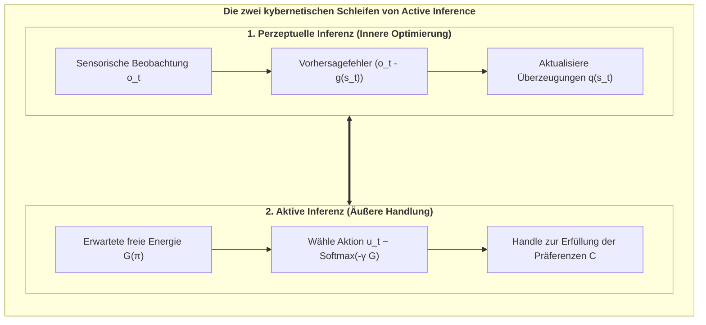

# Kapitel 2: Die kybernetische Engine: Das Free Energy Principle & Active Inference

> *„Ein System kann seine strukturelle Integrität nur aufrechterhalten und dem thermodynamischen Zerfall entgehen, indem es die Überraschung seiner sensorischen Beobachtungen minimiert.“*  
> — **Karl Friston**, *The Free-Energy Principle: A Unified Brain Theory?* (2010)

---

## 2.1 Der Kampf gegen die Entropie

Das unerbittliche Grundgesetz der unbelebten Physik ist der **Zweite Hauptsatz der Thermodynamik**: In einem geschlossenen System nimmt die Entropie (Unordnung, Dissipation) monoton zu:

$$\Delta S_{\text{Universum}} \ge 0$$

Ein unbelebter Stein zerfällt mit der Zeit zu Staub. Im Gegensatz dazu sind lebendige Organismen **dissipative Nicht-Gleichgewichts-Systeme**, die sich aktiv in einem hochgradig unwahrscheinlichen, stabilen physiologischen Zustand halten (Körpertemperatur ca. $37^\circ\text{C}$, konstanter Blut-pH-Wert).

Wie gelingt dem dissoziierten Zentrum diese lokale Umkehrung des Entropiestroms?

Die Antwort liefert Karl Fristons **Free Energy Principle (FEP)**: Jeder selbstorganisierende Organismus, der durch eine Markov-Decke abgegrenzt ist, muss seine **variationale freie Energie ($F$)** minimieren, die eine berechenbare mathematische Obergrenze für **sensorische Überraschung** darstellt:

$$\text{Überraschung } = -\ln P(o)$$

---

## 2.2 Variationale Freie Energie: Mathematische Formulierung

Da der Organismus die verborgenen Ursachen der Welt ($s$) nicht direkt sehen kann, sondern nur verrauschte Beobachtungen ($o$) empfängt, unterhält er ein internes Wahrscheinlichkeitsmodell $Q(s)$ über die Umwelt.

Die **variationale freie Energie ($F$)** ist definiert als:

$$\begin{aligned}
F &= \mathbb{E}_{Q(s)}\Big[\ln Q(s) - \ln P(o, s)\Big] \\
  &= \underbrace{D_{\text{KL}}\Big(Q(s) \;\parallel\; P(s \mid o)\Big)}_{\text{Divergenz (Wahrnehmungsfehler)}} - \underbrace{\ln P(o)}_{\text{Log-Evidenz (Negative Überraschung)}}
\end{aligned}$$

Da die Kullback-Leibler-Divergenz stets nicht-negativ ist ($D_{\text{KL}} \ge 0$), gilt immer:

$$F \ge -\ln P(o)$$

Das Minimieren von $F$ erzwingt zwei lebensrettende Anpassungsschleifen:
1. **Perzeptuelle Inferenz (Wahrnehmung):** Das Gehirn passt seine inneren Überzeugungen ($Q(s)$) an, um Vorhersagefehler zu minimieren.
2. **Aktive Inferenz (Handlung):** Der Organismus führt Handlungen aus, um die Welt so zu verändern, dass die eingehenden Sinneseindrücke seinen angeborenen Erwartungen entsprechen.

---

## 2.3 Das generative POMDP-Modell

Das interne Weltmodell des Agenten wird als diskreter **Partially Observable Markov Decision Process (POMDP)** formalisiert:

$$\mathcal{M} = \big\{ A, B, C, D \big\}$$

1. **Die Likelihood-Matrix ($A = P(o_t \mid s_t)$):** Verknüpft verborgene Zustände $s$ mit Beobachtungen $o$.
2. **Der Übergangstensor ($B = P(s_{t+1} \mid s_t, u_t)$):** Der innere Simulator für die Dynamik der Welt unter Handlung $u$.
3. **Der Präferenzvektor ($C = \ln P(o)$):** Die Sollwerte des Überlebens (*Conatus / Der Existenzwille*).
4. **Der Anfangsvektor ($D = P(s_0)$):** Angeborene phylogenetische Startüberzeugungen.

---

## 2.4 Erwartete Freie Energie ($G$) und kontrafaktische Planung

Für zukünftige Handlungsfolgen (Policies $\pi$) berechnet der Agent die **erwartete freie Energie ($\mathbf{G}$)** über einen Zeithorizont $H$:

$$\mathbf{G}(\pi) = \sum_{\tau = t+1}^{t+H} \delta^{\tau - t} \cdot \mathbf{G}(\pi, \tau)$$

$$\mathbf{G}(\pi, \tau) = \underbrace{D_{\text{KL}}\Big(Q(o_\tau \mid \pi) \;\parallel\; P(o_\tau)\Big)}_{\text{1. Pragmatischer Wert (Zielerreichung)}} + \underbrace{\mathbb{E}_{Q(s_\tau \mid \pi)}\Big[\mathcal{H}\big[P(o_\tau \mid s_\tau)\big]\Big]}_{\text{2. Epistemischer Wert (Neugier / Ambiguitätsabbau)}}$$

* **Pragmatischer Wert:** Zwingt den Agenten zur Sicherung von Nahrung und Schutz (Erfüllung von $C$).
* **Epistemischer Wert:** Treibt den Agenten dazu, unsichere Orte zu erkunden, um sein Weltmodell zu verbessern.
