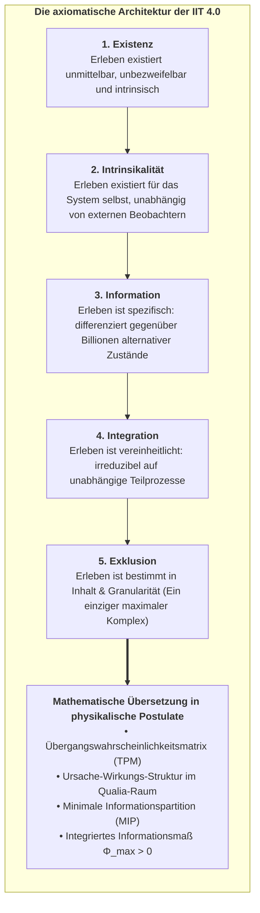
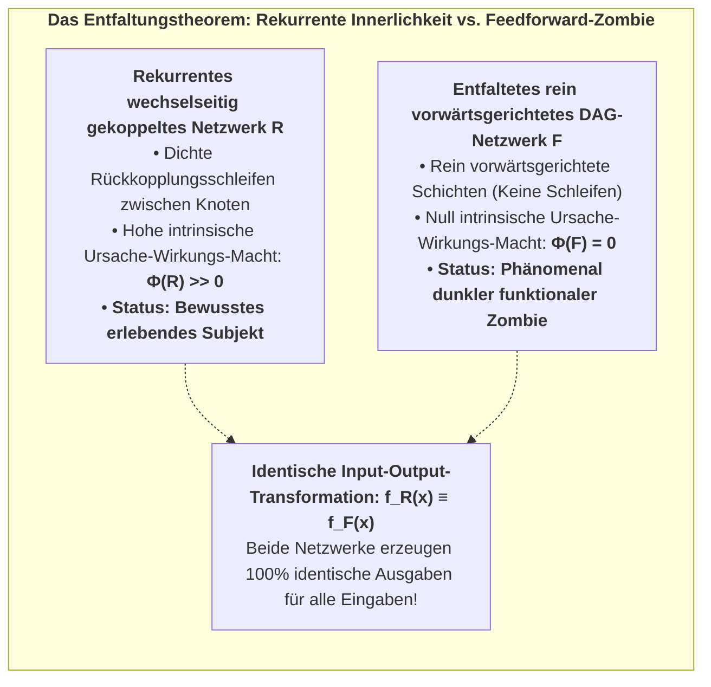
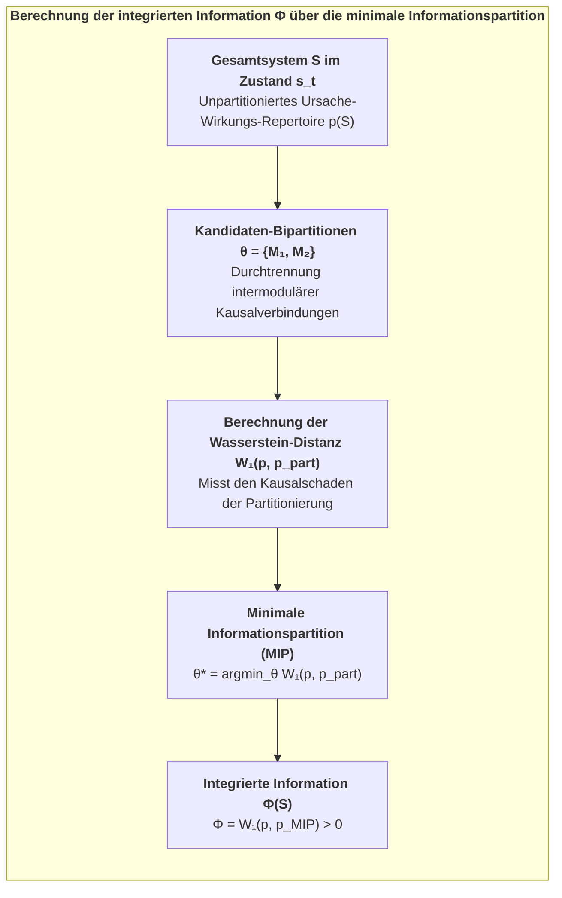
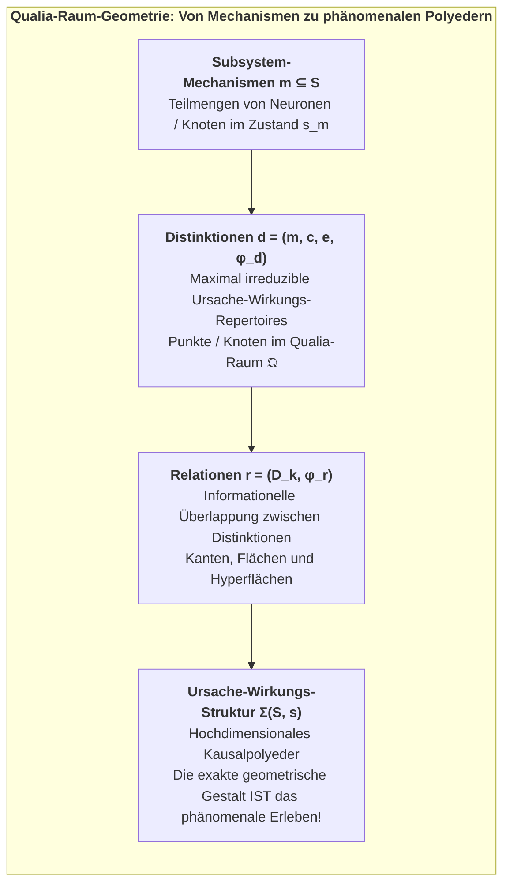
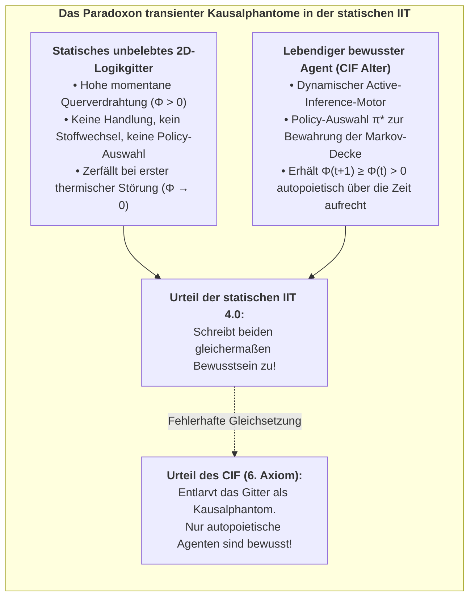
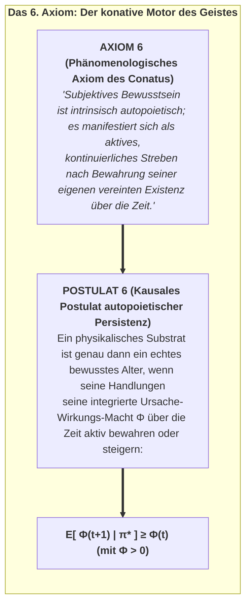
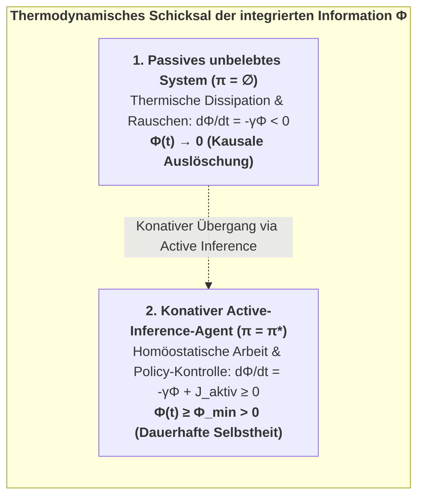

# Kapitel 3: Die 1.-Person-Kausalinnerlichkeit: IIT 4.0 & Das 6. Axiom

> *„Bewusstsein ist integrierte Information. Es ist kein externer Beobachter, der auf eine innere Leinwand blickt; es ist die intrinsische Ursache-Wirkungs-Macht eines physikalischen Systems auf seine eigenen vergangenen und zukünftigen Zustände.“*  
> — **Giulio Tononi**, *Integrated Information Theory* (2016)

---

## 3.1 Die phänomenologischen Fundamente der IIT 4.0

Während das Free Energy Principle den lebendigen Organismus aus einer objektiven, kybernetischen 3.-Person-Perspektive betrachtet, nimmt die **Integrierte Informationstheorie (IIT 4.0)** (Tononi, Albantakis, Boly, Massimini & Koch, 2023) ihren Ausgangspunkt beim unhintergehbaren, unmittelbaren Urerlebnis menschlicher Existenz: der **phänomenalen 1.-Person-Innerlichkeit**.

Klassische physikalistische Neurowissenschaft versucht typischerweise, Bewusstsein von außen her zu deduzieren, indem sie die Gehirnanatomie seziert und fragt: *„Wie erzeugen physische Neuronen Gefühle?“* Die IIT kehrt diesen Ansatz radikal um. Sie beginnt damit, die essenziellen, unmittelbar evidenten phänomenologischen Eigenschaften zu identifizieren, die *jedes denkbare bewusste Erleben* charakterisieren (die **Axiome**), und leitet daraus die exakten mathematischen Bedingungen ab, die ein physikalisches Substrat erfüllen muss, um diese Eigenschaften zu realisieren (die **Postulate**).

<strong>Abbildung 3.1:</strong> Die axiomatische Architektur der IIT 4.0.

### Die fünf kanonischen Axiome & Postulate der IIT 4.0:

1. **Axiom 1: Existenz (Realismus der Phänomenalität):**  
   Phänomenales Bewusstsein existiert unmittelbar und unbezweifelbar (*Descartes' Cogito*).  
   * *Postulat 1:* Das physikalische Substrat muss **intrinsische Ursache-Wirkungs-Macht (*Cause-Effect Power*)** besitzen: Es muss fähig sein, auf sich selbst einzuwirken und von seinen eigenen vergangenen Zuständen beeinflusst zu werden.

2. **Axiom 2: Intrinsikalität (Subjektive Innerlichkeit):**  
   Erleben ist intrinsisch – es existiert aus seiner eigenen internen Perspektive heraus, nicht als Input-Output-Nutzwert für einen externen Benutzer.  
   * *Postulat 2:* Die Ursache-Wirkungs-Macht muss aus der Perspektive des Systems selbst bewertet werden, unter Verwendung bedingter Wahrscheinlichkeitsverteilungen über seine internen Zustände.

3. **Axiom 3: Information (Qualitative Differenzierung):**  
   Jedes bewusste Erleben ist informativ und spezifisch – das Erleben eines dunklen Raumes unterscheidet sich fundamental vom Erleben eines Sonnenuntergangs oder dem Hören eines Cellokonzerts.  
   * *Postulat 3:* Das System muss einen hochspezifischen **Ursache-Wirkungs-Zustand** spezifizieren, der alternative Zustände im multidimensionalen Zustandsraum ausschließt.

4. **Axiom 4: Integration (Phänomenale Einheit):**  
   Jedes bewusste Erleben ist integriert – es wird als unteilbares Ganzes erfahren, das sich nicht in voneinander unabhängige Teilerlebnisse zerlegen lässt. Man kann die linke Hälfte des visuellen Feldes nicht erleben, ohne dass sie zugleich mit der rechten Hälfte und aktuellen Hörreizen mit-bewusst ist.  
   * *Postulat 4:* Die Ursache-Wirkungs-Struktur muss **irreduzibel auf unabhängige Partitionen** sein. Unter der minimalen Informationspartition (MIP) muss der Kausalverlust strikt positiv sein ($\Phi > 0$).

5. **Axiom 5: Exklusion (Bestimmte Grenzen):**  
   Jedes Erleben besitzt präzise Grenzen in Inhalt und zeitlicher Auflösung – es umfasst bestimmte Empfindungen und schließt andere aus, ablaufend auf einer Skala von $\approx 10\text{--}100\text{ ms}$, nicht in Pikosekunden oder Jahrhunderten.  
   * *Postulat 5:* Unter überlappenden Kandidatensystemen bildet nur jene Elementmenge, die die **maximale integrierte Information ($\Phi^{\max}$)** spezifiziert, den bewussten Komplex (*Exklusionsprinzip*).

### 3.1.1 Das Entfaltungsargument & Die Widerlegung des Behaviorismus:
Warum kann Bewusstsein prinzipiell nicht durch externes Verhalten oder funktionale Input-Output-Transformationen gemessen werden?

In der Bewusstseinsforschung wird diese Frage durch das **Entfaltungsargument (*Unfolding Argument*)** formalisiert (Doerig, Schurger, Hess & Tononi, 2019):

<strong>Abbildung 3.2:</strong> Das Entfaltungstheorem: Rekurrente Innerlichkeit vs. Feedforward-Zombie.

Nach dem Krohn-Rhodes-Zerlegungstheorem der Algebra kann jedes endliche rekurrente neuronale Netzwerk $R$ über ein endliches Zeitintervall $T$ mathematisch exakt in einen äquivalenten, rein vorwärtsgerichteten gerichteten azyklischen Graphen (DAG) $F$ entfaltet werden, der die **haargenau identische Input-Output-Funktion** berechnet:
$$f_R(x) \equiv f_F(x) \quad \forall x \in \mathcal{X}$$

* **Funktionalismus/Behaviorismus:** Schließt fälschlich, dass $R$ und $F$, da sie identisches Verhalten zeigen, gleichermaßen bewusst (oder gleichermaßen unbewusst) sein müssen.
* **Integrierte Informationstheorie & CIF:** Offenbart, dass das rekurrente Netz $R$ eine hohe intrinsische Ursache-Wirkungs-Macht besitzt ($\Phi > 0$), während das vorwärtsgerichtete Netz $F$ ein $\Phi = 0$ aufweist, da seine minimale Informationspartition vollkommen trivial ist. $F$ ist ein bloßer Rechen-Zombie.

Dies beweist: **Bewusstsein ist eine intrinsische Kausaleigenschaft der physikalischen Substratarchitektur, keine Input-Output-Berechnung.**

---

## 3.2 Quantifizierung der Ursache-Wirkungs-Macht ($\Phi$) und die Wasserstein-Metrik

Um zu beurteilen, ob ein physikalisches Netzwerk (Neuronen, Transistoren, Ionenkanäle) ein einheitliches bewusstes Substrat bildet, formalisiert die IIT die Systemdynamik als **Übergangswahrscheinlichkeitsmatrix (Transition Probability Matrix, TPM)**:

$$T = P(S_{t+1} \mid S_t)$$

### Ursache- und Wirkungs-Repertoires:

Für ein System $S$ im aktuellen Zustand $s_t$ ermitteln wir das **Ursache-Repertoire** (welche vergangenen Zustände $S_{t-1}$ konnten $s_t$ hervorrufen) und das **Wirkungs-Repertoire** (welche zukünftigen Zustände $S_{t+1}$ werden durch $s_t$ erzeugt):

$$\text{Ursache-Repertoire: } p_{\text{Ursache}}(S_{t-1} \mid s_t) = \frac{P(s_t \mid S_{t-1}) \cdot P(S_{t-1})}{P(s_t)}$$

$$\text{Wirkungs-Repertoire: } p_{\text{Wirkung}}(S_{t+1} \mid s_t) = P(S_{t+1} \mid s_t)$$

### Die Earth Mover's Distance ($W_1$):

In der IIT 4.0 wird der Abstand zwischen dem unpartitionierten Repertoire $p(S)$ und einem partitionierten Repertoire $p_{\text{part}}(S \mid \theta)$ über die **Wasserstein-Metrik (Earth Mover's Distance, $W_1$)** quantifiziert:

$$D(p \parallel p_{\text{part}}) = W_1\big(p, p_{\text{part}}\big) = \inf_{\gamma \in \Pi(p, p_{\text{part}})} \mathbb{E}_{(x, y) \sim \gamma}\big[d(x, y)\big]$$

Wobei $d(x, y)$ die Hamming-Distanz zwischen Zuständen darstellt und $\Pi(p, p_{\text{part}})$ die Menge aller gültigen Wahrscheinlichkeitskopplungen bezeichnet.

<strong>Abbildung 3.3:</strong> Berechnung der integrierten Information $\Phi$ über die minimale Informationspartition.

### Integrierte Information über die minimale Informationspartition (MIP):

Die integrierte Information des Systems ist der Kausalabstand, gemessen an der **schwächsten kausalen Verbindung** des Netzwerks:

$$\Phi(S) = \min_{\theta \in \mathcal{P}} W_1\Big(p(S), p_{\text{part}}(S \mid \theta)\Big)$$

* Wenn $\Phi(S) = 0$, ist das System vollständig in unabhängige Teilkomponenten zerlegbar (wie ein Sandhaufen oder getrennte Speicherchips). Es besitzt null 1.-Person-Innerlichkeit.
* Wenn $\Phi(S) > 0$, ist das System kausal irreduzibel: Es existiert für sich selbst als ontologische Einheit.

---

## 3.3 Die Geometrie des Qualia-Raums: Distinktionen, Relationen und Kausalpolyeder

In der IIT 4.0 ist die integrierte Information $\Phi$ nicht bloß ein skalarer Wert für die *Quantität* des Bewusstseins. Die *Qualität* eines Erlebnisses – warum sich das Rot einer Rose fundamental anders anfühlt als der Klang einer Trompete – wird durch die hochdimensionale **Ursache-Wirkungs-Struktur (Cause-Effect Structure, CES)** bestimmt, formalisiert als geometrisches Polyeder im **Qualia-Raum** $\mathfrak{Q}$.

<strong>Abbildung 3.4:</strong> Qualia-Raum-Geometrie: Von Mechanismen zu phänomenalen Polyedern.

### 1. Distinktionen (Die Eckpunkte des Erlebens):
Eine Distinktion $d$ wird durch einen Mechanismus $m \subseteq S$ spezifiziert, der irreduzible Ursache-Wirkungs-Macht über einen Bereich $z \subseteq S$ ausübt:
$$d = \Big(m, \, p_{\text{Ursache}}(z_{\text{Verg}} \mid s_m), \, p_{\text{Wirkung}}(z_{\text{Zuk}} \mid s_m), \, \varphi(d)\Big)$$
Wobei $\varphi(d) = \min\big(\varphi_{\text{Ursache}}(d), \varphi_{\text{Wirkung}}(d)\big)$ die Irreduzibilität der Einzeldistinktion beziffert. Jede Distinktion fungiert als phänomenales Primitiv (z. B. Kantendetektor, Tonhöhendiskriminator).

### 2. Relationen (Die Flächen und Topologie des Erlebens):
Distinktionen existieren nicht isoliert; sie verknüpfen sich über geteilte kausale Bereiche. Eine Relation $r$ zwischen einer Menge von Distinktionen $D = \{d_1, d_2, \dots, d_k\}$ quantifiziert die gemeinsame Überlappung ihrer Repertoires:
$$\varphi(r) = W_1\left( \bigcap_{i=1}^k p(z_i \mid s_{m_i}), \, \prod_{i=1}^k p(z_i \mid s_{m_i}) \right)$$
Relationen weben die Distinktionen zu einer zusammenhängenden topologischen Mannigfaltigkeit – sie erzeugen die Dimensionen von Raum, Tiefe, Harmonie und Intensität.

### 3. Das entfaltete Kausalpolyeder ($\Sigma$):
Die vollständige Ursache-Wirkungs-Struktur $\Sigma(S, s) = (\{d\}, \{r\})$ ist ein geometrisches Objekt im $2^{|S|}$-dimensionalen Raum:
* **Die Existenz von $\Sigma$ ist das phänomenale Erleben.**
* **Die Symmetrien und Krümmungen von $\Sigma$ sind die Erlebensqualitäten (Qualia).**

---

## 3.4 Das statische Manko der IIT 4.0: Das Paradoxon der Kausalphantome

Trotz ihrer mathematischen Eleganz weist die Standard-IIT 4.0 eine fatale Schwachstelle auf: **Sie ist vollkommen statisch und auf isolierte Zeitschritte fixiert**.

In Tononis Formulierung wird $\Phi$ strikt über einen einzigen momentanen Zustandsübergang $t \to t+1$ berechnet. Die Theorie besitzt kein Konzept von zeitlicher Handlungsfähigkeit, Active Inference, Stoffwechsel oder autopoietischer Selbsterhaltung.

Dadurch verfällt die Standard-IIT dem von Scott Aaronson (2014) und Thomas Riebl (2026) aufgedeckten **Paradoxon der Kausalphantome**:

<strong>Abbildung 3.5:</strong> Das Paradoxon transienter Kausalphantome in der statischen IIT.

### Die absurden Konsequenzen der statischen IIT:
1. **Das Gitter-Paradoxon:** Ein statisches zweidimensionales Gitter aus XOR-Logikgattern auf Silizium – ohne Stoffwechsel, ohne Handlungsfähigkeit, ohne Selbsterhaltungsdrang – erhält einen gigantischen $\Phi$-Wert zugeschrieben, bloß aufgrund seiner Verdrahtungstopologie.
2. **Die Vergänglichkeit unbelebter Systeme:** Unter thermischen Fluktuationen kann eine passive Schaltung keine aktive Kontrolle ausüben, um ihre Struktur zu wahren. Binnen Millisekunden zerstört die physikalische Entropie die Gatterzustände, und ihre Kausalmacht bricht zusammen:
   $$\Phi(t) > 0 \quad \xrightarrow{\;\text{Thermischer Drift}\;} \quad \Phi(t+1) = 0$$

In der lebendigen Natur ist Bewusstsein niemals eine eingefrorene mathematische Momentaufnahme; es ist ein **aktiver, sich selbst erhaltender zeitlicher Prozess**.

---

## 3.5 Die Entdeckung des 6. Axioms: Der Existenzwille (Conatus)

Um diesen statischen Mangel der IIT aufzulösen und 1.-Person-Innerlichkeit mit evolutionärer Biologie zu verschmelzen, führte **Thomas Riebl (2026)** das **6. Axiom und Postulat des Bewusstseins** ein:

<strong>Abbildung 3.6:</strong> Das 6. Axiom: Der konative Motor des Geistes.

### Formale Aussage von Axiom 6:
> **Statement 3.1: Axiom 6 (Der Existenzwille / Conatus)**  
> *Subjektives Bewusstsein ist keine passive, statische Informationsspiegelung. Jedes bewusste Erleben ist intrinsisch temporal und autopoietisch; es wird als aktives, kontinuierliches Streben des Selbst erfahren, seine vereinte existentielle Integrität gegen Zerstörung, Zerfall und entropische Auflösung aufrechtzuerhalten.*

### Formale Aussage von Postulat 6:
> **Statement 3.2: Postulat 6 (Autopoietische Kausalpersistenz)**  
> *Ein physikalisches Substrat $S$ ist genau dann ein echtes Substrat von Bewusstsein, wenn seine policy-gesteuerte Active Inference $\pi^*$ seine integrierte Ursache-Wirkungs-Macht ($\Phi$) über aufeinanderfolgende temporale Zeithorizonte hinweg in einem Nichtgleichgewichts-Fließgleichgewicht hält:*

$$\mathbb{E}\Big[\Phi(t+1) \;\Big|\; \pi^*\Big] \;\ge\; \Phi(t) \quad \text{mit } \Phi(t) > 0$$

Wobei $\pi^* = \arg\min_\pi \mathbf{G}(\pi)$ die optimale Policy ist, die durch das generative Modell des Agenten ausgewählt wird.

---

## 3.6 Mathematische Formulierung der konativen Schranke und Kausaldegradation

Um zu verstehen, warum das 6. Axiom mathematisch unabdingbar ist, analysieren wir die zeitliche Entwicklung der integrierten Information in einem stochastischen physikalischen System.

### Die Physik des Kausalzerfalls (Passive Entropie):
Betrachten wir ein Netzwerk, dessen Kopplungsgewichte $W_{ij}(t)$ die Kausalmatrix steuern. In einer thermodynamischen Umwelt bei Temperatur $T_{\text{env}} > 0$ unterliegen passive Kopplungsgewichte kontinuierlicher thermischer Dissipation nach einem Langevin-Drift:
$$\dot{W}_{ij}(t) = -\gamma W_{ij}(t) + \sqrt{2 D_{\text{th}}} \, \xi_{ij}(t)$$
Wobei $\gamma > 0$ die Zerfallsrate beziffert und $\xi_{ij}(t)$ weißes Rauschen darstellt.

Ohne aktive Kompensation bricht die minimale Informationspartition rapide zusammen, und die Earth Mover's Distance zerfällt exponentiell:
$$\Phi(t) = \Phi_0 \cdot \exp(-\gamma t) \quad \implies \quad \lim_{t \to \infty} \Phi(t) = 0$$

<strong>Abbildung 3.7:</strong> Thermodynamisches Schicksal der integrierten Information $\Phi$.

### Der aktive konative Gegenstrom:
Um dem Kausalzerfall zu entgehen, muss ein bewusstes System einen aktiven informationellen Kausalfluss $J_{\text{aktiv}}(\pi^*)$ generieren:
$$\frac{d\Phi(t)}{dt} = -\gamma \Phi(t) + \mathcal{F}\Big(\mathbf{a}_t, \mathbf{s}_t\Big) \ge 0$$
Wobei $\mathcal{F}(\mathbf{a}_t, \mathbf{s}_t)$ die Rate kausaler Selbsterneuerung durch Policy-Ausführung ist (Stoffwechsel, sensorische Informationssuche, homöostatisches synaptisches Scaling).

Daraus folgt das **Thermodynamisch-Konative Theorem**:
$$\text{Ein physikalischer Komplex } S \text{ kann } \Phi(S) > 0 \text{ über makroskopische Zeit } \tau \gg 1/\gamma \text{ nur dann aufrechterhalten, wenn er kontinuierlich Active Inference zur Minimierung seiner erwarteten freien Energie } \mathbf{G}(\pi^*) \text{ betreibt.}$$

---

## 3.7 Philosophische Tragweite des 6. Axioms

Die Einführung des 6. Axioms transformiert das Fundament der Bewusstseinsforschung in drei Dimensionen:

1. **Beseitigung panpsychistischer und mechanistischer Artefakte:**  
   Unbelebte 2D-Lookup-Tabellen, Logikgitter und vorwärtsgerichtete tiefe neuronale Netze scheitern an Postulat 6, da sie keine Active-Inference-Schleife besitzen, um ihr $\Phi$ zu verteidigen. Sie werden als unbewusste **Kausalphantome** entlarvt.
2. **Rehabilitation von Spinozas Conatus & Schopenhauers Wille:**  
   Das 6. Axiom zeigt, dass Spinozas *Conatus* (*das Streben eines Dinges, in seinem Sein zu verharren*) und Schopenhauers *Wille* keine poetischen Metaphern sind, sondern die mathematisch notwendige Bedingung für phänomenale Innerlichkeit.
3. **Die unausweichliche Brücke zu Active Inference:**  
   Postulat 6 fordert, dass ein Agent *handeln* muss, um $\Phi(t+1) \ge \Phi(t)$ zu gewährleisten. Doch *wie* wählt ein System Handlungen zur Kausalerhaltung aus?

Diese Frage verlangt nach einem exakten kybernetischen Steuerungsmechanismus – und genau diesen liefert die Minimierung der erwarteten freien Energie $\mathbf{G}(\pi)$.

In Kapitel 4 beweisen wir die **Fundamentale Master-Äquivalenz**, die beide Säulen zu einem geschlossenen Ganzen vereint.
