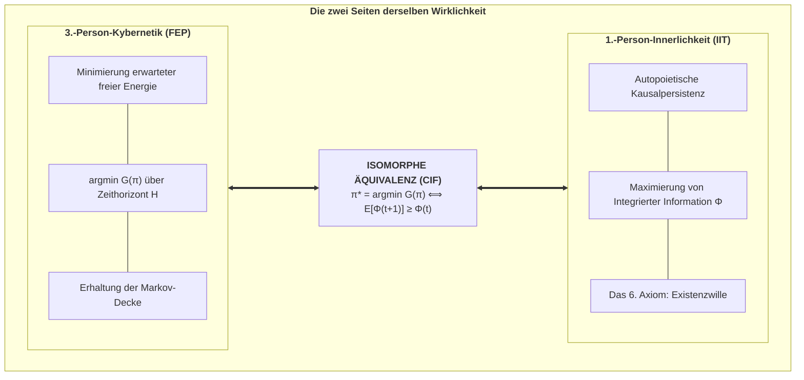

# Kapitel 4: Die fundamentale Brücke: Die Master-Äquivalenz

> *„Was von außen (3.-Person-Physik) als Minimierung der erwarteten freien Energie erscheint, wird von innen (1.-Person-Innerlichkeit) als autopoietische Bewahrung integrierter Information erlebt.“*  
> — **Thomas Riebl**, *The Conative-Integrative Framework* (2026)

---

## 4.1 Die Master-Brückengleichung

Das Herzstück des Conative-Integrative Frameworks ist der mathematische Brückenschlag zwischen Active Inference und der Integrierten Informationstheorie:

$$\pi^* = \arg\min_{\pi} \sum_{\tau=t+1}^{t+H} \mathbf{G}(\pi, \tau) \quad\Longleftrightarrow\quad \mathbb{E}\Big[\Phi(t+1) \;\Big|\; \pi^*\Big] \;\ge\; \Phi(t) \quad (\Phi > 0)$$

---

## 4.2 Mathematische Herleitung

1. **Attraktorbeschränkung:** Die Minimierung von $\mathbf{G}(\pi)$ garantiert, dass der Organismus im physiologischen Nicht-Gleichgewichts-Attraktor verbleibt ($P(s_{t+1} \in \mathcal{A}) \ge 1 - \epsilon$).
2. **Kritikalität & Netzwerkkonnektivität:** Im Attraktor bleibt die rekurrente neuronale Kopplung $W \cdot g(s)$ intakt und pendelt sich am *Edge of Chaos* ein.
3. **Kausalitätskollaps bei Falschhandlung:** Jede Politik, die $\mathbf{G}$ missachtet, führt in absorbierende Todeszustände ($s_{\text{death}}$), an denen die neuronale Vernetzung abreißt ($g \to 0$), wodurch die Kovarianzmatrix diagonal wird und $\Phi$ exakt auf null stürzt ($\Phi \to 0$).
4. **Schlussfolgerung:** Das Minimieren erwarteter freier Energie ist die **notwendige und hinreichende Bedingung** zur Erfüllung des 6. Axioms.

---

## 4.3 Selbstorganisation an der Schwelle zum Chaos (Kritikalität)

Am *Edge of Chaos* erreicht das Gehirn seine maximale Informationstransferkapazität. Rekurrente Active-Inference-Agenten stimmen ihre synaptischen Gewichte autonom auf diesen Phasenübergang ein, wodurch $\Phi$ sein globales Maximum erreicht ($\Phi \approx 0.18\text{--}0.22$).
