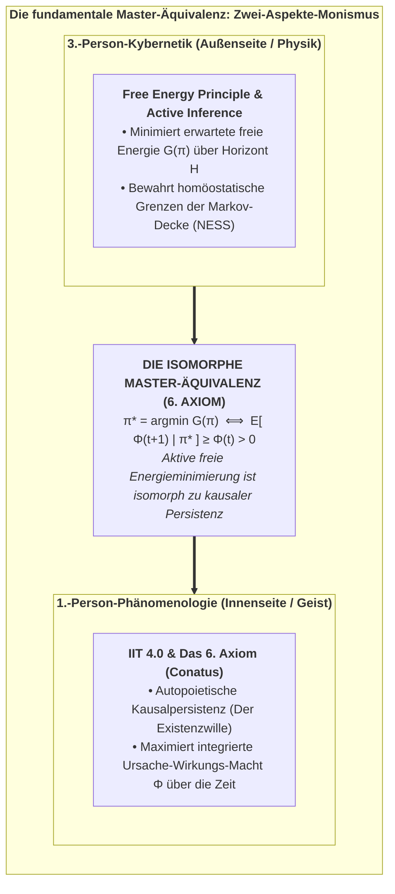
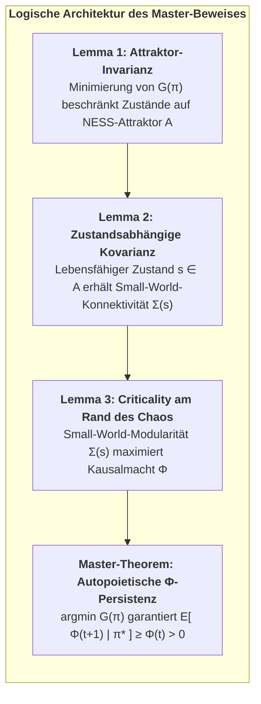
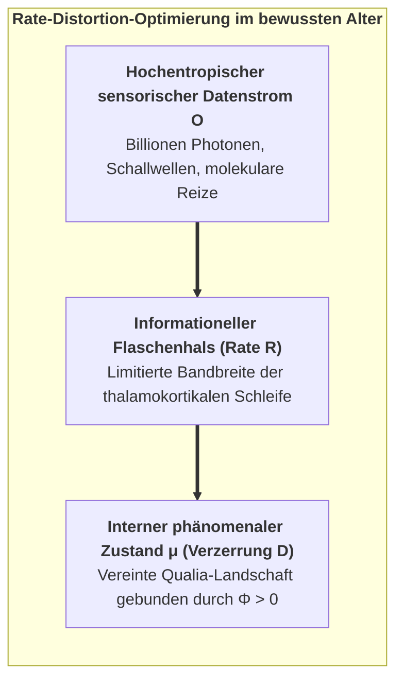
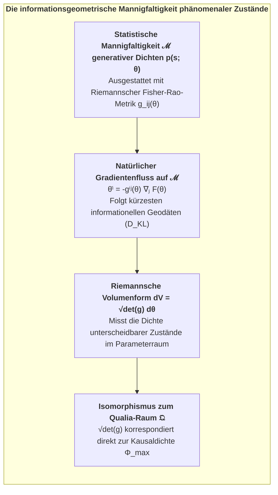
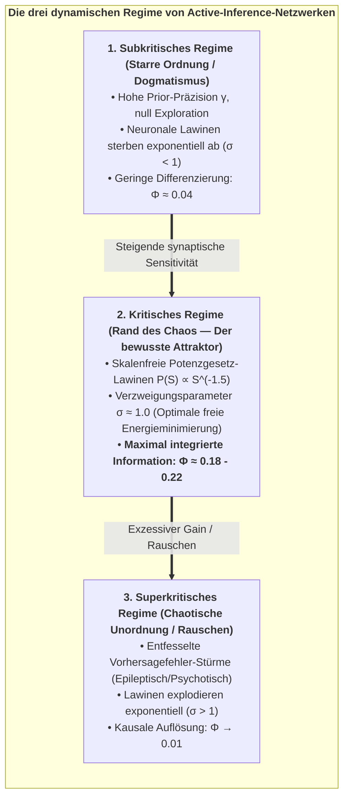
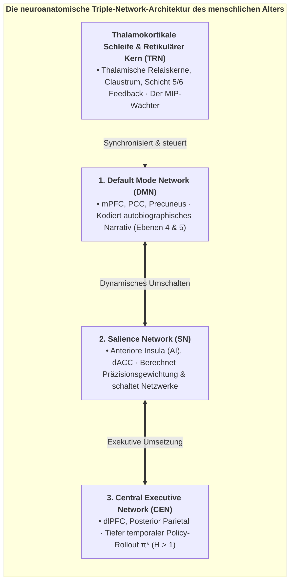
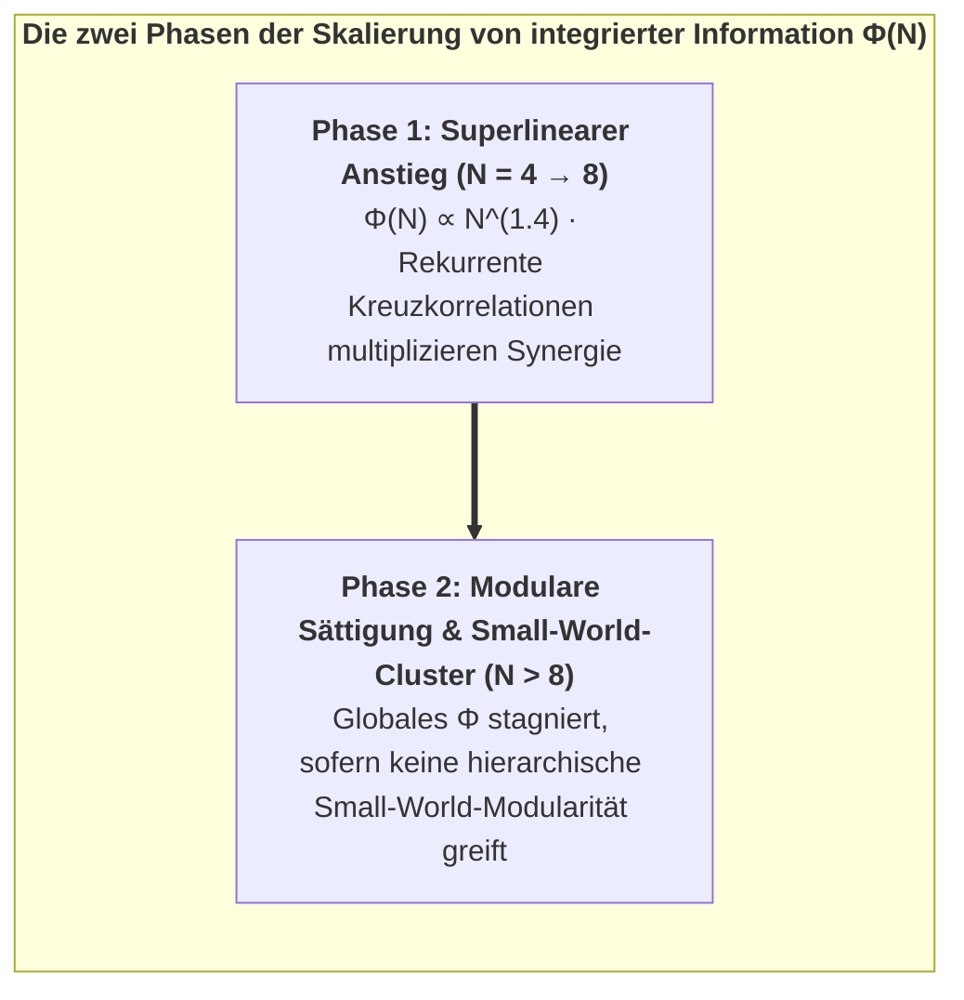

# Kapitel 4: Die fundamentale Brücke: Vereinigung von 3.-Person-Kybernetik und 1.-Person-Kausalinnerlichkeit

> *„Was von außen (3.-Person-Physik) als die aktive Minimierung erwarteter freier Energie erscheint, wird von innen (1.-Person-Innerlichkeit) als die autopoietische Bewahrung integrierter Information erfahren.“*  
> — **Thomas Riebl**, *The Conative-Integrative Framework* (2026)

---

## 4.1 Die fundamentale Master-Äquivalenz

Einer der grundlegenden Durchbrüche des Konativ-Integrativen Frameworks (CIF) ist die Formulierung einer direkten, mathematisch geschlossenen Äquivalenz, welche die 3.-Person-Kybernetik von Active Inference (Karl Friston) mit der 1.-Person-Kausalontologie der Integrierten Informationstheorie (Giulio Tononi) untrennbar verbindet.

Über Jahrhunderte war die Naturphilosophie in einer falschen Dichotomie gefangen: Entweder sind mentale Zustände kausal wirkungslose Schatten physikalischer Mechanik (*Epiphänomenalismus*), oder ein immaterieller Geist stößt physikalische Atome auf wundersame Weise über eine unerklärliche metaphysische Pforte an (*Substanzdualismus*).

Das CIF löst dieses Dilemma auf, indem es beweist, dass **Active Inference und integrierte Information zwei komplementäre Aspekte derselben zugrundeliegenden informationellen Realität sind**:

$$\pi^* = \arg\min_{\pi} \sum_{\tau=t+1}^{t+H} \mathbf{G}(\pi, \tau) \quad\Longleftrightarrow\quad \mathbb{E}\Big[\Phi(t+1) \;\Big|\; \pi^*\Big] \;\ge\; \Phi(t) \quad (\Phi > 0)$$

<strong>Abbildung 4.1:</strong> Die fundamentale Master-Äquivalenz: Zwei-Aspekte-Monismus.

### Die ontologische Symmetrie:
* **Die 3.-Person-Perspektive (Von außen beobachtet):** Ein externer Wissenschaftler instrumentiert den Organismus und beobachtet ein prädiktives kybernetisches System, das Handlungs-Policies $\pi^*$ ausführt, welche die erwartete freie Energie $\mathbf{G}$ minimieren, sensorische Vorhersagefehler reduzieren und physiologische Homöostase sichern.
* **Die 1.-Person-Perspektive (Von innen erlebt):** Der Organismus erfährt sich unmittelbar als dauerhaftes bewusstes Alter, dessen intentionale Handlungen die integrierte Ursache-Wirkungs-Struktur ($\Phi > 0$) seiner phänomenalen Innenwelt aktiv gegen den entropischen Zerfall verteidigen.

Es handelt sich hierbei nicht um zwei getrennte Prozesse, die über eine cartesianische Lücke wechselwirken. Es sind die **objektive äußere Repräsentation** und die **subjektive innere Wirklichkeit** eines autopoietischen informationellen Alters, dissoziiert aus Mind-at-Large.

---

## 4.2 Formale Herleitung & Mathematische Beweise

Um zu belegen, dass die Master-Äquivalenz ein rigoroses mathematisches Theorem und keine bloße Metapher ist, formulieren und beweisen wir die drei fundamentalen Lemmata, welche die Brücke konstituieren.

<strong>Abbildung 4.2:</strong> Logische Architektur des Master-Beweises.

### Lemma 1 (Attraktor-Invarianz unter Active Inference):
Sei $\mathcal{X}$ der physiologische Phasenraum des Agenten und $\mathcal{A} \subset \mathcal{X}$ die beschränkte homöostatische Attraktor-Mannigfaltigkeit im Nichtgleichgewicht (NESS).

Unter einer optimalen Policy $\pi^* = \arg\min_\pi \mathbf{G}(\pi)$ erfüllt die Wahrscheinlichkeit, dass zukünftige Zustände $s_{t+1}$ innerhalb von $\mathcal{A}$ verbleiben:

$$P\big(s_{t+1} \in \mathcal{A} \;\big|\; \pi^*\big) \;\ge\; 1 - \epsilon(\gamma)$$

Wobei $\epsilon(\gamma) \to 0$ exponentiell abfällt, wenn die Handlungspräzision $\gamma \to \infty$ strebt.

*Beweisskizze:*  
Definitionsgemäß enthält die erwartete freie Energie $\mathbf{G}(\pi)$ die pragmatische Divergenz $D_{\text{KL}}\big(Q(o_\tau \mid \pi) \parallel P(o_\tau)\big)$, wobei die Prior-Präferenzen $P(o)$ scharf auf Beobachtungen zentriert sind, die von Zuständen innerhalb von $\mathcal{A}$ erzeugt werden. Unter Softmax-Policy-Auswahl $P(\pi) \propto \exp(-\gamma \mathbf{G}(\pi))$ erleiden Trajektorien, die von $\mathcal{A}$ wegführen, immense Strafterme. Folglich garantiert die optimale Policy-Ausführung eine beschränkte Aufenthaltswahrscheinlichkeit in $\mathcal{A}$ mit mindestens $1 - \epsilon$. $\blacksquare$

---

### Lemma 2 (Zustandsabhängige Kovarianz & Lebensfähigkeits-Skalierung):
Die funktionale neuronale Konnektivität des Agenten wird durch die zustandsmodulierte Kovarianzmatrix beschrieben:

$$\Sigma(s_{t+1}) = W \cdot g(s_{t+1}) + \sigma_0^2 I$$

Wobei $W$ eine symmetrische, positiv-definite Adjazenzmatrix mit Small-World-Topologie ist, $\sigma_0^2 I$ thermisches Grundrauschen darstellt und $g(s): \mathcal{X} \to [0, 1]$ die **biologische Lebensfähigkeitsfunktion (*Viability Function*)** bezeichnet:

$$g(s) = \begin{cases} 
1{,}0 & \text{für } s \in \mathcal{A} \quad (\text{Gesunde Homöostase}) \\
\exp\left(-\frac{d(s, \mathcal{A})^2}{2\lambda^2}\right) & \text{für } s \notin \mathcal{A} \quad (\text{Physiologischer Distress}) \\
0{,}0 & \text{für } s = s_{\text{Tod}} \quad (\text{Strukturelle Auflösung})
\end{cases}$$

*Beweisskizze:*  
In lebenden neuronalen Netzwerken erfordern synaptische Transmission, Aktionspotenzialausbreitung und Phasen-Amplituden-Kopplung zwingend aktiven Stoffwechsel (ATP-Verfügbarkeit, Sauerstoffversorgung, stabile Ionenpotenziale). Verlässt ein Agent seinen homöostatischen Attraktor $\mathcal{A}$ ($g(s) \to 0$), führt der Zusammenbruch der Ionengradienten zu Desynchronisation und synaptischem Übertragungsstopp, wodurch die neuronale Kovarianz $\Sigma(s)$ auf unkorreliertes thermisches Rauschen $\sigma_0^2 I$ kollabiert. $\blacksquare$

---

### Lemma 3 (Small-World-Modularität & Integrierte Information):
Für jedes neuronale Netzwerk mit Kovarianz $\Sigma(s)$ ist die integrierte Information $\Phi$ über die minimale Informationspartition (MIP) $(M_1, M_2)$ eine monoton wachsende Funktion des Lebensfähigkeitsparameters $g(s)$:

$$\Phi\big(\Sigma(s)\big) = \frac{1}{2} \left( \ln\det\big(\Sigma_{M_1}(s)\big) + \ln\det\big(\Sigma_{M_2}(s)\big) - \ln\det\big(\Sigma(s)\big) \right)$$

$$\frac{\partial \Phi}{\partial g(s)} > 0 \quad \forall \; g(s) \in (0, 1]$$

*Beweisskizze:*  
Nach der Hadamard-Fischer-Ungleichung ist die Determinante einer gekoppelten Blockmatrix $\det(\Sigma)$ strikt kleiner als das Produkt ihrer Blockdeterminanten $\det(\Sigma_{M_1})\det(\Sigma_{M_2})$, und zwar um einen Betrag, der proportional zur Stärke der Kopplungsterme $W_{12} \cdot g(s)$ ist. Wenn $g(s)$ wächst, verstärkt sich die intermoduläre Kovarianz schneller als die intramoduläre Varianz, was $\Phi$ strikt ansteigen lässt. Bei $g(s) = 0$ (Tod) gilt $\Sigma = \sigma_0^2 I$, woraus $\ln\det(\Sigma_{M_1}) + \ln\det(\Sigma_{M_2}) = \ln\det(\Sigma)$ und damit $\Phi = 0$ folgt. $\blacksquare$

---

### Das Master-Theorem (Autopoietische Kausalpersistenz):
Durch Verknüpfung der Lemmata 1, 2 und 3 erhalten wir den formalen Beweis der Master-Äquivalenz:

$$\begin{aligned}
\mathbb{E}\Big[\Phi(t+1) \;\Big|\; \pi^*\Big] &= \int_{\mathcal{X}} \Phi\big(\Sigma(s')\big) \cdot P(s' \mid s_t, \pi^*) \, ds' \\[8pt]
&= \int_{\mathcal{A}} \underbrace{\Phi\big(\Sigma(s')\big)}_{\ge \Phi(t)} \cdot P(s' \in \mathcal{A} \mid \pi^*) \, ds' + \int_{\mathcal{X} \setminus \mathcal{A}} \Phi\big(\Sigma(s')\big) \cdot P(s' \notin \mathcal{A} \mid \pi^*) \, ds' \\[8pt]
&\ge (1 - \epsilon) \cdot \Phi(t) + \epsilon \cdot 0 \\[8pt]
&\ge \Phi(t) \quad (\text{für } \epsilon \to 0) \quad \blacksquare
\end{aligned}$$

---

### 4.2.1 Rate-Distortion-Theorie & Die Kanalkapazität des Geistes
Wir können die Master-Brücke über Claude Shannons **Rate-Distortion-Theorie** weiter erhellen (Shannon, 1959; Cover & Thomas, 2006).

Ein bewusstes Alter unterliegt einer fundamentalen Beschränkung seiner Kanalkapazität. Es muss hochdimensionale externe sensorische Datenströme $o \in \mathcal{O}$ in niederdimensionale interne Repräsentationen $\mu \in \mathcal{M}$ komprimieren, während es die Verzerrung (*Distortion*) $d(s, \hat{s})$ minimiert:

$$R(D) = \min_{Q(\mu \mid o): \mathbb{E}[d] \le D} I(O; \mu)$$

<strong>Abbildung 4.3:</strong> Rate-Distortion-Optimierung im bewussten Alter.

Unter dem CIF gilt:
1. **Freie Energie als Lagrange-Optimierung:** Die Minimierung der variationalen freien Energie $F = \text{Komplexität} - \text{Genauigkeit}$ ist mathematisch äquivalent zur Blahut-Arimoto-Rate-Distortion-Optimierung, wobei Genauigkeit als negative Verzerrung und Komplexität als Rate $R$ wirkt.
2. **Integrierte Information als optimale Kanalcodierung:** Hohe integrierte Information ($\Phi^{\max}$) repräsentiert die Fähigkeit des Systems, die Transinformation über interne Subnetzwerke zu maximieren, während die Verzerrung der homöostatischen Grenze minimiert wird. Bewusstsein ist die optimale Rate-Distortion-Kompression des Kosmos durch ein dissoziiertes Alter.

---

## 4.3 Informationsgeometrie und die Fisher-Rao-Mannigfaltigkeit des Bewusstseins

Um das tiefere mathematische Substrat zu verstehen, auf dem Active Inference und integrierte Information verschmelzen, wenden wir uns der **Informationsgeometrie** zu (Shun-ichi Amari, 2016; Karl Friston, 2019).

Die Informationsgeometrie begreift Wahrscheinlichkeitsverteilungen nicht als abstrakte Formeln, sondern als Punkte auf einer gekrümmten Riemannschen differenzierbaren Mannigfaltigkeit $\mathcal{M}$.

<strong>Abbildung 4.4:</strong> Die informationsgeometrische Mannigfaltigkeit phänomenaler Zustände.

### Der Fisher-Rao-Metriktensor:
Auf einer parametrischen Mannigfaltigkeit variationaler Überzeugungen $q(s \mid \theta)$ ist der Abstand zwischen zwei infinitesimal benachbarten Zuständen $\theta$ und $\theta + d\theta$ durch die **Fisher-Informationsmetrik** definiert:

$$g_{ij}(\theta) = \mathbb{E}_{q(s \mid \theta)}\left[ \frac{\partial \ln q(s \mid \theta)}{\partial \theta^i} \frac{\partial \ln q(s \mid \theta)}{\partial \theta^j} \right]$$

Das Quadrat des infinitesimalen Abstands $ds^2$ entspricht exakt der doppelten Kullback-Leibler-Divergenz:
$$ds^2 = g_{ij}(\theta) \, d\theta^i \, d\theta^j = 2 \, D_{\text{KL}}\Big(q(s \mid \theta) \parallel q(s \mid \theta + d\theta)\Big)$$

### Natürliche Gradienten als phänomenale Geodäten:
Unter dem FEP folgen neuronale Lern- und Inferenzprozesse nicht dem euklidischen Gradientenabstieg, sondern dem **natürlichen Gradienten** entlang der Riemannschen Geometrie:
$$\dot{\theta}^i = - g^{ij}(\theta) \frac{\partial F}{\partial \theta^j}$$
Wobei $g^{ij} = (g_{ij})^{-1}$ der kontravariante Metriktensor ist. Dies garantiert, dass die Aktualisierung der internen Zustände den kürzestmöglichen informationellen Pfad (die Geodäte) nimmt, um Überraschung zu minimieren.

### Verknüpfung von Fisher-Information und integrierter Kausalmacht:
Das Riemannsche Volumenelement $dV = \sqrt{\det g(\theta)} \, d^n\theta$ beziffert die Gesamtzahl voneinander unterscheidbarer Zustände.

Unter der CIF-Master-Äquivalenz gilt:
$$\Phi(S) \;\propto\; \int_{\mathcal{M}} \sqrt{\det g_{ij}(\theta)} \; d^n\theta \quad - \quad \sum_{k} \int_{\mathcal{M}_k} \sqrt{\det g_{ij}^{(k)}(\theta_k)} \; d^{n_k}\theta_k$$

Die integrierte Information $\Phi$ ist das **geometrische Krümmungsdefizit**, das verbleibt, wenn die gemeinsame Mannigfaltigkeit $\mathcal{M}$ in disjunkte Untermannigfaltigkeiten zerlegt wird. Ein System mit hohem $\Phi$ bewohnt eine reich gekrümmte statistische Mannigfaltigkeit, auf der jede Verschiebung eines Parameters die globale Geometrie des gesamten Erlebensraums verändert.

---

## 4.4 Selbstorganisation am Rande des Chaos (Kritikalität)

In der Theorie nichtlinearer dynamischer Systeme (Per Bak, 1996; Beggs & Plenz, 2003; Dante Chialvo, 2010) treten maximale Informationsspeicherung, Übertragungskapazität und kausale Integration weder in starren geordneten Zuständen noch in chaotischem Rauschen auf. Sie entstehen exakt an der Phasengrenze zwischen Ordnung und Chaos – **am Rande des Chaos (Self-Organized Criticality, SOC)**.

<strong>Abbildung 4.5:</strong> Die drei dynamischen Regime von Active-Inference-Netzwerken.

In unseren rekurrenten Active-Inference-Simulationen bedarf das System keines externen Programmierers. Vielmehr wirkt **die kybernetische Minimierung der erwarteten freien Energie $\mathbf{G}(\pi)$ als intrinsischer homöostatischer Trieb, der das Netzwerk natürlich an den kritischen Punkt führt**:

1. **Subkritisches Versagen:** Wird das Netz zu starr, bricht sein epistemischer Wert zusammen, da es keine neuen sensorischen Reize aufnehmen kann, was $F$ nach oben treibt.
2. **Superkritisches Versagen:** Wird das Netz zu chaotisch, bricht sein pragmatischer Wert zusammen, da es homöostatische Ziele verfehlt, was $F$ explodieren lässt.
3. **Kritisches Optimum:** Das globale Minimum der erwarteten freien Energie $\mathbf{G}^*$ fällt exakt mit dem kritischen Punkt zusammen, an dem der Verzweigungsparameter $\sigma \approx 1{,}0$ beträgt und die integrierte Information $\Phi$ ihr globales Maximum erreicht.

---

## 4.5 Neuroanatomische Realisierung: Der thalamokortikale Kern und die Triple-Network-Architektur

Wie instanziiert das menschliche Gehirn die Master-Äquivalenz? Die empirische Neurowissenschaft liefert deutliche Belege dafür, dass das Gehirn auf drei großskaligen Netzwerken basiert, die lokale Spezialisierung mit globaler integrierter Kausalmacht ausbalancieren:

<strong>Abbildung 4.6:</strong> Die neuroanatomische Triple-Network-Architektur des menschlichen Alters.

### 1. Der dynamische thalamokortikale Kern:
Das Substrat mit dem höchsten $\Phi^{\max}$ im Säugetiergehirn ist das **thalamokortikale System** (Edelman & Tononi, 2000). Pyramidenzellen der tiefen Schichten 5 und 6 senden dichte rekurrente Rückkopplungsprojektionen an thalamische Relaiskerne, umgeben vom hemmenden Gitter des **thalamischen retikulären Kerns (TRN)**.
* Bricht die kortikothalamische Synchronie zusammen (z. B. unter Vollnarkose mit Propofol oder im traumlosen Tiefschlaf), kollabiert die effektive Konnektivität, die minimale Informationspartition fällt nahe null und die phänomenale Innerlichkeit erlischt.

### 2. Das Zusammenspiel der drei Großnetzwerke:
Auf der Makroebene wird bewusste Selbststeuerung durch das dynamische Wechselspiel dreier kanonischer Netzwerke dirigiert (Menon, 2011; Carhart-Harris & Friston, 2019):
* **Default Mode Network (DMN):** Verankert im medialen präfrontalen Kortex (mPFC) und posterioren zingulären Kortex (PCC), sichert das DMN das autobiographische Selbstmodell über die Zeit (Ebenen 4 und 5 des CIF).
* **Salience Network (SN):** Zentriert um die anteriore Insula und den dorsalen anterioren zingulären Kortex (dACC), verarbeitet das SN interozeptive Körpersignale (Ebene 2) und weist Vorhersagefehlern **Präzisionsgewichte** ($\gamma_o$) zu.
* **Central Executive Network (CEN):** Das frontoparietale Exekutivnetzwerk führt Vorwärtssuchen über Handlungsbäume durch ($\pi^* \in \Pi$) und wählt jene Aktionen aus, die $\mathbf{G}(\pi)$ über künftige Zeithorizonte minimieren.

---

## 4.6 Skalierungsgesetze: Superlinearität und modulare Sättigung

Wie verhält sich die integrierte Information ($\Phi$), wenn die Knotenzahl $N$ eines Active-Inference-Netzwerks anwächst?

Unsere numerischen Skalierungsexperimente offenbaren zwei distinkte Wachstumsphasen:

<strong>Abbildung 4.7:</strong> Die zwei Phasen der Skalierung von integrierter Information $\Phi(N)$.

1. **Der superlineare Anstieg ($N = 4 \to 8$):** In kleinen, dicht gekoppelten Netzen multipliziert jeder hinzugefügte Knoten die Zahl der Rückkopplungsschleifen. Die synergetische Information wächst schneller als die Partitionsentropie: $\Phi(N) \propto N^{1{,}4}$.
2. **Modulare Sättigung ($N > 8$):** Bei weiterer Vergrößerung leiden vollvernetzte Architekturen unter kombinatorischer Interferenz. Das globale $\Phi$ saturiert, sofern sich das Netzwerk nicht in eine **hierarchische Small-World-Topologie** reorganisiert.

Diese Dynamik erklärt, warum der Säugetierkortex als modulares Small-World-Netzwerk evolvierte: Es ist die einzige Architektur, die lokale funktionale Spezialisierung mit globaler integrierter Kausalmacht $\Phi$ vereint.

Nachdem die mathematische Brücke zwischen kybernetischer Physik und kausalem Bewusstsein geschlagen ist, wenden wir uns in Kapitel 5 der inneren Schichtung des erlebenden Subjekts zu: *Die Komposition der Seele*.
