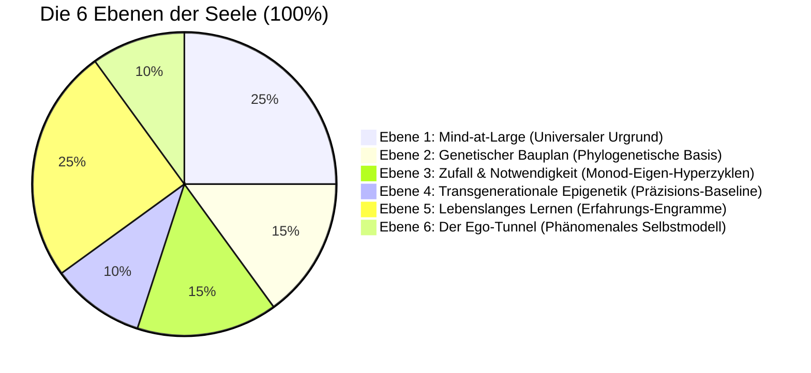

# Kapitel 5: Die Komposition der Seele: Die 6-Ebenen-Ontogenese ($100\,\%$)

> *„Die Seele ist weder ein übernatürlicher Geist noch eine leblose Illusion des Gehirns. Sie ist ein autopoietischer Teppich aus sechs Dimensionen: universalem Bewusstsein, Genetik, embryonalem Zufall, Ahnen-Epigenetik, individuellem Lernen und dem Ich-Tunnel.“*  
> — **Thomas Riebl**, *The Composition of the Soul* (2026)

---

## 5.1 Die sechs Schichten der individuellen Seele

Das Konativ-Integrative Framework überwindet den alten Streit zwischen Dualismus und Eliminativem Materialismus durch eine quantitative **6-Ebenen-Architektur**, die sich exakt zu $100\,\%$ aufsummiert[^ch5_indicative_note_de]:

1. **Ebene 1: Mind-at-Large ($25\,\%$)** – Der universale Bewusstseinsgrund (Spinoza, Kastrup). Liefert die rohe Fähigkeit zu phänomenalem Erleben (*Qualia*).
2. **Ebene 2: Der genetische Bauplan ($15\,\%$)** – Stammhirn und limbisches System (Gerhard Roth, Jaak Panksepp). Verankert elementare Überlebensantriebe (*Conatus*).
3. **Ebene 3: Zufall und Notwendigkeit ($15\,\%$)** – Embryonale Morphogenese und synaptisches Pruning (Jacques Monod, Manfred Eigen). Schafft die individuelle Einzigartigkeit des Gehirns.
4. **Ebene 4: Transgenerationale Epigenetik ($10\,\%$)** – Biochemische Schalter (Methylierung) zur generationenübergreifenden Kalibrierung der Stresspräzision ($\gamma$).
5. **Ebene 5: Lebenslanges biografisches Lernen ($25\,\%$)** – Kortex und Hippocampus (Eric Kandel). Autobiografische Erinnerungen, Sprache, Werte ($A, B, C$-Tensoren).
6. **Ebene 6: Der Ego-Tunnel ($10\,\%$)** – Das transparente phänomenale Selbstmodell (Thomas Metzinger). Erzeugt die Illusion eines zentrierten „Ich“.

---

## 5.2 Zuordnung zu den POMDP-Parametern

| Schicht | Seelische Dimension | Anteil | POMDP-Parameter | Funktion in Active Inference |
| :--- | :--- | :---: | :--- | :--- |
| **Ebene 1** | **Mind-at-Large** | $25\,\%$ | **Zustandsraum ($\mathcal{S}$)** | Der universale Erlebnisraum aller Konfigurationen |
| **Ebene 2** | **Genetik** | $15\,\%$ | **Startvektor ($D = P(s_0)$)** | Phylogenetische Sollwerte & Triebe (*Conatus*) |
| **Ebene 3** | **Zufall & Notwendigkeit** | $15\,\%$ | **Hyperzyklus-Dynamik** | Rauschhafter Entwicklungsfilter der neuronalen Topologie |
| **Ebene 4** | **Epigenetik** | $10\,\%$ | **Präzision ($\gamma = \sigma^{-2}$)** | Ahnen-Gewichtung von sensorischen Vorhersagefehlern |
| **Ebene 5** | **Lebenslanges Lernen** | $25\,\%$ | **Matrizen ($A, B$) & ($C$)** | Gelerntes Weltmodell und bewusste Werte |
| **Ebene 6** | **Der Ego-Tunnel** | $10\,\%$ | **Markov-Decke ($\mathcal{B}$)** | Grenze zur Aufrechterhaltung der 1.-Person-Perspektive |
| **Gesamt** | **Die Seele** | **$100\,\%$** | **Generatives Modell ($\mathcal{M}$)** | **Das vollständige bewusste Individuum** |

> [!NOTE]
> **Methodische Klarstellung zu den ontogenetischen Gewichtungen:**  
> Die konkreten Prozentangaben der sechs Schichten ($25\,\%, 15\,\%, 15\,\%, 10\,\%, 25\,\%, 10\,\%$) sind rein indikativ und heuristisch zu verstehen. Sie entstammen der individuellen phänomenologischen Erfahrung und reflektiven Modellbildung des Autors und dienen der Veranschaulichung der relativen strukturellen Anteile, nicht als empirisch absolute Naturkonstanten.

[^ch5_indicative_note_de]: Die konkreten Prozentangaben der sechs Schichten ($25\,\%, 15\,\%, 15\,\%, 10\,\%, 25\,\%, 10\,\%$) sind rein indikativ und heuristisch zu verstehen. Sie entstammen der individuellen phänomenologischen Erfahrung und reflektiven Modellbildung des Autors und dienen der Veranschaulichung der relativen strukturellen Anteile, nicht als empirisch absolute Naturkonstanten.

