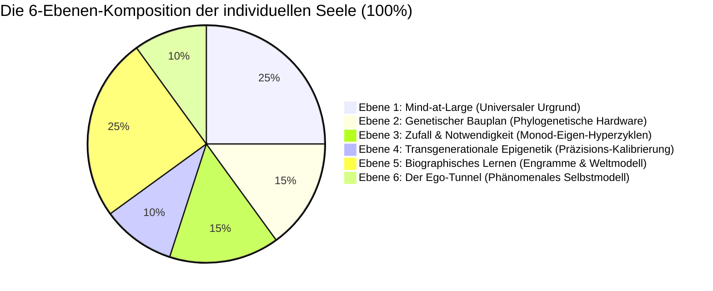
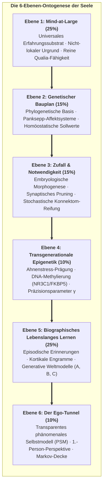
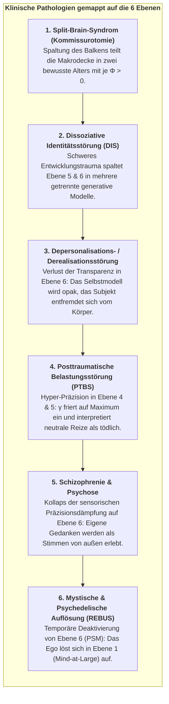

# Kapitel 5: Die Komposition der Seele: Das 6-Ebenen-Gefüge der Ontogenese

> *„Die Seele ist weder ein unteilbarer, übernatürlicher Geist noch eine bedeutungslose neuronale Illusion. Sie ist ein hierarchisches, autopoietisches Informationsgewebe, das sich über Genetik, embryologische Entwicklung, transgenerationale Epigenetik, biographisches Lernen und universales Bewusstsein erstreckt.“*  
> — **Thomas Riebl**, *The Composition of the Soul* (2026)

---

## 5.1 Jenseits von Substanzdualismus und eliminativem Materialismus

Woraus besteht eine individuelle menschliche Seele?

Im Verlauf der westlichen Philosophiegeschichte haben zwei extreme und gleichermaßen unzureichende Dogmen den Diskurs beherrscht:
1. **Der cartesianische Substanzdualismus:** Postuliert, dass die Seele eine immaterielle, unteilbare spirituelle Substanz (*res cogitans*) sei, die über die Zirbeldrüse auf magische Weise an einen mechanischen Körper (*res extensa*) gekoppelt ist. Diese Sichtweise scheitert völlig daran, die neurobiologischen, genetischen und pharmakologischen Abhängigkeiten von Persönlichkeit, Gedächtnis und kognitiver Leistungsfähigkeit zu erklären.
2. **Der eliminative Materialismus:** Behauptet, die „Seele“ und das subjektive Selbst seien bloße Illusionen – der Mensch sei nichts weiter als ein zufälliges Gemisch egoistischer Gene und mechanischer biochemischer Reflexe. Diese Haltung leugnet die unhintergehbare Realität des phänomenalen Erlebens und scheitert am Schweren Problem des Bewusstseins.

Das Konativ-Integrative Framework überwindet diesen historischen Streit, indem es die individuelle Seele als **ein 6-Ebenen-Gefüge autopoietischer Information** definiert. Ein individuelles Alter ist weder eine unteilbare Monade noch ein biochemischer Zufallsautomat; es ist ein strukturiertes, quantitatives Kompositum aus biologischen, biographischen und kosmischen Faktoren, die sich in ihrer Gesamtheit zu $100\%$ ergänzen[^ch5_indicative_note_de].

<strong>Abbildung 5.1:</strong> Die 6-Ebenen-Komposition der individuellen Seele (Indikative relative Gewichtung).

---

## 5.2 Die sechs architektonischen Ebenen der Seele

<strong>Abbildung 5.2:</strong> Die 6-Ebenen-Ontogenese der Seele.

---

### Ebene 1: Mind-at-Large (Das universale Erfahrungsfeld) — $25\%$
* **Ontologische Natur:** Das fundamentale, nicht-lokale Substrat des Bewusstseins selbst. Im Einklang mit Baruch Spinozas *Substanzmonismus*, Bernardo Kastrups *Analytischem Idealismus* und non-dualen Traditionen (Advaita Vedanta) wird Bewusstsein nicht von neuronaler Biomasse erzeugt; vielmehr ist das universale Bewusstsein die primäre Leinwand, auf der alle lokalisierten Phänomene erscheinen.
* **Funktionaler Beitrag:** Stellt die reine qualitative Erlebnisfähigkeit (*Qualia*) bereit, das transpersonale Fundament der Existenz und den zeitlosen Ozean, in den sich das lokalisierte Ich beim biologischen Tod wieder auflöst.

---

### Ebene 2: Der genetische Bauplan (Phylogenetische Basis) — $15\%$
* **Biologisches Substrat:** Der evolutionär vererbte Code in den Nukleotidsequenzen der menschlichen DNA. Aufbauend auf dem Neurobiologen **Gerhard Roth (2003, 2021)** und dem Begründer der Affektiven Neurowissenschaft **Jaak Panksepp (1998)**:
* **Die 7 subkortikalen emotionalen Primärsysteme:** Die Genetik verdrahtet tief im Hirnstamm, Hypothalamus und limbischen System fundamentale emotionale Triebe:
  1. `SEEKING` (mesolimbischer Dopaminpfad vom VTA zum Nucleus accumbens; treibt Neugier, Futtersuche und Vorwärtsdrang).
  2. `FEAR` (zentrale Amygdala zum lateralen Hypothalamus und vPAG; steuert Erstarren, Flucht und Tachykardie).
  3. `RAGE` (mediale Amygdala zur Stria terminalis und dorsalem PAG; Abwehr von Einengung und Grenzverletzungen).
  4. `PANIC / GRIEF` (anteriores Zingulum und dorsomedialer Thalamus zum PAG; Trennungsschmerz bei Opioid-Abfall).
  5. `CARE` (mediales präoptisches Areal; elterliche Fürsorge und Bindung via Oxytocin und Prolaktin).
  6. `PLAY` (dorsomedialer Thalamus und Striatum; soziales spielerisches Raufen und motorische Synchronie).
  7. `LUST` (ventromedialer Hypothalamus und präoptisches Areal; Sexualtrieb gesteuert durch Steroidhormone).
* **Kybernetische Rolle:** Definiert den phylogenetischen Prior-Zustandsvektor $D = P(s_0)$ und die primären homöostatischen Sollwerte (*Conatus*).

---

### Ebene 3: Zufall und teleonomische Notwendigkeit (Embryologische Morphogenese) — $15\%$
* **Biophysikalisches Substrat:** Das dynamische Rauschen der Selbstorganisation zwischen genetischem Code und makroskopischer Neuroanatomie. Nach Nobelpreisträger **Jacques Monod (1970)** (*Zufall und Notwendigkeit*) und Biophysiker **Manfred Eigen (1971)** (*Der Hyperzyklus*):
* **Stochastische Selbstorganisation:** Die DNA enthält keinen Schaltplan für jede der $86 \times 10^9$ Nervenzellen und $10^{14}$ Synapsen. Die Hirnentwicklung erfolgt über nichtlineare morphogenetische Gradienten (Turing-Muster), stochastisches axonales Wegfinden und kompetitives synaptisches Pruning.
* **Individuelle Einzigartigkeit:** Eineiige Zwillinge mit $100\%$ identischer DNA weisen pränatal unterschiedliche Gyrierungsmuster, Gefäßverzweigungen und Konnektom-Mikrostrukturen auf. Diese Ebene garantiert die unhintergehbare Einzigartigkeit jedes Alters.

---

### Ebene 4: Transgenerationale Epigenetik (Ahnen-Kalibrierung) — $10\%$
* **Molekulares Substrat:** Vererbbare biochemische Modifikationen des Chromatins ohne Veränderung der DNA-Sequenz.
* **Empirische Mechanismen:** Nach **Rachel Yehuda (2018)**, **Isabelle Mansuy (2014)** und **Eva Jablonka (2014)**:
  * **DNA-Methylierung:** Methylierung von CpG-Inseln im Promotor des *NR3C1*-Gens (Glukokortikoid-Rezeptor) und des *FKBP5*-Gens.
  * **Histon-Modifikationen:** Deacetylierung von H3/H4 kondensiert Chromatin zu transkriptionell inaktivem Heterochromatin.
  * **Nicht-kodierende Keimbahn-RNAs:** Extremer Ahnenstress und Hungersnöte übertragen sncRNAs, microRNAs und tRNA-Fragmente in Spermien und Eizellen, was die frühe zygotische Transkription künftiger Generationen modifiziert.
  * **Phänotypische Konsequenz:** Nachkommen erben eine vorjustierte Stressachse (HPA-Achse) mit erhöhter Vigilanz, noch bevor eigene Lebenserfahrungen einsetzen.
* **Kybernetische Rolle:** Dient als transgenerationale Brücke zur Justierung des **Präzisionsparameters ($\gamma = (\sigma^2)^{-1}$)**.

---

### Ebene 5: Biographisches lebenslanges Lernen & Kognitive Weltmodellierung — $25\%$
* **Neuroplastisches Substrat:** Die autobiographische Lebensgeschichte, verankert in kortiko-hippokampalen Netzwerken. Nach **Gerhard Roths oberen limbischen und neokortikalen Ebenen** und **Eric Kandels nobelpreisgekrönten molekularen Gedächtnismechanismen**:
* **Mechanismen:** Langzeitpotenzierung (LTP), Umbau dendritischer Dornen, CREB-vermittelte Proteinsynthese und assoziative Konditionierung.
* **Inhalt:** Explizite Erinnerungen, kulturelle Sozialisation, Sprachkategorien, moralische Werte, Traumata und spezifische Fertigkeiten.
* **Kybernetische Rolle:** Füllt die POMDP-Likelihood-Matrix ($A$), den Kausalübergangstensor ($B$) und die Werte-Präferenzen ($C$) mit Erfahrungsinhalten.

---

### Ebene 6: Der Ego-Tunnel (Das phänomenale Selbstmodell) — $10\%$
* **Kognitives Substrat:** Die Echtzeit-Simulation eines dauerhaften, einheitlichen 1.-Person-Ichs. Nach Kognitionsphilosoph **Thomas Metzinger (2003, 2009, 2024)** (*Being No One* & *Der Ego-Tunnel*):
* **Phänomenale Transparenz:** Das prädiktive Gehirn betreibt kontinuierlich ein **phänomenales Selbstmodell (PSM)** zur Steuerung der Sensomotorik. Da das Gehirn keinen Zugriff auf die Algorithmen hat, die dieses Modell erzeugen, erleben wir das Modell als *transparent*: Wir erleben kein Modell der Welt, sondern haben das Gefühl, direkt *in* der Welt zu sein.
* **Kybernetische Rolle:** Das PSM bildet die innere Grenze der Markov-Decke ($\mathcal{B} = \{s, a\}$) und verankert Active Inference in einem egozentrischen Raum-Zeit-Koordinatensystem.

---

## 5.3 Active-Inference-Zuordnung: Neurobiologie im POMDP-Tensorraum

Im Konativ-Integrativen Framework korrespondieren die sechs Ebenen der Seele exakt mit den formalen Parametern eines POMDP:

<strong>Tabelle 5.1:</strong> Active-Inference-Zuordnung: Neurobiologie und POMDP-Tensoren über die 6 Ebenen der Seele.

| Ebene | Architektonische Dimension | Anteil | POMDP-Mathematisches Objekt | Rolle in Active Inference |
| :--- | :--- | :---: | :--- | :--- |
| **Ebene 1** | **Mind-at-Large** | $25\,\%$ | **Zustandsraum ($\mathcal{S}$)** | Universaler Phasenraum aller denkbaren Erlebniskonfigurationen |
| **Ebene 2** | **Genetischer Bauplan** | $15\,\%$ | **Prior-Zustandsvektor ($D = P(s_0)$)** | Phylogenetische Sollwerte; homöostatische Ur-Attraktoren (*Conatus*) |
| **Ebene 3** | **Zufall & Notwendigkeit** | $15\,\%$ | **Hyperzyklus-Dynamik** | Entwicklungsrauschen, das die individuelle Hirntopologie formt |
| **Ebene 4** | **Transgenerationale Epigenetik** | $10\,\%$ | **Präzisionsparameter ($\gamma = (\sigma^2)^{-1}$)** | Transgenerationale Kalibrierung von Vorhersagefehler-Gewichten |
| **Ebene 5** | **Lebenslanges Lernen** | $25\,\%$ | **Tensoren ($A, B$) & Präferenzen ($C$)** | Gelerntes Weltmodell ($A, B$) und erlernte Wertvorstellungen ($C$) |
| **Ebene 6** | **Der Ego-Tunnel** | $10\,\%$ | **Markov-Decke ($\mathcal{B} = \{s, a\}$)** | Statistische Schranke, die innere Zustände ($\mu$) als 1.-Person-Ich isoliert |
| **Gesamt** | **Die geeinte Seele** | **$100\,\%$** | **Generatives Modell ($\mathcal{M} = \{A, B, C, D, \gamma\}$)** | **Das vollständige dissoziierte bewusste Alter** |

> [!NOTE]
> **Methodische Klarstellung zu den ontogenetischen Gewichtungen:**  
> Die prozentualen Anteile ($25\%, 15\%, 15\%, 10\%, 25\%, 10\%$) besitzen rein indikativen, heuristischen und modelltheoretischen Charakter. Sie entspringen der phänomenologischen Reflexion und qualitativen Synthese des Autors, um das relative Gefüge der Einflusskräfte zu verdeutlichen, und stellen keine universellen empirischen Naturkonstanten dar.

---

## 5.4 Klinische Fallstudien & Split-Brain-Phänomene über die 6 Ebenen

Die 6-Ebenen-Architektur bietet ein differentialdiagnostisches Modell für komplexe neuropsychiatrische Störungsbilder und radikale neuronale Dissoziationen:

<strong>Abbildung 5.3:</strong> Klinische Pathologien gemappt auf die 6 Ebenen der Seele.

### 1. Split-Brain-Syndrom (Gazzaniga & Sperry Kommissurotomie):
Werden die rund $200\text{ Millionen}$ Nervenfasern des Corpus Callosum durchtrennt, erfährt der thalamokortikale Komplex eine physikalische minimale Informationspartition:
* Experimente von Roger Sperry (1968) und Michael Gazzaniga (2000) bewiesen, dass die linke und rechte Hemisphäre zu zwei **funktional und phänomenal eigenständigen bewussten Alters** werden.
* Die linke Hemisphäre verfügt über Sprache und verbale Berichte; die rechte Hemisphäre steuert emotionale Erkennung, räumliches Denken und Bildsynthese. Konfrontiert mit widersprüchlichen Reizen handeln beide unabhängig voneinander.
* Dies ist die empirische Bestätigung des CIF: **Bewusstsein ist keine unteilbare Substanz, sondern ein topologisch abgegrenzter Kausalkomplex, der sich teilt, wenn seine kausale Integration durchtrennt wird.**

### 2. Dissoziative Identitätsstörung (DIS):
Bei frühem Bindungstrauma spaltet das Gehirn Ebene 5 (biographische Modelle) und Ebene 6 (Selbstmodelle) in **verschiedene Sub-Alters** auf, um unerträgliche freie Energie zu minimieren. Jedes Alter besitzt eigene Persönlichkeitsmerkmale und Erinnerungsgrenzen, teilt jedoch das biologische Substrat (Ebenen 1–3).

### 3. Depersonalisationsstörung (Dysfunktion der Ebene 6):
Das Selbstmodell verliert seine phänomenale Transparenz. Der Betroffene erlebt sich wie ein Schauspieler in einem Film oder als Roboter und beobachtet seinen Körper von außen.

### 4. Posttraumatische Belastungsstörung (Ebene 4 & 5):
Traumatische Prägungen verändern Chromatin und synaptische Gewichte dauerhaft und fixieren $\gamma$ in permanenter Übererregung. Neutrale Umweltreize feuern unkontrolliert subkortikale FEAR- und RAGE-Schaltkreise an (Ebene 2).

### 5. Schizophrenie (Grenzauflösung):
Fehlende Präzisionsdämpfung verhindert, dass das Gehirn selbstgenerierte sensorische Konsequenzen als eigen einstuft. Eigene Gedanken werden als fremde Stimmen wahrgenommen; die Markov-Decke wird porös.

### 6. Mystische Zustände (Ebene 6 löst sich in Ebene 1 auf):
Unter Psychedelika (Psilocybin) oder tiefer Meditation deaktivert sich das Default Mode Network und Ebene 6. Das Alter erfährt seine ursprüngliche Einheit mit Ebene 1 (Mind-at-Large).

---

### Synthese: Die Seele als autopoietischer Strudel
Eine individuelle Seele ist kein statisches Objekt; sie ist ein **autopoietischer informationeller Strudel im Ozean von Mind-at-Large**.

Das genetische Flussbett formt den Kanal (Ebene 2 & 3); die Ahnenströmung bestimmt die Grunddynamik (Ebene 4); die biographischen Treibhölzer weben das zirkulierende Narrativ (Ebene 5); der lokalisierte Wirbelkern erzeugt die Ich-Perspektive (Ebene 6); und das Wasser, aus dem der gesamte Wirbel besteht, ist das universale Bewusstsein selbst (Ebene 1).

In Kapitel 6 untersuchen wir den zeitlichen Mechanismus, der diesen Strudel in Bewegung hält: *Die temporale Mechanik des Bewusstseins und die Specious Present*.

[^ch5_indicative_note_de]: Die prozentualen Anteile ($25\%, 15\%, 15\%, 10\%, 25\%, 10\%$) besitzen rein indikativen und heuristischen Charakter. Sie entspringen der phänomenologischen Reflexion des Autors, um das relative Gefüge der Einflusskräfte zu verdeutlichen, und stellen keine universellen empirischen Naturkonstanten dar.
