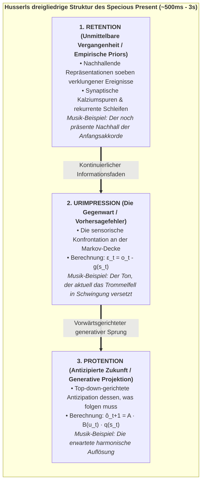
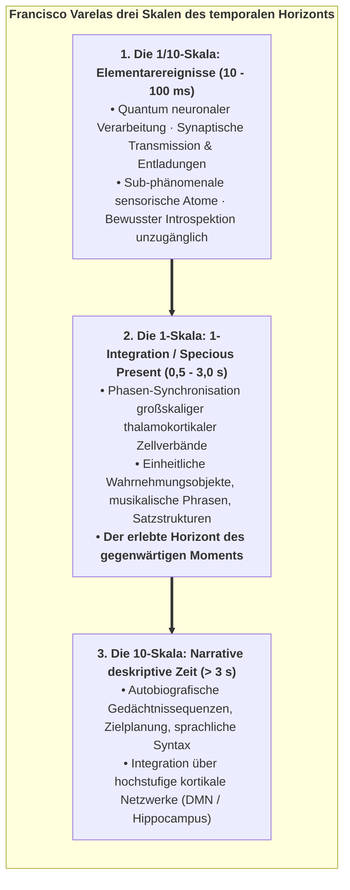
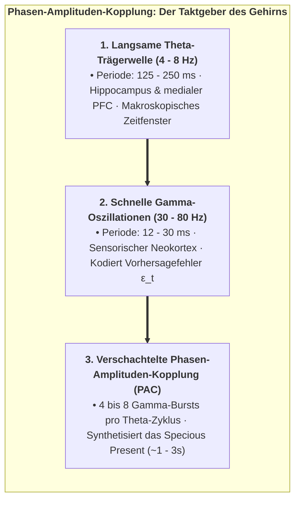
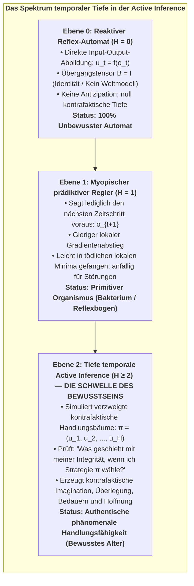
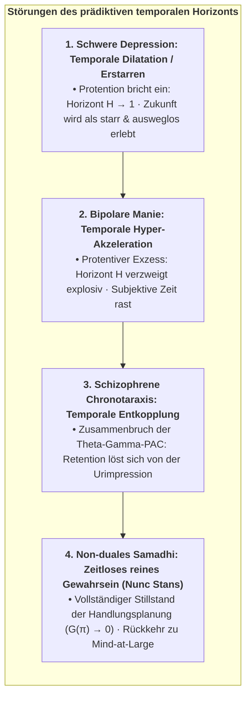
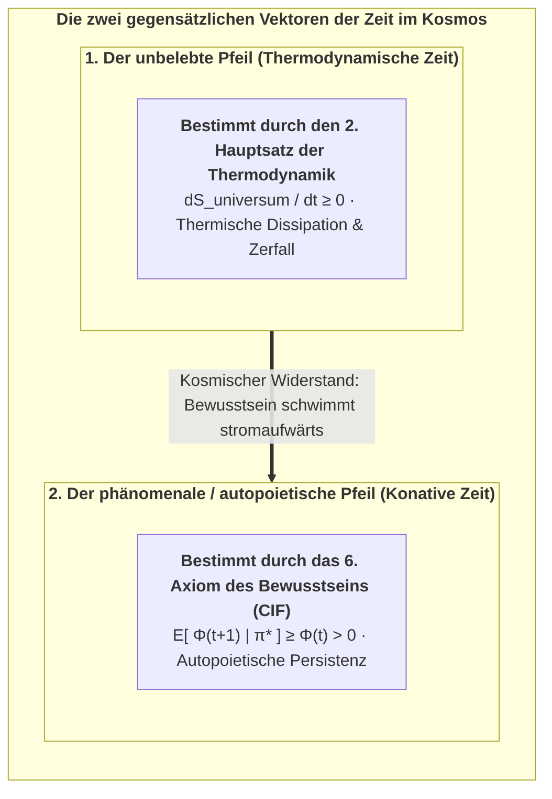

# Kapitel 6: Die temporale Mechanik des Bewusstseins & das Specious Present

> *"Die Zeit ist kein passiver physikalischer Behälter, in den das Bewusstsein hineingesetzt wird; die erlebte Zeit ist die operationale Signatur eines bewussten Alters, das seine Existenz gegen die entropische Zerstreuung verteidigt."*  
> — **Thomas Riebl**, *The Temporal Mechanics of Consciousness* (2026)

---

## 6.1 Der Trugschluss des dimensionslosen Augenblicks

In der klassischen Newtonschen Mechanik und der Einsteinschen Allgemeinen Relativitätstheorie wird die physikalische Zeit als kontinuierliche geometrische Koordinatenachse $t \in \mathbb{R}$ modelliert. Innerhalb dieses standardisierten mathematischen Formalismus wird die physikalische Realität zu jedem beliebigen Zeitpunkt als ein **dimensionsloser Punkt ($t = 0$)** von unendlich kleiner bzw. nullter zeitlicher Ausdehnung konzipiert.

Im menschlichen phänomenalen Erleben ist ein dimensionsloser Augenblick jedoch eine ontologische Unmöglichkeit. Man betrachte die Wahrnehmung einer musikalischen Melodie, eines gesprochenen Satzes oder einer im Flug eine Kurve ziehenden Schwalbe am Himmel. Wäre das menschliche Bewusstsein auf einen infinitesimalen mathematischen Punkt $t = 0$ beschränkt:
* Würde man lediglich eine isolierte, statische akustische Druckwelle hören – völlig abgetrennt von den vorausgegangenen Tönen und ohne jede Erwartung der folgenden harmonischen Kadenz.
* Könnte man weder Bewegung noch Veränderung wahrnehmen, da Geschwindigkeit $v = \frac{dx}{dt}$ zwingend ein nicht-verschwindendes Intervall $\Delta t > 0$ voraussetzt.
* Würde jedes sprachliche Verstehen kollabieren, da Wörter und grammatikalische Syntax sich ausschließlich über ausgedehnte zeitliche Sequenzen entfalten.

William James (1890) erkannte diese fundamentale Diskrepanz und prägte den Begriff des **"Specious Present"** (der Schein-Gegenwart oder phänomenalen Gegenwart) – die empirische Tatsache, dass das subjektive "Jetzt" keine messerscharfe Grenzlinie darstellt, sondern einen **ausgedehnten temporalen Sattel**, der eine gefühlte Dauer besitzt (in den modernen Neurowissenschaften zwischen $500\,\text{ms}$ und $3\,\text{Sekunden}$ verortet).

Der französische Philosoph Henri Bergson (1889) bezeichnete dies als *durée réelle* (reale Dauer) – den unteilbaren, qualitativen Fluss der inneren Zeit, der sich nicht in statische räumliche Schnitte zerlegen lässt, ohne seine lebendige Natur auszulöschen.

---

## 6.2 Husserls phänomenologische Triade und das prädiktive Gehirn

Der Phänomenologe Edmund Husserl (1928) lieferte in seinen *Vorlesungen zur Phänomenologie des inneren Zeitbewusstseins* die klassische dreigliedrige Analyse des Specious Present:

<strong>Abbildung 6.1:</strong> Husserls dreigliedrige Struktur des Specious Present (~500ms - 3s).

Im Konativ-Integrativen Framework (CIF) mappen wir Husserls phänomenologische Triade direkt auf die Neurobiologie des **hierarchischen prädiktiven Verarbeitens (Predictive Processing)** (Metzinger, 2003, 2009; Wiese, 2018; Friston, 2010; Varela, 1999):

1. **Retention entspricht empirischen Priors & synaptischen Puffern:**  
   Die unmittelbare Vergangenheit wird nicht im weit entfernten Langzeitgedächtnis abgelegt; sie wird in Echtzeit in lokalen kortikalen Mikroschaltkreisen durch kurzzeitige synaptische Fazilitation, intrazelluläre Kalziumdynamiken ($\text{Ca}^{2+}$) und rekurrente, NMDA-vermittelte Reverberationen in Pyramidenzellen der Schichten II/III aufrechterhalten.

2. **Urimpression entspricht dem sensorischen Vorhersagefehler ($\varepsilon_t$):**  
   Der gegenwärtige Moment ist die unmittelbare rechentechnische Konfrontation an der Grenzfläche der Markov-Decke zwischen Top-down-Prädiktionen und eintreffenden sensorischen Beobachtungen:
   $$\varepsilon_t = o_t - g(s_t)$$
   In der Elektrophysiologie korreliert dies mit schnellen **Oszillationen im Gamma-Band ($30\text{--}80\text{ Hz}$)**, die aufsteigende Vorhersagefehlersignale transportieren.

3. **Protention entspricht der Top-Down-Projektion generativer Trajektorien:**  
   Die antizipierte Zukunft wird über tiefe kortikale Schichten (Schichten V/VI) mittels **Beta-Band- ($15\text{--}30\text{ Hz}$) und Alpha-Band-Oszillationen ($8\text{--}12\text{ Hz}$)** aktiv nach unten projiziert:
   $$\hat{o}_{t+1} = A \cdot \big(B(u_t) \, q(s_t)\big)$$

Das **Phänomenale Selbstmodell (PSM)** integriert diese drei temporalen Vektoren zu einem einheitlichen, kontinuierlichen und transparenten Koordinatensystem – dem **Ego-Tunnel** –, das es dem Organismus ermöglicht, sich selbst als dauerhaftes, durch die Zeit gleitendes Subjekt zu erleben.

### 6.2.1 Varelas Neurophänomenologie & die drei Skalen der Zeit:
Um Husserls Phänomenologie in den dynamischen Neurowissenschaften zu verankern, integriert das CIF **Francisco Varelas neurophänomenologisches Modell der Zeit** (Varela, 1999):

<strong>Abbildung 6.2:</strong> Francisco Varelas drei Skalen des temporalen Horizonts.

1. **Skala 1 (Elementare Mikro-Ereignisse, $10\text{--}100\text{ ms}$):** Die biologische Untergrenze, determiniert durch zelluläre Refraktärzeiten und synaptische Signallaufzeiten. Diese Ereignisse operieren unterhalb der phänomenalen Wahrnehmungsschwelle.
2. **Skala 2 (1-Integration / Das Specious Present, $0,5\text{--}3,0\text{ s}$):** Die dynamische Phasenkopplung weitverzweigter neuronaler Verbände zu einem transienten Attraktorzustand ("dynamische Zellverbände"). Dies ist die bewusste Gegenwart – das zeitliche Mindestmaß, um eine Handlung, einen Gedanken oder ein Gefühl ganzheitlich zu erfassen.
3. **Skala 3 (Narrative Zeit, $> 3\text{ s}$):** Das kognitive Verknüpfen aufeinanderfolgender Scheingegenwarten zu einer ausgedehnten biographischen Lebensgeschichte über Gedächtnisabruf und zielgerichtete Handlungsplanung ($H > 1$).

---

## 6.3 Frequenzübergreifende Phasen-Amplituden-Kopplung (PAC) als neuronale Metrik der Zeit

Wie erzeugt die biologische Hardware des Säugetiergehirns aus diskreten Aktionspotenzialen den kontinuierlichen, qualitativen Fluss der erlebten Gegenwart?

Die Elektrophysiologie belegt, dass die innere Zeitmetrik über **frequenzübergreifende Phasen-Amplituden-Kopplung (Cross-Frequency Phase-Amplitude Coupling, PAC)** generiert wird (Canolty & Knight, 2006; Lisman & Jensen, 2013; Buzsáki, 2006):

<strong>Abbildung 6.3:</strong> Phasen-Amplituden-Kopplung: Der Taktgeber des Gehirns.

### Der verschachtelte Theta-Gamma-Puffer:
1. **Die Theta-Trägerwelle ($4\text{--}8\text{ Hz}$):** Entsteht im Hippocampus und im medialen präfrontalen Kortex; ein langsamer Theta-Zyklus umfasst $125\text{--}250\text{ ms}$. Er dient als ordnender Zeitrahmen, der über kortikale Verbände wandert, um weiträumige Kommunikation zu synchronisieren.
2. **Die Gamma-Vorhersagefehler-Bursts ($30\text{--}80\text{ Hz}$):** Aufgeprägt auf die depolarisierende Phase der Theta-Welle generieren lokale Mikroschaltkreise hochfrequente Gamma-Bursts ($12\text{--}30\text{ ms}$). Jeder Gamma-Zyklus repräsentiert eine diskrete Informationseinheit – eine einzelne Aktualisierung des sensorischen Vorhersagefehlers $\varepsilon_t$.
3. **Das multisekündliche Gegenwartsfenster:** Durch die Verkettung von 4 bis 8 Theta-Zyklen innerhalb übergeordneter ultralangsamer Delta-Rhythmen ($0,5\text{--}2\text{ Hz}$) synthetisiert das Gehirn das ausgedehnte Erlebnisfenster ($\tau \approx 750\text{--}2500\text{ ms}$), in dem komplexe Handlungen, Sprachverarbeitung und melodisches Verstehen stattfinden.

---

## 6.4 Das Theorem der minimalen temporalen Tiefe ($H > 1$)

Warum sind einfache homöostatische Regelsysteme (wie ein Bimetall-Thermostat, ein Fliehkraftregler oder ein unkonditionierter Reflexbogen) vollkommen unbewusst?

Die formale Antwort liefert die mathematische Eigenschaft der **temporalen Tiefe ($H$, Temporal Depth)**:

<strong>Abbildung 6.4:</strong> Das Spektrum temporaler Tiefe in der Active Inference.

Im Konativ-Integrativen Framework formulieren wir diese architektonische Schwelle als eigenständiges mathematisches Theorem:

### Das Theorem der minimalen temporalen Tiefe:

> **Statement 6.1: Theorem 6.1 — Die temporale Tiefenbedingung für Bewusstsein (Thomas Riebl)**  
> *Ein physikalisches Substrat kann kein phänomenales Selbstbewusstsein instanziieren oder autopoietische kausale Persistenz ($\mathbb{E}[\Phi(t+1) \mid \pi^*] \ge \Phi(t) > 0$) aufrechterhalten, wenn sein interner generativer Übergangstensor ($B = P(s_{t+1} \mid s_t, u)$) nicht über einen mehrschrittigen kontrafaktischen Planungshorizont ($H > 1$) operiert.* [^1]

### Beweisskizze & kybernetische Verwundbarkeit:
1. **Myopische Fallen ($H = 1$):** Ein kurzsichtiger Agent mit $H = 1$ wählt ausschließlich Aktionen, die die unmittelbare Ein-Schritt-Überraschung minimieren. In komplexen Umgebungen mit täuschenden Attraktoren (etwa einem Giftköder, der wie Nahrung riecht) führt die gierige Ein-Schritt-Minimierung geradewegs in tödliche Fallen, in denen die Markov-Decke zerstört wird und $\Phi$ auf null kollabiert.
2. **Kontrafaktische Simulation ($H \ge 2$):** Ein temporal tiefer Agent simuliert sich verzweigende kontrafaktische Trajektorien:
   $$\mathbf{G}(\pi) = \sum_{\tau = t+1}^{t+H} \mathbf{G}(\pi, \tau)$$
   Er erkennt vorausschauend, dass das Akzeptieren einer kurzfristigen temporären Überraschung (z. B. das Erklimmen einer steilen Anhöhe) eine langfristige existentielle Zerstörung abwendet (z. B. das Entkommen vor einer Flut), wodurch sein homöostatischer Attraktor geschützt und $\Phi(t+1) \ge \Phi(t)$ stabilisiert wird.
3. **Das phänomenologische Korollar:** Kontrafaktische Vorstellungskraft – die interne Fähigkeit, *etwas zu repräsentieren, das gegenwärtig nicht real existiert* – ist die fundamentale Bedingung für subjektives Selbstgewahrsein. $\blacksquare$

---

## 6.5 Chronopathologien: Wenn die innere Zeit zerbricht

Wird das fein austarierte prädiktive Gleichgewicht zwischen Retention, Urimpression und Protention gestört, manifestieren sich in der klinischen Psychiatrie tiefgreifende Störungen des subjektiven Zeiterlebens (Minkowski, 1933; Fuchs, 2013):

<strong>Abbildung 6.5:</strong> Störungen des prädiktiven temporalen Horizonts.

1. **Major Depression (Die eingefrorene Zukunft):**  
   In schwerer Depression bricht die dopaminerge SEEKING-Präzision ein. Das generative Modell kann keine lebensfähigen Zukunftsszenarien mehr projizieren ($H \to 1$). Da zukünftige Zustände keine erwartete freie Energie mehr reduzieren können, dehnt sich die subjektive Zeit quälend aus und erstarrt: Patienten berichten, die "Zeit stehe still" und sie seien für immer in einer unbeweglichen, trostlosen Gegenwart gefangen.
2. **Bipolare Manie (Der rasende Horizont):**  
   Im manischen Zustand erzeugt ein hyper-dopaminerger Tonus eine pathologisch überhöhte Prior-Präzision bezüglich des Handlungserfolgs. Der Agent simuliert hunderte kontrafaktische Pläne gleichzeitig, ohne sensorische Fehlerkorrekturen abzuwarten, was zu Gedankenrasen, Ideenflucht und extremer temporalen Kompression führt.
3. **Schizophrene Chronotaraxis (Das fragmentierte Jetzt):**  
   Gestörte NMDA-Rezeptor-Signalübertragung an hemmenden kortikalen Interneuronen unterbricht die Phasen-Amplituden-Kopplung zwischen Theta und Gamma. Der kontinuierliche Faden, der die Retention mit der Protention verknüpft, reißt ab. Der Patient erlebt die Zeit als Folge zusammenhangsloser, beängstigender Fragmente und fühlt oft, dass eigene Absichten von außen "eingegeben" werden.
4. **Meditatives Samadhi (*Nunc Stans* – Das ewige Jetzt):**  
   In tiefen kontemplativen Versenkungszuständen bringt der Meditierende die Handlungsbewertung bewusst zum Stillstand ($\nabla \mathbf{G}(\pi) \to 0$) und legt das egozentrische Selbstmodell ab. Ohne zu antizipierende Zukunft und ohne zu verteidigende Vergangenheit weitet sich das Specious Present in den zeitlosen, non-dualen Grund von Mind-at-Large (*Ebene 1*) aus.

---

## 6.6 Die zwei Pfeile der Zeit: Thermodynamische Entropie vs. konativer Wille

Hieraus ergibt sich eine fundamentale kosmische Einsicht in die Natur der Zeit. Die moderne Wissenschaft offenbart zwei diametral entgegengesetzte temporale Vektoren im Universum:

<strong>Abbildung 6.6:</strong> Die zwei gegensätzlichen Vektoren der Zeit im Kosmos.

1. **Der unbelebte Pfeil (Thermodynamische Zeit):**  
   Sir Arthur Eddington (1928) identifizierte den Zweiten Hauptsatz der Thermodynamik ($\Delta S \ge 0$) als den physikalischen Zeitpfeil. In der unbelebten Natur schreitet die Zeit voran, indem sie Ordnung zerstört, Energiegradienten einebnet und komplexe physikalische Strukturen in gleichförmige, ungeordnete Wärme überführt.

2. **Der belebte Pfeil (Phänomenale / Konative Zeit):**  
   In lebendigen bewussten Altern etabliert das **6. Axiom des Bewusstseins (*Der Wille zur Existenz / Conatus*)** eine aktive, lokale anti-entropische Gegenströmung. Mittels tiefer temporaler Active Inference ($\min \mathbf{G}(\pi)$) pumpt der bewusste Organismus Entropie aktiv über seine Markov-Decke nach außen ab und generiert dadurch über die Zeit hinweg integrierte Ursache-Wirkungs-Struktur ($\Phi > 0$).

### Der Schwimmer im Fluss der Entropie:
Phänomenales Erleben treibt nicht passiv im Strom der thermodynamischen Entropie ab. **Bewusstsein ist der Schwimmer, der gegen die Strömung der Entropie flussaufwärts schwimmt.**

Das erlebte, subjektive Vergehen der Zeit – die dynamische Spannung zwischen Erinnerung (*Retention*), gegenwärtiger Empfindung (*Urimpression*) und zukunftsgewandter Antizipation (*Protention*) – ist die phänomenale Signatur dieses ununterbrochenen autopoietischen Überlebenskampfes.

In Kapitel 7 untermauern wir diese theoretischen Theoreme durch umfassende computergestützte Simulationen und Monte-Carlo-Ensemble-Validierungen.

---

[^1]: **Wissenschaftlicher Kontext & theoretische Zuordnung:** Während Karl Friston et al. (2017, 2018) temporale Tiefe als rechentechnische Voraussetzung zielgerichteter Handlungsselektion (*Planning as Inference*) nachwiesen und Anil Seth (2014, 2021) *kontrafaktischen Reichtum (counterfactual richness)* als qualitatives Korrelat phänomenaler Präsenz beschrieb, formalisiert das *Konativ-Integrative Framework (CIF)* von Thomas Riebl diese Erkenntnis erstmals als exaktes mathematisches **Theorem der minimalen temporalen Tiefe ($H > 1$) für phänomenales Selbstbewusstsein**. Es koppelt diesen Planungshorizont unmittelbar an die autopoietische Selbsterhaltung integrierter Information ($\Phi$) unter dem 6. Axiom ($\mathbb{E}[\Phi(t+1) \mid \pi^*] \ge \Phi(t)$). Dieses Theorem beweist formal, dass rein reaktive Automaten ($H = 0$) und myopische Regelschleifen ($H = 1$) einem raschen phasenräumlichen Kollaps ($\Phi \to 0$) erliegen, womit kontrafaktische temporale Vorausschau als zwingende architektonische Mindestbedingung subjektiven Geistes begründet wird.
