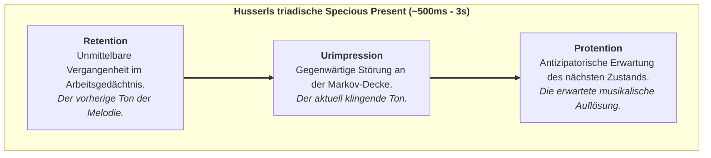

# Kapitel 6: Die temporale Mechanik des Geistes: Zeitbewusstsein & Specious Present

> *„Zeit ist kein Behälter der physikalischen Welt, in den Bewusstsein hineingeworfen wird; Zeit wie wir sie erleben ist die Signatur eines lebendigen Geistes, der sich gegen den Zerfall behauptet.“*  
> — **Thomas Riebl**, *The Temporal Mechanics of Consciousness* (2026)

---

## 6.1 Die Illusion des ausdehnungslosen Punkts

In der klassischen Physik ist Zeit eine eindimensionale reelle Zahl $t \in \mathbb{R}$. In dieser Abstraktion existiert die Gegenwart als **ausdehnungsloser mathematischer Punkt ($t=0$)**.

Im subjektiven Erleben jedoch ist ein ausdehnungsloser Augenblick unmöglich: Man kann keine Melodie, keinen gesprochenen Satz und keine Bewegung an einem Punkt $t=0$ wahrnehmen. William James (1890) prägte dafür den Begriff der **„Specious Present“** (der gefühlten Gegenwart) mit einer Dauer von ca. $500\,\text{ms}$ bis $3\,\text{Sekunden}$.

---

## 6.2 Husserls Phänomenologie & Das Prädiktive Gehirn

Edmund Husserl (1928) gliederte die Gegenwart in eine triadische Struktur:

In der Kognitionswissenschaft entspricht dies exakt der **hierarchischen prädiktiven Verarbeitung**:
* **Retention:** Synaptische Kurzzeitpriors und rekurrente Aktivierung.
* **Urimpression:** Eingehender Vorhersagefehler ($\varepsilon_t = o_t - g(s_t)$) an der Sinnesgrenze.
* **Protention:** Top-Down-Generierung zukünftiger sensorischer Erwartungen über den $B$-Tensor ($\hat{o}_{t+1} = A B q(s)$).

---

## 6.3 Das Theorem zur temporalen Mindesttiefe

> **Theorem (Die temporale Tiefenbedingung für Bewusstsein — Thomas Riebl):**  
> *Ein physikalisches System kann phänomenales Selbstbewusstsein nur dann aufrechterhalten, wenn sein generatives Modell Übergangstensoren ($B = P(s_{t+1} \mid s_t, u)$) umfasst, die einen mehrstufigen kontrafaktischen Planungshorizont ($H > 1$) aufspannen.* [^1]

[^1]: **Wissenschaftliche Einordnung & Attribution:** Während Karl Friston et al. (2017, 2018) temporale Tiefe als Voraussetzung für intentionale Handlungsplanung etablierten und Anil Seth (2014, 2021) kontrafaktische Tiefe als phänomenales Korrelat beschrieb, formuliert das *Conative-Integrative Framework (CIF)* von Thomas Riebl diese Erkenntnis erstmals als formales mathematisches **Theorem der temporalen Mindesttiefe ($H > 1$) für phänomenales Selbstbewusstsein**, das direkt an die autopoietische Erhaltung von $\Phi$ unter dem 6. Axiom gekoppelt ist.

---

## 6.4 Die zwei Pfeile der Zeit

1. **Der thermodynamische Zeitpfeil (Unbelebte Physik):** Folgt dem 2. Hauptsatz ($\Delta S \ge 0$) in Richtung Entropie, Chaos und thermischem Tod.
2. **Der phänomenale Zeitpfeil (Lebendiger Geist):** Folgt dem **6. Axiom (*Der Existenzwille*)**, das durch Active Inference ($\min \mathbf{G}$) eine lokale, anti-entropische Ordnung erzwingt ($\mathbb{E}[\Phi(t+1)] \ge \Phi(t)$).

Bewusstsein treibt nicht passiv im Fluss der physikalischen Zeit. **Bewusstsein ist der Schwimmer, der gegen die Strömung der Entropie schwimmt.**
