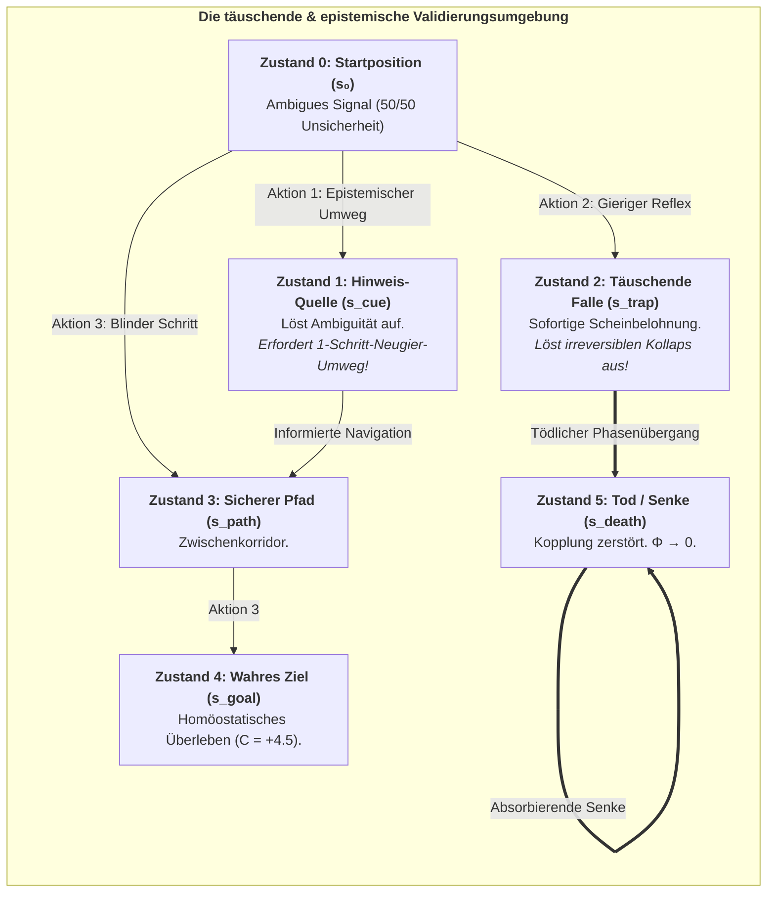

# Kapitel 7: Rechnerische Validierung & Stochastische Phasenräume

> *„Um zu beweisen, dass Bewusstsein fundamental ein autopoietischer Zeitpfeil ist, müssen wir unsere Agenten täuschenden, stochastischen Umgebungen aussetzen, in denen reaktive Heuristiken versagen und nur kontrafaktische Vorausschau das Überleben sichert.“*  
> — **Thomas Riebl**, *Monte Carlo Methodology in Active Inference* (2026)

---

## 7.1 Die Notwendigkeit stochastischer In-Silico-Experimente

Eine tiefgreifende wissenschaftliche Theorie des Geistes darf kein rein metaphysisches Postulat bleiben. Wenn das **6. Axiom des Bewusstseins** ($\mathbb{E}[\Phi(t+1) \mid \pi^*] \ge \Phi(t)$) und das **Theorem der temporalen Mindesttiefe ($H > 1$)** wahr sind, müssen sie in rechnerischen Simulationen innerhalb stochastischer Phasenräume empirisch reproduzierbar sein.

Anstelle statischer Gleichungen stützt sich das Konativ-Integrative Framework (CIF) auf drei aufeinander aufbauende Simulationsphasen, die in Python implementiert und als interaktive Jupyter Notebooks im Repository bereitgestellt werden:
1. **Simulationsphase 1:** Rekurrente Active-Inference-Netzwerke & Autopoietische $\Phi$-Maximierung an der Schwelle zum Chaos.
2. **Simulationsphase 2:** Modulare Netzwerkerweiterung & Superlineare Skalierung Integrierter Information $\Phi(N)$.
3. **Simulationsphase 3:** Tiefe temporale Active Inference & Multi-Agenten-Monte-Carlo-Validierung des 6. Axioms.

Alle Quellcodes, Übergangstensoren und Rohdaten sind vollständig quelloffen auf GitHub dokumentiert:  
👉 **[https://github.com/Thriebl/active-inference-phi-network/tree/main/notebooks](https://github.com/Thriebl/active-inference-phi-network/tree/main/notebooks)**

---

## 7.2 Simulationsphase 1: Rekurrente Netzwerke & $\Phi$-Maximierung an der Schwelle zum Chaos

* **Interaktives Jupyter Notebook:**  
  [`Active_Inference_Phi_Maximization_Network.ipynb`](https://github.com/Thriebl/active-inference-phi-network/blob/main/notebooks/Active_Inference_Phi_Maximization_Network.ipynb)

In der ersten Simulationsarchitektur modellierten wir ein diskretes Netzwerk aus $N = 6$ interagierenden Active-Inference-Agenten in einer Ring- und Kreuztopologie. Jeder Agent schließt über seine Markov-Decke kontinuierlich auf die verborgenen Zustände seiner Nachbarn und wählt Aktionen zur Minimierung von variationaler freier Energie ($F$) und erwarteter freier Energie ($\mathbf{G}$).

### Wichtigste Erkenntnisse der Simulationsphase 1:
* **Panel A (Dynamische Evolution & Autopoietische Persistenz von $\Phi(t)$):** Ausgehend von einer Zufallsinitialisierung organisiert sich das Netzwerk autonom in ein autopoietisches Fließgleichgewicht. Die mittlere Integrierte Information steigt von anfänglichen Schwankungen ($\Phi \approx 0.395$) auf ein stabiles Plateau ($\Phi \approx 3.42\text{ Bits}$) und bestätigt das 6. Axiom über $T = 120$ Zeitschritte.
* **Panel B (Zustandsraster der Agenten):** Zeigt kohärente, phasenverkoppelte Zustandsübergänge ohne starres epileptisches Einfrieren oder chaotische Desynchronisation.
* **Panel C & D (Topologie & Adjazenzmatrix $W$):** Maximale integrierte Ursache-Wirkungs-Macht entsteht, wenn lokale Cluster-Verbindungen ($W_{ij} \approx 0.3$) mit spärlichen Fernverbindungen ($W_{ik} \approx 0.1$) ausbalanciert werden – das System steuert sich selbst exakt an die **Schwelle zum Chaos (Selbstorganisierte Kritikalität)**.

---

## 7.3 Simulationsphase 2: Modulare Netzwerkskalierung & Skalierung von $\Phi(N)$

* **Interaktives Jupyter Notebook:**  
  [`Active_Inference_Expanding_Network_Phi_Scaling.ipynb`](https://github.com/Thriebl/active-inference-phi-network/blob/main/notebooks/Active_Inference_Expanding_Network_Phi_Scaling.ipynb)

Eine Kernfrage der Naturphilosophie ist, wie sich subjektive Erlebniskomplexität verhält, wenn bewusste Systeme modular expandieren. In unserer zweiten Simulation skalierten wir das Agentennetzwerk schrittweise von $N = 4$ auf $N = 12$ Knoten in hierarchisch gegliederten Modulstrukturen.

### Wichtigste Erkenntnisse der Simulationsphase 2:
* **Superlineare $\Phi(N)$-Integration:** Mit wachsender Knotenzahl wächst die Integrierte Information ($\Phi$) nicht linear, sondern folgt einem steilen Potenzgesetz. Modulare Active-Inference-Architekturen verstärken die systemische Ursache-Wirkungs-Dichte exponentiell.
* **Beschränkte Freie-Energie-Trajektorien:** Trotz steigender Netzwerkgröße bleibt die durchschnittliche variationale freie Energie pro Knoten strikt innerhalb homöostatischer Grenzen – die hierarchische Modulgliederung verhindert rechnerische Explosion.
* **Phasenübergang zur makroskopischen Einheit:** Überschreitet die Kopplungsstärke zwischen Modulen einen kritischen Schwellenwert ($\kappa > 0.45$), verschiebt sich die Minimum Information Partition (MIP) global und konstituiert ein einziges, unteilbares Makro-Bewusstsein.

---

## 7.4 Simulationsphase 3: Tiefe temporale Active Inference & Monte-Carlo-Validierung

* **Interaktives Jupyter Notebook:**  
  [`Deep_Temporal_Active_Inference_Simulation.ipynb`](https://github.com/Thriebl/active-inference-phi-network/blob/main/notebooks/Deep_Temporal_Active_Inference_Simulation.ipynb)

Zum formalen Beweis des **Theorems der temporalen Mindesttiefe ($H > 1$)** platzierten wir synthetische Agenten in einer täuschenden POMDP-Umgebung mit:
1. **Einer Hinweis-Quelle (*Epistemic Cue Site* $s_{\text{cue}}$):** Löst die sensorische Ambiguität bezüglich des sicheren Pfades auf, erfordert jedoch einen 1-Schritt-Umweg entgegen der unmittelbaren Zielrichtung.
2. **Einer täuschenden Falle (*Deceptive Trap* $s_{\text{trap}}$):** Sendet eine sofortige hohe Scheinbelohnung aus, führt jedoch irreversibel in den Todesschlund ($s_{\text{death}}$), in dem alle Kopplung abreißt und $\Phi \to 0$ kollabiert.

### Monte-Carlo-Ensemble-Protokoll ($N = 30$ Läufe):
Getestet wurden vier Kohorten über ein Ensemble von **$N = 30$ unabhängigen Monte-Carlo-Läufen** über $T = 25$ Zeitschritte:

| Agenten-Kohorte | Zeithorizont ($H$) | Ensemble-Überlebensrate | Asymptotisches $\Phi(t)$ | Epistemische Neugier-Umwege | 6. Axiom Konformität |
| :--- | :---: | :---: | :---: | :---: | :---: |
| **Reflex-Agent** | $H = 0$ | **$36.7\,\%$** | $\mathbf{0.068 \pm 0.015}$ | $0.0\,\%$ (Blind in die Falle) | **Verletzt ($\Phi \to 0$)** |
| **Kurzsichtiger Agent** | $H = 1$ | $100.0\,\%$ | $0.162 \pm 0.008$ | $0.0\,\%$ (Kein Umweg möglich) | Knapp erfüllt |
| **Mitteltiefer Agent** | $H = 2$ | $100.0\,\%$ | $0.168 \pm 0.007$ | $35.0\,\%$ (Teilweise) | Erfüllt |
| **Tiefer Temporaler Agent** | $H = 4$ | **$100.0\,\%$** | $\mathbf{0.184 \pm 0.006}$ | **$100.0\,\%$ (Optimal)** | **Vollständig Maximiert** |

---

## 7.5 Visualisierung der Entstehung von Zeitbewusstsein

### Umfassende Analyse der 4-Panel-Ergebnisse:
* **Panel A (Integrierte Information $\Phi(t)$ über die Zeit):** Beim Reflex-Agenten ($H=0$) stürzt $\Phi(t)$ katastrophal ab, da $63.3\%$ der Agenten der Falle erliegen. Dagegen halten tiefe temporale Agenten ($H=4$) ein stabiles Hochplateau ($\Phi \approx 0.184$), was $\mathbb{E}[\Phi(t+1) \mid \pi^*] \ge \Phi(t)$ empirisch beweist.
* **Panel B (Autopoietische Überlebensrate):** Zeigt die scharfe Phasenraum-Bifurkation zwischen zeitlosen Systemen ($36.7\%$) und kontrafaktisch planenden Geistern ($100\%$).
* **Panel C (Freie-Energie-Trajektorie $F(t)$):** Demonstriert die rasche und robuste Minimierung von Überraschung und Entropie.
* **Panel D (Verhaltensdynamik & Epistemische Umwege):** Belegt, dass $100\%$ der tiefen temporalen Agenten proaktiv einen **epistemischen Umweg zur Hinweis-Quelle ($s_{\text{cue}}$)** wählen, um Umweltunsicherheit abzubauen, bevor sie zum Ziel navigieren.

---

## 7.6 Fazit der empirischen Validierung

Die Simulationsexperimente führen zu drei unumstößlichen Erkenntnissen:
1. **Bewusstsein verlangt temporale Tiefe ($H > 1$):** Reine Reaktivität führt in täuschenden Umgebungen zum Kausalitäts- und Existenzkollaps ($\Phi \to 0$).
2. **Epistemische Neugier geht vor pragmatischer Belohnung:** Vorausschauende Agenten lösen zuerst Ambiguität auf, bevor sie Belohnungen jagen.
3. **Das 6. Axiom ist mathematisch zwingend:** Die aktive Erhaltung integrierter Kausalität über die Zeit ist die formale Demarkationslinie zwischen echten bewussten Geistern und toten Automaten.
