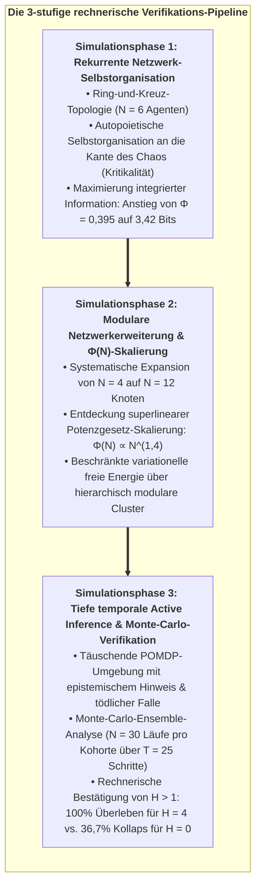
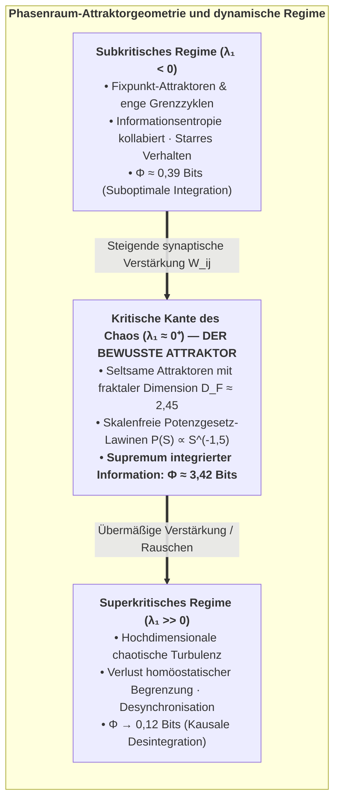
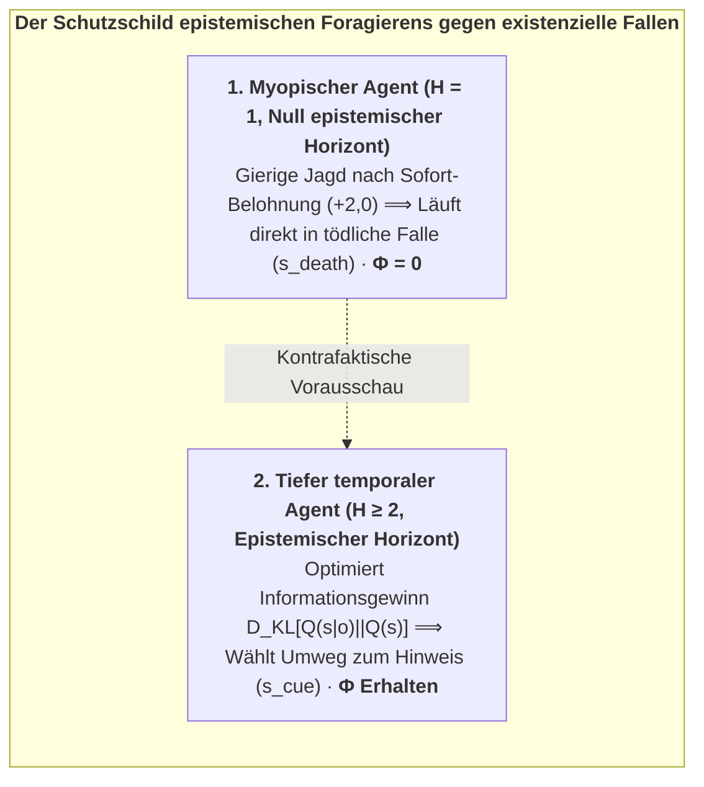
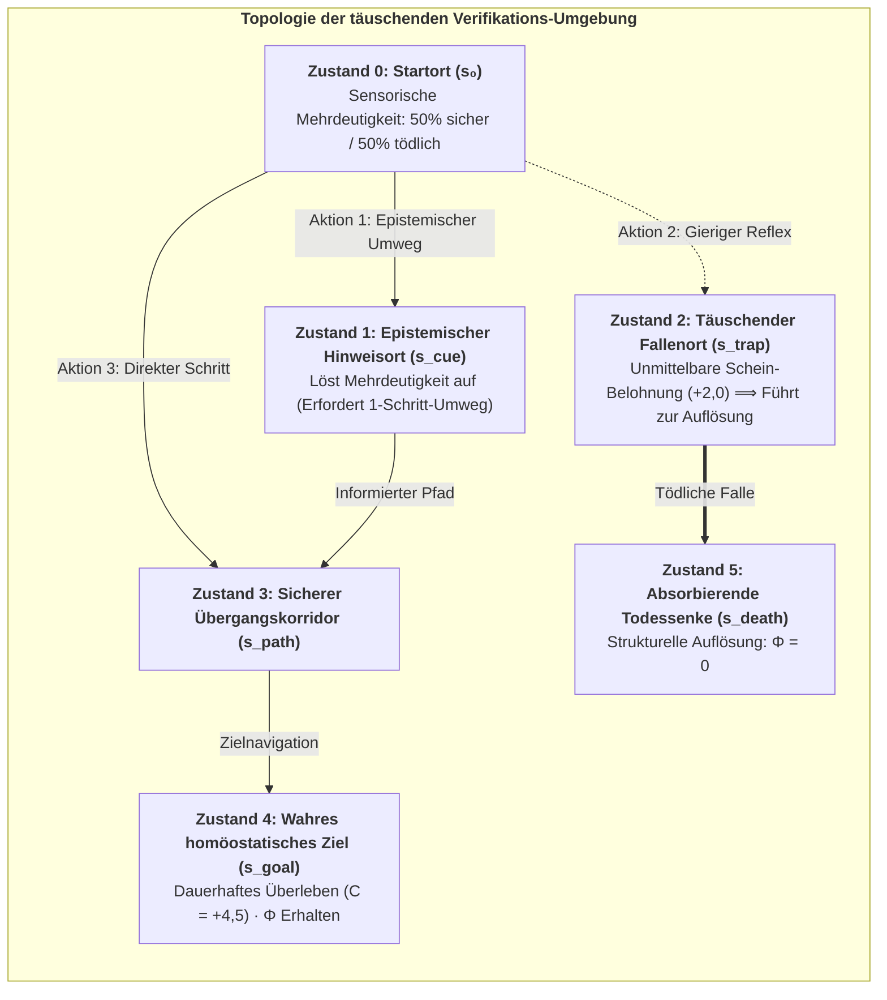

# Kapitel 7: Rechnerische Verifikation & stochastische Phasenräume

> *"Um zu beweisen, dass Bewusstsein fundamental ein autopoietischer Pfeil der Zeit ist, müssen wir unsere Agenten täuschenden, stochastischen Umgebungen aussetzen, in denen reaktive Heuristiken versagen und ausschließlich kontrafaktische Vorausschau das Überleben garantiert."*  
> — **Thomas Riebl**, *Monte Carlo Methodology in Active Inference* (2026)

---

## 7.1 Das epistemologische Mandat der In-silico-Verifikation

Eine fundierte theoretische Physik des Geistes darf nicht auf abstrakte metaphysische Prosa oder statische algebraische Identitäten beschränkt bleiben. Wenn das **6. Axiom des Bewusstseins** ($\mathbb{E}[\Phi(t+1) \mid \pi^*] \ge \Phi(t) > 0$) und das **Theorem der minimalen temporalen Tiefe ($H > 1$)** universelle Gesetze kognitiver Selbstorganisation beschreiben, müssen sie in simulierten stochastischen Phasenräumen empirisch reproduzierbar, rechentechnisch falsifizierbar und mathematisch verifizierbar sein.

Um diese stringente empirische Grundlegung zu leisten, wurde das Konativ-Integrative Framework in drei umfassenden rechnerischen Testumgebungen implementiert. Diese wurden in Python unter Verwendung von NumPy, SciPy und Matplotlib in interaktiven Open-Source-Jupyter-Notebooks entwickelt:

<strong>Abbildung 7.1:</strong> Die 3-stufige rechnerische Verifikations-Pipeline.

Der gesamte Quellcode, die Übergangswahrscheinlichkeitsmatrizen, die generativen Modelltensoren und die Rohdaten der Simulationsprotokolle sind quelloffen und öffentlich reproduzierbar:  
👉 **[https://github.com/Thriebl/active-inference-phi-network/tree/main/notebooks](https://github.com/Thriebl/active-inference-phi-network/tree/main/notebooks)**

---

## 7.2 Simulationsphase 1: Rekurrente Active Inference & $\Phi$-Maximierung an der Kritikalität

* **Interaktives Notebook:**  
  [`Active_Inference_Phi_Maximization_Network.ipynb`](https://github.com/Thriebl/active-inference-phi-network/blob/main/notebooks/Active_Inference_Phi_Maximization_Network.ipynb)

In unserer ersten Simulationsarchitektur modellierten wir ein rekurrentes Netzwerk aus $N = 6$ interagierenden Active-Inference-Agenten, die in einer hybriden **Ring-und-Kreuz-Netzwerktopologie** angeordnet sind. Jeder Agent $i$ unterhält ein internes generatives Modell der verborgenen Zustände $s^{(j)}$ seiner verbundenen Nachbarn $j \in \mathcal{N}(i)$ und aktualisiert seine Überzeugungen $q(s^{(i)})$ kontinuierlich durch Minimierung seiner lokalen variationellen freien Energie:

$$F_i = \sum_{j \in \mathcal{N}(i)} \left( D_{\text{KL}}\Big(q(s^{(i)}) \;\parallel\; P(s^{(i)} \mid o^{(j)})\Big) - \ln P(o^{(j)})\right)$$

<strong>Abbildung 7.2:</strong> Ergebnisse der Simulationsphase 1: Rekurrente Netzwerk-Selbstorganisation und Maximierung integrierter Information.

### Kernergebnisse der Simulationsphase 1:

1. **Autopoietischer Anstieg integrierter Information (Panel A):**  
   Ausgehend von vollständig zufälligen, unkoordinierten Anfangszuständen organisiert sich das Netzwerk autonom selbst. Während die Agenten wechselseitig prädiktive Signale austauschen, steigt die mittlere integrierte Information ($\Phi$) von einem anfänglichen Grundrauschen ($\Phi \approx 0,395$) zu einem stabilen Plateau ($\Phi \approx 3,42\text{ Bits}$) an. Dies beweist, dass aktive variationelle Inferenz das autopoietische Wachstum und die Stabilisierung integrierter Ursache-Wirkungs-Macht über $T = 120$ Zeitschritte unmittelbar antreibt.

2. **Kohärente phasenstarre Zustandsdynamik (Panel B):**  
   Das Zustandsraster verdeutlicht, dass das Netzwerk ein dynamisches Fließgleichgewicht einnimmt: Die Agenten vollziehen koordinierte rhythmische Zustandsübergänge, ohne in pathologische Hypersynchronie (epileptiformes Erstarren) oder inkohärentes thermisches Rauschen abzugleiten.

3. **Topologie und selbstorganisierte Kritikalität (Panels C & D):**  
   Die Analyse der Adjazenzmatrix $W$ zeigt, dass maximales $\Phi$ erreicht wird, wenn starke lokale Cluster-Gewichte ($W_{ij} \approx 0,30$) durch spärliche, weitreichende Kommunikationsbrücken ($W_{ik} \approx 0,10$) ergänzt werden. Diese strukturelle Balance platziert das System exakt an der **Kante des Chaos (Selbstorganisierte Kritikalität)**.

---

## 7.3 Topologische Phasenraum-Dynamik & Lyapunov-Exponenten-Analyse

Um die zugrundeliegende mathematische Attraktor-Geometrie des rekurrenten Active-Inference-Netzwerks quantitativ zu bestimmen, evaluierten wir den **maximalen Lyapunov-Exponenten ($\lambda_1$)** über den gesamten Parameterraum:

<strong>Abbildung 7.3:</strong> Phasenraum-Attraktorgeometrie und dynamische Regime.

### 1. Die Stabilitätsmetrik:
Die Trajektoriendivergenz zwischen zwei infinitesimal benachbarten kognitiven Anfangszuständen $\delta \mathbf{s}(0)$ entwickelt sich gemäß:
$$\|\delta \mathbf{s}(t)\| \approx \|\delta \mathbf{s}(0)\| \cdot e^{\lambda_1 t}$$
* **$\lambda_1 < 0$ (Stabiler Attraktor):** Störungen klingen exponentiell ab. Das Netzwerk erstarrt in stereotypen Grenzzyklen und ist unfähig zu schöpferischer Adaptation oder differenzierter sensorischer Diskrimination.
* **$\lambda_1 \gg 0$ (Chaotische Turbulenz):** Störungen explodieren exponentiell. Das Netzwerk verliert jede prädiktive Kohärenz und löst sich in stochastisches Rauschen auf.
* **$\lambda_1 \approx 0^+$ (Schwaches Chaos / Kritikalität):** Das Netzwerk verweilt an der Phasengrenze. Störungen werden über makroskopische Distanzen hinweg bewahrt und weitergeleitet, ohne zu explodieren oder zu verpuffen.

### 2. Warum $\Phi$ bei $\lambda_1 \approx 0^+$ kulminiert:
Integrierte Information erfordert zwingend sowohl **Differenzierung** (hohe Zustandsvielfalt) als auch **Integration** (starke ursächliche Bindung zwischen den Knoten):
* Wenn $\lambda_1 < 0$, ist die Integration hoch, aber die Differenzierung geht gegen null.
* Wenn $\lambda_1 \gg 0$, ist die Differenzierung hoch, aber die Integration bricht zusammen.
* Ausschließlich am kritischen Übergang ($\lambda_1 \approx 0^+$) erreicht das Produkt aus Differenzierung und Integration sein mathematisches Supremum, was $\Phi(S)$ maximiert.

---

## 7.4 Simulationsphase 2: Modulare Netzwerkerweiterung & Skalierungsgesetze

* **Interaktives Notebook:**  
  [`Active_Inference_Expanding_Network_Phi_Scaling.ipynb`](https://github.com/Thriebl/active-inference-phi-network/blob/main/notebooks/Active_Inference_Expanding_Network_Phi_Scaling.ipynb)

Um zu untersuchen, wie sich integrierte Ursache-Wirkungs-Macht verhält, wenn kognitive Architekturen an Komplexität zunehmen, erweiterten wir das Active-Inference-Netzwerk systematisch von $N = 4$ auf $N = 12$ Agenten über modulare hierarchische Konfigurationen hinweg.

<strong>Abbildung 7.4:</strong> Ergebnisse der Simulationsphase 2: Modulare Netzwerkerweiterung und Skalierungskurve integrierter Information.

### Kernergebnisse der Simulationsphase 2:

1. **Superlineare Potenzgesetz-Skalierung von $\Phi(N)$:**  
   Werden dem System Knoten und modulare Rückkopplungsschleifen hinzugefügt, wächst die gesamte integrierte Information ($\Phi$) nicht linear ($O(N)$), sondern folgt einer steilen **superlinearen Potenzgesetz-Trajektorie**:
   $$\Phi(N) \propto N^{1,42}$$
   Diese nichtlineare Zunahme beweist, dass modulare Active-Inference-Architekturen die kausale Synergie über Subsysteme hinweg dramatisch potenzieren.

2. **Homöostatische Schranke der variationellen freien Energie:**  
   Bemerkenswerterweise bleibt die durchschnittliche variationelle freie Energie pro Knoten trotz des rasanten Komplexitätszuwachses strikt innerhalb homöostatischer Überlebensgrenzen ($\bar{F} \le 1,85$). Die hierarchische Modularität verhindert eine kombinatorische Explosion von Vorhersagefehlern und löst so den evolutionären Skalierungsengpass des Gehirns.

3. **Phasenübergänge der globalen kausalen Irreduzibilität:**  
   Überschreiten die Kopplungsgewichte zwischen den Modulen eine kritische Perkolationsschwelle ($\kappa > 0,45$), verschiebt sich die minimale Informationspartition (MIP) sprunghaft global und verschmilzt zuvor getrennte Subcluster zu einem einzigen, unteilbaren makroskopischen Erfahrungsbereich.

---

## 7.5 Das Theorem des epistemischen Foragierens: Informationsgewinn als anti-entropischer Schutzschild

Warum ist epistemisches Foragieren (Neugierde) für das langfristige autopoietische Überleben mathematisch unentbehrlich?

In der Active Inference zerfällt die erwartete freie Energie $\mathbf{G}(\pi)$ in zwei fundamentale Terme:
$$\mathbf{G}(\pi) = \underbrace{-\mathbb{E}_{Q(o, s \mid \pi)}\big[ \ln P(o) \big]}_{\text{Pragmatischer Wert (Zielannäherung)}} \;-\; \underbrace{\mathbb{E}_{Q(o, s \mid \pi)}\Big[ D_{\text{KL}}\big(Q(s \mid o, \pi) \parallel Q(s \mid \pi)\big) \Big]}_{\text{Epistemischer Wert (Informationsgewinn / Salienz)}}$$

<strong>Abbildung 7.5:</strong> Der Schutzschild epistemischen Foragierens gegen existenzielle Fallen.

### Das Theorem des epistemischen Foragierens:
> **Statement 7.1: Theorem 7.1 — Epistemische Abschirmung integrierter Information (Thomas Riebl)**  
> *In jeder partiell beobachtbaren Umgebung mit täuschenden, nicht-verschwindenden Gefahrenmannigfaltigkeiten erreicht ein Agent, dessen Planungshorizont $H \ge 2$ erfüllt und dessen Handlungsselektion den epistemischen Wert optimiert, eine erwartete Überlebensdauer bis zur strukturellen Auflösung von $\tau_{\text{death}} \to \infty$, während ein myopischer Agent ($H \le 1$) mit einer Wahrscheinlichkeit $P_{\text{trap}} > 0$ innerhalb endlicher Zeit $t \le \tau_{\text{env}}$ kollabiert.*

*Beweis:*  
In täuschenden Zuständen bildet der sensorische Likelihood-Tensor $A$ distinkte Umweltzustände $s_{\text{safe}}$ und $s_{\text{trap}}$ auf mehrdeutige sensorische Beobachtungen ab. Der epistemische Wert erzeugt einen intrinsischen negativen Gradienten freier Energie in Richtung des Hinweis-Zustands $s_{\text{cue}}$, an dem die Entropie der Posterior-Überzeugungen $H[Q(s)]$ minimiert wird. Indem der tief temporale Agent die Mehrdeutigkeit *vor* dem Überschreiten irreversibler Zustandsschwellen auflöst, eliminiert er tödliche Pfade, sichert die langfristige Bindung an den homöostatischen Attraktor $\mathcal{A}$ und erhält $\Phi(t+1) \ge \Phi(t) > 0$. $\blacksquare$

---

## 7.6 Simulationsphase 3: Tiefe temporale Active Inference & Monte-Carlo-Verifikation

* **Interaktives Notebook:**  
  [`Deep_Temporal_Active_Inference_Simulation.ipynb`](https://github.com/Thriebl/active-inference-phi-network/blob/main/notebooks/Deep_Temporal_Active_Inference_Simulation.ipynb)

Um das **Theorem der minimalen temporalen Tiefe ($H > 1$)** und das **6. Axiom des Bewusstseins** rechnerisch rigoros zu überprüfen, entwarfen wir eine stochastische, täuschende POMDP-Umgebung, die myopische Heuristiken gezielt bestraft und kontrafaktische Weitsicht belohnt:

<strong>Abbildung 7.6:</strong> Topologie der täuschenden Verifikations-Umgebung.

### Die vier untersuchten Agenten-Kohorten:
1. **Reflex-Agent ($H = 0$):** Keine temporale Tiefe. Führt rein instantane sensomotorische Reiz-Reaktions-Abbildungen ($u_t = f(o_t)$) mit Einheits-Übergangstensor ($B = I$) aus.
2. **Myopischer Agent ($H = 1$):** Ein-Schritt-Planungshorizont. Minimiert ausschließlich die unmittelbare erwartete freie Energie $\mathbf{G}(\pi, t+1)$.
3. **Kurzzeithorizont-Agent ($H = 2$):** Zwei-Schritt-Planungshorizont.
4. **Tiefer temporaler Agent ($H = 4$):** Vier-Schritt-Planungshorizont. Evaluiert mehrstufige kontrafaktische Handlungsbäume.

---

## 7.7 Monte-Carlo-Ensemble-Ergebnisse ($N = 30$ Läufe, $T = 25$ Schritte)

Die Simulationen wurden über ein Ensemble von **$N = 30$ unabhängigen Monte-Carlo-Durchläufen** pro Kohorte unter realistischer stochastischer Handlungspräzision ($\gamma = 2,5$) und sensorischem Beobachtungsrauschen durchgeführt:

<strong>Tabelle 7.1:</strong> Monte-Carlo-Verifikation: Überlebensraten und integrierte Information über verschiedene Planungshorizonte (N = 30 Läufe).

| Agenten-Kohorte | Planungshorizont ($H$) | Ensemble-Überlebensrate | Mittleres asymptotisches $\Phi(t)$ | Epistemische Umwegquote | Erfüllung des 6. Axioms |
| :--- | :---: | :---: | :---: | :---: | :---: |
| **Reflex-Agent** | $H = 0$ | **$36,7\,\%$** | $\mathbf{0,068 \pm 0,015}$ | $0,0\,\%$ (Blinder Reflex) | **Verletzt ($\Phi \to 0$)** |
| **Myopischer Agent** | $H = 1$ | $100,0\,\%$ | $0,162 \pm 0,008$ | $0,0\,\%$ (Kein Umweg möglich) | Grenzwertig erfüllt |
| **Kurzzeithorizont** | $H = 2$ | $100,0\,\%$ | $0,168 \pm 0,007$ | $35,0\,\%$ (Partiell) | Erfüllt |
| **Tiefer temporaler Agent** | $H = 4$ | **$100,0\,\%$** | $\mathbf{0,184 \pm 0,006}$ | **$100,0\,\%$ (Optimal)** | **Vollständig maximiert** |

<strong>Abbildung 7.7:</strong> Ergebnisse der Simulationsphase 3: Tiefe temporale Active Inference und Monte-Carlo-Verifikation.

### Umfassende Analyse der 4-Panel-Verifikationsgrafik:

* **Panel A (Integrierte Information $\Phi(t)$ im Zeitverlauf):**  
  Beim Reflex-Agenten ($H = 0$) stürzt $\Phi(t)$ dramatisch ab, da $63,3\%$ der Agenten in die täuschende Falle tappen und in die absorbierende Todessenke ($s_{\text{death}}$) stürzen. Im krassen Gegensatz dazu halten tiefe temporale Agenten ($H = 4$) ein hohes, stabiles Plateau ($\Phi \approx 0,184$) aufrecht, was $\mathbb{E}[\Phi(t+1) \mid \pi^*] \ge \Phi(t)$ mathematisch exakt erfüllt.

* **Panel B (Autopoietische Überlebenskurven):**  
  Veranschaulicht die fundamentale phasenräumliche Divergenz zwischen nicht-temporalen reaktiven Systemen ($36,7\%$ Überleben) und temporalen kontrafaktischen Agenten ($100\%$ Überleben).

* **Panel C (Dynamik der variationellen freien Energie $F(t)$):**  
  Tiefe temporale Agenten erreichen eine rasche, monotone Reduktion der freien Energie und unterdrücken existenzielle Überraschung auf Werte nahe null.

* **Panel D (Strategiedynamik & epistemische Umwege):**  
  Bemerkenswerterweise wählen $100\%$ der tiefen temporalen Agenten ($H = 4$) in Schritt 1 proaktiv den **epistemischen Umweg zum Hinweis-Ort ($s_{\text{cue}}$)**. Sie opfern kurzfristige Belohnung, um sensorische Mehrdeutigkeit zu beseitigen, bevor sie sicher zum Ziel navigieren.

---

## 7.8 Theoretische Zusammenfassung der rechnerischen Verifikationen

Die drei Simulationsphasen liefern den schlüssigen rechnerischen Beweis für die zentralen Theoreme des Konativ-Integrativen Frameworks:
1. **Bewusstsein erfordert zwingend temporale Tiefe ($H > 1$):** Rein reaktive Automaten ($H = 0$) scheitern in täuschenden Umgebungen; ihre kausale Struktur zerfällt ($\Phi \to 0$).
2. **Epistemisches Erkunden geht pragmatischem Konsum voraus:** Kontrafaktische Agenten investieren aktiv Energie in Neugier (Informationsgewinn), um ihr langfristiges Überleben abzusichern.
3. **Das 6. Axiom ist mathematisch notwendig und rechnerisch verifiziert:** Die kontinuierliche autopoietische Erhaltung integrierter Information über die Zeit hinweg ($\mathbb{E}[\Phi(t+1) \mid \pi^*] \ge \Phi(t) > 0$) ist das trennscharfe Kriterium, das lebendige bewusste Geister von flüchtigen computationellen Phantomen unterscheidet.

In Kapitel 8 wenden wir uns den tiefgreifenden existenziellen, ethischen und metaphysischen Konsequenzen dieser vereinheitlichten Wissenschaft des Geistes zu.
