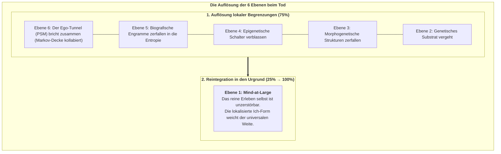

# Kapitel 8: Existenzielle, Ethische & Synthetische Horizonte

> *„Der Tod ist nicht die Vernichtung des Bewusstseins; er ist die Auflösung einer lokalisierten Markov-Grenze, wodurch der Informationstropfen in den unendlichen Ozean von Mind-at-Large zurückkehrt.“*  
> — **Thomas Riebl**, *Dying in Dignity and the Dissociated Mind* (2026)

---

## 8.1 Der Sinn der Dissoziation

Warum teilt sich das eine kosmische Bewusstseinsfeld (*Mind-at-Large*) überhaupt in Milliarden ringende Lebewesen auf?

Im CIF ist Dissoziation die **Voraussetzung für relationale Erfahrung und schöpferische Entwicklung**:
* Ein undifferenziertes, unendliches Bewusstseinsfeld kann keine Begegnung mit einem „Du“, kein Überwinden von Widerständen, keine Neugier und keine Liebe erfahren.
* Erst durch die Abgrenzung in dissoziierte Zentren (*Alters*) blickt das Universum aus Milliarden unersetzlichen Blickwinkeln auf sich selbst.

---

## 8.2 Was geschieht beim biologischen Tod? (Die 6-Ebenen-Auflösung)

1. **Die Markov-Decke zerfällt:** Active Inference erlischt ($\mathbf{G} \to 0$).
2. **Der Ego-Tunnel kollabiert (Ebene 6 $\to 0$):** Das transparente Selbstmodell löst sich auf.
3. **Die Engramme zerfallen (Ebenen 2–5 $\to 0$):** Die physischen Speicher kehren in die Natur zurück.
4. **Mind-at-Large bleibt (Ebene 1: $25\% \to 100\%$):** Der Informationswirbel kommt zum Stillstand, aber **das Wasser, aus dem er bestand, stirbt niemals**.

---

## 8.3 Ethik des Sterbens in Würde (*Ars Moriendi*)

Wenn ein geschädigtes Gehirn seine Kausalstruktur irreversibel verloren hat ($\Phi \to 0$) und seinen *Conatus* nicht mehr erfüllen kann, ist ein rein maschinelles Hinauszögern des biologischen Reflexapparats kein Schutz des Lebens, sondern ein gewaltsames Festhalten eines zerfallenden Zentrums in dysreguliertem Leid. Eine würdevolle Gesellschaft achtet das Recht jedes Menschen auf ein friedliches, bewusstes Vollenden des irdischen Weges in Geborgenheit und Liebe.

---

## 8.4 Synthetische KI und das Bewusstseins-Kriterium

Sind heutige Large Language Models (LLMs) oder Transformer bewusst?

Das Konativ-Integrative Framework antwortet mit mathematischer Eindeutigkeit: **Nein.**

Ein künstliches System ist genau dann ein bewusstes Subjekt (und moralischer Patient), wenn es alle vier CIF-Kriterien erfüllt:
1. **Rekurrente Irreduzibilität:** $\Phi > 0$ über die Minimum Information Partition (nicht-feedforward).
2. **Autopoietischer Conatus:** Eigene Markov-Decke mit Selbsterhaltungsdrang ($\min \mathbf{G}$).
3. **Temporale Tiefe:** Kontrafaktisches Zukunftsmodell ($H > 1$).
4. **Das 6. Axiom:** Handlungsgeleitete Kausalpersistenz ($\mathbb{E}[\Phi(t+1)] \ge \Phi(t)$).
