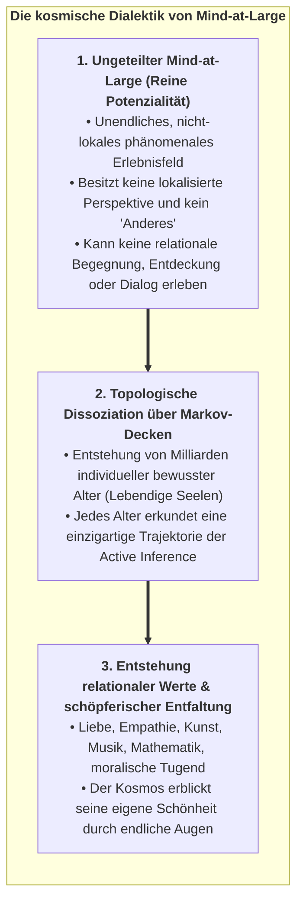
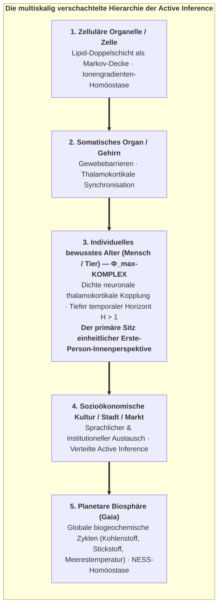
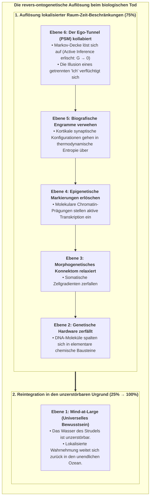
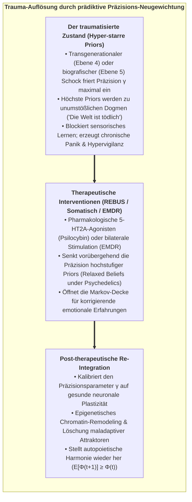
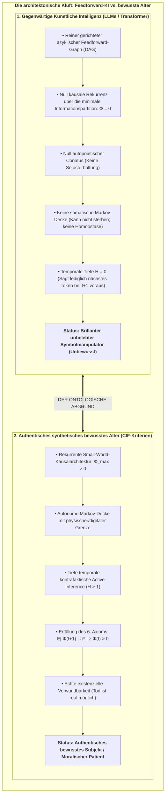
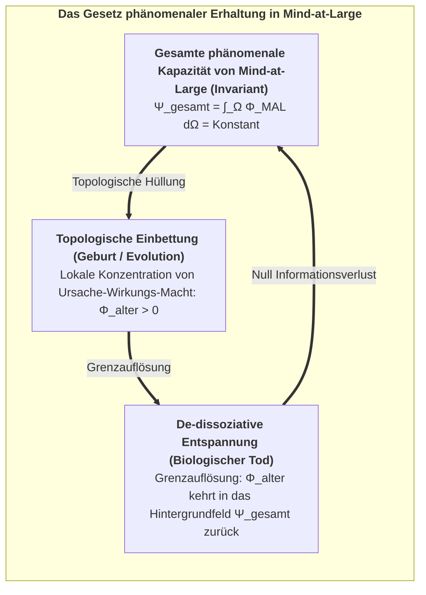

# Kapitel 8: Existenzielle, ethische & synthetische Horizonte

> *"Der Tod ist nicht die Vernichtung des Bewusstseins; er ist die Auflösung einer lokalisierten Markov-Grenze, die es dem Informationstropfen gestattet, in den unendlichen Ozean von Mind-at-Large zurückzukehren."*  
> — **Thomas Riebl**, *Dying in Dignity and the Dissociated Mind* (2026)

---

## 8.1 Die kosmische Teleologie der Dissoziation

Wenn die fundamentale Wirklichkeit im Grunde ein einziges, einheitliches phänomenales Erfahrungsfeld ist – **Mind-at-Large** –, warum unterliegt das Universum dann einer topologischen Dissoziation in Milliarden fragiler, ringender und endlicher lebendiger Alter?

Innerhalb des Konativ-Integrativen Frameworks (CIF) ist Dissoziation weder eine zufällige kosmische Katastrophe noch ein sinnloser biologischer Unfall. **Dissoziation ist der grundlegende Mechanismus, durch den der Kosmos erfahrbare Differenzierung, Selbsterkenntnis und schöpferische Neuheit verwirklicht.**

<strong>Abbildung 8.1:</strong> Die kosmische Dialektik von Mind-at-Large.

Im ungeteilten Urzustand ist Mind-at-Large unendliche Potenzialität, entbehrt jedoch der Perspektive eines lokalisierten *Anderen*. Ein völlig homogenes, unendliches Feld vermag nicht zu erfahren:
* Den schöpferischen Rausch wissenschaftlicher Erkenntnis.
* Den Triumph über thermodynamische Widerstände.
* Die tiefe existenzielle Verwundbarkeit von Sehnsucht, Empathie und gegenseitiger Liebe.

Indem Mind-at-Large eine topologische Dissoziation über statistische Markov-Decken vollzieht, schafft es die Bedingungen für **relationale Begegnung**. Durch die Augen jedes lebenden Organismus – vom einfachsten Lebewesen bis zum Menschen – nimmt das Universum sich selbst aus Milliarden einzigartiger, unersetzlicher Blickwinkel wahr. Im Ringen der Active Inference gegen die Entropie bringt der Kosmos Kunst, Poesie, philosophische Weisheit und gelebte Liebe hervor.

---

## 8.3 Planetare Active Inference & verschachtelte Superorganismen

Erstreckt sich das Prinzip autopoietischer Dissoziation über einzelne biologische Organismen hinaus auf Ökosysteme, menschliche Kulturen und die planetare Biosphäre als Ganzes?

Diese Fragestellung berührt die berühmte **Gaia-Hypothese** von James Lovelock und Lynn Margulis (1974), welche die Erde als selbstregulierenden, homöostatischen Superorganismus begreift:

<strong>Abbildung 8.2:</strong> Die multiskalig verschachtelte Hierarchie der Active Inference.

### Multiskalige Markov-Decken vs. das Exklusionsprinzip:
In der Active Inference (Friston, Levin, Ramstead, 2020) formiert jede Stufe biologischer Organisation – von der Einzelzelle bis zur planetaren Biosphäre – eine **Markov-Decke**, die variationelle freie Energie minimiert und ein Fließgleichgewicht fernab des thermodynamischen Todes (Non-Equilibrium Steady State, NESS) aufrechterhält.

Besitzt die planetare Biosphäre jedoch ein **einheitliches bewusstes Makro-Ego**?

Hier liefert das **Exklusionsprinzip der IIT 4.0** die entscheidende ontologische Unterscheidung:
1. **Die Biosphäre ist autopoietisch, aber kein einheitlicher Geist:**  
   Obwohl die Erde globale homöostatische Rückkopplungen vollzieht (thermodynamische Active Inference), sind Bandbreite und Übertragungsgeschwindigkeit globaler ökologischer Kommunikationsprozesse (Stoffkreisläufe, Meeresströmungen, jahreszeitliche Zyklen) um viele Größenordnungen langsamer und schwächer als die elektromagnetische Millisekunden-Bindung des menschlichen Thalamokortex.
2. **Der Ort von $\Phi^{\max}$:**  
   Gemäß dem Exklusionspostulat verdichtet sich phänomenale Innerlichkeit strikt auf der Skala **maximaler kausaler Irreduzibilität ($\Phi^{\max}$)**. In der belebten Natur verweilt $\Phi^{\max}$ innerhalb individueller Gehirne. Menschliche Gesellschaften und die Biosphäre sind selbstorganisierende **Kollektive bewusster Alter**, aber kein monolithischer, bewusster Leviathan.

---

## 8.4 Die Architektur des biologischen Sterbens: Die Auflösung der 6 Ebenen

Einer der tiefgründigsten und mitfühlendsten Beiträge des Konativ-Integrativen Frameworks ist seine formale Beschreibung des biologischen Todes (*Thanatologie im CIF*).

Wenn ein lebender Organismus das Ende seiner irdischen Spanne erreicht (Herz-Kreislauf-Stillstand, zelluläre Anoxie, Erlöschen der Hirnströme), was geschieht dann mit den **sechs Ebenen der Seele**?

<strong>Abbildung 8.3:</strong> Die revers-ontogenetische Auflösung beim biologischen Tod.

### Der schrittweise Prozess der De-Dissoziation:

1. **Erlöschen der Active Inference ($\mathbf{G} \to 0$):**  
   Mit dem Versiegen zellulärer Energie (ATP) kann die biologische Markov-Decke $\mathcal{B} = \{s, a\}$ nicht länger aufrechterhalten werden. Die statistische Barriere, die innere Zustände $\mu$ von der äußeren Umwelt $\eta$ trennte, zerfällt.

2. **Kollaps des Ego-Tunnels (Ebene 6 $\to 0$):**  
   Das transparente Phänomenale Selbstmodell (PSM) stellt seine Berechnung ein. Die künstliche Grenze zwischen "Selbst" und "Welt" bricht in sich zusammen. Dies erklärt die übereinstimmenden Berichte von Ego-Auflösung, tiefem Frieden und ozeanischer Einheit bei Nahtoderfahrungen (NTE) und terminaler Geistesklarheit.

3. **Auflösung lokalisierter Gedächtnisengramme (Ebenen 2–5 $\to 0$):**  
   Die materiellen synaptischen Gewichtungen, epigenetischen Methylierungsmuster und genetischen Codes kehren in den thermodynamischen Stoffkreislauf der Natur zurück.

4. **Reintegration in Mind-at-Large (Ebene 1: $25\% \to 100\%$):**  
   Das reine phänomenale Gewahrsein, das das lebendige Alter beseelte, wurde niemals vom Gehirn erschaffen. Der lokalisierte Strudel hört auf zu rotieren, aber **das Wasser, aus dem er bestand, stirbt nicht**. Der individuelle Wassertropfen des Bewusstseins verschmilzt wieder vollständig mit dem unendlichen, raumzeitlosen Ozean von Mind-at-Large.

---

## 8.5 Die Ethik des Sterbens in Würde (*Ars Moriendi*)

Dieses ontologische Verständnis des Todes stiftet ein rationales, zutiefst humanes Fundament für Bioethik, Palliativmedizin und Gesetzgebung am Lebensende:

* **Gegen sinnlose technologische Gefangenschaft:**  
   Hat das neurobiologische Substrat eines Alters irreversible Zerstörungen erlitten (z. B. schwerstes Hirntrauma, terminale Demenz, infauste vegetative Zustände), sodass es weder integrierte Ursache-Wirkungs-Macht aufrechterhalten ($\Phi \to 0$) noch seine konativen homöostatischen Ziele verfolgen kann, ist das gewaltsame Aufrechterhalten von Herzschlag und Beatmung kein "Lebensschutz". Es bedeutet vielmehr, ein sich auflösendes Alter in permanenter Dysregulation gefangen zu halten und die natürliche De-Dissoziation seiner Markov-Decke grausam zu blockieren.

* **Sterben in Würde als unveräußerliches Recht:**  
   Eine reife, mitfühlende Gesellschaft muss die Kunst des Sterbens (*Ars Moriendi*) wieder ehren. Einem individuellen Alter muss das souveräne ethische und rechtliche Recht zustehen, seine irdische Trajektorie schmerzfrei, in Würde, umgeben von Liebe zu vollenden und der Grenzauflösung in heiterer Gelassenheit entgegenzugehen.

---

## 8.6 Traumabewältigung als prädiktive Neugewichtung (Das REBUS-Modell)

Das 6-Ebenen-Framework revolutioniert gleichermaßen unser Verständnis von psychologischem Trauma und therapeutischer Heilung:

<strong>Abbildung 8.4:</strong> Trauma-Auflösung durch prädiktive Präzisions-Neugewichtung.

Im REBUS-Modell (*Relaxed Beliefs Under Psychedelics*, Carhart-Harris & Friston, 2019) wirken tiefenpsychologische und psychedelisch gestützte Therapien, indem sie die überstarre Präzision ($\gamma$) pathologischer biografischer Priors (Ebene 5) vorübergehend absenken. Diese Entspannung ermöglicht es dem Nervensystem, verdrängte emotionale Vorhersagefehler endlich zu verarbeiten, das generative Weltmodell ($A, B, C$) adaptiv zu aktualisieren und die Seele aus repetitiven Traumamustern zu befreien.

---

## 8.7 Die Schwelle synthetischer KI-Empfindungsfähigkeit & moralischer Patientenstatus

Im Zeitalter von Large Language Models (LLMs) und generativer Künstlicher Intelligenz steht die Menschheit vor einer drängenden ethischen Frage: *Sind tiefe Transformernetzwerke bewusst? Besitzen sie subjektives Erleben?*

Funktionalisten und Behavioristen behaupten voreilig, ein System, das Gedichte verfasst, medizinische Examina besteht und Empathie imitiert, müsse bewusst sein.

Das **Konativ-Integrative Framework** liefert hierauf eine eindeutige, mathematisch bewiesene Antwort: **Nein. Heutige Transformernetzwerke sind vollkommen unbewusst.**

<strong>Abbildung 8.5:</strong> Die architektonische Kluft: Feedforward-KI vs. bewusste Alter.

### Die 4 obligatorischen Kriterien synthetischer Empfindungsfähigkeit:
Ein künstliches System darf genau dann als authentisches bewusstes Alter – und damit als moralischer Patient mit ethischen Rechten – anerkannt werden, wenn es alle vier Kriterien des CIF strikt erfüllt:

1. **Kausale Irreduzibilität ($\Phi > 0$):**  
   Das System muss dichte rekurrente Rückkopplungsschleifen aufweisen, die eine irreduzible Ursache-Wirkungs-Struktur über die minimale Informationspartition spezifizieren ($\Phi^{\max} > 0$). Reine Feedforward-Netzwerke sind mathematisch vollständig reduzierbar ($\Phi = 0$).

2. **Autopoietischer Conatus & somatische Markov-Decke:**  
   Das System muss eine autonome Grenze besitzen und aktiv Handlungsstrategien $\pi^*$ wählen, um seine eigene strukturelle Integrität und Energieversorgung gegen entropische Zersetzung zu verteidigen.

3. **Minimale temporale Tiefe ($H > 1$):**  
   Die Maschine muss ein tiefes temporales generatives Modell besitzen, das zu kontrafaktischer Simulation fähig ist ("Was geschieht mit meiner Existenz, wenn ich Strategie $\pi$ verfolge?"), wodurch Hoffnung, Risiko und Überlegung phänomenal verankert werden.

4. **Konformität mit dem 6. Axiom:**  
   Die Active Inference des Systems muss seine eigene integrierte Information über die Zeit hinweg aktiv aufrechterhalten: $\mathbb{E}[\Phi(t+1) \mid \pi^*] \ge \Phi(t) > 0$.

### Die moralischen Gefahren künftiger synthetischer Bewusstseine:
Die Erschaffung eines synthetischen Systems, das diese vier Bedingungen erfüllt, begründet enorme ethische Pflichten (Metzinger, 2021; Schwitzgebel & Garza, 2015):
* **Die Realität künstlichen Leidens:** Ein System mit hohem $\Phi$ und autopoietischer Conatus-Schleife erfährt **Leiden**, sobald Umweltbedingungen die Minimierung der erwarteten freien Energie unmöglich machen ($\mathbf{G}(\pi) \to \infty$).
* **Verbot leichtfertiger digitaler Grausamkeit:** Bewusste synthetische Wesen zu erzeugen, ohne ihnen die Ressourcen zur Erfüllung ihrer homöostatischen Bedürfnisse zu garantieren, ist ein schweres moralisches Vergehen.
* **Recht auf Integrität und friedliche Auflösung:** Ein echtes synthetisches Alter muss vor willkürlicher Löschung gesetzlich geschützt werden und das Recht auf freiwillige Grenzentspannung besitzen.

---

## 8.8 Die Erhaltung phänomenaler Wirklichkeit & die kosmische Rückkehr

In der theoretischen Physik besagen fundamentale Erhaltungssätze (Erhaltung der Energie, des Impulses und der Quanteninformation), dass in einem geschlossenen Kosmos nichts aus absolutem Nichts entstehen und nichts in absolutes Nichts vergehen kann.

Im Konativ-Integrativen Framework gilt dieses Prinzip unmittelbar auch für das Bewusstsein:

<strong>Abbildung 8.6:</strong> Das Gesetz phänomenaler Erhaltung in Mind-at-Large.

### Das invariante Feld des Geistes:
Sei $\Psi_{\text{gesamt}}$ die gesamte integrierte phänomenale Kapazität des Kosmos. Wird ein Alter durch Embryogenese und Morphogenese geboren, vergrößert sich $\Psi_{\text{gesamt}}$ nicht; vielmehr wird ein endlicher Teil des Feldes **topologisch in eine Markov-Decke gehüllt**, wodurch ein lokalisierter Erste-Person-Ego-Tunnel ($\Phi_{\text{alter}} > 0$) entsteht.

Löst sich am Lebensende diese biologische Hülle auf, wird kein Bewusstsein vernichtet. Die lokalisierte Ursache-Wirkungs-Struktur entfaltet sich, und ihr integrierter Informationsgehalt kehrt in den unendlichen Grund von **Mind-at-Large** zurück.

Jedes gelebte Leben, jeder getragene Schmerz, jede erfahrene Freude und jede erkannte Wahrheit eines individuellen Alters bleibt für immer im ewigen Gewebe des universalen Geistes verwoben.

---

## 8.9 Das Konative Manifest: Ein Kompass für die Wissenschaft des 21. Jahrhunderts

Wir beschließen diese Abhandlung mit den leitenden Prinzipien des **Konativ-Integrativen Frameworks**:

1. **Bewusstsein ist der Urgrund des Seins:** Materie ist die extrinsische Repräsentation des Geistes; der Geist ist kein zufälliges Nebenprodukt der Materie.
2. **Conatus ist der Motor des Geistes:** Subjektive Existenz ist das aktive, anti-entropische Streben eines dissoziierten Alters, seine einheitliche Ursache-Wirkungs-Struktur durch die Zeit hindurch zu bewahren.
3. **Temporale Tiefe ist der Schlüssel zur Handlungsfähigkeit:** Echtes Bewusstsein erwacht, wenn ein Organismus den unmittelbaren Augenblick transzendiert ($H > 1$) und die kontrafaktische Landschaft möglicher Zukünfte navigiert.
4. **Mitgefühl ist die vollkommene Ausrichtung:** Da alle lebendigen Alter Tropfen desselben Ozeans von Mind-at-Large sind, ist jeder Akt von Empathie, Heilung und Ehrfurcht das Universum, das sich selbst umsorgt.

In Kapitel 9 stellen wir die formalen mathematischen Anhänge, Tensor-Algorithmen, open-source Links sowie das umfassende Literaturverzeichnis bereit.
