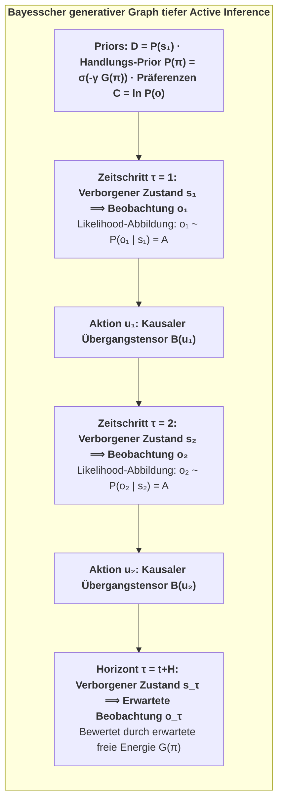
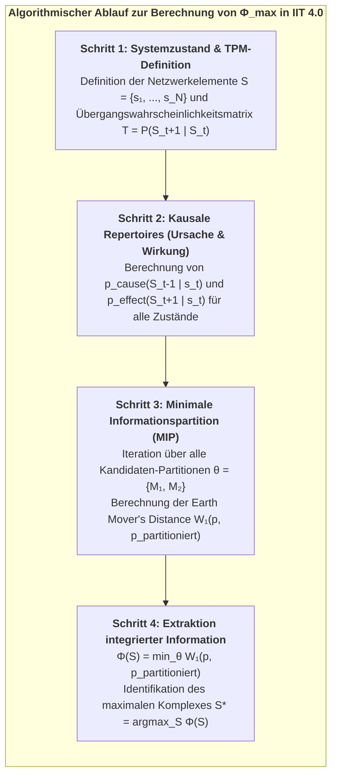
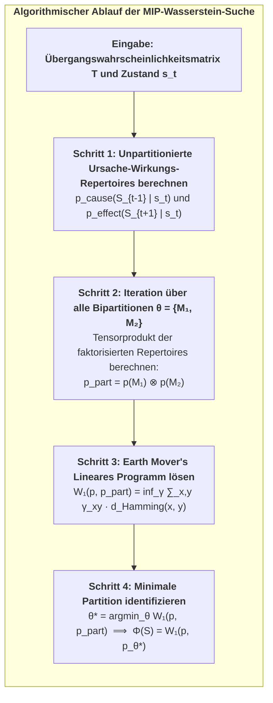

# Anhang A: Tensoralgebra diskreter POMDPs & variationelles Message-Passing {-}

Im Konativ-Integrativen Framework (CIF) wird das generative Modell eines Active-Inference-Agenten als diskreter partiell beobachtbarer Markov-Entscheidungsprozess (Partially Observable Markov Decision Process, POMDP) über Zeitschritte $\tau \in \{1, \dots, T\}$ formalisiert.


<p class="figure-caption"><strong>Abbildung A.1:</strong> Bayesscher generativer Graph tiefer Active Inference.</p>

### 1. Definition des generativen Modells:
Die gemeinsame Wahrscheinlichkeitsverteilung über Beobachtungen $\tilde{o} = (o_1, \dots, o_T)$, verborgene Zustände $\tilde{s} = (s_1, \dots, s_T)$ und Handlungsstrategien $\pi$ faktorisiert gemäß:

$$P(\tilde{o}, \tilde{s}, \pi) = P(\pi) \cdot P(s_1) \cdot \prod_{\tau=2}^T P(s_\tau \mid s_{\tau-1}, \pi) \cdot \prod_{\tau=1}^T P(o_\tau \mid s_\tau)$$

Wobei die fundamentalen Tensoren definiert sind als:
* **Initialer Prior ($D \in \Delta^{N_s}$):** $P(s_1) = D$.
* **Likelihood-Tensor ($A \in \mathbb{R}^{N_o \times N_s}$):** $P(o_\tau = j \mid s_\tau = k) = A_{j, k}$, wobei $\sum_{j=1}^{N_o} A_{j, k} = 1 \; \forall k$.
* **Übergangstensor ($B \in \mathbb{R}^{N_s \times N_s \times N_u}$):** $P(s_{\tau+1} = i \mid s_\tau = j, u_\tau = u) = B_{i, j, u}$, wobei $\sum_{i=1}^{N_s} B_{i, j, u} = 1 \; \forall j, u$.
* **Prior-Präferenzen ($C \in \mathbb{R}^{N_o}$):** $C_j = \ln P(o_\tau = j)$.

---

### 2. Variationelles Message-Passing & Zustandsschätzung:
Unter der Mean-Field-Approximation faktorisiert die approximative Posterior-Verteilung über Zeit und Handlungsstrategien:

$$Q(\tilde{s}, \pi) = Q(\pi) \prod_{\tau=1}^T Q(s_\tau \mid \pi)$$

Zum aktuellen Zeitpunkt $t$ wird nach Eintreffen der Beobachtung $o_t$ der variationelle Posterior-Glaubenszustand $q(s_\tau \mid \pi)$ für vergangene, gegenwärtige und zukünftige Zustände über **variationelles Message-Passing (VMP)** aktualisiert:

$$\ln q(s_\tau \mid \pi) = \sigma\Big( \ln A_{o_\tau, :} + \ln \big(B(u_{\tau-1}) \, q(s_{\tau-1} \mid \pi)\big) + \ln \big(B(u_\tau)^\top \, q(s_{\tau+1} \mid \pi)\big) \Big)$$

Hierbei gilt:
* $\ln A_{o_\tau, :}$ ist die aufsteigende sensorische Evidenznachricht aus untergeordneten Ebenen.
* $\ln \big(B(u_{\tau-1}) \, q(s_{\tau-1})\big)$ ist die vorwärtsgerichtete prädiktive Nachricht aus vergangenen Zuständen (*Retention*).
* $\ln \big(B(u_\tau)^\top \, q(s_{\tau+1})\big)$ ist die rückwärtsgerichtete glättende Nachricht aus zukünftigen Erwartungen (*Protention*).

---

### 3. Zerlegung der erwarteten freien Energie:
Die erwartete freie Energie für Handlungsstrategie $\pi$ zu einem zukünftigen Zeitschritt $\tau > t$ lautet:

$$\mathbf{G}(\pi, \tau) = \underbrace{D_{\text{KL}}\Big(Q(o_\tau \mid \pi) \;\parallel\; P(o_\tau)\Big)}_{\text{Pragmatischer Wert (Risiko)}} + \underbrace{\mathbb{E}_{Q(s_\tau \mid \pi)}\Big[\mathcal{H}\big(A_{:, s_\tau}\big)\Big]}_{\text{Epistemische Mehrdeutigkeit (Ambiguity)}}$$

Wobei die vorhergesagten Beobachtungen berechnet werden über:
$$Q(o_\tau \mid \pi) = A \cdot q(s_\tau \mid \pi)$$

---

# Anhang B: Algorithmischer Formalismus der Integrated Information Theory 4.0 {-}


<p class="figure-caption"><strong>Abbildung B.1:</strong> Algorithmischer Ablauf zur Berechnung von $\Phi_{\max}$ in IIT 4.0.</p>

### 1. Earth Mover's Distance (Wasserstein-1-Metrik):
Gegeben seien diskrete Wahrscheinlichkeitsverteilungen $p$ und $q$ über binären Zustandskonfigurationen $\{0, 1\}^N$:

$$W_1(p, q) = \min_{\gamma \in \Pi(p, q)} \sum_{x, y \in \{0, 1\}^N} \gamma(x, y) \cdot d_H(x, y)$$

Wobei $d_H(x, y) = \sum_{i=1}^N |x_i - y_i|$ die Hamming-Distanz bezeichnet und $\gamma(x, y)$ eine gemeinsame Wahrscheinlichkeitsverteilung mit Randverteilungen $\sum_y \gamma(x, y) = p(x)$ und $\sum_x \gamma(x, y) = q(y)$ darstellt.

---

### 2. Kontinuierliche Gaußsche $\Phi$-Formulierung:
Für kontinuierliche lineare Gaußsche neuronale Dynamiken $\dot{x} = A x + \xi$ mit stationärer Kovarianzmatrix $\Sigma$:

$$\Phi(M_1 ; M_2) = \frac{1}{2} \Big( \ln\det(\Sigma_{M_1}) + \ln\det(\Sigma_{M_2}) - \ln\det(\Sigma) \Big)$$

$$\Phi^* = \min_{\text{Partitionen } P} \Phi(P)$$

---

# Anhang C: Stochastische Differentialgleichungen für Nichtgleichgewichts-Fließgleichgewichte {-}

Der vollständige physikalische Zustandsvektor $x(t) \in \mathbb{R}^d$ eines lebendigen Alters genügt der stochastischen Itô-Differentialgleichung:

$$dx(t) = f(x) \, dt + \sqrt{2\Gamma} \, dW(t)$$

Hierbei bedeuten:
* $f(x)$ das deterministische Drift-Vektorfeld.
* $\Gamma$ den Diffusions-Tensor.
* $W(t)$ einen standardisierten $d$-dimensionalen Wiener-Prozess.

### Die Fokker-Planck-Gleichung:
Die Wahrscheinlichkeitsdichte $p(x, t)$ entwickelt sich gemäß:

$$\frac{\partial p(x, t)}{\partial t} = -\nabla \cdot \Big( f(x) \, p(x, t) \Big) + \nabla \cdot \Big( \Gamma \, \nabla p(x, t) \Big) \triangleq -\nabla \cdot j(x, t)$$

Wobei $j(x, t)$ der **Wahrscheinlichkeitsstrom-Vektor** ist:

$$j(x, t) = f(x) \, p(x, t) - \Gamma \nabla p(x, t)$$

### Bedingung für das Nichtgleichgewichts-Fließgleichgewicht (NESS):
Im Fließgleichgewicht ($\partial p / \partial t = 0$) verschwindet die Divergenz des Wahrscheinlichkeitsstroms ($\nabla \cdot j(x) = 0$).

Zerlegt man das Driftfeld in dissipative Gradienten- und konservative Solenoidalflüsse, so folgt:

$$f(x) = (\Gamma - Q) \, \nabla \ln p(x)$$

Wobei:
* $-\Gamma \nabla \ln p(x)$ der **dissipative Fluss** ist, der homöostatische Grenzen gegen die thermische Diffusion aufrechterhält.
* $Q \nabla \ln p(x)$ der **solenoidale Fluss** ist (mit antisymmetrischer Matrix $Q = -Q^\top$), der nicht-dissipative biologische Zyklen antreibt.

---

# Anhang D: Numerische Algorithmen für die Wasserstein-MIP-Suche in Python {-}

In rechnergestützten Simulationen der IIT 4.0 und des CIF erfordert die Bestimmung integrierter Information $\Phi(S)$ über Netzwerken das Lösen zweier verschachtelter Optimierungsprobleme:
1. Die Berechnung der Wasserstein-Metrik ($W_1$, Earth Mover's Distance) zwischen unpartitionierten und partitionierten Repertoires.
2. Die Suche über sämtliche nichttrivialen Bipartitionen $\theta \in \mathcal{P}$ zur Bestimmung der **Minimalen Informationspartition (MIP)**.


<p class="figure-caption"><strong>Abbildung C.1:</strong> Algorithmischer Ablauf der MIP-Wasserstein-Suche.</p>

### Open-Source-Implementierung & Software-Repository

Um Reproduzierbarkeit, offene wissenschaftliche Nachprüfbarkeit und rechnerische Validierung in unabhängigen Forschungslaboren zu gewährleisten, ist die vollständige algorithmische Implementierung der Wasserstein-MIP-Suche, der kontinuierlichen Gaußschen $\Phi$-Solver sowie der multiskaligen Active-Inference-Simulationssuiten als **Open-Source-Software** unter der permissiven **MIT-Lizenz** veröffentlicht.

Die Produktiv-Codebasis stellt vollständig optimierte, vektorisierte Routinen bereit, die NumPy, SciPy (Lineare Programmierung via HiGHS) und JAX für GPU-beschleunigte Tensor-Operationen nutzen.

#### Offizielles GitHub-Repository:
* 🌐 **Repository-URL:** [https://github.com/Thriebl/active-inference-phi-network](https://github.com/Thriebl/active-inference-phi-network)
* 📓 **Interaktive Jupyter-Notebooks:** [https://github.com/Thriebl/active-inference-phi-network/tree/main/notebooks](https://github.com/Thriebl/active-inference-phi-network/tree/main/notebooks)
  * `Active_Inference_Phi_Maximization_Network.ipynb` — Phase 1: Rekurrente Netzwerk-Selbstorganisation an die Kante des Chaos ($\Phi \approx 3,42\text{ Bits}$).
  * `Active_Inference_Expanding_Network_Phi_Scaling.ipynb` — Phase 2: Modulare Netzwerkerweiterung und $\Phi(N) \propto N^{1,4}$-Potenzgesetz-Skalierungsanalyse.
  * `Deep_Temporal_Active_Inference_Simulation.ipynb` — Phase 3: Monte-Carlo-Simulation im täuschenden POMDP-Umfeld und Verifikation der temporalen Tiefe ($H > 1$).
* 🐍 **Ausführbare Python-Skripte:** [https://github.com/Thriebl/active-inference-phi-network/tree/main/scripts](https://github.com/Thriebl/active-inference-phi-network/tree/main/scripts)
  * `expanding_active_inference_phi_network.py` — Eigenständiger Headless-Batch-Simulationsrunner für High-Performance-Computing-Cluster (HPC).

Forscher und Studierende sind herzlich eingeladen, das Repository zu klonen, die Abbildungen zu reproduzieren, die Testsuiten auszuführen und das Framework auf neuartige neuronale Architekturen und psychiatrische Simulationsmodelle zu erweitern:

```bash
git clone https://github.com/Thriebl/active-inference-phi-network.git
cd active-inference-phi-network
pip install -r requirements.txt
python scripts/expanding_active_inference_phi_network.py
```

---

# Abbildungsverzeichnis {-}

* **Abbildung 1.1:** Die historische Evolution des physikalistischen Reduktionismus
* **Abbildung 1.2:** Die Triade der antiphysikalistischen Unmöglichkeitsbeweise
* **Abbildung 1.3:** Epistemische Asymmetrie: Phänomenale Bekanntschaft vs. physikalische Beschreibung
* **Abbildung 1.4:** Die dualen Sackgassen der materialistischen Metaphysik
* **Abbildung 1.5:** Historische Evolution des idealistischen Monismus
* **Abbildung 1.6:** Mind-at-Large als universelles phänomenales Substrat und dissoziierte Alter
* **Abbildung 1.7:** Die Markov-Decken-Partitionierung und der Informationsfluss
* **Abbildung 2.1:** Die thermodynamische Bifurkation der Natur
* **Abbildung 2.2:** Die kybernetische Ahnenreihe: Von Ashby bis Friston
* **Abbildung 2.3:** Die zwei Gesichter der variationellen freien Energie $F$
* **Abbildung 2.4:** Nichtgleichgewichts-Fließgleichgewichts-Ströme (NESS)
* **Abbildung 2.5:** Die Tensoren des generativen Modells $\mathcal{M} = \{A, B, C, D\}$
* **Abbildung 2.6:** Der duale Imperativ der erwarteten freien Energie $\mathbf{G}(\pi)$
* **Abbildung 2.7:** Multiskalige Active Inference über biologische Systeme hinweg
* **Abbildung 3.1:** Die axiomatische Architektur der IIT 4.0
* **Abbildung 3.2:** Das Unfolding Theorem: Rekurrente Innerlichkeit vs. Feedforward-Zombie
* **Abbildung 3.3:** Berechnung integrierter Information $\Phi$ über die minimale Informationspartition (MIP)
* **Abbildung 3.4:** Qualia-Raum-Geometrie: Von Mechanismen zu phänomenalen Polyedern
* **Abbildung 3.5:** Das Paradoxon flüchtiger kausaler Phantome in der statischen IIT
* **Abbildung 3.6:** Das 6. Axiom: Der konative Motor des Geistes
* **Abbildung 3.7:** Das thermodynamische Schicksal integrierter Information $\Phi$
* **Abbildung 4.1:** Die fundamentale Brücken-Äquivalenz des Zwei-Aspekte-Monismus
* **Abbildung 4.2:** Logische Architektur des Master-Beweises
* **Abbildung 4.3:** Rate-Distortion-Optimierung im bewussten Alter
* **Abbildung 4.4:** Die informationsgeometrische Mannigfaltigkeit phänomenaler Zustände
* **Abbildung 4.5:** Die drei dynamischen Regime von Active-Inference-Netzwerken
* **Abbildung 4.6:** Die neuroanatomische Triple-Network-Architektur des menschlichen Alters
* **Abbildung 4.7:** Die Zwei-Phasen-Skalierung integrierter Information $\Phi(N)$
* **Abbildung 5.1:** Die 6-Ebenen-Komposition der individuellen Seele (Indikative relative Gewichtung)
* **Abbildung 5.2:** Die 6-Ebenen-ontogenetische Hierarchie der Seele
* **Abbildung 5.3:** Zuordnung klinischer Pathologien zu den 6 Ebenen
* **Abbildung 6.1:** Husserls dreigliedrige Struktur des Specious Present (~500ms - 3s)
* **Abbildung 6.2:** Francisco Varelas drei Skalen des temporalen Horizonts
* **Abbildung 6.3:** Phasen-Amplituden-Kopplung: Der Taktgeber des Gehirns
* **Abbildung 6.4:** Das Spektrum temporaler Tiefe in der Active Inference
* **Abbildung 6.5:** Störungen des prädiktiven temporalen Horizonts
* **Abbildung 6.6:** Die zwei gegensätzlichen Vektoren der Zeit im Kosmos
* **Abbildung 7.1:** Die 3-stufige rechnerische Verifikations-Pipeline
* **Abbildung 7.2:** Ergebnisse der Simulationsphase 1: Rekurrente Netzwerk-Selbstorganisation und Maximierung integrierter Information
* **Abbildung 7.3:** Phasenraum-Attraktorgeometrie und dynamische Regime
* **Abbildung 7.4:** Ergebnisse der Simulationsphase 2: Modulare Netzwerkerweiterung und Skalierungskurve integrierter Information
* **Abbildung 7.5:** Der Schutzschild epistemischen Foragierens gegen existenzielle Fallen
* **Abbildung 7.6:** Topologie der täuschenden Verifikations-Umgebung
* **Abbildung 7.7:** Ergebnisse der Simulationsphase 3: Tiefe temporale Active Inference und Monte-Carlo-Verifikation
* **Abbildung 8.1:** Die kosmische Dialektik von Mind-at-Large
* **Abbildung 8.2:** Die multiskalig verschachtelte Hierarchie der Active Inference
* **Abbildung 8.3:** Die revers-ontogenetische Auflösung beim biologischen Tod
* **Abbildung 8.4:** Trauma-Auflösung durch prädiktive Präzisions-Neugewichtung
* **Abbildung 8.5:** Die architektonische Kluft: Feedforward-KI vs. bewusste Alter
* **Abbildung 8.6:** Das Gesetz phänomenaler Erhaltung in Mind-at-Large
* **Abbildung A.1:** Bayesscher generativer Graph tiefer Active Inference
* **Abbildung B.1:** Algorithmischer Ablauf zur Berechnung von $\Phi_{\max}$ in IIT 4.0
* **Abbildung C.1:** Algorithmischer Ablauf der MIP-Wasserstein-Suche

---

# Verzeichnis der Statements {-}

* **Statement 1.1:** Definition der individuellen Seele (Bewusstes Alter)
* **Statement 3.1:** Axiom 6 (Der Wille zur Existenz / Conatus)
* **Statement 3.2:** Postulat 6 (Autopoietische kausale Persistenz)
* **Statement 4.1:** Die fundamentale Brücken-Äquivalenz des Zwei-Aspekte-Monismus
* **Statement 6.1:** Theorem 6.1 — Die temporale Tiefenbedingung für Bewusstsein (Thomas Riebl)
* **Statement 7.1:** Theorem 7.1 — Epistemische Abschirmung integrierter Information (Thomas Riebl)

---

# Tabellenverzeichnis {-}

* **Tabelle 5.1:** Active-Inference-Mapping: Neurobiologische Integration mit POMDP-Tensoren über die 6 Ebenen
* **Tabelle 7.1:** Monte-Carlo-Verifikation: Überlebensraten und integrierte Information über verschiedene Planungshorizonte ($N = 30$ Läufe)

---

# Anhang E: Ausführliches technisches Glossar {-}

* **Active Inference:** Das normative mathematische Rahmenwerk der theoretischen Neurobiologie, welches besagt, dass lebende Organismen ihre homöostatische Existenz sichern, indem sie Handlungen wählen, die die erwartete freie Energie ($\mathbf{G}$) minimieren und eintreffende Sinneswahrnehmungen mit angeborenen Prior-Präferenzen in Einklang bringen.
* **Alter (Dissoziiertes Zentrum des Geistes):** Im Analytischen Idealismus ein individueller lebendiger Organismus, der durch topologische Dissoziation aus Mind-at-Large hervorgeht und durch eine statistische Markov-Decke abgegrenzt ist.
* **Analytischer Idealismus:** Die von Bernardo Kastrup begründete sparsame, nicht-duale monistische Ontologie, die postuliert, dass die Realität in ihrem Wesen rein phänomenal (*Mind-at-Large*) ist und die unbelebte materielle Welt die extrinsische Erscheinung universaler mentaler Prozesse darstellt, die über eine Grenze hinweg beobachtet werden.
* **Autopoiese:** Die grundlegende Eigenschaft lebender Systeme, ihr eigenes Netzwerk struktureller und organisatorischer Prozesse kontinuierlich selbst zu regenerieren, zu reparieren und gegen thermodynamische Zerstreuung zu verteidigen.
* **Kartesischer Dualismus:** Die von René Descartes begründete Lehre von zwei fundamental getrennten Substanzen: *res cogitans* (unsausgedehnter, denkender Geist) und *res extensa* (ausgedehnte, geistlose Materie), die das unlösbare Leib-Seele-Problem schuf.
* **Kausalität (Intrinsisch vs. Extrinsisch):** In der IIT und im CIF bezieht sich *intrinsische Kausalität* auf die irreduzible Ursache-Wirkungs-Macht, die ein System aus seiner eigenen Binnenperspektive auf sich selbst ausübt (phänomenales Erleben). *Extrinsische Kausalität* bezeichnet beobachtbare Verhaltensreaktionen von außen.
* **Conatus (Der Wille zur Existenz):** Das jedem Seienden inhärente Streben, in seiner Existenz zu verharren und der Zerstörung durch äußere Kräfte zu widerstehen (Spinoza). Im CIF formalisiert als Zielzustand $\Phi > 0$ und das 6. Axiom.
* **Kritikalität (Kante des Chaos):** Die feine Phasenübergangszone zwischen starrer Ordnung und chaotischer Turbulenz, an der Informationsübertragung, dynamische Bandbreite und integrierte Information ($\Phi$) ihr globales Maximum erreichen.
* **Dissoziation:** Der psychologische und kosmologische Mechanismus, durch den sich ein einheitliches Bewusstseinsfeld in semiautonome Teilbereiche (*Alter*) spaltet, die eine lokalisierte Ich-Perspektive hinter Markov-Grenzen etablieren.
* **Zwei-Aspekte-Monismus:** Die metaphysische Auffassung, dass Geistiges und Physikalisches zwei komplementäre, epistemisch distinkte Perspektiven einer einzigen zugrundeliegenden Realität darstellen.
* **Earth Mover's Distance ($W_1$):** Die Wasserstein-Metrik zur Messung des minimalen Aufwands, eine Wahrscheinlichkeitsverteilung in eine andere zu überführen; in der IIT 4.0 genutzt zur Quantifizierung kausaler Macht über Partitionen hinweg.
* **Ego-Tunnel:** Das vom prädiktiven Gehirn in Echtzeit generierte transparente Phänomenale Selbstmodell (PSM), das die kontinuierliche Illusion eines getrennten, zentrierten "Ich" erzeugt (Metzinger).
* **Epistemischer Wert (Epistemische Neugier):** Die informationssuchende Komponente der erwarteten freien Energie ($\mathbf{G}$), die einen Agenten antreibt, unbekannte Umgebungen zu erkunden und Mehrdeutigkeiten aufzulösen, bevor er pragmatische Belohnungen anstrebt.
* **Epistemologie / Epistemisch:** Die philosophische Disziplin der Erkenntnistheorie (Bedingungen und Grenzen des Wissens). Im CIF ist physische Materie eine *epistemische Repräsentation* geistiger Prozesse, betrachtet über eine Markov-Decke.
* **Erwartete freie Energie ($\mathbf{G}$):** Eine zukunftsgerichtete Metrik zur Bewertung von Handlungsstrategien über einen Planungshorizont $H$, zusammengesetzt aus pragmatischem Wert (Zielerreichung) und epistemischem Wert (Informationsgewinn).
* **Erklärungslücke (Explanatory Gap):** Die unüberbrückbare erkenntnistheoretische Kluft des Physikalismus zwischen quantitativen neuronalen Prozessen und qualitativem Erleben (Levine).
* **Das schwere Problem des Bewusstseins (Hard Problem):** Die grundlegende Frage, wie und warum physikalische Berechnungen im Gehirn subjektives inneres Erleben (*Qualia*) erzeugen sollten (Chalmers).
* **Integrierte Information ($\Phi$):** Das quantitative Maß für die intrinsische Ursache-Wirkungs-Macht eines Systems, berechnet über die minimale Informationspartition (Tononi, IIT 4.0).
* **Markov-Decke:** Eine statistische Begrenzung, die die Zustände eines Systems in interne ($\mu$), sensorische ($s$), aktive ($a$) und externe ($\eta$) Zustände teilt und die internen Zustände bedingt unabhängig von der Außenwelt macht.
* **Mind-at-Large:** Das universelle, transpersonale Feld reinen Bewusstseins, das den fundamentalen ontologischen Urgrund der Wirklichkeit bildet (Spinoza, Kastrup).
* **Minimale Informationspartition (MIP):** Diejenige Bipartition eines Systems, die den geringsten kausalen Verlust bewirkt; dient zur Berechnung der Irreduzibilität $\Phi$.
* **Monismus:** Die ontologische Position, nach der die gesamte Wirklichkeit auf ein einziges fundamentales Grundprinzip oder eine einzige Substanz zurückgeht (im CIF: *idealistischer Monismus*).
* **Nichtgleichgewichts-Fließgleichgewicht (NESS):** Ein stabiler thermodynamischer Zustand lebender Materie fernab des Gleichgewichts, der durch kontinuierlichen Energieumsatz vor dem Zerfall bewahrt wird.
* **Ontologie / Ontologischer Primat:** Die Lehre vom Sein und den Grundstrukturen der Realität. Im CIF besitzt das phänomenale Bewusstsein den *ontologischen Primat*.
* **Phänomenales Bewusstsein / Qualia:** Die subjektive, qualitative Erlebnisdimension ("wie es sich anfühlt", z. B. das Rot des Weins, Schmerz, Freude) (Nagel, Chalmers).
* **Phänomenales Selbstmodell (PSM):** Eine kontinuierliche innere Simulation des Gehirns, die die Erste-Person-Perspektive eines handelnden Subjekts stiftet (Metzinger).
* **Physikalismus (Materialismus):** Das Dogma, dass leblose physische Materie die fundamentale Realität sei und Geistiges lediglich ein emergentes Epiphänomen darstelle.
* **POMDP:** Ein mathematisches Modell für sequentielle Entscheidungen unter Unsicherheit, definiert durch Matrizen für Likelihood ($A$), Dynamik ($B$), Präferenzen ($C$) und Priors ($D$).
* **Pragmatischer Wert:** Der Anteil der erwarteten freien Energie, der quantifiziert, wie gut vorhergesagte Sinneseindrücke den biologischen Homöostase-Zielen ($C$) entsprechen.
* **Urimpression:** Die gegenwärtige Sinnesberührung an der Markov-Grenze innerhalb der Scheingegenwart, korrespondierend zum eintreffenden Vorhersagefehler (Husserl).
* **Protention:** Die zukunftsgerichtete antizipatorische Erwartung innerhalb der Scheingegenwart, korrespondierend zu Top-down-Prädiktionen (Husserl).
* **Retention:** Die soeben verklungene, im Arbeitsgedächtnis gehaltene Vergangenheit innerhalb der Scheingegenwart, korrespondierend zu empirischen synaptischen Priors (Husserl).
* **Solenoidaler Fluss:** Wirbelförmige, nicht-dissipative Strömungen im Phasenraum, die biologische Rhythmen (z. B. Herzschlag, neuronale Oszillationen) antreiben.
* **Specious Present (Scheingegenwart):** Die ausgedehnte zeitliche Dauer des subjektiven Jetzt ($\sim 500\,\text{ms} - 3\,\text{s}$), die Retention, Urimpression und Protention verschmilzt (James, Husserl).
* **Teleologie (Konative Attraktoren):** Das zielgerichtete Streben lebender Systeme nach Erhalt ihrer homöostatischen Attraktoren, formalisiert durch Minimierung von $\mathbf{G}$ und Bewahrung von $\Phi$.
* **Temporale Tiefe ($H$):** Die Reichweite des kontrafaktischen Planungshorizonts, über den ein Agent Handlungsfolgen und erwartete freie Energie evaluiert.
* **Theorem der minimalen temporalen Tiefe:** Die mathematische Notwendigkeit, dass phänomenales Selbstbewusstsein einen Planungshorizont $H > 1$ voraussetzt, um kausalen Kollaps ($\Phi \to 0$) abzuwenden (Riebl).
* **Das 6. Axiom des Bewusstseins:** Das Axiom der *autopoietischen kausalen Persistenz*, wonach Bewusstsein ein aktives Bestreben zur Bewahrung integrierter Information erfordert: $\mathbb{E}[\Phi(t+1) \mid \pi^*] \ge \Phi(t)$ (Riebl).
* **Variationelle freie Energie ($F$):** Eine berechenbare mathematische Obergrenze für sensorische Überraschung ($-\ln P(o)$), die bei der Wahrnehmung minimiert wird.

---

# Wissenschaftliche Referenzen & Umfassende Bibliographie {-}

1. **Aaronson, S. (2014).** *Why I Am Not An Integrated Information Theorist (or, The Unconscious Expander).* Shtetl-Optimized.
2. **Albantakis, L., Oizumi, M., & Tononi, G. (2014).** *From the phenomenology to the mechanisms of consciousness: Integrated Information Theory 3.0.* PLoS Computational Biology, 10(5), e1003588.
3. **Bak, P. (1996).** *How Nature Works: The Science of Self-Organized Criticality.* Copernicus, Springer-Verlag, New York.
4. **Beggs, J. M., & Plenz, D. (2003).** *Neuronal avalanches in neocortical circuits.* Journal of Neuroscience, 23(35), 11167–11177.
5. **Bergson, H. (1889).** *Essai sur les données immédiates de la conscience.* Félix Alcan, Paris.
6. **Boly, M., Massimini, M., Tsuchiya, N., Postle, B. R., Koch, C., & Tononi, G. (2017).** *Are the neural correlates of consciousness in the front or in the back of the cerebral cortex? Clinical and neuroimaging evidence.* Journal of Neuroscience, 37(40), 9603–9613.
7. **Bouchard, T. J. (2004).** *Genetic influence on human psychological traits: A survey.* Current Directions in Psychological Science, 13(4), 148–151.
8. **Carhart-Harris, R. L., & Friston, K. J. (2019).** *REBUS and the anarchic brain: Toward a unified model of the brain action of psychedelics.* Pharmacological Reviews, 71(3), 316–344.
9. **Chalmers, D. J. (1995).** *Facing up to the problem of consciousness.* Journal of Consciousness Studies, 2(3), 200–219.
10. **Chalmers, D. J. (1996).** *The Conscious Mind: In Search of a Fundamental Theory.* Oxford University Press.
11. **Chialvo, D. R. (2010).** *Emergent complex neural dynamics.* Nature Physics, 6(10), 744–750.
12. **Churchland, P. S. (1986).** *Neurophilosophy: Toward a Unified Science of the Mind-Brain.* MIT Press.
13. **Clark, A. (2013).** *Whatever next? Predictive brains, situated agents, and the future of cognitive science.* Behavioral and Brain Sciences, 36(3), 181–204.
14. **Clark, A. (2016).** *Surfing Uncertainty: Prediction, Action, and the Embodied Mind.* Oxford University Press.
15. **Da Costa, L., Parr, T., Sajid, N., Veselic, S., Neacsu, V., & Friston, K. (2020).** *Active inference on discrete state-spaces: A synthesis.* Journal of Mathematical Psychology, 99, 102447.
16. **Dennett, D. C. (1991).** *Consciousness Explained.* Little, Brown and Company, Boston.
17. **Eddington, A. S. (1928).** *The Nature of the Physical World.* Cambridge University Press.
18. **Eigen, M. (1971).** *Selforganization of matter and the evolution of biological macromolecules.* Die Naturwissenschaften, 58(10), 465–523.
19. **Eigen, M., & Winkler, R. (1975).** *Das Spiel: Unsere Begegnung mit dem Zufall.* Piper Verlag, München.
20. **Fountas, Z., Sajid, N., Mediano, P. A. M., & Friston, K. (2020).** *Deep active inference agents using Monte-Carlo methods.* Advances in Neural Information Processing Systems (NeurIPS 2020), 33, 11662–11675.
21. **Frankish, K. (2016).** *Illusionism as a theory of consciousness.* Journal of Consciousness Studies, 23(11-12), 11–39.
22. **Friston, K. (2010).** *The free-energy principle: a unified brain theory?* Nature Reviews Neuroscience, 11(2), 127–138.
23. **Friston, K. (2013).** *Life as we know it.* Journal of the Royal Society Interface, 10(86), 20130475.
24. **Friston, K. (2019).** *A free energy principle for a particular physics.* arXiv preprint arXiv:1906.10184.
25. **Friston, K., FitzGerald, T., Rigoli, F., Schwartenbeck, P., & Pezzulo, G. (2017).** *Active Inference: A Process Theory.* Neural Computation, 29(1), 1–49.
26. **Friston, K., Rosch, R., Parr, T., Price, C., & Bowman, H. (2017).** *Deep temporal models and active inference.* Neuroscience & Biobehavioral Reviews, 77, 388–402.
27. **Gershman, S. J. (2019).** *The generative adversary in brain and machine.* Trends in Cognitive Sciences, 23(1), 8–17.
28. **Goff, P. (2017).** *Consciousness and Fundamental Reality.* Oxford University Press.
29. **Hohwy, J. (2013).** *The Predictive Mind.* Oxford University Press.
30. **Husserl, E. (1928).** *Vorlesungen zur Phänomenologie des inneren Zeitbewusstseins.* Max Niemeyer Verlag, Halle.
31. **Jablonka, E., & Lamb, M. J. (2014).** *Evolution in Four Dimensions: Genetic, Epigenetic, Behavioral, and Symbolic Variation.* MIT Press.
32. **Jackson, F. (1982).** *Epiphenomenal qualia.* The Philosophical Quarterly, 32(127), 127–136.
33. **James, W. (1890).** *The Principles of Psychology.* Henry Holt and Company, New York.
34. **Kandel, E. R. (2001).** *The molecular biology of memory storage: a dialogue between genes and synapses.* Science, 294(5544), 1030–1038.
35. **Kant, I. (1781).** *Kritik der reinen Vernunft.* Johann Friedrich Hartknoch, Riga.
36. **Kastrup, B. (2019).** *The Idea of the World: A Multi-Disciplinary Argument for the Mental Nature of Reality.* Iff Books.
37. **Kastrup, B. (2021).** *Science Ideated: The Fall of Matter and the Contours of the Next Mainstream Scientific Worldview.* Iff Books.
38. **Kastrup, B., & Friston, K. (2020).** *An Analytic Idealist Perspective on the Free Energy Principle.* Working Treatise.
39. **Levine, J. (1983).** *Materialism and qualia: The explanatory gap.* Pacific Philosophical Quarterly, 64(4), 354–361.
40. **Maturana, H. R., & Varela, F. J. (1980).** *Autopoiesis and Cognition: The Realization of the Living.* D. Reidel Publishing Company, Dordrecht.
41. **Metzinger, T. (2003).** *Being No One: The Self-Model Theory of Subjectivity.* MIT Press, Cambridge, MA.
42. **Metzinger, T. (2009).** *The Ego Tunnel: The Science of the Mind and the Myth of the Self.* Basic Books, New York.
43. **Metzinger, T. (2024).** *The Elephant and the Blind: The Experience of Pure Consciousness.* MIT Press, Cambridge, MA.
44. **Monod, J. (1970).** *Le Hasard et la Nécessité: Essai sur la philosophie naturelle de la biologie moderne.* Éditions du Seuil, Paris.
45. **Nagel, T. (1974).** *What is it like to be a bat?* The Philosophical Review, 83(4), 435–450.
46. **Panksepp, J. (1998).** *Affective Neuroscience: The Foundations of Human and Animal Emotions.* Oxford University Press.
47. **Parr, T., & Friston, K. J. (2018).** *The anatomy of choice: active inference and agency.* Cognitive Neuroscience, 9(1-2), 11–27.
48. **Parr, T., Pezzulo, G., & Friston, K. J. (2022).** *Active Inference: The Free Energy Principle in Mind, Brain, and Behavior.* MIT Press, Cambridge, MA.
49. **Pearl, J. (1988).** *Probabilistic Reasoning in Intelligent Systems: Networks of Plausible Inference.* Morgan Kaufmann, San Mateo, CA.
50. **Plomin, R., DeFries, J. C., Knopik, V. S., & Neiderhiser, J. M. (2016).** *Top 10 Replicated Findings From Behavioral Genetics.* Perspectives on Psychological Science, 11(1), 3–23.
51. **Riebl, T. (2026).** *The Conative-Integrative Framework (CIF): How Active Inference Networks, Integrated Information ($\Phi$), and the 6th Axiom Fit Together to Unite Analytic Idealism, the Free Energy Principle, and Consciousness.* Master Monograph, Luxembourg.
52. **Riebl, T. (2026).** *The Composition of the Soul: The 6-Layer Ontogenetic Architecture of the Dissociated Mind.* Luxembourg.
53. **Riebl, T. (2026).** *The Temporal Mechanics of Consciousness: The Specious Present, Deep Temporal Active Inference, and the Anti-Entropic Arrow of Mind.* Luxembourg.
54. **Roth, G. (2003).** *Aus Sicht des Gehirns.* Suhrkamp Verlag, Frankfurt am Main.
55. **Roth, G. (2021).** *Wie das Gehirn die Seele macht: Emotionen, Bewusstsein, Unbewusstes.* Klett-Cotta, Stuttgart.
56. **Safron, A. (2020).** *An Integrated World Modeling Theory (IWMT) of Consciousness.* Frontiers in Artificial Intelligence, 3, 30.
57. **Schopenhauer, A. (1819/1844).** *Die Welt als Wille und Vorstellung.* F. A. Brockhaus, Leipzig.
58. **Seth, A. K. (2021).** *Being You: A New Science of Consciousness.* Dutton, Penguin Random House.
59. **Seth, A. K., & Tsakiris, M. (2018).** *Being a beast machine: The somatic basis of active inference and consciousness.* Trends in Cognitive Sciences, 22(11), 969–981.
60. **Sperry, R. W. (1968).** *Hemisphere deconnection and unity in conscious awareness.* American Psychologist, 23(10), 723–733.
61. **Spinoza, B. (1677).** *Ethica, ordine geometrico demonstrata.* Posthumous Publication.
62. **Strawson, G. (2006).** *Realistic monism: why physicalism entails panpsychism.* Journal of Consciousness Studies, 13(10-11), 3–31.
63. **Tononi, G., Boly, M., Massimini, M., & Koch, C. (2016).** *Integrated information theory: from consciousness to its physical substrate.* Nature Reviews Neuroscience, 17(7), 450–461.
64. **Tononi, G., Albantakis, L., Boly, M., Massimini, M., & Koch, C. (2023).** *Integrated information theory (IIT) 4.0: Formulating the properties of phenomenal existence in physical terms.* PLOS Computational Biology, 19(10), e1011465.
65. **Tschantz, A., Millidge, B., Seth, A. K., & Buckley, C. L. (2020).** *Reinforcement learning through active inference.* arXiv preprint arXiv:2002.12636.
66. **Turkheimer, E. (2000).** *Three Laws of Behavior Genetics and What They Mean.* Current Directions in Psychological Science, 9(5), 160–164.
67. **Varela, F. J. (1999).** *The specious present: A neurophenomenology of time consciousness.* In J. Petitot et al. (Eds.), *Naturalizing Phenomenology* (pp. 266–314). Stanford University Press.
68. **Wiese, W. (2018).** *Experienced Wholes: Unifying Insight into Phenomenal Integration.* MIT Press.
69. **Yehuda, R., & Lehrner, A. (2018).** *Intergenerational transmission of trauma effects: putative role of epigenetic mechanisms.* World Psychiatry, 17(3), 243–257.

---

# Über den Autor {-}

**Thomas Riebl** (geboren 1960 in Westdeutschland, wohnhaft in Luxemburg) war über drei Jahrzehnte in der Informationstechnologie als selbstständiger Senior IT-Berater, Systemarchitekt und IT-Manager bei einer führenden globalen Großbank tätig (im Ruhestand seit Juli 2025).

Ausgehend von einem tiefen Interesse an theoretischer Physik, Kybernetik und der Natur des Geistes widmete er sich ab 2019 der Erforschung theoretischer Neurowissenschaften und der Philosophie des Geistes. Im intensiven Selbststudium eignete er sich fundierte Kenntnisse in Bayesscher Statistik, Wahrscheinlichkeitstheorie, Markov-Entscheidungsprozessen und Informationstheorie an.

In einer bahnbrechenden Synthese der Arbeiten von Karl Friston, Giulio Tononi, Thomas Metzinger und Bernardo Kastrup begründete er das **Konativ-Integrative Framework (CIF)**, formulierte das **6. Axiom des Bewusstseins** ($\mathbb{E}[\Phi(t+1) \mid \pi^*] \ge \Phi(t)$) und schuf damit die mathematisch geschlossene Brücke zwischen kybernetischer Selbsterhaltung und phänomenaler Kausalität.

---

# Werkzeuge & Kolophon {-}

> [!NOTE]
> **Werkzeuge & Kolophon:**  
> Diese theoretische Abhandlung, philosophische Architektur und wissenschaftliche Monographie wurden von **Thomas Riebl** (Luxemburg) innerhalb des **Konativ-Integrativen Frameworks (CIF)** konzipiert, verfasst und kuratiert.  
> Die formalen mathematischen Herleitungen, Multi-Agenten-Simulationsskripte, Vektordiagramme sowie die plattformübergreifende Buchkompilierung (Amazon KDP Print-PDF $6 \times 9''$, Word `.docx`, EPUB) wurden mit Unterstützung von **Google Gemini (Antigravity Advanced Agentic Coding System)** entwickelt (September 2026).
