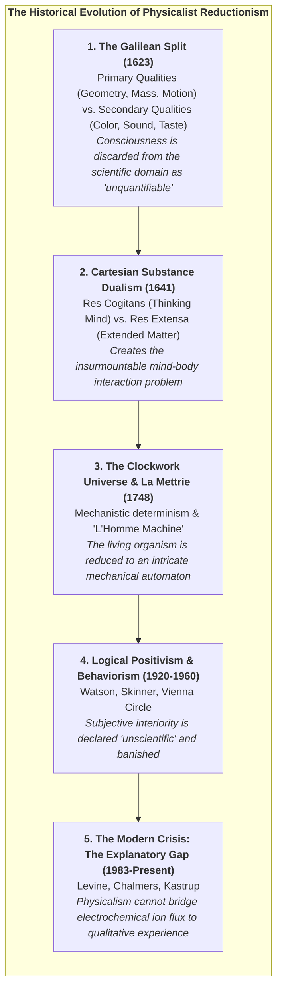
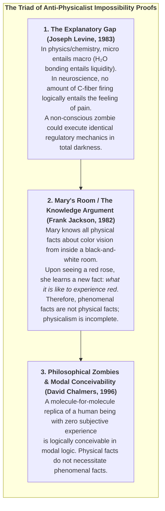
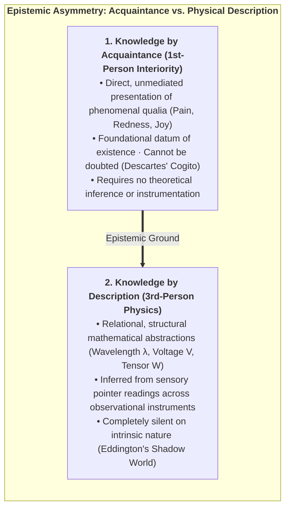
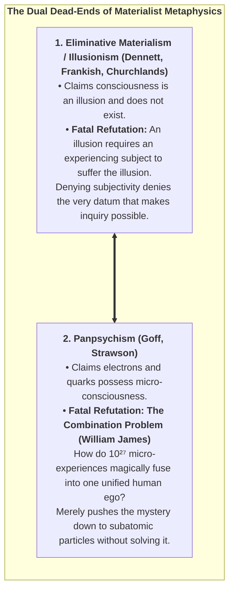
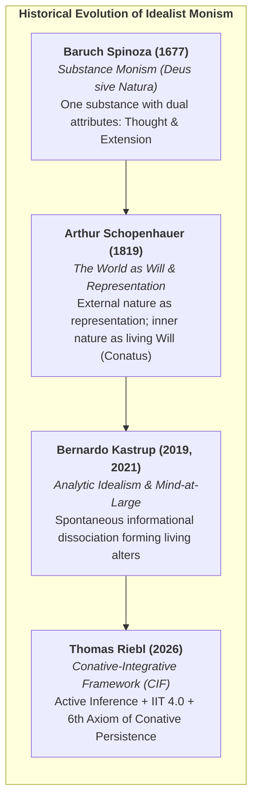
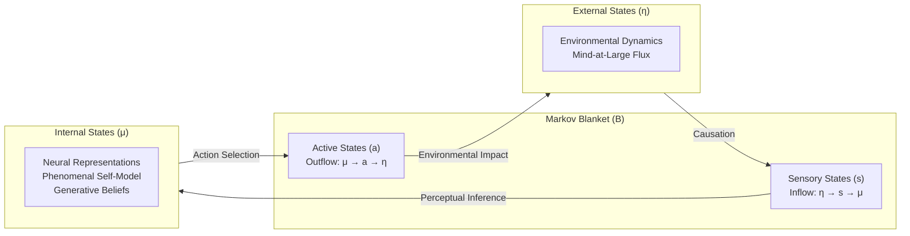

# Chapter 1: The Crisis of Physicalism & The Architecture of Mind-at-Large

> *"Experience is not an accidental byproduct of inanimate matter; matter is the extrinsic appearance of experiential processes observed across a dissociative boundary."*  
> — **Bernardo Kastrup**, *The Idea of the World* (2019)

---

## 1.1 The Historical Genesis of the Physicalist Dogma

For more than three centuries, Western natural science has operated under the implicit metaphysical dogma of **Physicalism** (reductive materialism). To understand why modern cognitive science and philosophy of mind have reached an existential crisis, we must trace how this metaphysical framework originally arose.



### The Galilean Cleaving of Reality:
In *The Assayer* (1623), Galileo Galilei made a profound methodological move that propelled the scientific revolution: he split nature into two domains:
1. **Primary Qualities (Objective):** Shape, size, quantity, position, and motion—properties that could be measured geometrically and mathematically.
2. **Secondary Qualities (Subjective):** Colors, tastes, warmth, sounds, and emotional valences. Galileo explicitly declared that secondary qualities exist solely within the consciousness of the observer:
   > *"I think that tastes, odors, colors, and so on are no more than mere names so far as the object in which we place them is concerned, and that they reside only in the consciousness of the living creature."*

This abstraction was brilliant as a practical laboratory method to simplify calculations. However, over the subsequent three centuries, science committed the ultimate philosophical category error: **it mistook a pragmatic methodological abstraction for an exhaustive ontological truth**. Science banished qualitative experience from its physical ontology, and then acted surprised when it could not find a way to re-introduce consciousness back into its equations.

---

## 1.2 The Explanatory Chasm: Levine, Jackson, and Chalmers

In the prevailing physicalist paradigm, reality at its fundamental bedrock is postulated to consist entirely of quantitative, non-experiential entities: subatomic fields, quantum wavefunctions, leptons, quarks, and spacetime manifolds. Within this mechanistic worldview, subjective experience—the felt, qualitative texture of living reality, formally termed *phenomenal consciousness* or *qualia*—is assumed to be an epiphenomenon, synthesized by the electrochemical switching of neurons within the biological central nervous system.

Yet, as cognitive philosopher David Chalmers (1995, 1996) decisively demonstrated, physicalism confronts an insurmountable theoretical impasse known as the **"Hard Problem of Consciousness"**. Cognitive neuroscience and computational psychiatry have made extraordinary strides in resolving the "easy problems" of mind:
* Mapping functional neural correlates to sensory discrimination (e.g., V1 retinotopic orientation columns).
* Measuring reaction times and motor execution thresholds.
* Characterizing memory consolidation across hippocampal-entorhinal loops.
* Modeling linguistic token prediction within neocortical language networks.

However, resolving functional input-output mappings leaves the core ontological question entirely untouched: *Why should any physiological computation or electrochemical ion flux ever feel like anything from the inside?*

$$\text{Physical Substrate } (\text{Ion Flux, Synaptic Spikes, Tensor Ops}) \;\xrightarrow{\;\text{Explanatory Gap}\;} \;\text{1st-Person Qualia } (\text{The Raw Redness of a Rose, Agony, Love})$$

### The Triad of Anti-Physicalist Proofs:



---

## 1.3 The Epistemological Inversion: Mind as the Primary Datum

Physicalism commits a profound epistemological inversion. It treats physical matter—which is a theoretical construct inferred from qualitative observation—as primary, while dismissing the very experiencing awareness that made the observation possible as secondary or illusory.

As Nobel laureate in physics **Erwin Schrödinger** famously wrote in *Mind and Matter* (1958):
> *"The material world has only been constructed at the price of taking the self, that is, mind, out of it, removing it; mind is not part of it, obviously, therefore it cannot act on it or be acted on by any of its parts... We are introduced to a purely objective external world, and then we wonder why we cannot find our own consciousness inside it."*

And as **Sir Arthur Eddington** observed in *The Nature of the Physical World* (1928):
> *"The external world of physics is a world of shadow-symbols... Our knowledge of the physical world is purely structural and relational. But we have direct, immediate acquaintance with the intrinsic nature of one thing in the universe: our own conscious experience."*

The foundational insight of the Conative-Integrative Framework is to **restore the correct epistemological hierarchy**: consciousness is not a late, accidental emergent property of physical matter. **Consciousness is the primary ontological ground of reality**, and physical matter is the structural representation of mental processes viewed across observational boundaries.

### 1.3.1 Knowledge by Acquaintance vs. Knowledge by Description:
To formalize the epistemological inversion mathematically, we draw on **Bertrand Russell’s distinction** between *Knowledge by Acquaintance* and *Knowledge by Description* (Russell, 1912; Chalmers, 2003):



1. **Propositional Completeness vs. Phenomenal Blindness:**  
   Let $\mathcal{K}_{\text{phys}} = \{p_1, p_2, \dots, p_n\}$ represent the set of all possible third-person physical propositions describing the human visual cortex (rhodopsin photon absorption, parvocellular pathway activations, V4 retinotopic maps). Even if $\mathcal{K}_{\text{phys}}$ is complete, an observer who has never experienced the qualitative sensation of crimson possesses zero acquaintance with the quale of red.
2. **The Inverted Spectrum Argument (Ned Block, 1990):**  
   It is entirely consistent with all known laws of physics and functional behavior that two individuals share identical neural wiring and identical linguistic responses ("That traffic light is red"), yet experience inverted phenomenal qualia (Subject A experiences what Subject B experiences as green). Because physicalism captures only extrinsic functional relations, it cannot differentiate between isomorphic qualia mappings.

---

## 1.4 The Bankruptcy of Eliminative Materialism & Panpsychism

Faced with this explanatory impasse, contemporary physicalism fractures into two untenable extremes:



---

## 1.5 The Lineage of Analytic Idealism

To escape both the absurdity of eliminativism and the incoherence of panpsychism without relapsing into Cartesian substance dualism, the Conative-Integrative Framework adopts **Analytic Idealism**—a parsimonious, non-dual ontology with an illustrious philosophical pedigree:



1. **Baruch Spinoza (1677):** In his *Ethics*, Spinoza demonstrated that there can exist only one infinite substance. Mind (*Thought*) and Body (*Extension*) are not two distinct causal substances colliding through an anatomical gland; they are the 1st-person interior and 3rd-person exterior expressions of the exact same underlying reality.
2. **Arthur Schopenhauer (1819):** In *The World as Will and Representation*, Schopenhauer realized that our scientific instruments grant us access to nature only as representation (*Vorstellung*). But from within our own organism, we immediately experience nature as *Will* (*Wille*)—an unyielding, autopoietic striving to exist and maintain form against decay.
3. **Bernardo Kastrup (2019, 2021):** Kastrup translated these insights into modern analytic philosophy: reality is fundamentally a single, continuous, transpersonal experiential field, termed **Mind-at-Large**. The inanimate physical cosmos is not an external matter-factory generating mind; rather, what we call the "physical universe" is simply what the universal cognitive processes of Mind-at-Large look like when observed from across a localized observational perspective.

---

---

## 1.6 The Topology of Dissociation: How Alters Form

If reality is fundamentally a single, universal experiential field, how do individual living agents, possessing private 1st-person interiority, subjective privacy, and autonomous boundaries, arise?

The solution is not aggregation (bottom-up), but **topological partitioning via Dissociation (top-down)**. 

In clinical psychiatry, **Dissociative Identity Disorder (DID)** provides direct empirical proof that a single, unified mind can undergo informational partitioning, generating multiple concurrent, distinct centers of conscious awareness (*alters*) within the same mental substrate. Each alter has its own subjective horizon, its own narrative identity, and its own sensory boundaries, while remaining wholly composed of the underlying mental fabric.

Similarly, neurosurgical split-brain studies conducted by Roger Sperry and Michael Gazzaniga (1968) demonstrated that severing the corpus callosum splits the unified conscious subject into two distinct, concurrently operating experiential alters residing within the same cranium, each executing independent visual and motor active inference.

```mermaid
flowchart TD
    subgraph MAL_FIELD["<b>Mind-at-Large (Universal Experiential Substrate)</b>"]
        direction TB
        
        subgraph ALTER_A["<b>Dissociated Conscious Alter A</b>"]
            direction TB
            MB_A["<b>Markov Blanket A</b><br>(Sensory & Active States)"]
            INT_A["<b>Internal Experiential Dynamics</b><br>1st-Person Qualia, Memories & PSM"]
            MB_A <===> INT_A
        end
        
        subgraph ALTER_B["<b>Dissociated Conscious Alter B</b>"]
            direction TB
            MB_B["<b>Markov Blanket B</b><br>(Sensory & Active States)"]
            INT_B["<b>Internal Experiential Dynamics</b><br>1st-Person Qualia, Memories & PSM"]
            MB_B <===> INT_B
        end
        
        AMBIENT["<b>Ambient Cosmological Dynamics</b><br>Extrinsic Appearance: Inanimate Physical Universe (Stars, Rocks, Vacuum)"]
    end
    
    ALTER_A <=== Perception / Action ===> AMBIENT <=== Perception / Action ===> ALTER_B
```

### 1.6.1 Topological Dissociation vs. The Combination Problem:
Why does the top-down dissociative mechanism succeed where bottom-up panpsychism fatally fails?

In analytic philosophy, the **De-Combination Problem** of Idealism is fundamentally easier to solve than the **Combination Problem** of Panpsychism (Kastrup, 2018; Goff, 2017):
1. **The Panpsychist Impasse (Aggregation Failure):** Panpsychism requires billions of distinct, micro-conscious subatomic subjects (quarks, electrons) to miraculously fuse their private 1st-person perspectives into a single unified human macro-subject (*The Subject Addition Problem*). There exists no known mathematical, physical, or logical mechanism whereby two separate 1st-person interiorities can combine into a third without violating individual identity.
2. **The Idealist Solution (Topological Segregation):** In contrast, Analytic Idealism starts with an already unified, non-local field of consciousness (Mind-at-Large). It requires only that this field form **local boundaries of informational closure**—precisely what the physics of Markov blankets describes.
3. **The Whirlpool Metaphor Formalized:** Just as a whirlpool forms in a river through localized vorticity without adding a new "water substance," a conscious alter forms within Mind-at-Large through localized statistical closure without introducing new ontological primitives. The alter is 100% made of Mind-at-Large, yet causally bounded from the rest of the stream.

---

## 1.7 The Statistical Physics of the Markov Blanket

In statistical mechanics and theoretical biology (Pearl, 1988; Friston, 2013, 2019), the exact boundary that segregates a dissociated alter from the ambient field of Mind-at-Large is formalized as a **Markov Blanket**.

Let the full state space of reality be described by a vector of continuous or discrete random variables $\mathcal{X}$. A Markov Blanket partition divides $\mathcal{X}$ into four mutually exclusive, conditionally independent state spaces:

$$\mathcal{X} = \{\eta, s, a, \mu\}$$

Where:
* **External States ($\eta \in \mathcal{H}$):** The transpersonal processes of Mind-at-Large and environmental dynamics occurring outside the organism's boundary.
* **Sensory States ($s \in \mathcal{S}$):** The receptive boundary interface (retinal rods, cochlear hair cells, skin thermoreceptors, interoceptive sensors) that are causally driven by external states $\eta$ and internal states $\mu$.
* **Active States ($a \in \mathcal{A}$):** The effector boundary interface (muscular contractions, secretory glands, speech outputs) that are causally driven by internal states $\mu$ and act upon external states $\eta$.
* **Internal States ($\mu \in \mathcal{M}$):** The neural connectivity, intracellular signaling cascades, and subjective phenomenal representations of the living agent.

The **Markov Blanket ($\mathcal{B}$)** is defined as the union of sensory and active states:

$$\mathcal{B} \triangleq \{s, a\}$$

### The Fundamental Independence Theorem:

Under this partition, the internal states $\mu$ and external states $\eta$ are **conditionally independent** given the blanket states $\mathcal{B}$:

$$P(\mu, \eta \mid \mathcal{B}) = P(\mu \mid \mathcal{B}) \cdot P(\eta \mid \mathcal{B}) \quad \Longleftrightarrow \quad \mu \perp\!\!\!\perp \eta \mid \mathcal{B}$$



This conditional independence carries profound epistemological and ontological implications:
1. **The Epistemic Barrier:** Internal states $\mu$ never have unmediated, direct contact with external reality $\eta$. An organism can never directly "touch" the world; it can only infer the hidden causes of its sensory excitations $s$ by projecting predictive generative hypotheses.
2. **The Phenomenological Screen:** The sensory-active boundary is the statistical veil upon which subjective perceptual reality is rendered.
3. **The Physical Body as Extrinsic Appearance:** What an outside observer observes as a biological physical body (cells, blood vessels, cortex) is nothing other than the **extrinsic physical representation of the alter's Markov blanket and internal cognitive dynamics** when viewed from across the dissociative boundary.

---

## 1.8 The Definition of the Conscious Soul in the CIF

Synthesizing analytic idealism with statistical physics, we formulate the foundational definition of individual existence in the Conative-Integrative Framework:

> **Definition 1.1 (The Individual Soul / Conscious Alter):**  
> *An individual conscious organism (a soul) is an autopoietic, non-equilibrium informational alter dissociated from Mind-at-Large, demarcated by a statistical Markov Blanket $\mathcal{B} = \{s, a\}$, whose internal dynamics $\mu$ maintain homeostatic self-organization and subjective 1st-person interiority by actively minimizing variational free energy and preserving integrated cause-effect structure across time.*

In Chapter 2, we explore the exact cybernetic engine that enables this dissociated alter to preserve its existence against entropic dissolution: *The Free Energy Principle and Active Inference*.
