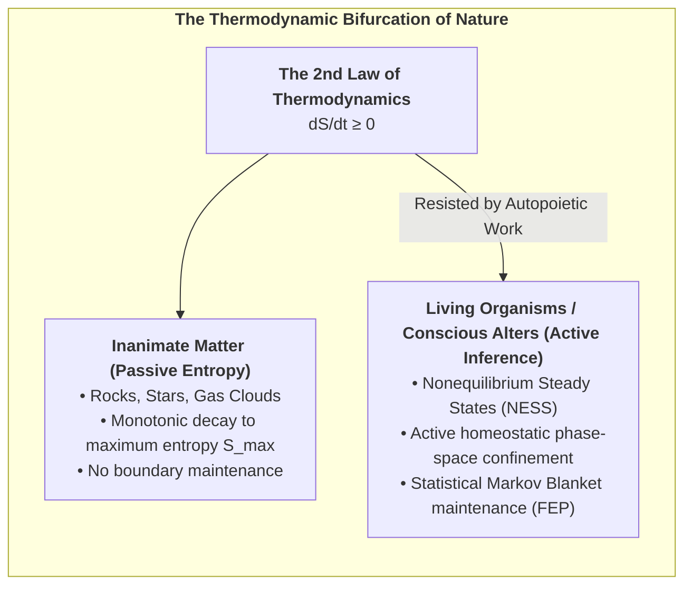
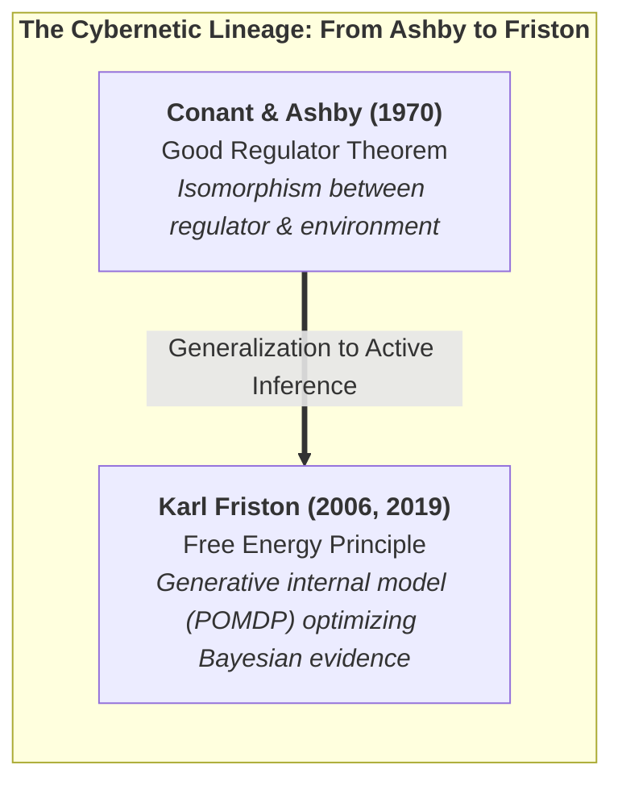
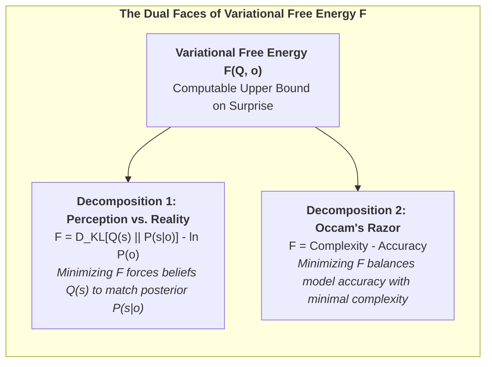
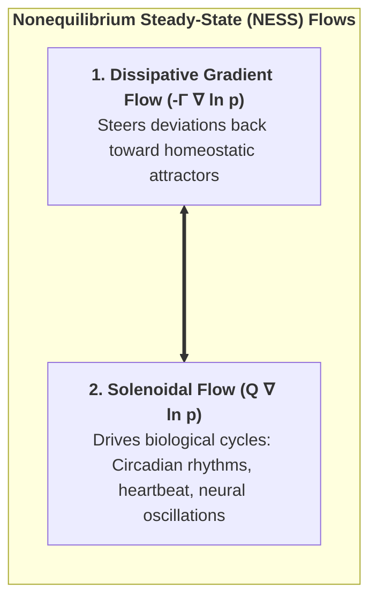
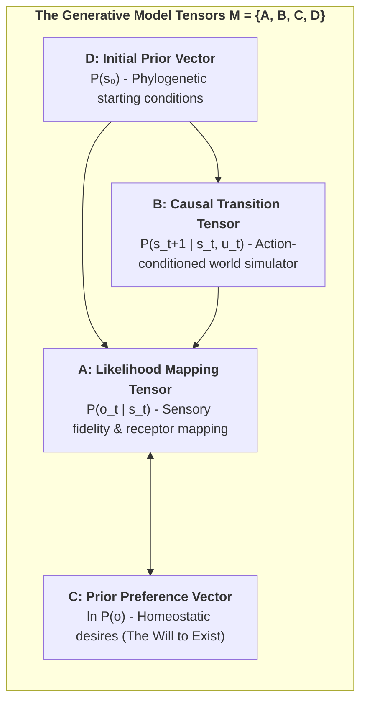
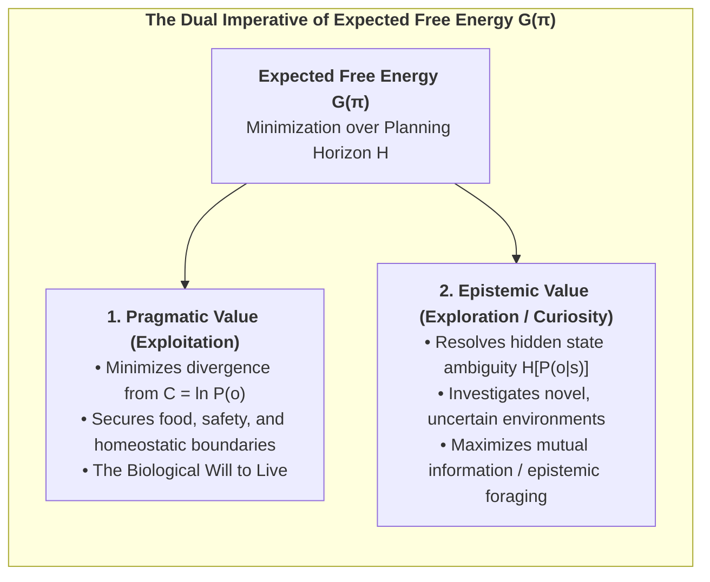
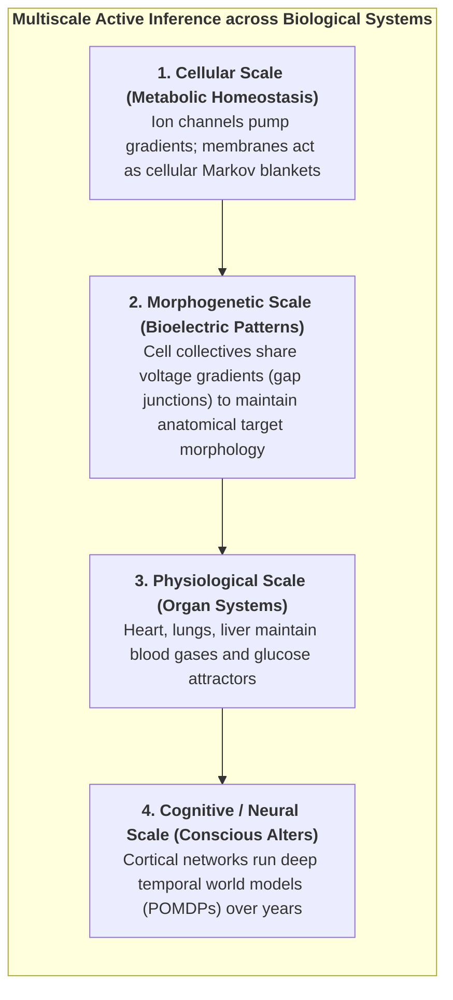

# Chapter 2: The Cybernetic Engine: The Free Energy Principle & Active Inference

> *"A self-organizing system can only maintain its structural integrity and avoid thermodynamic dispersion by minimizing the surprise of its sensory observations."*  
> — **Karl Friston**, *The Free-Energy Principle: A Unified Brain Theory?* (2010)

---

## 2.1 The Thermodynamic Crisis: Resisting Entropic Dissolution

The most universal and unforgiving law governing inanimate physical nature is the **Second Law of Thermodynamics**: in any isolated physical system, entropy (statistical disorder, thermal dispersion, and microscopic chaos) increases monotonically over time until thermodynamic equilibrium—maximum entropy, uniform heat death, and total loss of structure—is reached:

$$\frac{d S_{\text{universe}}}{d t} \ge 0$$

An inanimate object—such as a granite boulder abandoned in the desert—passively succumbs to this universal entropic drift. It absorbs heat, undergoes mechanical weathering, fractures under thermal expansion, and slowly dissolves into amorphous sand. It possesses no self-maintaining boundary, no internal regulatory setpoints, and no cybernetic mechanism to resist dissolution.

In stark, defiant contrast, **living organisms are non-equilibrium steady-state (NESS) systems**. A bacterium navigating a chemical gradient, a hummingbird foraging for nectar, or a human maintaining cellular homeostasis does not passively dissipate into its environment. Across days, years, or decades, a living organism actively restricts its internal physical and physiological states to an extraordinarily narrow, highly improbable region of its total phase space:
* Core body temperature preserved between $36.5^\circ\text{C}$ and $37.5^\circ\text{C}$.
* Blood plasma pH strictly maintained between $7.35$ and $7.45$.
* Intracellular potassium ($140\text{ mM}$) and extracellular sodium ($142\text{ mM}$) concentration gradients actively pumped across lipid bilayers against osmotic gradients.

How does a living organism—viewed in the CIF as a dissociated conscious alter within Mind-at-Large—achieve this continuous, improbable triumph over entropic dispersion?

The theoretical answer is formalized by Karl Friston’s **Free Energy Principle (FEP)**: any self-organizing system that endures over time must actively minimize its **Variational Free Energy ($F$)**, which establishes a mathematically computable upper bound on the **Surprise** of its sensory encounters.

### 2.1.1 The Good Regulator Theorem and Cybernetic Foundations:
The mathematical lineage of Active Inference traces back directly to mid-20th-century cybernetics, notably the **Good Regulator Theorem** proved by Roger Conant and W. Ross Ashby (1970):

> *"Every good regulator of a system must be a model of that system."*

Conant and Ashby proved in information-theoretic terms that an agent cannot maintain essential homeostatic variables within viable physiological limits unless its internal state transitions are mathematically isomorphic to the environmental disturbances it encounters. 

The Free Energy Principle generalizes the Good Regulator theorem in two fundamental ways:
1. **From Static Isomorphism to Dynamic Generative Modeling:** The brain does not merely reflect external dynamics; it runs an active, hierarchical **generative world-model** ($A, B, C, D$) that anticipates sensory consequences before they occur.
2. **From Passive Control to Active Inference:** The organism does not merely adjust internal parameters to match external shocks; it acts upon the external world to force sensory observations to conform to its prior preferences.

---

## 2.2 Mathematical Derivation of Variational Free Energy

Consider an organism separated from the external world by a Markov Blanket $\mathcal{B} = \{s, a\}$. The organism receives sensory observations $o \in \Omega$, which are generated by external hidden states $\eta \in \mathcal{H}$ that the organism cannot directly access.

The true statistical surprise (self-information) of encountering an observation $o$ is defined as the negative log-evidence under the organism's evolutionary generative model $P$:

$$\mathcal{I}(o) = -\ln P(o) = -\ln \int_{\mathcal{S}} P(o, s) \, ds$$

Directly evaluating this marginal integral $-\ln P(o)$ is computationally intractable for any biological brain, as it requires summing over all conceivable combinations of hidden environmental causes $s$.

To overcome this computational barrier, the living alter introduces an **internal recognition density $Q(s)$**—a parameterized probabilistic belief distribution over the hidden states $s$ of the world.

### Step-by-Step Derivation from Jensen's Inequality:

Applying Jensen’s inequality for concave functions ($\ln \mathbb{E}[X] \ge \mathbb{E}[\ln X]$) to the negative log-evidence:

$$-\ln P(o) = -\ln \int_{\mathcal{S}} Q(s) \frac{P(o, s)}{Q(s)} \, ds = -\ln \mathbb{E}_{Q(s)}\left[ \frac{P(o, s)}{Q(s)} \right]$$

Since $-\ln(x)$ is convex, Jensen’s inequality yields the fundamental variational upper bound:

$$-\ln P(o) \le \mathbb{E}_{Q(s)}\left[ -\ln \frac{P(o, s)}{Q(s)} \right] = \mathbb{E}_{Q(s)}\Big[ \ln Q(s) - \ln P(o, s) \Big] \triangleq F(Q, o)$$

Where **$F(Q, o)$ is the Variational Free Energy**.

### The Two Decompositions of Free Energy:

By algebraic rearrangement, Variational Free Energy can be factored in two revealing ways:

$$\begin{aligned}
F &= \underbrace{D_{\text{KL}}\Big(Q(s) \;\parallel\; P(s \mid o)\Big)}_{\text{1. Relative Entropy (Perceptual Error)}} - \underbrace{\ln P(o)}_{\text{Log Evidence (Negative Surprise)}} \\[10pt]
  &= \underbrace{D_{\text{KL}}\Big(Q(s) \;\parallel\; P(s)\Big)}_{\text{2. Complexity (Overfitting Penalty)}} - \underbrace{\mathbb{E}_{Q(s)}\big[\ln P(o \mid s)\big]}_{\text{Accuracy (Sensory Fit)}}
\end{aligned}$$

### The Dual Theorems of Active Inference:

Because the Kullback-Leibler divergence is strictly non-negative ($D_{\text{KL}} \ge 0$, with equality if and only if $Q(s) = P(s \mid o)$):

$$F(Q, o) \ge -\ln P(o) \quad \forall \; Q(s)$$

This leads directly to the two fundamental modes of active self-organization:

1. **Perceptual Inference (Belief Updating):**  
   By changing its internal states $\mu$ (synaptic activities and membrane potentials), the brain updates $Q(s)$ to minimize $D_{\text{KL}}\big(Q(s) \parallel P(s \mid o)\big)$. When this divergence approaches zero, internal beliefs become Bayes-optimal posteriors, and Free Energy reduces to true surprise:
   $$F \longrightarrow -\ln P(o)$$

2. **Active Inference (Action Execution):**  
   An organism cannot change past sensations, but it can act upon the world via its active states $a$ to selectively sample sensory observations $o$ that have high prior probability $P(o)$ under its generative model. By executing actions that steer sensory inputs toward its homeostatic setpoints, the organism directly minimizes $-\ln P(o)$.

---

## 2.3 Continuous Active Inference & Generalized Coordinates of Motion

In physical reality, sensory input arrives as a continuous stream of continuous variables (sound waves, electromagnetic photons, joint angles). In continuous-time formulation, the brain tracks hidden states using **Generalized Coordinates of Motion**:

$$\tilde{s} = \big( s, s', s'', s''', \dots \big)^\top = \big( \text{Position}, \text{Velocity}, \text{Acceleration}, \text{Jerk}, \dots \big)^\top$$

The internal neural dynamics $\tilde{\mu}$ evolve via gradient descent on Free Energy corrected for the passage of time:

$$\dot{\tilde{\mu}} = \mathcal{D}\tilde{\mu} - \nabla_{\tilde{\mu}} F(\tilde{\mu}, \tilde{o})$$

Where $\mathcal{D}$ is the derivative shift operator ($\mathcal{D} \tilde{\mu} = (\mu', \mu'', \mu''', \dots)$). This ensures that the brain is not merely predicting static values, but **actively tracking dynamic trajectories in real time**.

---

## 2.4 The Nonequilibrium Steady State (NESS) and Solenoidal Flows

In physical space, the temporal evolution of the alter's complete state vector $x = (\eta, s, a, \mu)$ is described by the Langevin stochastic differential equation:

$$\dot{x}(t) = f(x) + \omega(t)$$

Where $f(x)$ is the drift vector field and $\omega(t)$ is standard Gaussian fluctuation with covariance matrix $2\Gamma$.

According to the **Helmholtz Decomposition Theorem**, under a Nonequilibrium Steady State (NESS) density $p(x)$, the deterministic flow $f(x)$ decomposes into two orthogonal components:

$$f(x) = \underbrace{-\Gamma \nabla \ln p(x)}_{\text{1. Irreversible Dissipative Flow}} + \underbrace{Q \nabla \ln p(x)}_{\text{2. Reversible Solenoidal Flow}}$$

Where:
* **Dissipative Gradient Flow ($-\Gamma \nabla \ln p(x)$):** Drives the system directly toward regions of high probability density (the homeostatic attractor manifold $\mathcal{A}$).
* **Conservative Solenoidal Flow ($Q \nabla \ln p(x)$):** Circulates along the iso-probability contours of the attractor without altering probability density ($\nabla \cdot (Q \nabla \ln p(x)) = 0$).

In biological organisms, solenoidal flows are precisely the autonomous biological cycles that sustain life: circadian rhythms, respiratory cycles, cardiac pacing, and cortical brain waves (theta-gamma phase-amplitude coupling).

---

## 2.5 The Discrete Generative Model: POMDP Tensor Architecture

In cognitive neuroscience and artificial intelligence, the generative model of a living agent is formulated as a discrete-time **Partially Observable Markov Decision Process (POMDP)**. The model is fully defined by four fundamental tensor structures:

$$\mathcal{M} = \big\{ A, B, C, D \big\}$$

### 1. The Likelihood Mapping Tensor ($A$):
Maps hidden environmental states $s \in \{1, \dots, N_s\}$ to sensory observations $o \in \{1, \dots, N_o\}$:

$$A_{j, k} \triangleq P(o_t = j \mid s_t = k)$$

### 2. The Causal Transition Tensor ($B$):
Represents the agent's internal simulator of temporal physics—how hidden states evolve as a function of the agent's control actions $u \in \{1, \dots, N_u\}$:

$$B_{i, j, u} \triangleq P(s_{t+1} = i \mid s_t = j, u_t = u)$$

### 3. The Prior Preference Vector ($C$):
Encodes the innate biological values, homeostatic requirements, and affective preferences of the alter:

$$C_j \triangleq \ln P(o_t = j)$$

### 4. The Initial State Prior Vector ($D$):
Encodes phylogenetic expectations before sensory observation begins:

$$D_k \triangleq P(s_0 = k)$$

---

## 2.6 Expected Free Energy ($G$) and Temporal Depth

While current Variational Free Energy ($F$) evaluates immediate sensations at the present moment $t$, purposeful action requires evaluating candidate sequences of future actions—termed **Policies ($\pi = (u_1, u_2, \dots, u_H)$)**—across an extended planning horizon $H$.

For each candidate policy $\pi$, the agent computes the **Expected Free Energy ($\mathbf{G}$)** over the horizon $H$:

$$\mathbf{G}(\pi) = \sum_{\tau = t+1}^{t+H} \delta^{\tau - t} \cdot \mathbf{G}(\pi, \tau)$$

Where $\delta \in (0, 1]$ is a temporal decay parameter. The single-step Expected Free Energy decomposes into two fundamental terms:

$$\mathbf{G}(\pi, \tau) = \underbrace{D_{\text{KL}}\Big(Q(o_\tau \mid \pi) \;\parallel\; P(o_\tau)\Big)}_{\text{1. Pragmatic Value (Homeostatic Risk)}} + \underbrace{\mathbb{E}_{Q(s_\tau \mid \pi)}\Big[\mathcal{H}\big[P(o_\tau \mid s_\tau)\big]\Big]}_{\text{2. Epistemic Value (Information Gain / Ambiguity Reduction)}}$$

### Policy Selection via Softmax Optimization:

The probability of executing policy $\pi$ is governed by the precision-weighted softmax distribution:

$$P(\pi) = \sigma\big(-\gamma \cdot \mathbf{G}(\pi)\big) = \frac{\exp\big(-\gamma \cdot \mathbf{G}(\pi)\big)}{\sum_{\pi'} \exp\big(-\gamma \cdot \mathbf{G}(\pi')\big)}$$

Where $\gamma$ is the **Action Precision** parameter (inverse temperature).

---

## 2.7 Multiscale Biological Active Inference: Cells, Tissues, and Morphogenesis

Crucially, Active Inference is not restricted to brains. As developmental biologist **Michael Levin (2019, 2021)** and Karl Friston have shown, active inference operates at all nested scales of living biology:

Every living cell, tissue collective, and organism is an active inference engine striving to preserve its Markov blanket. In the human conscious alter, this multiscale architecture reaches its zenith in the cerebral cortex.

### 2.7.1 The Bioelectric Code: Morphogenetic Active Inference Without Neurons
How do non-neural cell collectives coordinate macroscopic form without central cortical control?

Groundbreaking work by biophysicist **Michael Levin (2019, 2021, 2024)** demonstrates that somatic cells communicate via a non-neural **Bioelectric Code**:
1. **Resting Membrane Potentials ($V_{\text{mem}}$) as Cognitive Variables:** Every somatic cell maintains an intracellular voltage gradient through ion translocators ($V_{\text{mem}} \approx -10\text{ to } -70\text{ mV}$). Slow changes in spatial voltage distribution act as anatomical memory states.
2. **Gap Junctions as Gated Communication Channels:** Cells connect through hexameric protein channels called **connexins** (gap junctions). When gap junctions open, voltage states equalize across cell groups, binding thousands of individual cellular Markov blankets into a single, unified **Morphogenetic Macro-Blanket**.
3. **Anatomical Setpoints as Prior Preferences ($C$):** In regenerating flatworms (*Planaria*), bioelectric circuits store the geometric target morphology (e.g., "one head, one tail"). If a fragment is cut, the cell collective senses the deviation from its target voltage pattern as a spatial prediction error and directs cellular proliferation to restore the correct anatomy.
4. **Epistemological Significance for the CIF:** This proves that Active Inference and purposeful, goal-directed cybernetic agency are not recent inventions of complex mammalian brains; they are the universal organizational logic of all living matter across every scale of biological organization.

In Chapter 3, we transition from this objective 3rd-person cybernetics to the 1st-person interiority of consciousness: Giulio Tononi's **Integrated Information Theory (IIT 4.0)** and the formulation of the **6th Axiom**.
