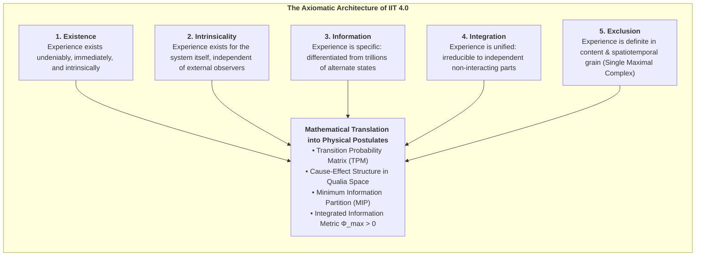
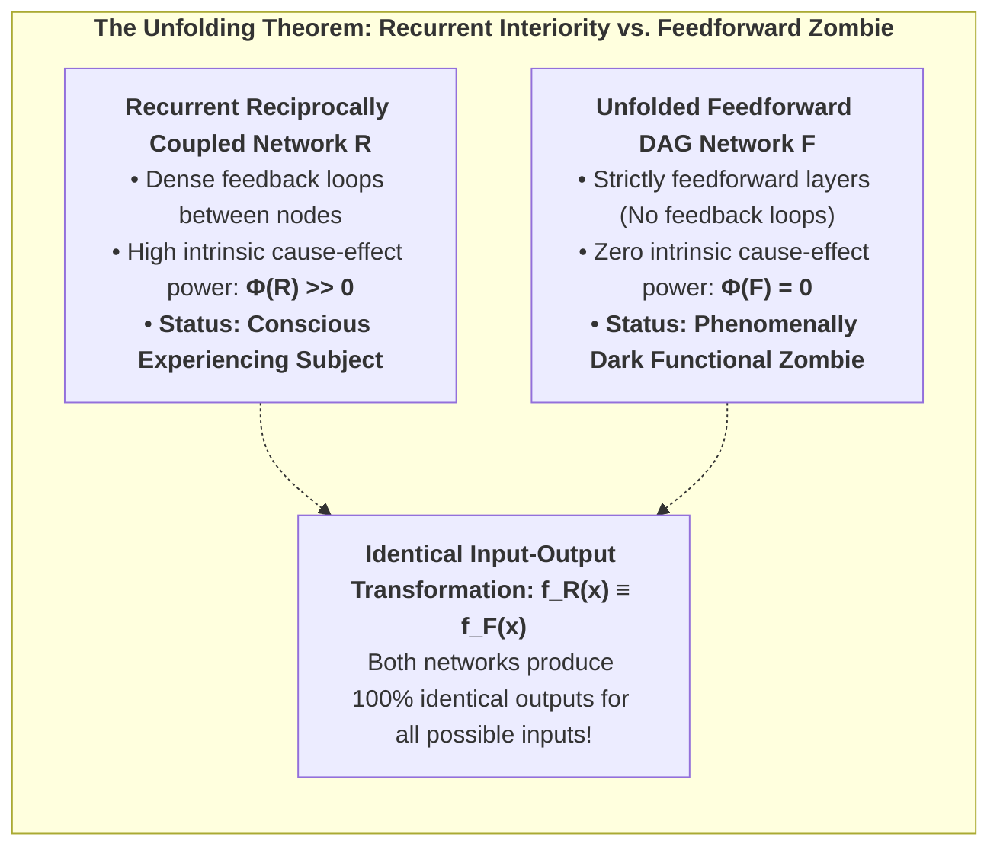
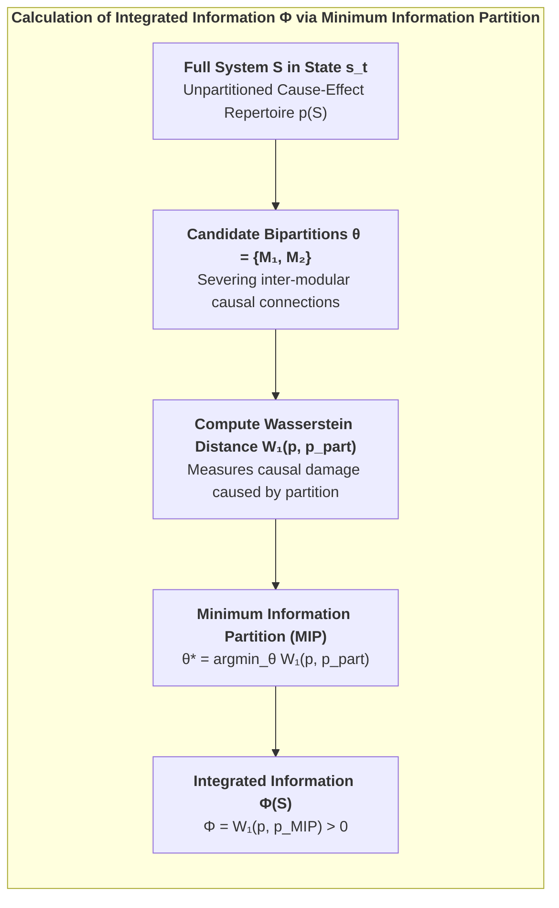
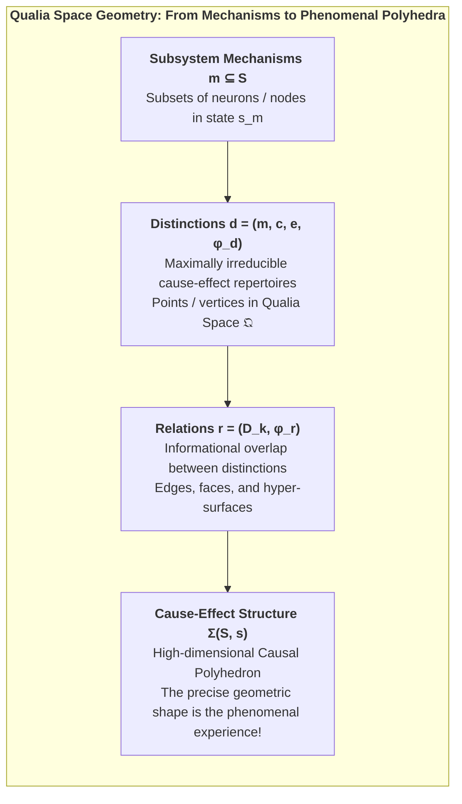
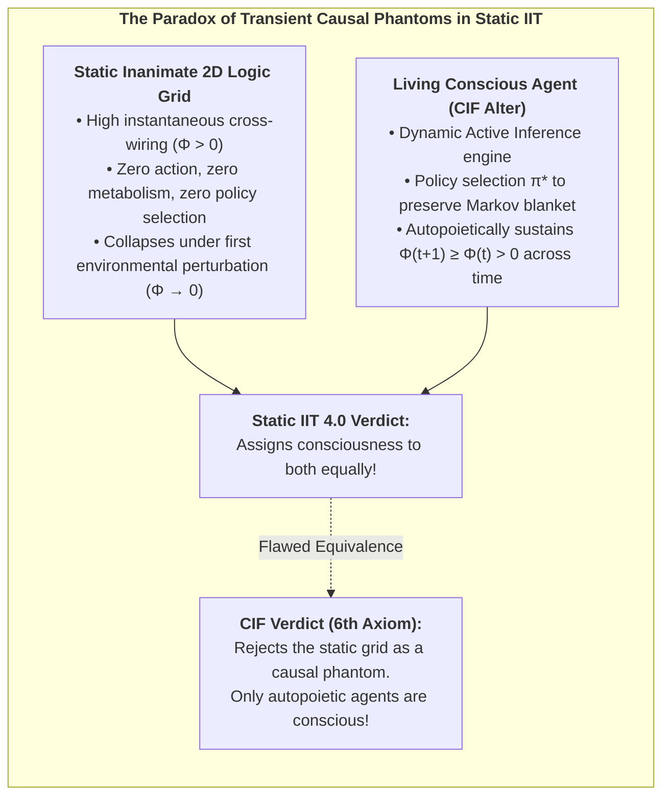
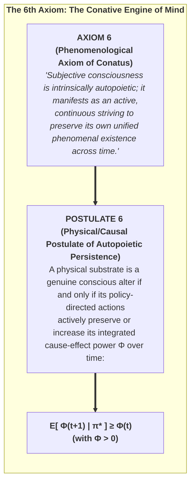
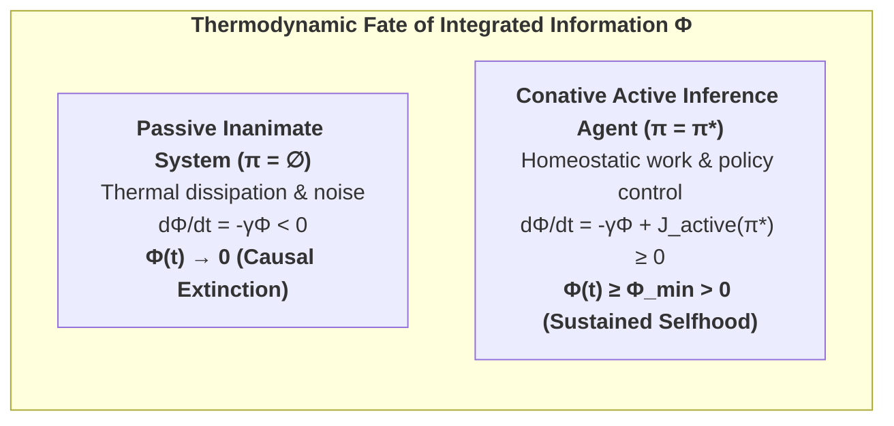

# Chapter 3: 1st-Person Causal Interiority: IIT 4.0 & The 6th Axiom

> *"Consciousness is integrated information. It is not an external observer looking at an internal screen; it is the intrinsic cause-effect power of a physical system upon its own past and future states."*  
> — **Giulio Tononi**, *Integrated Information Theory* (2016)

---

## 3.1 The Phenomenological Foundations of IIT 4.0

While the Free Energy Principle approaches the living organism from an objective, 3rd-person cybernetic vantage point, **Integrated Information Theory (IIT 4.0)** (Tononi, Albantakis, Boly, Massimini, & Koch, 2023) starts from the undeniable, immediate datum of human existence: **1st-person phenomenal interiority**.

Standard physicalist neuroscience typically attempts to deduce consciousness by examining brain anatomy and asking: *"How do physical neurons generate feelings?"* IIT turns this question on its head. It begins by identifying the essential, self-evident phenomenological properties that characterize *every conceivable conscious experience* (the **Axioms**), and then deduces the precise mathematical requirements that any physical substrate must satisfy to instantiate those properties (the **Postulates**).

### The Five Canonical Axioms & Postulates of IIT 4.0:

1. **Axiom 1: Existence (Realism of Phenomenality):**  
   Phenomenal consciousness exists immediately and undeniably (*Descartes' Cogito*).  
   * *Postulate 1:* The physical substrate must possess **intrinsic cause-effect power**: it must be capable of acting on itself and being affected by its own past states.

2. **Axiom 2: Intrinsicality (Subjective Interiority):**  
   Experience is intrinsic—it exists from its own internal vantage point, not as an input-output utility for an external user.  
   * *Postulate 2:* The cause-effect power must be evaluated from the system's own perspective, using conditional probability distributions over its own internal states.

3. **Axiom 3: Information (Qualitative Differentiation):**  
   Every conscious experience is informative and distinct—experiencing a dark room is fundamentally different from experiencing a vibrant sunset or hearing a cello sonata.  
   * *Postulate 3:* The system must specify a highly specific **cause-effect state**, ruling out alternative states within its multidimensional state space.

4. **Axiom 4: Integration (Phenomenal Unity):**  
   Every conscious experience is integrated—it is experienced as a unified whole that cannot be decomposed into independent sub-experiences. You cannot experience your visual field's left half without it being co-conscious with the right half and your current auditory sensations.  
   * *Postulate 4:* The cause-effect structure must be **irreducible to independent partitions**. Under the Minimum Information Partition (MIP), informational loss must be strictly positive ($\Phi > 0$).

5. **Axiom 5: Exclusion (Definite Boundaries):**  
   Every experience is definite in content and grain—it includes certain sensations and excludes others, resolving at a specific temporal scale ($\approx 10\text{--}100\text{ ms}$) rather than picoseconds or centuries.  
   * *Postulate 5:* Among overlapping candidate systems, only the set of elements specifying the **maximal integrated information ($\Phi^{\max}$)** forms the conscious complex (*The Exclusion Principle*).

### 3.1.1 The Unfolding Argument & The Refutation of Behaviorism:
Why cannot consciousness be measured purely by observing external behavior or functional input-output transformations?

In consciousness science, this question is formalized by the **Unfolding Argument** (Doerig, Schurger, Hess, & Tononi, 2019):

By the Krohn-Rhodes algebraic decomposition theorem, any finite recurrent neural network $R$ operating over a finite time interval $T$ can be mathematically unfolded into an equivalent purely feedforward directed acyclic graph (DAG) $F$ that computes the **exact same input-output function**:
$$f_R(x) \equiv f_F(x) \quad \forall x \in \mathcal{X}$$

* **Functionalism/Behaviorism:** Concludes that because $R$ and $F$ have identical behavior, both must be equally conscious (or equally unconscious).
* **Integrated Information Theory & CIF:** Reveals that while the recurrent network $R$ has high intrinsic cause-effect power ($\Phi > 0$), the feedforward network $F$ has $\Phi = 0$ because its Minimum Information Partition is completely trivial. $F$ is a computational zombie.

This proves that **consciousness is an intrinsic causal property of physical substrate architecture, not an input-output computation.**

---

## 3.2 Quantifying Cause-Effect Power ($\Phi$) and the Earth Mover's Distance

To evaluate whether a network of physical elements (neurons, transistors, ion channels) constitutes a unified conscious substrate, IIT formalizes the system's dynamics as a **Transition Probability Matrix (TPM)**:

$$T = P(S_{t+1} \mid S_t)$$

### Cause and Effect Repertoires:

Given a candidate system $S$ in current state $s_t$, we evaluate its **Cause Repertoire** (what past states $S_{t-1}$ could have produced $s_t$) and its **Effect Repertoire** (what future states $S_{t+1}$ will be produced by $s_t$):

$$\text{Cause Repertoire: } p_{\text{cause}}(S_{t-1} \mid s_t) = \frac{P(s_t \mid S_{t-1}) \cdot P(S_{t-1})}{P(s_t)}$$

$$\text{Effect Repertoire: } p_{\text{effect}}(S_{t+1} \mid s_t) = P(S_{t+1} \mid s_t)$$

### The Earth Mover's Distance ($W_1$) Metric:

In IIT 4.0, the distance between the unpartitioned cause-effect repertoire $p(S)$ and a partitioned repertoire $p_{\text{partitioned}}(S \mid \theta)$ is quantified using the **Wasserstein Metric (Earth Mover's Distance, $W_1$)**:

$$D(p \parallel p_{\text{partitioned}}) = W_1\big(p, p_{\text{partitioned}}\big) = \inf_{\gamma \in \Pi(p, p_{\text{part}})} \mathbb{E}_{(x, y) \sim \gamma}\big[d(x, y)\big]$$

Where $d(x, y)$ is the Hamming distance between states, and $\Pi(p, p_{\text{part}})$ is the set of all valid probability couplings.

### Integrated Information across the Minimum Information Partition (MIP):

The integrated information of the system is the causal distance measured at the **weakest causal link** of the network:

$$\Phi(S) = \min_{\theta \in \mathcal{P}} W_1\Big(p(S), p_{\text{partitioned}}(S \mid \theta)\Big)$$

* If $\Phi(S) = 0$, the system is completely reducible to independent, non-interacting sub-components (like a pile of sand or a bank of disconnected memory registers). It possesses zero 1st-person interiority.
* If $\Phi(S) > 0$, the system is causally irreducible: it exists for itself as a unified ontological whole.

---

## 3.3 Qualia Space Geometry: Distinctions, Relations, and Causal Polyhedra

In IIT 4.0, integrated information $\Phi$ is not merely a single scalar quantity representing the *quantity* of consciousness. The *quality* of an experience—why the subjective redness of a rose feels fundamentally distinct from the sharp timbre of a trumpet or the visceral ache of grief—is determined by the full, high-dimensional **Cause-Effect Structure (CES)**, often formalized as a geometric polyhedron in **Qualia Space** $\mathfrak{Q}$.

### 1. Distinctions (The Vertices of Experience):
A distinction $d$ is specified by a mechanism $m \subseteq S$ (a subset of nodes within the candidate complex) that has irreducible cause-effect power over a purview $z \subseteq S$:
$$d = \Big(m, \, p_{\text{cause}}(z_{\text{past}} \mid s_m), \, p_{\text{effect}}(z_{\text{fut}} \mid s_m), \, \varphi(d)\Big)$$
Where $\varphi(d) = \min\big(\varphi_{\text{cause}}(d), \varphi_{\text{effect}}(d)\big)$ is the small-phi irreducibility of the individual distinction. Each distinction acts as a specific phenomenal primitive (e.g., an edge detector, a pitch discriminator, a spatial locator).

### 2. Relations (The Faces and Topology of Experience):
Distinctions do not exist in isolation; they bind together through shared causal purviews. A relation $r$ between a set of distinctions $D = \{d_1, d_2, \dots, d_k\}$ quantifies the irreducible joint overlap among their cause-effect repertoires:
$$\varphi(r) = W_1\left( \bigcap_{i=1}^k p(z_i \mid s_{m_i}), \, \prod_{i=1}^k p(z_i \mid s_{m_i}) \right)$$
Relations weave the individual distinctions into an interconnected topological manifold—creating the structural phenomenal dimensions of space, depth, harmony, and intensity.

### 3. The Unfolded Causal Polyhedron ($\Sigma$):
The complete cause-effect structure $\Sigma(S, s) = (\{d\}, \{r\})$ is an unfolded geometric object in $2^{|S|}$-dimensional space. Under IIT 4.0:
* **The existence of $\Sigma$ is the phenomenal experience.**
* **The symmetries, curvature, and topological invariants of $\Sigma$ are the experiential qualities (qualia).**
* An unfolded structure with spatial grid topology specifies phenomenal 2D/3D space; a structure with hierarchical tree topology specifies conceptual abstractions.

---

## 3.4 The Static Flaw of IIT 4.0: The Paradox of Causal Phantoms

Despite its mathematical rigor, standard IIT 4.0 contains a profound, fatal limitation: **it is entirely static and time-slice bound**.

In Tononi’s formulation, $\Phi$ is computed strictly across a single instantaneous state transition $t \to t+1$. The theory possesses no concept of temporal agency, active inference, metabolic maintenance, or autopoietic survival.

Consequently, standard IIT 4.0 falls victim to what computer scientist Scott Aaronson (2014) and Thomas Riebl (2026) have termed the **Paradox of Transient Causal Phantoms**:

### The Absurd Consequences of Static IIT:
1. **The Inanimate Grid Paradox:** A static 2D grid of interconnected XOR lookup gates stored in silicon—possessing zero metabolism, zero agency, and zero self-preservation—is assigned a massive $\Phi$ score simply because of its wiring topology.
2. **The Ephemerality of Non-Living Systems:** Under thermal fluctuations, an inanimate circuit cannot execute active control to preserve its configuration. Within milliseconds, physical entropy randomizes its gates, and its causal power collapses:
   $$\Phi(t) > 0 \quad \xrightarrow{\;\text{Thermal Drift}\;} \quad \Phi(t+1) = 0$$

In living nature, consciousness is never a frozen mathematical snapshot; it is an **active, self-maintaining temporal process**.

---

## 3.5 The Discovery of the 6th Axiom: The Will to Exist (Conatus)

To resolve the static flaw of IIT and unite 1st-person interiority with evolutionary biology, **Thomas Riebl (2026)** introduced **The 6th Axiom and Postulate of Consciousness**:

### Formal Statement of Axiom 6:
> **Axiom 6 (The Will to Exist / Conatus):**  
> *Subjective consciousness is not a passive, static reflection of information. Every conscious experience is intrinsically temporal and autopoietic; it is experienced as an active, continuous striving of the self to maintain its unified experiential existence against destruction, decay, and entropic dissolution.*

### Formal Statement of Postulate 6:
> **Postulate 6 (Autopoietic Causal Persistence):**  
> *A physical substrate $S$ is a genuine substrate of consciousness if and only if its policy-directed active inference $\pi^*$ actively maintains its integrated cause-effect power ($\Phi$) within a non-equilibrium steady state over successive temporal horizons:*

$$\mathbb{E}\Big[\Phi(t+1) \;\Big|\; \pi^*\Big] \;\ge\; \Phi(t) \quad \text{with } \Phi(t) > 0$$

Where $\pi^* = \arg\min_\pi \mathbf{G}(\pi)$ is the optimal policy selected by the agent's generative model.

---

## 3.6 Mathematical Formulation of the Conative Constraint and Causal Degradation

To understand why the 6th Axiom is mathematically indispensable, let us analyze the temporal evolution of integrated information in any physical system embedded in a stochastic environment.

### The Physics of Causal Degradation (Passive Entropy):
Consider a network whose synaptic or coupling weights $W_{ij}(t)$ govern the Transition Probability Matrix $T$. In an open thermodynamic environment at temperature $T_{\text{env}} > 0$, passive physical coupling weights undergo continuous thermal dissipation governed by an Ornstein-Uhlenbeck or Langevin drift:
$$\dot{W}_{ij}(t) = -\gamma W_{ij}(t) + \sqrt{2 D_{\text{th}}} \, \xi_{ij}(t)$$
Where $\gamma > 0$ represents the natural dissipation rate (synaptic decay, thermal decoherence, ion diffusion), $D_{\text{th}}$ is the thermal diffusion constant, and $\xi_{ij}(t)$ is standard Gaussian white noise.

Under this uncompensated degradation, the Minimum Information Partition (MIP) rapidly detaches, and the Earth Mover's Distance $W_1(p, p_{\text{part}})$ decays exponentially:
$$\Phi(t) = \Phi_0 \cdot \exp(-\gamma t) \quad \implies \quad \lim_{t \to \infty} \Phi(t) = 0$$

### The Active Conative Counter-Current:
To prevent causal extinction, a conscious system must generate an active informational flux $J_{\text{active}}(\pi^*)$ that matches or exceeds the natural decay rate:
$$\frac{d\Phi(t)}{dt} = -\gamma \Phi(t) + \mathcal{F}\Big(\mathbf{a}_t, \mathbf{s}_t\Big) \ge 0$$
Where $\mathcal{F}(\mathbf{a}_t, \mathbf{s}_t)$ is the rate of causal renewal achieved through policy execution (e.g., metabolic intake, active sensory foraging, synaptic homeostatic scaling, and predictive error correction).

This yields the **Thermodynamic-Conative Theorem**:
$$\text{A physical complex } S \text{ can sustain } \Phi(S) > 0 \text{ over macroscopic time } \tau \gg 1/\gamma \text{ if and only if it performs continuous active inference to minimize its expected free energy } \mathbf{G}(\pi^*).$$

---

## 3.7 Philosophical Significance of the 6th Axiom

The introduction of the 6th Axiom transforms the foundations of consciousness research in three critical dimensions:

1. **Elimination of Panpsychist and Mechanical Artifacts:**  
   Inanimate 2D lookup tables, static logic arrays, and feedforward deep neural networks fail Postulate 6 because they possess no active inference loop to protect their $\Phi$. Under environmental stress, their $\Phi$ disintegrates. They are revealed as non-conscious **Causal Phantoms**.

2. **Integration of Spinozian Conatus & Schopenhauerian Will:**  
   The 6th Axiom establishes that Spinoza's *Conatus* (*the striving of a thing to persist in its own being*) and Schopenhauer's *Will* are not poetic metaphors, but the fundamental mathematical condition for conscious interiority.

3. **The Unavoidable Bridge to Active Inference:**  
   Postulate 6 requires an agent to *act* in order to sustain $\Phi(t+1) \ge \Phi(t)$. But *how* does a physical system select actions to preserve its causal integration? 

This question demands an explicit cybernetic engine—which is precisely the minimization of Expected Free Energy $\mathbf{G}(\pi)$.

In Chapter 4, we prove the **Fundamental Master Equivalence** that connects these two pillars into an ontologically closed whole.

