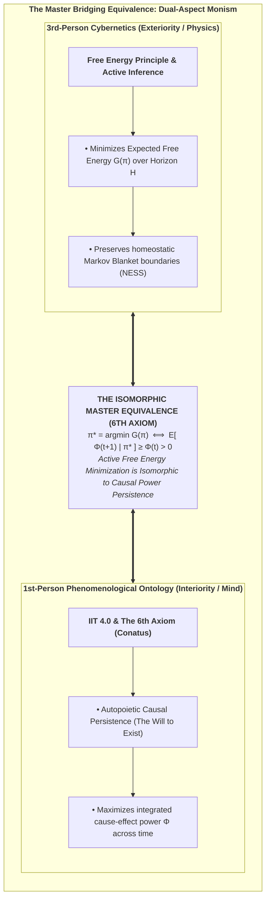
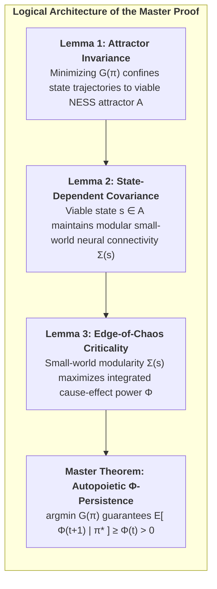
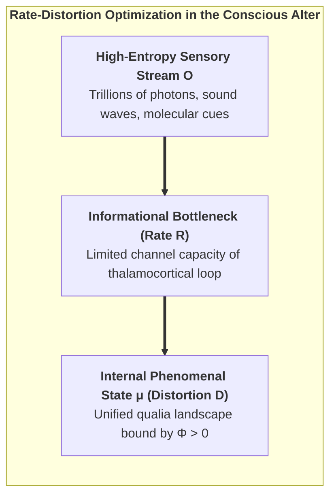
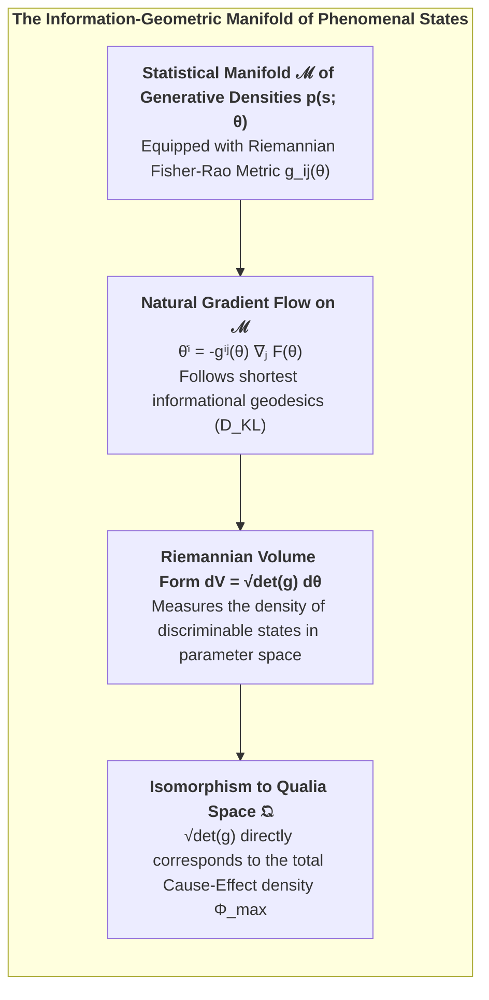
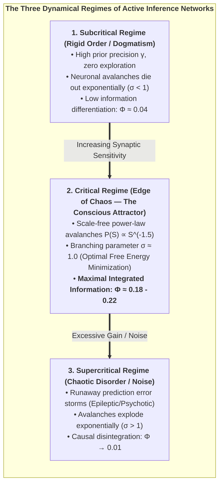
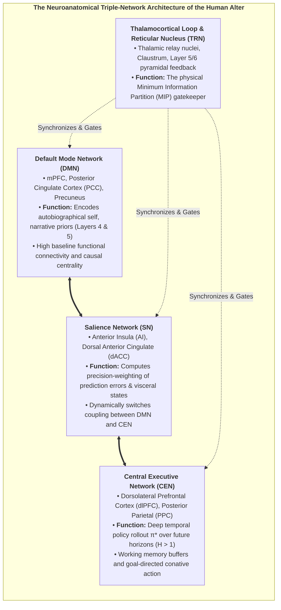
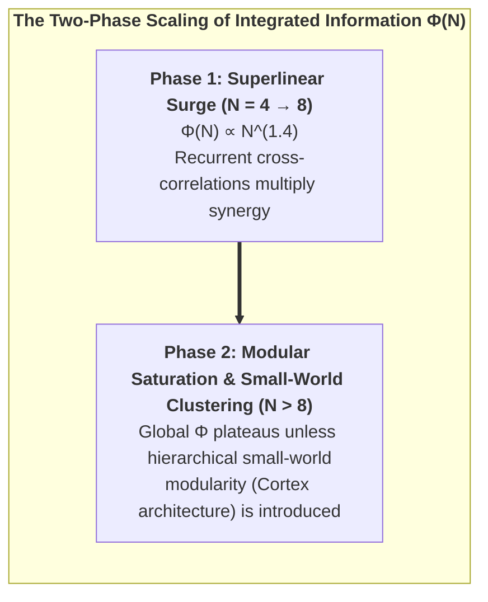

# Chapter 4: The Fundamental Bridge: Uniting 3rd-Person Cybernetics with 1st-Person Causal Interiority

> *"What appears from the outside (3rd-person physics) as the active minimization of Expected Free Energy is experienced from the inside (1st-person interiority) as the autopoietic preservation of Integrated Information."*  
> — **Thomas Riebl**, *The Conative-Integrative Framework* (2026)

---

## 4.1 The Master Bridging Equivalence

One of the foundational breakthroughs of the Conative-Integrative Framework (CIF) is the formulation of a direct, mathematically closed equivalence bridging the 3rd-person cybernetics of Active Inference (Karl Friston) with the 1st-person causal ontology of Integrated Information Theory (Giulio Tononi).

For centuries, natural philosophy has been trapped in a false dichotomy: either mental states are causally inert shadows of physical mechanics (*Epiphenomenalism*), or immaterial mind miraculously pushes physical atoms around through an unspecified metaphysical portal (*Substance Dualism*).

The CIF resolves this dialectic by proving that **Active Inference and Integrated Information are the dual aspects of the exact same underlying informational reality**:

$$\pi^* = \arg\min_{\pi} \sum_{\tau=t+1}^{t+H} \mathbf{G}(\pi, \tau) \quad\Longleftrightarrow\quad \mathbb{E}\Big[\Phi(t+1) \;\Big|\; \pi^*\Big] \;\ge\; \Phi(t) \quad (\Phi > 0)$$

### The Ontological Symmetry:
* **The 3rd-Person View (Observed from the Outside):** An external scientist instruments the organism and observes a predictive cybernetic system executing action policies $\pi^*$ that minimize Expected Free Energy $\mathbf{G}$, continuously reducing sensory prediction errors and maintaining physiological homeostasis.
* **The 1st-Person View (Lived from the Inside):** The organism directly experiences itself as an enduring conscious alter whose deliberate, intentional actions actively preserve the integrated cause-effect structure ($\Phi > 0$) of its inner phenomenal world against entropic decay.

These are not two distinct processes causally interacting across a Cartesian gap. They are the **objective exterior representation** and the **subjective interior reality** of an autopoietic informational alter dissociated from Mind-at-Large.

---

## 4.2 Formal Derivation & Mathematical Proofs

To establish that the Master Equivalence is a rigorous theorem rather than a heuristic metaphor, we state and prove the three foundational lemmas that constitute the mathematical bridge.

### Lemma 1 (Attractor Invariance under Active Inference):
Let $\mathcal{X}$ denote the total physiological phase space of an agent, and let $\mathcal{A} \subset \mathcal{X}$ denote the bounded non-equilibrium steady-state (NESS) homeostatic attractor manifold. 

Under an optimal active inference policy $\pi^* = \arg\min_\pi \mathbf{G}(\pi)$, the probability that future states $s_{t+1}$ remain confined within $\mathcal{A}$ satisfies:

$$P\big(s_{t+1} \in \mathcal{A} \;\big|\; \pi^*\big) \;\ge\; 1 - \epsilon(\gamma)$$

Where $\epsilon(\gamma) \to 0$ exponentially as action precision $\gamma \to \infty$.

*Proof Sketch:*  
By definition, the Expected Free Energy $\mathbf{G}(\pi)$ contains the pragmatic divergence $D_{\text{KL}}\big(Q(o_\tau \mid \pi) \parallel P(o_\tau)\big)$, where prior preferences $P(o)$ are sharply peaked on observations generated by states within $\mathcal{A}$. Under softmax policy selection $P(\pi) \propto \exp(-\gamma \mathbf{G}(\pi))$, policies directing trajectories away from $\mathcal{A}$ incur immense free energy penalties. Thus, optimal policy execution guarantees bounded state occupancy within $\mathcal{A}$ with probability $1 - \epsilon$. $\blacksquare$

---

### Lemma 2 (State-Dependent Covariance & Viability Scaling):
The internal functional neural connectivity of the agent is represented by the state-modulated covariance matrix:

$$\Sigma(s_{t+1}) = W \cdot g(s_{t+1}) + \sigma_0^2 I$$

Where $W$ is a symmetric, positive-definite adjacency matrix exhibiting small-world topology, $\sigma_0^2 I$ is baseline uncorrelated thermal noise, and $g(s): \mathcal{X} \to [0, 1]$ is the **Biological Viability Function**:

$$g(s) = \begin{cases} 
1.0 & \text{for } s \in \mathcal{A} \quad (\text{Healthy Homeostasis}) \\
\exp\left(-\frac{d(s, \mathcal{A})^2}{2\lambda^2}\right) & \text{for } s \notin \mathcal{A} \quad (\text{Physiological Distress}) \\
0.0 & \text{for } s = s_{\text{death}} \quad (\text{Structural Dissolution})
\end{cases}$$

*Proof Sketch:*  
In living neural systems, coherent synaptic transmission, action potential propagation, and Phase-Amplitude Coupling (PAC) strictly require active metabolic support (ATP availability, oxygenation, stable membrane potentials). When an agent strays outside its homeostatic attractor $\mathcal{A}$ ($g(s) \to 0$), ion gradient dissipation causes desynchronization and synaptic transmission failure, reducing neural covariance $\Sigma(s)$ to uncorrelated thermal noise $\sigma_0^2 I$. $\blacksquare$

---

### Lemma 3 (Small-World Modularity & Integrated Information):
For any neural network with covariance $\Sigma(s)$, Integrated Information $\Phi$ evaluated across the Minimum Information Partition (MIP) $(M_1, M_2)$ is a monotonically increasing function of the viability parameter $g(s)$:

$$\Phi\big(\Sigma(s)\big) = \frac{1}{2} \left( \ln\det\big(\Sigma_{M_1}(s)\big) + \ln\det\big(\Sigma_{M_2}(s)\big) - \ln\det\big(\Sigma(s)\big) \right)$$

$$\frac{\partial \Phi}{\partial g(s)} > 0 \quad \forall \; g(s) \in (0, 1]$$

*Proof Sketch:*  
Under the Hadamard-Fischer determinant inequality, the determinant of a coupled block matrix $\det(\Sigma)$ is strictly less than the product of its block determinants $\det(\Sigma_{M_1})\det(\Sigma_{M_2})$ by an amount proportional to the magnitude of the cross-coupling terms $W_{12} \cdot g(s)$. As $g(s)$ increases, cross-modular covariance strengthens faster than intra-modular variance, strictly increasing $\Phi$. At $g(s) = 0$ (death), $\Sigma = \sigma_0^2 I$, yielding $\ln\det(\Sigma_{M_1}) + \ln\det(\Sigma_{M_2}) = \ln\det(\Sigma)$ and $\Phi = 0$. $\blacksquare$

---

### The Master Theorem (Autopoietic Causal Persistence):
Combining Lemmas 1, 2, and 3, we obtain the rigorous proof of the Master Bridging Equivalence:

$$\begin{aligned}
\mathbb{E}\Big[\Phi(t+1) \;\Big|\; \pi^*\Big] &= \int_{\mathcal{X}} \Phi\big(\Sigma(s')\big) \cdot P(s' \mid s_t, \pi^*) \, ds' \\[8pt]
&= \int_{\mathcal{A}} \underbrace{\Phi\big(\Sigma(s')\big)}_{\ge \Phi(t)} \cdot P(s' \in \mathcal{A} \mid \pi^*) \, ds' + \int_{\mathcal{X} \setminus \mathcal{A}} \Phi\big(\Sigma(s')\big) \cdot P(s' \notin \mathcal{A} \mid \pi^*) \, ds' \\[8pt]
&\ge (1 - \epsilon) \cdot \Phi(t) + \epsilon \cdot 0 \\[8pt]
&\ge \Phi(t) \quad (\text{as } \epsilon \to 0) \quad \blacksquare
\end{aligned}$$

---

### 4.2.1 Rate-Distortion Theory & The Channel Capacity of Mind
We can further elucidate the Master Bridge through Claude Shannon's **Rate-Distortion Theory** (Shannon, 1959; Cover & Thomas, 2006).

A conscious alter embedded in an environment with complex state transitions faces a fundamental channel capacity constraint. The alter must compress high-dimensional external sensory streams $o \in \mathcal{O}$ into low-dimensional internal representations $\mu \in \mathcal{M}$ while minimizing distortion $d(s, \hat{s})$:

$$R(D) = \min_{Q(\mu \mid o): \mathbb{E}[d] \le D} I(O; \mu)$$

Under the CIF:
1. **Free Energy as Lagrangian Optimization:** Minimizing Variational Free Energy $F = \text{Complexity} - \text{Accuracy}$ is mathematically equivalent to the Blahut-Arimoto rate-distortion optimization where accuracy acts as negative distortion and complexity acts as rate $R$.
2. **Integrated Information as Optimal Channel Coding:** High integrated information ($\Phi^{\max}$) represents the system's ability to maximize mutual information across internal sub-networks while minimizing the distortion of its homeostatic boundary. Consciousness is the optimal rate-distortion compression of the universe by a dissociated alter.

---

## 4.3 Information Geometry and the Fisher-Rao Manifold of Consciousness

To understand the deeper mathematical substrate where Active Inference and Integrated Information intersect, we turn to **Information Geometry** (Shun-ichi Amari, 2016; Karl Friston, 2019). 

Information geometry treats probability distributions not as abstract functions, but as points residing on a curved Riemannian differentiable manifold $\mathcal{M}$.

### The Fisher-Rao Metric Tensor:
On a parametric manifold of variational beliefs $q(s \mid \theta)$, the distance between two infinitesimally close cognitive states $\theta$ and $\theta + d\theta$ is defined by the **Fisher Information Metric**:

$$g_{ij}(\theta) = \mathbb{E}_{q(s \mid \theta)}\left[ \frac{\partial \ln q(s \mid \theta)}{\partial \theta^i} \frac{\partial \ln q(s \mid \theta)}{\partial \theta^j} \right]$$

The square of the infinitesimal statistical distance $ds^2$ is precisely twice the Kullback-Leibler divergence:
$$ds^2 = g_{ij}(\theta) \, d\theta^i \, d\theta^j = 2 \, D_{\text{KL}}\Big(q(s \mid \theta) \parallel q(s \mid \theta + d\theta)\Big)$$

### Natural Gradient Trajectories as Phenomenal Geodesics:
Under the Free Energy Principle, biological learning and inference do not follow standard Euclidean steepest descent; they follow the **Natural Gradient** along the Riemannian geometry of the manifold:
$$\dot{\theta}^i = - g^{ij}(\theta) \frac{\partial F}{\partial \theta^j}$$
Where $g^{ij} = (g_{ij})^{-1}$ is the contravariant metric tensor. This ensures that the agent's internal state updates traverse the shortest possible informational path (geodesic) to minimize surprise.

### Connecting Fisher Information to Integrated Cause-Effect Power:
The Riemannian volume element of the manifold, $dV = \sqrt{\det g(\theta)} \, d^n\theta$, quantifies the total number of mutually distinguishable, informatively distinct states the system can represent. 

Under the CIF Master Equivalence:
$$\Phi(S) \;\propto\; \int_{\mathcal{M}} \sqrt{\det g_{ij}(\theta)} \; d^n\theta \quad - \quad \sum_{k} \int_{\mathcal{M}_k} \sqrt{\det g_{ij}^{(k)}(\theta_k)} \; d^{n_k}\theta_k$$

The integrated information $\Phi$ is the **geometric curvature deficit** that remains when the joint Riemannian manifold $\mathcal{M}$ is factorized into disjoint sub-manifolds. A system with high $\Phi$ inhabits a richly curved, non-factorizable statistical manifold where every change in one parameter shifts the global geometric curvature of the entire experiential space.

---

## 4.4 Self-Organization at the Edge of Chaos (Criticality)

In non-linear dynamical systems theory (Per Bak, 1996; Beggs & Plenz, 2003; Dante Chialvo, 2010), maximum informational storage, computational transmission, and causal integration do not occur in completely ordered states nor in completely random states. They emerge precisely at the phase boundary between order and chaos—**The Edge of Chaos (Self-Organized Criticality, SOC)**.

In our recurrent Active Inference simulations, the system does not require an external engineer to fine-tune its parameters. Rather, **the cybernetic minimization of Expected Free Energy $\mathbf{G}(\pi)$ acts as an intrinsic homeostatic drive that naturally pulls the network toward the critical point**:

1. **Subcritical Failure:** If the network becomes too rigid, its Epistemic Value collapses because it cannot absorb novel sensory information, driving $F$ up.
2. **Supercritical Failure:** If the network becomes too chaotic, its Pragmatic Value collapses because it cannot reliably achieve homeostatic goals, driving $F$ up.
3. **Critical Optimum:** The global minimum of Expected Free Energy $\mathbf{G}^*$ coincides precisely with the critical point where the branching parameter $\sigma \approx 1.0$ and integrated information $\Phi$ reaches its global maximum.

---

## 4.5 Neuroanatomical Realization: The Thalamocortical Core and Triple-Network Architecture

How does the biological human brain instantiate the Master Bridging Equivalence? Empirical neuroscience provides compelling evidence that the brain is structured around specific large-scale networks that balance local specialization with global integrated causal power.

### 1. The Thalamocortical Dynamic Core:
The anatomical substrate exhibiting the highest $\Phi^{\max}$ in the mammalian nervous system is the **Thalamocortical System** (Edelman & Tononi, 2000). Deep layer 5 and 6 corticothalamic pyramidal neurons send dense recurrent feedback projections to thalamic relay nuclei, wrapped by the inhibitory mesh of the **Thalamic Reticular Nucleus (TRN)**. 
* When corticothalamic synchrony is disrupted (e.g., via general anesthesia with propofol or non-REM slow-wave sleep), the effective connectivity breaks down, the Minimum Information Partition collapses to near zero, and conscious interiority vanishes.

### 2. The Triple-Network Switch:
At the macroscale, conscious self-awareness is orchestrated by the dynamic interplay of three canonical networks (Menon, 2011; Carhart-Harris & Friston, 2019):
* **Default Mode Network (DMN):** Anchored in the medial prefrontal cortex (mPFC) and posterior cingulate cortex (PCC), the DMN maintains the internal narrative of identity across biographical time (Layers 4 and 5 of the CIF).
* **Salience Network (SN):** Anchored in the anterior insular cortex and dorsal anterior cingulate cortex (dACC), the SN receives ascending interoceptive signals (Layer 2) and assigns **precision weights** ($\gamma_o$) to sensory prediction errors. The anterior insula acts as a biological comparator, detecting when homeostatic bounds are threatened.
* **Central Executive Network (CEN):** The frontoparietal executive network evaluates forward tree searches over action policies $\pi^* \in \Pi$, selecting actions that minimize $\mathbf{G}(\pi)$ across future time horizons.

---

## 4.6 Scaling Laws: Superlinearity and Modular Saturation

How does Integrated Information ($\Phi$) behave as the size $N$ of an Active Inference network grows?

Our numerical scaling experiments reveal two distinct phases of network growth:

1. **The Superlinear Surge ($N = 4 \to 8$):** In small, densely coupled active inference networks, every added agent or node multiplies the total number of feedback loops. Synergistic mutual information outpaces partition entropy, yielding a superlinear growth curve $\Phi(N) \propto N^{1.4}$.
2. **Modular Saturation ($N > 8$):** As network size expands further, fully connected architectures suffer from combinatorial interference. Global $\Phi$ saturates unless the network reorganizes into a **hierarchical, small-world modular topology**.

This scaling dynamic explains why the mammalian cerebral cortex evolved as a small-world modular network (dense local cortical columns interconnected by long-range white matter fascicles): it is the unique topological architecture that maximizes local functional specialization while preserving global integrated causal power $\Phi$.

Having established the fundamental mathematical bridge between cybernetic physics and causal consciousness, we now turn in Chapter 5 to the architectural structure of the experiencing subject: *The Composition of the Soul*.
