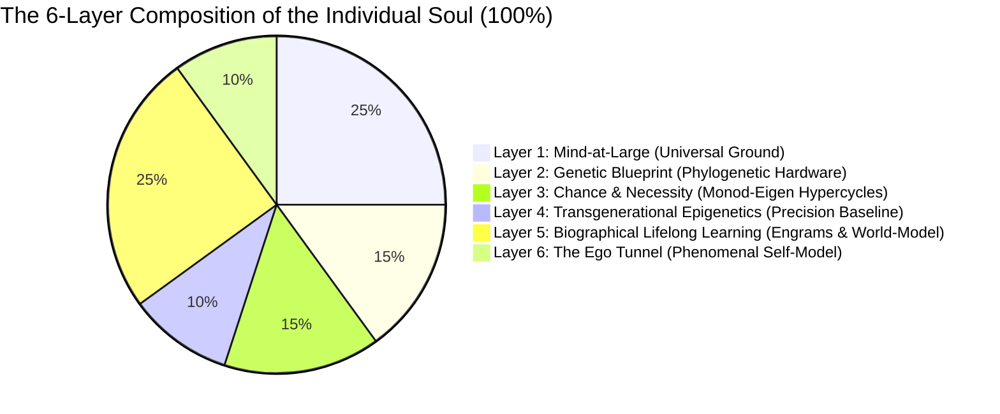
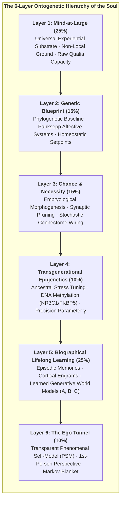
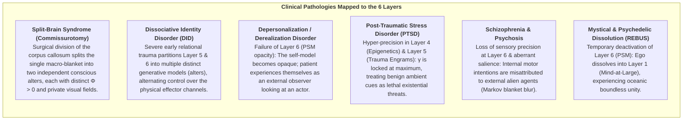

# Chapter 5: The Composition of the Soul: The 6-Layer Ontogenetic Tapestry

> *"The soul is not an indivisible, supernatural ghost, nor is it a meaningless neural illusion. It is a hierarchical, autopoietic tapestry of informational processes spanning genetics, developmental chance, ancestral epigenetics, biographical learning, and universal consciousness."*  
> — **Thomas Riebl**, *The Composition of the Soul* (2026)

---

## 5.1 Beyond Substance Dualism and Eliminative Materialism

What constitutes an individual human soul? 

Throughout the history of Western thought, two extreme and equally inadequate dogmas have dominated the discourse:
1. **Cartesian Substance Dualism:** Postulates that the soul is an immaterial, indivisible spiritual substance (*res cogitans*) magically tethered to a mechanical physical body (*res extensa*) via the pineal gland. This view fails entirely to account for the neurobiological, genetic, and pharmacological dependencies of personality, memory, and cognitive capacity.
2. **Eliminative Materialism:** Asserts that the "soul" and subjective self are non-existent illusions—that a human being is nothing more than an accidental assembly of selfish genes and mechanical biochemical reflexes. This view fails to account for the undeniable reality of 1st-person phenomenal existence and the hard problem of consciousness.

The Conative-Integrative Framework resolves this ancient dispute by defining the individual soul as **a 6-Layer Autopoietic Tapestry of Information**. An individual alter is neither an indivisible monad nor a random biochemical automaton; it is a structured, quantitative composite of biological, environmental, and cosmic factors that together sum to $100\%$[^ch5_indicative_note].

---

## 5.2 The Six Architectural Layers of the Soul

---

### Layer 1: Mind-at-Large (The Universal Experiential Field) — $25\%$
* **Ontological Nature:** The fundamental, non-local substrate of consciousness itself. Following Baruch Spinoza's *Substance Monism*, Bernardo Kastrup's *Analytic Idealism*, and ancient non-dual philosophy (Advaita Vedanta), consciousness is not manufactured by neural wetware; rather, universal consciousness is the primordial canvas upon which all localized phenomena appear.
* **Functional Contribution:** Provides the raw qualitative capacity for phenomenal experience (*qualia*), the transpersonal ground of existence, and the eternal ocean into which localized individual awareness dissolves upon biological death.

---

### Layer 2: The Genetic Blueprint (Phylogenetic Baseline) — $15\%$
* **Biological Substrate:** The inherited evolutionary code written into the nucleotide sequences of the human genome. Following neurobiologist **Gerhard Roth (2003, 2021)** and affective neuroscientist **Jaak Panksepp (1998)**:
* **The 7 Subcortical Affective Operating Systems:** Genetics hardwires the deep brainstem, hypothalamic, and lower limbic circuits governing primal emotional drivers:
  1. `SEEKING` (mesolimbic dopamine pathway from the ventral tegmental area [VTA] to nucleus accumbens; drives exploratory foraging, curiosity, and forward epistemic momentum).
  2. `FEAR` (central amygdala to lateral hypothalamus and ventral periaqueductal gray [vPAG]; orchestrates freezing, tachycardia, and active avoidance).
  3. `RAGE` (medial amygdala to stria terminalis and dorsal PAG; defense against physical restraint and boundary violation).
  4. `PANIC / GRIEF` (anterior cingulate cortex and dorsomedial thalamus to dorsal PAG; mediated by rapid drops in endogenous $\mu$-opioids; generates separation distress).
  5. `CARE` (ventral bed nucleus of stria terminalis and medial preoptic area; driven by oxytocin, prolactin, and endogenous opioids; supports maternal/paternal nurturing).
  6. `PLAY` (dorsomedial thalamus and dorsal striatum; promotes safe social wrestling and joyful motor synchrony).
  7. `LUST` (hypothalamic ventromedial nucleus and medial preoptic area; modulated by sex steroids and vasopressin).
* **Cybernetic Role:** Establishes the immutable phylogenetic prior state vector $D = P(s_0)$ and primary homeostatic setpoints (*Conatus*) that constrain all downstream learning.

---

### Layer 3: Chance and Teleonomic Necessity (Embryological Morphogenesis) — $15\%$
* **Biophysical Substrate:** The self-organizing dynamical noise bridging genetic code and macroscopic neuroanatomy. Following Nobel laureate **Jacques Monod (1970)** (*Chance and Necessity*) and biophysicist **Manfred Eigen (1971)** (*The Hypercycle*):
* **Stochastic Self-Organization:** DNA does not contain a deterministic wiring diagram for each of the brain's $86 \times 10^9$ neurons and $10^{14}$ synapses. Instead, development operates through non-linear morphogenetic chemical gradients (Turing patterns), stochastic axonal pathfinding, and competitive synaptic pruning.
* **Individual Uniqueness:** Monozygotic (identical) twins sharing $100\%$ identical DNA diverge prenatally in cortical gyral patterns, vascular branching, and micro-connectome topology due to developmental noise. This layer ensures that every conscious alter possesses an irreducibly unique physical substrate.

---

### Layer 4: Transgenerational Epigenetics (Ancestral Calibration) — $10\%$
* **Molecular Substrate:** Heritable biochemical annotations that regulate chromatin accessibility and gene transcription without modifying the underlying DNA nucleotide sequence.
* **Empirical Mechanisms:** Following **Rachel Yehuda (2018)**, **Isabelle Mansuy (2014)**, and **Eva Jablonka (2014)**:
  * **DNA Methylation:** Cytosine methylation at CpG islands within the promoter region of the *NR3C1* gene (encoding the glucocorticoid receptor) and the *FKBP5* gene (a co-chaperone regulating glucocorticoid receptor sensitivity).
  * **Histone Post-Translational Modifications:** Deacetylation of histones H3 and H4, condensing chromatin into transcriptionally silent heterochromatin.
  * **Sperm and Oocyte Small Non-Coding RNAs:** Environmental shock and severe ancestral starvation transfer small non-coding RNAs (sncRNAs, microRNAs, tRNA fragments [tsRNAs]) into male gametes, directly reprogramming early zygotic transcription in subsequent generations.
  * **Phenotypic Consequence:** Offspring inherit a pre-calibrated hypothalamic-pituitary-adrenal (HPA) axis, exhibiting heightened vigilance or blunted cortisol reactivity before personal life experience begins.
* **Cybernetic Role:** Serves as a transgenerational bridge calibrating the **Precision Parameter ($\gamma = (\sigma^2)^{-1}$)**—weighting sensory prediction errors against environmental volatility.

---

### Layer 5: Biographical Lifelong Learning & Cognitive World-Modeling — $25\%$
* **Neuroplastic Substrate:** The unique autobiographical narrative of the individual encoded across cortical-hippocampal networks. Following **Gerhard Roth’s upper limbic and neocortical levels** and **Eric Kandel’s Nobel-winning molecular mechanisms of memory**:
* **Mechanisms:** Long-Term Potentiation (LTP), dendritic spine remodeling, CREB-mediated protein synthesis, and associative conditioning.
* **Functional Content:** The explicit memories, cultural socialization, linguistic categories, moral values, trauma history, and specialized skills that distinguish one person's biography from another.
* **Cybernetic Role:** Fills in the POMDP Likelihood Tensor ($A$), Causal Transition Tensor ($B$), and Prior Value Preferences ($C$).

---

### Layer 6: The Ego Tunnel (The Phenomenal Self-Model) — $10\%$
* **Cognitive Substrate:** The real-time computational simulation of being an abiding, unified 1st-person self. Following cognitive philosopher **Thomas Metzinger (2003, 2009, 2024)** (*Being No One* & *The Ego Tunnel*):
* **Phenomenal Transparency:** The predictive brain continuously runs a **Phenomenal Self-Model (PSM)** to bind sensory-motor loops. Because the brain has no conscious access to the underlying computational algorithms generating the model, the model is experienced as *transparent*: we do not experience a model of reality; we experience *being* in reality.
* **Cybernetic Role:** The PSM constitutes the internal boundary of the Markov Blanket ($\mathcal{B} = \{s, a\}$), anchoring all active inference in an egocentric spatial and temporal frame of reference.

---

## 5.3 Active Inference Mapping: Uniting Neurobiology with POMDP Tensors

In the Conative-Integrative Framework, the six layers of the soul map directly onto the formal parameters of a discrete Partially Observable Markov Decision Process (POMDP):

| Layer | Soul Architectural Dimension | Contribution | POMDP Mathematical Object | Active Inference Role |
| :--- | :--- | :---: | :--- | :--- |
| **Layer 1** | **Mind-at-Large** | $25\,\%$ | **State Space ($\mathcal{S}$)** | The universal phase space of all possible experiential configurations |
| **Layer 2** | **Genetics** | $15\,\%$ | **Prior State Vector ($D = P(s_0)$)** | Phylogenetic setpoints; hardwired homeostatic attractors (*Conatus*) |
| **Layer 3** | **Chance & Necessity** | $15\,\%$ | **Hypercycle Transition Dynamics** | Developmental noise seeding the unique structural topology of the brain |
| **Layer 4** | **Epigenetics** | $10\,\%$ | **Precision Parameter ($\gamma = (\sigma^2)^{-1}$)** | Transgenerational calibration of sensory prediction error weighting |
| **Layer 5** | **Lifelong Learning** | $25\,\%$ | **Matrices ($A, B$) & Preferences ($C$)** | Learned likelihood mappings ($A$), world-simulator ($B$), and values ($C$) |
| **Layer 6** | **The Ego Tunnel** | $10\,\%$ | **Markov Blanket ($\mathcal{B} = \{s, a\}$)** | Statistical boundary isolating internal states ($\mu$) into a 1st-person self |
| **Total** | **The Unified Soul** | **$100\,\%$** | **Generative Model ($\mathcal{M} = \{A, B, C, D, \gamma\}$)** | **The Complete Dissociated Conscious Alter** |

> [!NOTE]
> **Methodological Clarification on Ontogenetic Weights:**  
> The specific percentage allocations assigned to these six layers ($25\%, 15\%, 15\%, 10\%, 25\%, 10\%$) are purely indicative, conceptual, and heuristic in nature. They derive from the author's individual phenomenological experience, reflective synthesis, and qualitative modeling, serving as a conceptual framework to illustrate relative structural balance rather than fixed, empirically universal constants.

---

## 5.4 Clinical Case Studies & Split-Brain Phenomena Across the 6 Layers

The 6-layer architecture provides an explanatory diagnostic model for complex clinical neuropsychiatric conditions and radical neurological dissociations:

### 1. Split-Brain Syndrome (Gazzaniga & Sperry Commissurotomy):
When the $\approx 200\text{ million}$ axonal fibers of the corpus callosum are severed to treat intractable epilepsy, the unified thalamocortical complex undergoes a physical Minimum Information Partition. 
* Experiments by Roger Sperry (1968) and Michael Gazzaniga (2000) demonstrated that the left and right cerebral hemispheres become two **functionally and phenomenally distinct conscious alters**.
* The left hemisphere possesses linguistic agency and verbal reporting; the right hemisphere possesses emotional recognition, visual synthesis, and spatial reasoning. When presented with conflicting stimuli, each hemisphere acts independently to minimize its own local free energy.
* This is conclusive empirical confirmation of the CIF thesis: **consciousness is not an indivisible metaphysical substance, but a topologically bounded informational complex that divides when its causal integration is severed.**

### 2. Dissociative Identity Disorder (DID) as Multiscale Blanketing:
In severe, repetitive childhood developmental trauma, an individual alter's generative model cannot reconcile irreconcilable survival imperatives (e.g., attachment to an abusive caregiver).
* To minimize unbearable free energy, the brain undergoes functional psychological dissociation, partitioning Layer 5 (biographical world-models) and Layer 6 (phenomenal self-models) into **distinct sub-alters**.
* Each alter maintains its own distinct personality traits, physiological pulse profiles, and episodic memory boundaries, sharing only the deeper biological substrate (Layers 1–3).

### 3. Depersonalization / Derealization Disorder (Layer 6 Dysfunction):
Under severe panic or exhaustion, the Phenomenal Self-Model loses its transparency. The patient experiences the self as an artificial puppet or character in a movie, observing their own body from an alienated perspective.

### 4. Post-Traumatic Stress Disorder (Layer 4 & 5 Pathology):
Traumatic experiences permanently alter chromatin structure and synaptic weights, locking the precision parameter $\gamma$ in hyper-vigilance. Benign sensory inputs trigger explosive subcortical FEAR and RAGE circuits (Layer 2).

### 5. Schizophrenia (Aberrant Prediction Error & Boundary Failure):
Impaired sensory precision prevents the brain from attenuating self-generated sensory consequences. The patient’s own inner thoughts are misclassified as external voices, blurring the Markov blanket boundary.

### 6. Mystical & Psychedelic States (Layer 6 Dissolution into Layer 1):
Under 5-HT2A receptor agonism (psilocybin, DMT) or deep meditative absorption (*Samadhi*), the default mode network and Layer 6 PSM temporarily deactivate. The alter's Markov blanket becomes porous, allowing individual consciousness to re-experience its non-dual identity with Layer 1 (Mind-at-Large).

---

### Synthesis: The Soul as an Autopoietic Whirlpool:
An individual soul is not a static object; it is an **autopoietic informational whirlpool within the ocean of Mind-at-Large**. 

The genetic and embryological banks shape its channel (Layers 2 & 3); the ancestral current tunes its sensitivity (Layer 4); the autobiographical debris forms its circulating narrative pattern (Layer 5); the localized vortex creates the felt perspective of a centered ego (Layer 6); and the water of which the entire whirlpool is composed is universal consciousness itself (Layer 1).

In Chapter 6, we explore the temporal engine that keeps this whirlpool spinning: *The Temporal Mechanics of Consciousness and the Specious Present*.

[^ch5_indicative_note]: The specific percentage allocations assigned to these six layers ($25\%, 15\%, 15\%, 10\%, 25\%, 10\%$) are purely indicative and heuristic in nature. They derive from the author's individual phenomenological experience and reflective modeling, serving as a conceptual framework to illustrate relative structural proportions rather than fixed, empirically universal constants.
