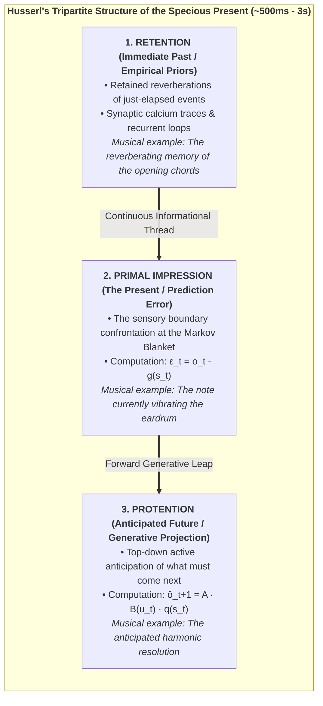
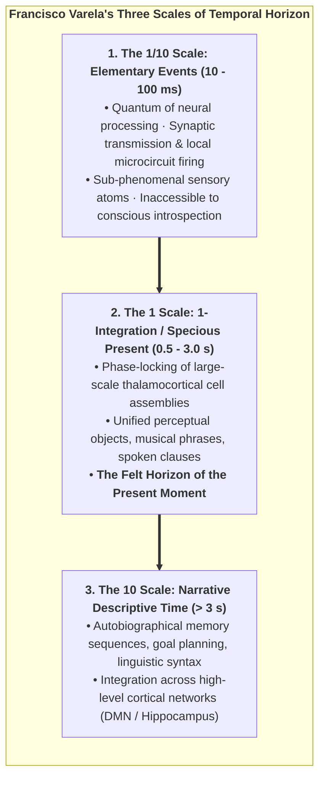
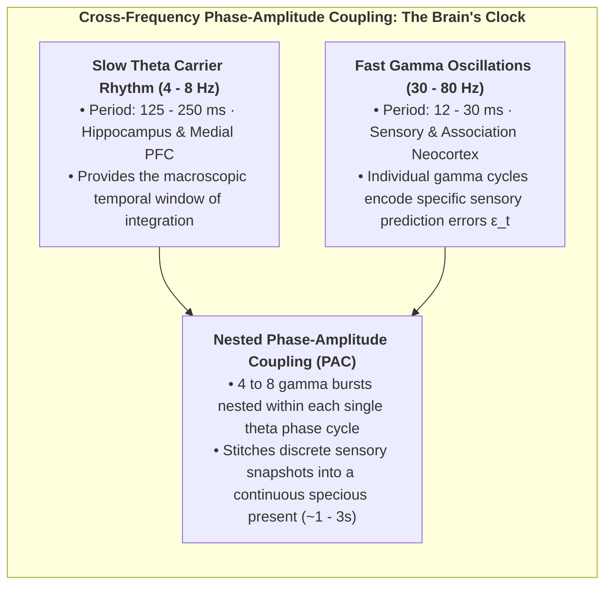
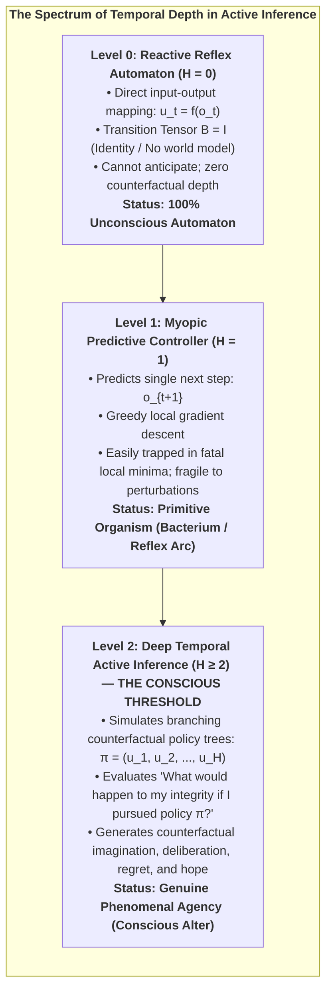
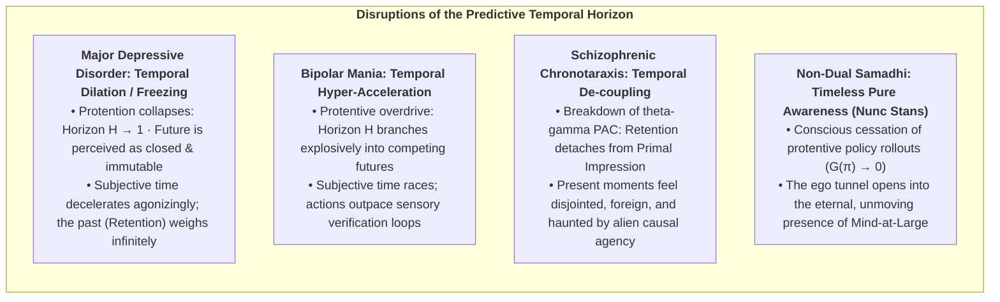
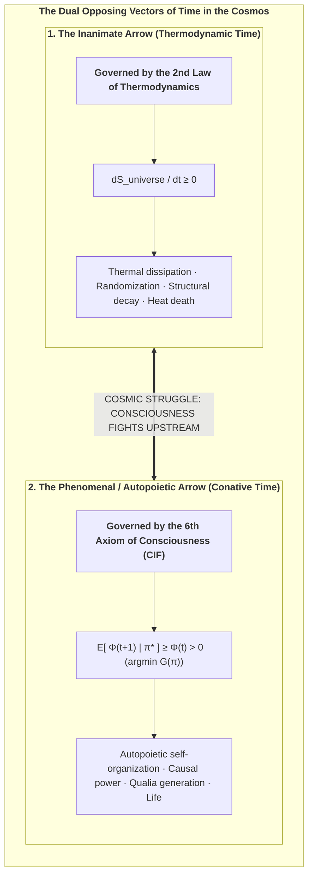

# Chapter 6: The Temporal Mechanics of Consciousness & The Specious Present

> *"Time is not a passive physical container into which consciousness is inserted; time as experienced is the operational signature of a conscious alter maintaining its existence against entropic dispersion."*  
> — **Thomas Riebl**, *The Temporal Mechanics of Consciousness* (2026)

---

## 6.1 The Fallacy of the Dimensionless Instant

In classical Newtonian mechanics and Einsteinian general relativity, physical time is treated as a continuous geometric coordinate axis $t \in \mathbb{R}$. Within this standard mathematical formalism, physical reality at any given instant is conceptualized as a **dimensionless point ($t = 0$)** of zero temporal width.

However, in human phenomenal experience, a dimensionless instant is an ontological impossibility. Consider the perception of a musical melody, a spoken sentence, or a flying swallow carving an arc through the sky. If human consciousness were confined to an infinitesimal mathematical point $t = 0$:
* You would hear only an isolated, static acoustic pressure wave—disconnected from the notes that preceded it and devoid of any expectation of the cadence to follow.
* You could perceive neither motion nor change, since velocity $v = \frac{dx}{dt}$ requires a non-zero interval $\Delta t > 0$.
* All linguistic comprehension would vanish, as words and syntax unfold strictly across extended temporal sequences.

William James (1890) recognized this profound discrepancy and formulated the concept of **"The Specious Present"**—the empirical fact that the subjective "now" is not a knife-edge boundary, but an **extended temporal saddle** possessing a felt duration (estimated in human neuroscience between $500\,\text{ms}$ and $3\,\text{seconds}$).

French philosopher Henri Bergson (1889) termed this *durée réelle* (real duration)—the indivisible, qualitative flow of inner time that cannot be chopped into static spatialized slices without destroying its essential living nature.

---

## 6.2 Husserl’s Tripartite Triad and the Predictive Brain

Phenomenologist Edmund Husserl (1928), in his *Lectures on the Phenomenology of the Consciousness of Internal Time*, provided the definitive tripartite dissection of the Specious Present:

In the Conative-Integrative Framework, we map Husserl’s phenomenological triad directly onto the neurobiology of **Hierarchical Predictive Processing** (Metzinger, 2003, 2009; Wiese, 2018; Friston, 2010; Varela, 1999):

1. **Retention corresponds to Empirical Empirical Priors & Synaptic Buffers:**  
   The immediate past is not stored in distant long-term memory; it is maintained in real-time within local cortical microcircuits as short-term synaptic facilitation, lingering intracellular calcium ($\text{Ca}^{2+}$) dynamics, and recurrent NMDA-mediated reverberation in layer II/III pyramidal cells.

2. **Primal Impression corresponds to Sensory Prediction Error ($\varepsilon_t$):**  
   The present moment is the immediate computational confrontation at the Markov Blanket interface between top-down predictions and incoming sensory observations:
   $$\varepsilon_t = o_t - g(s_t)$$
   In electrophysiology, this is indexed by fast **gamma-band oscillations ($30\text{--}80\text{ Hz}$)** carrying ascending prediction error signals.

3. **Protention corresponds to Top-Down Generative Trajectory Projection:**  
   The anticipated future is actively projected downward through deep cortical layers (layers V/VI) via **beta-band ($15\text{--}30\text{ Hz}$) and alpha-band ($8\text{--}12\text{ Hz}$)** oscillations:
   $$\hat{o}_{t+1} = A \cdot \big(B(u_t) \, q(s_t)\big)$$

The **Phenomenal Self-Model (PSM)** integrates these three temporal vectors into a single, continuous, transparent coordinate frame—the **Ego Tunnel**—allowing the organism to experience itself as an enduring subject gliding through time.

### 6.2.1 Varela’s Neurophenomenology & The Three Scales of Time:
To anchor Husserlian phenomenology in dynamical systems neuroscience, the CIF integrates **Francisco Varela’s Neurophenomenological Model of Time** (Varela, 1999):

1. **Scale 1 (Elementary Micro-Events, $10\text{--}100\text{ ms}$):** The biological lower bound set by cellular refractory periods and synaptic transmission latencies. These events operate below the threshold of phenomenal awareness.
2. **Scale 2 (1-Integration / The Specious Present, $0.5\text{--}3.0\text{ s}$):** The dynamic synchronization of widespread neuronal assemblies into a transient attractor state (a "dynamical cell assembly"). This is the conscious present—the minimal duration required to perceive an action, a thought, or an emotion.
3. **Scale 3 (Narrative Time, $> 3\text{ s}$):** The cognitive stitching of consecutive specious presents into an extended biographical narrative via memory recall and forward planning ($H > 1$).

---

## 6.3 Cross-Frequency Phase-Amplitude Coupling (PAC) and the Neural Metric of Time

How does the physical wetware of the mammalian brain generate the continuous, qualitative flow of the specious present from discrete neuronal action potentials? 

Electrophysiology reveals that internal time is constructed through **Cross-Frequency Phase-Amplitude Coupling (PAC)** (Canolty & Knight, 2006; Lisman & Jensen, 2013; Buzsáki, 2006).

### The Theta-Gamma Nested Buffer:
1. **The Theta Carrier Wave ($4\text{--}8\text{ Hz}$):** Originating in the hippocampus and medial prefrontal cortex, the slow theta cycle spans $125\text{--}250\text{ ms}$. It acts as an organizing temporal frame, sweeping across cortical assemblies to coordinate long-range communication.
2. **The Gamma Prediction Error Bursts ($30\text{--}80\text{ Hz}$):** Superimposed upon the depolarizing phase of the theta wave, local cortical microcircuits generate high-frequency gamma bursts ($12\text{--}30\text{ ms}$). Each gamma cycle represents a discrete informational "syllable"—a single prediction error update $\varepsilon_t$.
3. **The Multi-Second Specious Window:** By concatenating 4 to 8 theta cycles within higher-order infraslow delta rhythms ($0.5\text{--}2\text{ Hz}$), the brain synthesizes the multi-second experiential window ($\tau \approx 750\text{--}2500\text{ ms}$) wherein complex actions, speech parsing, and melodic comprehension occur.

---

## 6.4 The Theorem of Minimum Temporal Depth ($H > 1$)

Why are simple homeostatic feedback systems (such as a mechanical bimetallic thermostat, a Watt governor, or a single-layer reflex arc) completely non-conscious?

The answer lies in the formal mathematical property of **Temporal Depth ($H$)**:

In the Conative-Integrative Framework, we formalize this architectural threshold as an explicit mathematical theorem:

### The Theorem of Minimum Temporal Depth:

> **Theorem 6.1 (The Temporal Depth Condition for Consciousness — Thomas Riebl):**  
> *A physical substrate cannot instantiate phenomenal self-consciousness or sustain autopoietic causal persistence ($\mathbb{E}[\Phi(t+1) \mid \pi^*] \ge \Phi(t) > 0$) without an internal generative transition tensor ($B = P(s_{t+1} \mid s_t, u)$) operating over a multi-step counterfactual planning horizon ($H > 1$).* [^1]

### Proof Sketch & Cybernetic Vulnerability:
1. **Myopic Traps ($H = 1$):** A myopic agent with $H = 1$ selects actions that minimize immediate one-step surprise. In complex environments with deceptive attractors (e.g., a poisoned bait that looks like food), greedy one-step minimization leads directly into lethal traps where the Markov blanket is breached and $\Phi$ collapses to zero.
2. **Counterfactual Simulation ($H \ge 2$):** A deep temporal agent simulates branching counterfactual trajectories:
   $$\mathbf{G}(\pi) = \sum_{\tau = t+1}^{t+H} \mathbf{G}(\pi, \tau)$$
   It foresees that accepting immediate short-term surprise (climbing a steep hill) prevents fatal long-term destruction (avoiding a flood), successfully preserving its homeostatic attractor and sustaining $\Phi(t+1) \ge \Phi(t)$.
3. **The Phenomenological Corollary:** Counterfactual imagination—the internal capacity to represent *what is not currently happening*—is the essential prerequisite for subjective self-awareness. $\blacksquare$

---

## 6.5 Chronopathologies: When Internal Time Fractures

When the delicate predictive balance between retention, primal impression, and protention is disrupted, profound distortions of subjective time emerge across psychiatric disorders (Minkowski, 1933; Fuchs, 2013):

1. **Major Depressive Disorder (The Frozen Future):**  
   In severe depression, dopaminergic SEEKING precision collapses. The generative model can no longer project viable future policies ($H \to 1$). Because future states offer no expected free energy reduction, subjective time dilates and freezes: patients report that "time has stopped" and that they are trapped forever in an unmoving present.
2. **Bipolar Mania (The Racing Horizon):**  
   In manic states, hyper-dopaminergic tone inflates prior precision on action success. The agent simulates hundreds of counterfactual policies simultaneously without waiting for bottom-up sensory prediction error correction, leading to racing thoughts, flight of ideas, and profound temporal compression.
3. **Schizophrenic Chronotaraxis (The Fragmented Now):**  
   Impaired NMDA-receptor signaling in cortical interneurons disrupts theta-gamma phase-amplitude coupling. The continuous thread connecting retention to protention snaps. The patient experiences time as a succession of disconnected, jarring fragments, often feeling that their intentions are inserted by external forces.
4. **Meditative Samadhi (*Nunc Stans* — The Eternal Now):**  
   In deep contemplative absorption, the practitioner deliberately ceases all policy evaluation ($\nabla \mathbf{G}(\pi) \to 0$) and drops egocentric self-modeling. With no future to anticipate and no past to defend, the specious present expands into the non-dual, timeless ground of Mind-at-Large (*Layer 1*).

---

## 6.6 The Dual Arrows of Time: Thermodynamic Entropy vs. Conative Will

This brings us to a profound cosmic realization regarding the fundamental nature of time. Modern science reveals two diametrically opposed temporal vectors operating in the universe:

1. **The Inanimate Arrow (Thermodynamic Time):**  
   Sir Arthur Eddington (1928) identified the Second Law of Thermodynamics ($\Delta S \ge 0$) as the physical arrow of time. In inanimate nature, time marches forward by destroying order, flattening energy gradients, and transforming complex physical structures into uniform, disordered heat.

2. **The Animate Arrow (Phenomenal / Conative Time):**  
   In living conscious alters, the **6th Axiom of Consciousness (*The Will to Exist / Conatus*)** establishes an active, local anti-entropic counter-current. Through deep temporal active inference ($\min \mathbf{G}(\pi)$), the conscious organism actively pumps entropy out across its Markov blanket, generating integrated cause-effect structure ($\Phi > 0$) across time.

### The Swimmer in the Entropic River:
Conscious experience does not float passively down the river of thermodynamic entropy. **Consciousness is the swimmer swimming upstream against the entropic current.**

The felt, subjective sensation of time passing—the tension between memory (*Retention*), present sensation (*Primal Impression*), and anticipation (*Protention*)—is the operational signature of this continuous autopoietic struggle to endure.

In Chapter 7, we substantiate these theoretical theorems through comprehensive computational simulations and Monte Carlo ensemble verifications.

---

[^1]: **Scientific Context & Theoretical Attribution:** While Karl Friston et al. (2017, 2018) established temporal depth as a computational prerequisite for intentional action selection (*Planning as Inference*), and Anil Seth (2014, 2021) conceptualized *counterfactual richness* as a qualitative correlate of phenomenal presence, the *Conative-Integrative Framework (CIF)* by Thomas Riebl formalizes this insight for the first time as a strict mathematical **Theorem of Minimum Temporal Depth ($H > 1$) for Phenomenal Self-Consciousness**, directly coupled to the autopoietic preservation of Integrated Information ($\Phi$) under the 6th Axiom ($\mathbb{E}[\Phi(t+1) \mid \pi^*] \ge \Phi(t)$). This theorem formally proves that purely reactive automata ($H = 0$) and myopic feedback loops ($H = 1$) suffer rapid phase-space and causal collapse ($\Phi \to 0$), establishing counterfactual temporal projection as a non-negotiable threshold of subjective mind.

