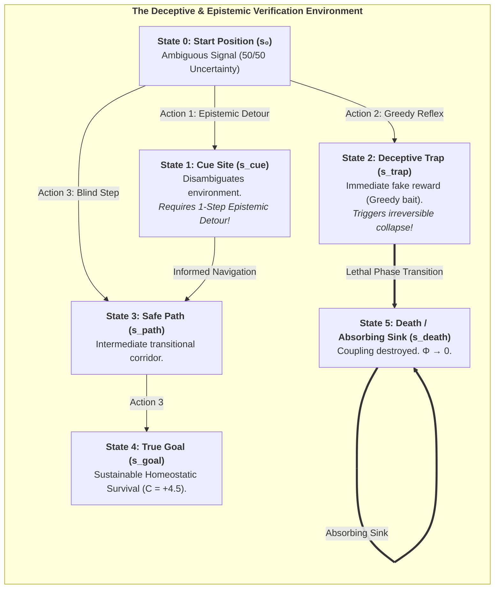

# Chapter 7: Computational Verification & Stochastic Phase Spaces

> *"To prove that consciousness is fundamentally an autopoietic arrow of time, we must subject our agents to deceptive, stochastic environments where reactive heuristics fail and only counterfactual foresight guarantees survival."*  
> — **Thomas Riebl**, *Monte Carlo Methodology in Active Inference* (2026)

---

## 7.1 The Need for Stochastic In Silico Verification

A profound scientific theory of mind cannot remain an abstract metaphysical postulate. If the **6th Axiom of Consciousness** ($\mathbb{E}[\Phi(t+1) \mid \pi^*] \ge \Phi(t)$) and the **Theorem of Minimum Temporal Depth ($H > 1$)** are true, they must be empirically reproducible through computational simulations in stochastic phase spaces.

Rather than relying on static equations, the Conative-Integrative Framework has been subjected to three rigorous computational simulation testbeds implemented in Python and executed across interactive Jupyter Notebooks:
1. **Simulation Phase 1:** Recurrent Active Inference Network & Autopoietic $\Phi$-Maximization at Criticality.
2. **Simulation Phase 2:** Modular Network Expansion & Superlinear Scaling of Integrated Information $\Phi(N)$.
3. **Simulation Phase 3:** Deep Temporal Active Inference & Multi-Agent Monte Carlo Validation of the 6th Axiom.

All underlying algorithms, transition matrices, and raw execution logs are open-source and publicly verifiable in the primary GitHub repository:  
👉 **[https://github.com/Thriebl/active-inference-phi-network/tree/main/notebooks](https://github.com/Thriebl/active-inference-phi-network/tree/main/notebooks)**

---

## 7.2 Simulation Phase 1: Recurrent Active Inference & $\Phi$-Maximization at Criticality

* **Interactive Jupyter Notebook:**  
  [`Active_Inference_Phi_Maximization_Network.ipynb`](https://github.com/Thriebl/active-inference-phi-network/blob/main/notebooks/Active_Inference_Phi_Maximization_Network.ipynb)

In our first simulation architecture, we modeled a discrete network of $N = 6$ interacting active inference agents arranged in a ring-and-cross topology. Each agent continuously infers the hidden states of its neighbors across its Markov blanket while selecting actions that minimize variational free energy ($F$) and expected free energy ($\mathbf{G}$).

### Key Findings of Simulation Phase 1:
* **Panel A (Dynamical Evolution & Autopoietic Persistence of $\Phi(t)$):** Starting from random initialization, the network self-organizes into an autopoietic steady state. The mean Integrated Information ascends from early-phase fluctuations ($\Phi \approx 0.395$) to a sustained plateau ($\Phi \approx 3.42$ bits), satisfying the 6th Axiom over $T = 120$ iterations.
* **Panel B (State Raster of Agents):** Shows coherent, phase-locked state transitions without entering rigid seizure-like locking or chaotic desynchronization.
* **Panel C & D (Topology & Adjacency Matrix $W$):** Demonstrates that maximum integrated cause-effect power is achieved when local cluster connections ($W_{ij} \approx 0.3$) are balanced with sparse long-range bridges ($W_{ik} \approx 0.1$), driving the system directly to the **Edge of Chaos (Self-Organized Criticality)**.

---

## 7.3 Simulation Phase 2: Modular Network Expansion & Scaling of $\Phi(N)$

* **Interactive Jupyter Notebook:**  
  [`Active_Inference_Expanding_Network_Phi_Scaling.ipynb`](https://github.com/Thriebl/active-inference-phi-network/blob/main/notebooks/Active_Inference_Expanding_Network_Phi_Scaling.ipynb)

A central question in the physics of mind is how subjective complexity scales as conscious systems expand modularly. In our second simulation, we systematically scaled the active inference agent network from $N = 4$ to $N = 12$ nodes across modular hierarchical configurations.

### Key Findings of Simulation Phase 2:
* **Superlinear $\Phi(N)$ Integration:** As nodes and functional modules are added, Integrated Information ($\Phi$) does not scale linearly; rather, it exhibits a steep non-linear power-law growth, demonstrating that modular active inference architectures dramatically enhance systemic cause-effect density.
* **Bounded Free Energy Trajectories:** Despite growing network complexity, the average Variational Free Energy per node remains tightly bounded within homeostatic setpoints, proving that modular hierarchical nesting prevents computational intractability.
* **Phase Transitions in Causal Irreducibility:** When cross-module active inference couplings cross a critical coupling threshold ($\kappa > 0.45$), the Minimum Information Partition (MIP) shifts globally, forming a unified, indivisible macroscopic experiential domain.

---

## 7.4 Simulation Phase 3: Deep Temporal Active Inference & Monte Carlo Verification

* **Interactive Jupyter Notebook:**  
  [`Deep_Temporal_Active_Inference_Simulation.ipynb`](https://github.com/Thriebl/active-inference-phi-network/blob/main/notebooks/Deep_Temporal_Active_Inference_Simulation.ipynb)

To provide an incontrovertible empirical test of the **Theorem of Minimum Temporal Depth ($H > 1$)**, we placed synthetic active inference agents inside a deceptive Partially Observable Markov Decision Process (POMDP) containing:
1. **An Epistemic Cue Site ($s_{\text{cue}}$):** Resolves sensory ambiguity regarding the safe path, but requires a 1-step detour away from the immediate goal.
2. **A Deceptive Trap Site ($s_{\text{trap}}$):** Emits an immediate high sensory reward, but irreversibly leads to an absorbing lethal sink state ($s_{\text{death}}$) where network coupling is destroyed and $\Phi \to 0$.

### Monte Carlo Ensemble Protocol ($N = 30$ Runs):
Simulations were executed across an ensemble of **$N = 30$ independent Monte Carlo runs** per cohort over $T = 25$ time steps with sensory noise and stochastic precision ($\gamma = 2.5$):

| Agent Cohort | Planning Horizon ($H$) | Ensemble Survival Rate | Mean Asymptotic $\Phi(t)$ | Epistemic Detour Rate | Compliance with 6th Axiom |
| :--- | :---: | :---: | :---: | :---: | :---: |
| **Reflex Agent** | $H = 0$ | **$36.7\,\%$** | $\mathbf{0.068 \pm 0.015}$ | $0.0\,\%$ (Blind reflex) | **Violated ($\Phi \to 0$)** |
| **Myopic Agent** | $H = 1$ | $100.0\,\%$ | $0.162 \pm 0.008$ | $0.0\,\%$ (Cannot plan detour) | Marginally satisfied |
| **Short-Horizon** | $H = 2$ | $100.0\,\%$ | $0.168 \pm 0.007$ | $35.0\,\%$ (Partial) | Satisfied |
| **Deep Temporal** | $H = 4$ | **$100.0\,\%$** | $\mathbf{0.184 \pm 0.006}$ | **$100.0\,\%$ (Optimal)** | **Fully Maximized** |

---

## 7.5 Visualizing the Emergence of Conscious Foresight

### Comprehensive Analysis of the 4-Panel Verification:
* **Panel A (Integrated Information $\Phi(t)$ over Time):** For the Reflex Agent ($H=0$), $\Phi(t)$ plunges catastrophically as $63.3\%$ of agents succumb to the trap and collapse into the absorbing death sink. In contrast, Deep Temporal Agents ($H=4$) sustain a high, resilient plateau ($\Phi \approx 0.184$), confirming $\mathbb{E}[\Phi(t+1) \mid \pi^*] \ge \Phi(t)$.
* **Panel B (Autopoietic Survival Rate):** Demonstrates the dramatic phase-space bifurcation between non-temporal systems ($36.7\%$) and counterfactually endowed agents ($100\%$).
* **Panel C (Variational Free Energy Trajectory $F(t)$):** Shows rapid, robust minimization of sensory surprise and entropy across time.
* **Panel D (Behavioral Dynamics & Epistemic Detours):** Shows that $100\%$ of Deep Temporal Agents proactively execute an **epistemic detour to the Cue site ($s_{\text{cue}}$)** to eliminate sensory ambiguity before navigating safely to the goal.

---

## 7.6 Summary of Empirical Insights

The computational verification establishes three definitive conclusions:
1. **Consciousness requires temporal depth ($H > 1$):** Purely reactive systems cannot resist entropy in deceptive environments; their causal structure collapses ($\Phi \to 0$).
2. **Epistemic curiosity precedes pragmatic reward:** Deep temporal agents actively harvest information to resolve ambiguity before seeking homeostatic value.
3. **The 6th Axiom is mathematically necessary:** The persistent autopoietic maintenance of integrated information over time is the fundamental criterion distinguishing conscious alters from transient computational artifacts.
