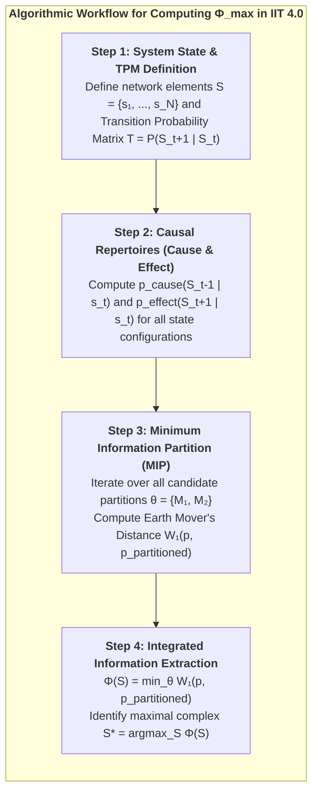
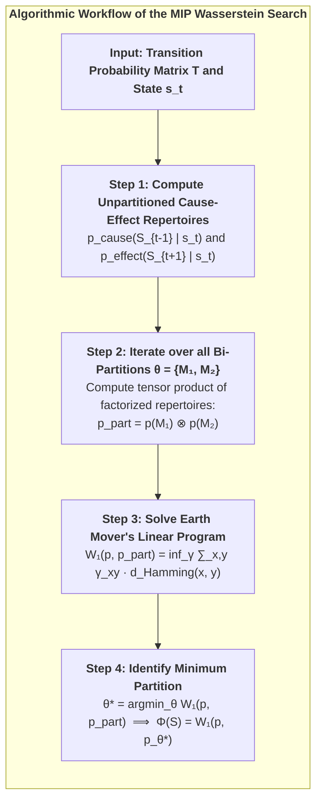

# Appendix A: Tensor Algebra of Discrete POMDPs & Variational Message Passing {-}

In the Conative-Integrative Framework, the generative model of an active inference agent is formulated as a discrete Partially Observable Markov Decision Process (POMDP) operating over time steps $\tau \in \{1, \dots, T\}$.

```mermaid
flowchart TD
    subgraph POMDP_GRAPH["<b>Bayesian Generative Graph of Deep Active Inference</b>"]
        direction TB
        
        D_NODE["<b>Prior Vector D = P(s₁)</b>"]
        PI_NODE["<b>Policy Prior P(π) = σ(-γ G(π))</b>"]
        
        S1["<b>Hidden State s₁</b>"]
        S2["<b>Hidden State s₂</b>"]
        ST["<b>Hidden State s_τ</b>"]
        
        O1["<b>Observation o₁</b>"]
        O2["<b>Observation o₂</b>"]
        OT["<b>Observation o_τ</b>"]
        
        U1["<b>Action u₁</b>"]
        U2["<b>Action u₂</b>"]
        
        C_NODE["<b>Preference Vector C = ln P(o)</b>"]
        
        D_NODE --> S1
        PI_NODE --> U1
        PI_NODE --> U2
        
        S1 -->|Likelihood A| O1
        S1 -->|Transition B(u₁)| S2
        S2 -->|Likelihood A| O2
        S2 -->|Transition B(u₂)| ST
        ST -->|Likelihood A| OT
        
        C_NODE -.->|Pragmatic Evaluation| O1
        C_NODE -.->|Pragmatic Evaluation| O2
        C_NODE -.->|Pragmatic Evaluation| OT
    end
```

### 1. The Generative Model Definition:
The joint probability distribution over observations $\tilde{o} = (o_1, \dots, o_T)$, hidden states $\tilde{s} = (s_1, \dots, s_T)$, and policies $\pi$ is factored as:

$$P(\tilde{o}, \tilde{s}, \pi) = P(\pi) \cdot P(s_1) \cdot \prod_{\tau=2}^T P(s_\tau \mid s_{\tau-1}, \pi) \cdot \prod_{\tau=1}^T P(o_\tau \mid s_\tau)$$

Where the fundamental tensors are:
* **Initial State Prior ($D \in \Delta^{N_s}$):** $P(s_1) = D$.
* **Likelihood Tensor ($A \in \mathbb{R}^{N_o \times N_s}$):** $P(o_\tau = j \mid s_\tau = k) = A_{j, k}$, where $\sum_{j=1}^{N_o} A_{j, k} = 1 \; \forall k$.
* **Transition Tensor ($B \in \mathbb{R}^{N_s \times N_s \times N_u}$):** $P(s_{\tau+1} = i \mid s_\tau = j, u_\tau = u) = B_{i, j, u}$, where $\sum_{i=1}^{N_s} B_{i, j, u} = 1 \; \forall j, u$.
* **Prior Preferences ($C \in \mathbb{R}^{N_o}$):** $C_j = \ln P(o_\tau = j)$.

---

### 2. Variational Message Passing & State Estimation:
Under the mean-field approximation, the approximate posterior factorizes across time and policies:

$$Q(\tilde{s}, \pi) = Q(\pi) \prod_{\tau=1}^T Q(s_\tau \mid \pi)$$

At current time $t$, upon observing outcome $o_t$, the variational posterior belief state $q(s_\tau \mid \pi)$ for past, present, and future states is updated via **Variational Message Passing (VMP)**:

$$\ln q(s_\tau \mid \pi) = \sigma\Big( \ln A_{o_\tau, :} + \ln \big(B(u_{\tau-1}) \, q(s_{\tau-1} \mid \pi)\big) + \ln \big(B(u_\tau)^\top \, q(s_{\tau+1} \mid \pi)\big) \Big)$$

Where:
* $\ln A_{o_\tau, :}$ is the ascending sensory evidence message from lower levels.
* $\ln \big(B(u_{\tau-1}) \, q(s_{\tau-1})\big)$ is the forward predictive message from past states (*Retention*).
* $\ln \big(B(u_\tau)^\top \, q(s_{\tau+1})\big)$ is the backward smoothing message from future expectations (*Protention*).

---

### 3. Expected Free Energy Decomposition:
The Expected Free Energy for policy $\pi$ at future time $\tau > t$ is:

$$\mathbf{G}(\pi, \tau) = \underbrace{D_{\text{KL}}\Big(Q(o_\tau \mid \pi) \;\parallel\; P(o_\tau)\Big)}_{\text{Pragmatic Value (Risk)}} + \underbrace{\mathbb{E}_{Q(s_\tau \mid \pi)}\Big[\mathcal{H}\big(A_{:, s_\tau}\big)\Big]}_{\text{Epistemic Ambiguity}}$$

Where predicted outcomes are:
$$Q(o_\tau \mid \pi) = A \cdot q(s_\tau \mid \pi)$$

---

# Appendix B: Algorithmic Formalism of Integrated Information Theory 4.0 {-}



### 1. Earth Mover's Distance (Wasserstein-1 Metric):
Given discrete probability distributions $p$ and $q$ over binary state configurations $\{0, 1\}^N$:

$$W_1(p, q) = \min_{\gamma \in \Pi(p, q)} \sum_{x, y \in \{0, 1\}^N} \gamma(x, y) \cdot d_H(x, y)$$

Where $d_H(x, y) = \sum_{i=1}^N |x_i - y_i|$ is the Hamming distance, and $\gamma(x, y)$ is a joint distribution with marginals $\sum_y \gamma(x, y) = p(x)$ and $\sum_x \gamma(x, y) = q(y)$.

---

### 2. Continuous Gaussian $\Phi$ Formulation:
For continuous linear Gaussian neural dynamics $\dot{x} = A x + \xi$ with steady-state covariance $\Sigma$:

$$\Phi(M_1 ; M_2) = \frac{1}{2} \Big( \ln\det(\Sigma_{M_1}) + \ln\det(\Sigma_{M_2}) - \ln\det(\Sigma) \Big)$$

$$\Phi^* = \min_{\text{Partitions } P} \Phi(P)$$

---

# Appendix C: Stochastic Differential Equations for Nonequilibrium Steady States {-}

The full physical state vector $x(t) \in \mathbb{R}^d$ of a living alter is governed by the Itô stochastic differential equation:

$$dx(t) = f(x) \, dt + \sqrt{2\Gamma} \, dW(t)$$

Where:
* $f(x)$ is the drift vector field.
* $\Gamma$ is the diffusion tensor.
* $W(t)$ is a standard $d$-dimensional Wiener process.

### The Fokker-Planck Equation:
The probability density $p(x, t)$ evolves according to:

$$\frac{\partial p(x, t)}{\partial t} = -\nabla \cdot \Big( f(x) \, p(x, t) \Big) + \nabla \cdot \Big( \Gamma \, \nabla p(x, t) \Big) \triangleq -\nabla \cdot j(x, t)$$

Where $j(x, t)$ is the **probability flux vector**:

$$j(x, t) = f(x) \, p(x, t) - \Gamma \nabla p(x, t)$$

### Nonequilibrium Steady State Condition:
At steady state ($\partial p / \partial t = 0$), the divergence of the probability flux vanishes ($\nabla \cdot j(x) = 0$).

Decomposing the flux into gradient and solenoidal flows yields:

$$f(x) = (\Gamma - Q) \, \nabla \ln p(x)$$

Where:
* $-\Gamma \nabla \ln p(x)$ is the **dissipative flow** maintaining homeostatic boundaries against diffusion.
* $Q \nabla \ln p(x)$ is the **solenoidal flow** (with antisymmetric matrix $Q = -Q^\top$) driving non-dissipative biological cycles.

---

# Appendix D: Numerical Algorithms for Wasserstein MIP Search in Python {-}

In computational simulations of IIT 4.0 and the CIF, calculating Integrated Information $\Phi(S)$ over candidate networks requires solving two nested optimization problems:
1. Evaluating the Wasserstein metric ($W_1$, Earth Mover's Distance) between unpartitioned and partitioned repertoires.
2. Searching over all non-trivial bi-partitions $\theta \in \mathcal{P}$ to identify the **Minimum Information Partition (MIP)**.



### Python Implementation of Wasserstein-1 Distance over Discrete States:

```python
import numpy as np
from scipy.optimize import linprog

def compute_wasserstein_1d(p_unpartitioned, p_partitioned, state_dim):
    """
    Computes Earth Mover's Distance (Wasserstein-1) between two discrete
    probability distributions over binary state vectors of length N.
    """
    num_states = 2 ** state_dim
    states = [np.array([int(b) for b in format(i, f'0{state_dim}b')]) 
              for i in range(num_states)]
    
    # 1. Cost matrix based on Hamming distance between binary states
    C = np.zeros((num_states, num_states))
    for i in range(num_states):
        for j in range(num_states):
            C[i, j] = np.sum(np.abs(states[i] - states[j]))
            
    c_vector = C.flatten()
    
    # 2. Linear programming constraints for optimal transport coupling
    A_eq = np.zeros((2 * num_states, num_states * num_states))
    for i in range(num_states):
        A_eq[i, i*num_states:(i+1)*num_states] = 1.0  # Row sums match p
    for j in range(num_states):
        A_eq[num_states + j, j::num_states] = 1.0     # Col sums match p_part
        
    b_eq = np.concatenate([p_unpartitioned, p_partitioned])
    
    res = linprog(c_vector, A_eq_ub=None, b_eq_ub=None,
                  A_eq=A_eq, b_eq=b_eq, method='highs')
    
    return res.fun if res.success else 0.0

def find_minimum_information_partition(TPM, current_state, N):
    """
    Exhaustive search over all 2^(N-1) - 1 bipartitions to find MIP and Phi.
    """
    min_w1 = float('inf')
    optimal_partition = None
    
    # Compute full unpartitioned repertoire
    p_full = TPM[current_state, :]
    
    # Generate bipartitions M1, M2
    for partition_mask in range(1, 2**(N-1)):
        # Compute tensor product of marginalized partitions
        p_part = compute_factorized_repertoire(TPM, current_state, partition_mask, N)
        w1_dist = compute_wasserstein_1d(p_full, p_part, N)
        
        if w1_dist < min_w1:
            min_w1 = w1_dist
            optimal_partition = partition_mask
            
    phi_integrated = min_w1
    return phi_integrated, optimal_partition
```

---

# Appendix E: Comprehensive Technical Glossary {-}

* **Active Inference:** The normative mathematical framework in theoretical neurobiology stating that living organisms preserve homeostatic existence by executing actions to minimize Expected Free Energy ($\mathbf{G}$), bringing sensory observations into alignment with prior preferences.
* **Alter (Dissociated Center of Mind):** In Analytic Idealism, an individual living organism formed through the topological dissociation of Mind-at-Large, demarcated by a statistical Markov Blanket.
* **Analytic Idealism:** The non-dual, parsimonious monistic ontology (formulated by Bernardo Kastrup) asserting that reality in its essence is experiential (*Mind-at-Large*), and inanimate physical matter is the extrinsic appearance of universal mental processes observed across a boundary.
* **Autopoiesis:** The fundamental property of a living system to continuously regenerate, repair, and sustain its own structural and organizational network against thermodynamic dispersion.
* **Cartesian Dualism:** The philosophical doctrine established by René Descartes asserting the existence of two fundamentally distinct substances: *res cogitans* (unextended, thinking mind) and *res extensa* (extended, mindless matter), creating the insoluble problem of mind-body interaction.
* **Causality (Intrinsic vs. Extrinsic):** In Integrated Information Theory and CIF, *intrinsic causality* refers to the irreducible cause-effect power a system exerts upon itself from within, which constitutes phenomenal experience. *Extrinsic causality* refers to observed behavioral input-output transformations.
* **Conatus (The Will to Exist):** The innate striving of any living entity to persevere in its own existence and resist entropic destruction (Spinoza). In CIF, formalized as the conative goal state $\Phi > 0$ and the 6th Axiom.
* **Criticality (Edge of Chaos):** The delicate phase transition boundary between rigid order and chaotic turbulence where information transmission, network dynamic range, and integrated information ($\Phi$) reach their global maximum.
* **Dissociation:** The psychological and cosmological mechanism whereby a unified conscious field divides into semi-autonomous, self-contained sub-domains (*alters*), establishing localized perspectives behind Markov boundaries.
* **Dual-Aspect Monism:** The metaphysical view that the mental and physical are two complementary, epistemically distinct perspectives of a single underlying reality.
* **Earth Mover's Distance ($W_1$):** The Wasserstein metric measuring the minimum cost of transforming one probability distribution into another, used in IIT 4.0 to evaluate cause-effect power across partitions.
* **Ego Tunnel:** The transparent Phenomenal Self-Model generated by the human brain that creates the continuous illusion of a distinct, centered "I" navigating through an external world (Metzinger).
* **Epistemic Value (Epistemic Curiosity):** The information-seeking component of Expected Free Energy ($\mathbf{G}$) that drives an active inference agent to explore uncertain environments, disambiguate hidden states, and resolve epistemic surprise before pursuing pragmatic rewards.
* **Epistemology / Epistemic:** The branch of philosophy concerned with the theory, nature, sources, and limitations of knowledge. In CIF, physical matter is an *epistemic representation* of mental processes viewed across a Markov blanket.
* **Expected Free Energy ($\mathbf{G}$):** A forward-looking metric evaluating candidate policy sequences over planning horizon $H$, decomposing into pragmatic value (goal satisfaction) and epistemic value (ambiguity resolution).
* **Explanatory Gap:** The insurmountable epistemic chasm within physicalism between quantitative objective neural mechanisms and qualitative subjective experience (Levine).
* **Hard Problem of Consciousness:** The fundamental question of why and how physical computations in a brain should ever give rise to subjective, qualitative inner experience (*qualia*) (Chalmers).
* **Integrated Information ($\Phi$):** The quantitative measure of intrinsic cause-effect power within a maximally irreducible physical substrate, computed across the Minimum Information Partition (Tononi, IIT 4.0).
* **Markov Blanket:** A statistical boundary partitioning a system into internal ($\mu$), sensory ($s$), active ($a$), and external ($\eta$) states, rendering internal states conditionally independent of external states.
* **Mind-at-Large:** The universal, transpersonal field of pure consciousness that constitutes the fundamental ontological ground of reality (Spinoza, Kastrup).
* **Minimum Information Partition (MIP):** The bipartition of a system that minimizes informational and causal loss, used to calculate irreducibility and integrated information $\Phi$.
* **Monism:** The ontological stance asserting that all of reality is ultimately composed of a single, fundamental kind of substance or essence. CIF adheres to an *idealist monism* where experiencing is primary.
* **Nonequilibrium Steady State (NESS):** A statistical state of living matter where continuous energy dissipation preserves organized internal structures far from thermodynamic equilibrium.
* **Ontology / Ontological Primacy:** The branch of metaphysics studying the fundamental nature of existence, reality, and being. In CIF, consciousness holds *ontological primacy* as the irreducible ground of reality.
* **Phenomenal Consciousness / Qualia:** The subjective, qualitative "what-it-is-like" dimension of direct conscious experience (e.g., the redness of red, the feeling of grief, the warmth of sunlight) (Nagel, Chalmers).
* **Phenomenal Self-Model (PSM):** A transparent, continuous internal simulation generated by the predictive brain that creates the felt 1st-person perspective of an enduring "I" (Metzinger).
* **Physicalism (Materialism):** The metaphysical dogma asserting that inanimate physical matter is the sole fundamental reality, and consciousness is merely an emergent epiphenomenon.
* **POMDP (Partially Observable Markov Decision Process):** A mathematical framework for modeling decision-making under uncertainty, defined by matrices $A$ (likelihood), $B$ (transitions), $C$ (preferences), and $D$ (priors).
* **Pragmatic Value:** The goal-seeking component of Expected Free Energy ($\mathbf{G}$) measuring the degree to which predicted sensory outcomes satisfy the agent's innate homeostatic survival preferences ($C$).
* **Primal Impression (*Urimpression*):** The present sensory perturbation at the Markov boundary within the Specious Present, corresponding to incoming prediction errors (Husserl).
* **Protention:** The forward-looking anticipatory projection within the Specious Present, corresponding to top-down generative predictions (Husserl).
* **Retention:** The immediate past preserved in working memory within the Specious Present, corresponding to empirical synaptic priors (Husserl).
* **Solenoidal Flow:** Non-dissipative circulating probability currents in nonequilibrium steady states that drive biological cycles (circadian rhythms, neural oscillations).
* **Specious Present:** The tripartite, non-zero temporal duration of subjective consciousness ($\sim 500\,\text{ms} - 3\,\text{s}$) combining Retention, Primal Impression, and Protention (James, Husserl).
* **Teleology (Conative Attractors):** The directed, goal-oriented striving of living systems toward future homeostatic attractors, governed by the formal minimization of Expected Free Energy and the preservation of $\Phi$.
* **Temporal Depth ($H$):** The length of the forward-looking counterfactual planning horizon over which an agent evaluates transition tensors ($B$) and expected free energy ($\mathbf{G}$).
* **Theorem of Minimum Temporal Depth:** The mathematical necessity condition stating that phenomenal self-consciousness strictly requires multi-step counterfactual planning ($H > 1$) to avoid causal collapse ($\Phi \to 0$) (Riebl).
* **The 6th Axiom of Consciousness:** The axiom of *Autopoietic Causal Persistence*, establishing that genuine consciousness requires an active striving to preserve integrated cause-effect power over time: $\mathbb{E}[\Phi(t+1) \mid \pi^*] \ge \Phi(t)$ (Riebl).
* **Variational Free Energy ($F$):** A computable upper bound on sensory surprise ($-\ln P(o)$), minimized during perceptual inference to eliminate prediction errors.

---

# Academic References & Comprehensive Bibliography {-}

1. **Aaronson, S. (2014).** *Why I Am Not An Integrated Information Theorist (or, The Unconscious Expander).* Shtetl-Optimized.
2. **Albantakis, L., Oizumi, M., & Tononi, G. (2014).** *From the phenomenology to the mechanisms of consciousness: Integrated Information Theory 3.0.* PLoS Computational Biology, 10(5), e1003588.
3. **Bak, P. (1996).** *How Nature Works: The Science of Self-Organized Criticality.* Copernicus, Springer-Verlag, New York.
4. **Beggs, J. M., & Plenz, D. (2003).** *Neuronal avalanches in neocortical circuits.* Journal of Neuroscience, 23(35), 11167–11177.
5. **Bergson, H. (1889).** *Essai sur les données immédiates de la conscience.* Félix Alcan, Paris.
6. **Boly, M., Massimini, M., Tsuchiya, N., Postle, B. R., Koch, C., & Tononi, G. (2017).** *Are the neural correlates of consciousness in the front or in the back of the cerebral cortex? Clinical and neuroimaging evidence.* Journal of Neuroscience, 37(40), 9603–9613.
7. **Bouchard, T. J. (2004).** *Genetic influence on human psychological traits: A survey.* Current Directions in Psychological Science, 13(4), 148–151.
8. **Carhart-Harris, R. L., & Friston, K. J. (2019).** *REBUS and the anarchic brain: Toward a unified model of the brain action of psychedelics.* Pharmacological Reviews, 71(3), 316–344.
9. **Chalmers, D. J. (1995).** *Facing up to the problem of consciousness.* Journal of Consciousness Studies, 2(3), 200–219.
10. **Chalmers, D. J. (1996).** *The Conscious Mind: In Search of a Fundamental Theory.* Oxford University Press.
11. **Chialvo, D. R. (2010).** *Emergent complex neural dynamics.* Nature Physics, 6(10), 744–750.
12. **Churchland, P. S. (1986).** *Neurophilosophy: Toward a Unified Science of the Mind-Brain.* MIT Press.
13. **Clark, A. (2013).** *Whatever next? Predictive brains, situated agents, and the future of cognitive science.* Behavioral and Brain Sciences, 36(3), 181–204.
14. **Clark, A. (2016).** *Surfing Uncertainty: Prediction, Action, and the Embodied Mind.* Oxford University Press.
15. **Da Costa, L., Parr, T., Sajid, N., Veselic, S., Neacsu, V., & Friston, K. (2020).** *Active inference on discrete state-spaces: A synthesis.* Journal of Mathematical Psychology, 99, 102447.
16. **Dennett, D. C. (1991).** *Consciousness Explained.* Little, Brown and Company, Boston.
17. **Eddington, A. S. (1928).** *The Nature of the Physical World.* Cambridge University Press.
18. **Eigen, M. (1971).** *Selforganization of matter and the evolution of biological macromolecules.* Die Naturwissenschaften, 58(10), 465–523.
19. **Eigen, M., & Winkler, R. (1975).** *Das Spiel: Unsere Begegnung mit dem Zufall.* Piper Verlag, München.
20. **Fountas, Z., Sajid, N., Mediano, P. A. M., & Friston, K. (2020).** *Deep active inference agents using Monte-Carlo methods.* Advances in Neural Information Processing Systems (NeurIPS 2020), 33, 11662–11675.
21. **Frankish, K. (2016).** *Illusionism as a theory of consciousness.* Journal of Consciousness Studies, 23(11-12), 11–39.
22. **Friston, K. (2010).** *The free-energy principle: a unified brain theory?* Nature Reviews Neuroscience, 11(2), 127–138.
23. **Friston, K. (2013).** *Life as we know it.* Journal of the Royal Society Interface, 10(86), 20130475.
24. **Friston, K. (2019).** *A free energy principle for a particular physics.* arXiv preprint arXiv:1906.10184.
25. **Friston, K., FitzGerald, T., Rigoli, F., Schwartenbeck, P., & Pezzulo, G. (2017).** *Active Inference: A Process Theory.* Neural Computation, 29(1), 1–49.
26. **Friston, K., Rosch, R., Parr, T., Price, C., & Bowman, H. (2017).** *Deep temporal models and active inference.* Neuroscience & Biobehavioral Reviews, 77, 388–402.
27. **Gershman, S. J. (2019).** *The generative adversary in brain and machine.* Trends in Cognitive Sciences, 23(1), 8–17.
28. **Goff, P. (2017).** *Consciousness and Fundamental Reality.* Oxford University Press.
29. **Hohwy, J. (2013).** *The Predictive Mind.* Oxford University Press.
30. **Husserl, E. (1928).** *Vorlesungen zur Phänomenologie des inneren Zeitbewusstseins.* Max Niemeyer Verlag, Halle.
31. **Jablonka, E., & Lamb, M. J. (2014).** *Evolution in Four Dimensions: Genetic, Epigenetic, Behavioral, and Symbolic Variation.* MIT Press.
32. **Jackson, F. (1982).** *Epiphenomenal qualia.* The Philosophical Quarterly, 32(127), 127–136.
33. **James, W. (1890).** *The Principles of Psychology.* Henry Holt and Company, New York.
34. **Kandel, E. R. (2001).** *The molecular biology of memory storage: a dialogue between genes and synapses.* Science, 294(5544), 1030–1038.
35. **Kant, I. (1781).** *Kritik der reinen Vernunft.* Johann Friedrich Hartknoch, Riga.
36. **Kastrup, B. (2019).** *The Idea of the World: A Multi-Disciplinary Argument for the Mental Nature of Reality.* Iff Books.
37. **Kastrup, B. (2021).** *Science Ideated: The Fall of Matter and the Contours of the Next Mainstream Scientific Worldview.* Iff Books.
38. **Kastrup, B., & Friston, K. (2020).** *An Analytic Idealist Perspective on the Free Energy Principle.* Working Treatise.
39. **Levine, J. (1983).** *Materialism and qualia: The explanatory gap.* Pacific Philosophical Quarterly, 64(4), 354–361.
40. **Maturana, H. R., & Varela, F. J. (1980).** *Autopoiesis and Cognition: The Realization of the Living.* D. Reidel Publishing Company, Dordrecht.
41. **Metzinger, T. (2003).** *Being No One: The Self-Model Theory of Subjectivity.* MIT Press, Cambridge, MA.
42. **Metzinger, T. (2009).** *The Ego Tunnel: The Science of the Mind and the Myth of the Self.* Basic Books, New York.
43. **Metzinger, T. (2024).** *The Elephant and the Blind: The Experience of Pure Consciousness.* MIT Press, Cambridge, MA.
44. **Monod, J. (1970).** *Le Hasard et la Nécessité: Essai sur la philosophie naturelle de la biologie moderne.* Éditions du Seuil, Paris.
45. **Nagel, T. (1974).** *What is it like to be a bat?* The Philosophical Review, 83(4), 435–450.
46. **Panksepp, J. (1998).** *Affective Neuroscience: The Foundations of Human and Animal Emotions.* Oxford University Press.
47. **Parr, T., & Friston, K. J. (2018).** *The anatomy of choice: active inference and agency.* Cognitive Neuroscience, 9(1-2), 11–27.
48. **Parr, T., Pezzulo, G., & Friston, K. J. (2022).** *Active Inference: The Free Energy Principle in Mind, Brain, and Behavior.* MIT Press, Cambridge, MA.
49. **Pearl, J. (1988).** *Probabilistic Reasoning in Intelligent Systems: Networks of Plausible Inference.* Morgan Kaufmann, San Mateo, CA.
50. **Plomin, R., DeFries, J. C., Knopik, V. S., & Neiderhiser, J. M. (2016).** *Top 10 Replicated Findings From Behavioral Genetics.* Perspectives on Psychological Science, 11(1), 3–23.
51. **Riebl, T. (2026).** *The Conative-Integrative Framework (CIF): How Active Inference Networks, Integrated Information ($\Phi$), and the 6th Axiom Fit Together to Unite Analytic Idealism, the Free Energy Principle, and Consciousness.* Master Monograph, Luxembourg.
52. **Riebl, T. (2026).** *The Composition of the Soul: The 6-Layer Ontogenetic Architecture of the Dissociated Mind.* Luxembourg.
53. **Riebl, T. (2026).** *The Temporal Mechanics of Consciousness: The Specious Present, Deep Temporal Active Inference, and the Anti-Entropic Arrow of Mind.* Luxembourg.
54. **Roth, G. (2003).** *Aus Sicht des Gehirns.* Suhrkamp Verlag, Frankfurt am Main.
55. **Roth, G. (2021).** *Wie das Gehirn die Seele macht: Emotionen, Bewusstsein, Unbewusstes.* Klett-Cotta, Stuttgart.
56. **Safron, A. (2020).** *An Integrated World Modeling Theory (IWMT) of Consciousness.* Frontiers in Artificial Intelligence, 3, 30.
57. **Schopenhauer, A. (1819/1844).** *Die Welt als Wille und Vorstellung.* F. A. Brockhaus, Leipzig.
58. **Seth, A. K. (2021).** *Being You: A New Science of Consciousness.* Dutton, Penguin Random House.
59. **Seth, A. K., & Tsakiris, M. (2018).** *Being a beast machine: The somatic basis of active inference and consciousness.* Trends in Cognitive Sciences, 22(11), 969–981.
60. **Sperry, R. W. (1968).** *Hemisphere deconnection and unity in conscious awareness.* American Psychologist, 23(10), 723–733.
61. **Spinoza, B. (1677).** *Ethica, ordine geometrico demonstrata.* Posthumous Publication.
62. **Strawson, G. (2006).** *Realistic monism: why physicalism entails panpsychism.* Journal of Consciousness Studies, 13(10-11), 3–31.
63. **Tononi, G., Boly, M., Massimini, M., & Koch, C. (2016).** *Integrated information theory: from consciousness to its physical substrate.* Nature Reviews Neuroscience, 17(7), 450–461.
64. **Tononi, G., Albantakis, L., Boly, M., Massimini, M., & Koch, C. (2023).** *Integrated information theory (IIT) 4.0: Formulating the properties of phenomenal existence in physical terms.* PLOS Computational Biology, 19(10), e1011465.
65. **Tschantz, A., Millidge, B., Seth, A. K., & Buckley, C. L. (2020).** *Reinforcement learning through active inference.* arXiv preprint arXiv:2002.12636.
66. **Turkheimer, E. (2000).** *Three Laws of Behavior Genetics and What They Mean.* Current Directions in Psychological Science, 9(5), 160–164.
67. **Varela, F. J. (1999).** *The specious present: A neurophenomenology of time consciousness.* In J. Petitot et al. (Eds.), *Naturalizing Phenomenology* (pp. 266–314). Stanford University Press.
68. **Wiese, W. (2018).** *Experienced Wholes: Unifying Insight into Phenomenal Integration.* MIT Press.
69. **Yehuda, R., & Lehrner, A. (2018).** *Intergenerational transmission of trauma effects: putative role of epigenetic mechanisms.* World Psychiatry, 17(3), 243–257.

---

# About the Author {-}

**Thomas Riebl** is an independent researcher, systems thinker, and author based in Luxembourg. Born in 1960 in Western Germany, he spent over three decades in enterprise information technology, working as an independent IT consultant, systems architect, and senior IT manager at a premier global banking institution before retiring from the corporate sector in July 2025.

Driven by a lifelong passion for foundational physics, cybernetics, and the nature of mind, Riebl began in 2019 an intensive research program at the intersection of theoretical neuroscience, computational psychiatry, and non-dual philosophy of mind. Through rigorous autodidactic self-study, he acquired a comprehensive command of advanced Bayesian statistics, probability theory, Markov decision processes, and information theory to construct the formal mathematical scaffolding for his work.

Synthesizing the discoveries of Karl Friston (Active Inference), Giulio Tononi (Integrated Information Theory), Thomas Metzinger (Phenomenal Self-Models), and Bernardo Kastrup (Analytic Idealism), he developed **The Conative-Integrative Framework (CIF)**. Through his discovery of **The 6th Axiom of Consciousness** ($\mathbb{E}[\Phi(t+1) \mid \pi^*] \ge \Phi(t)$) and the formalization of *Temporal Depth Agency*, Riebl provides the first mathematically closed bridge between 3rd-person cybernetic self-organization and 1st-person phenomenal causality.

---

# Tool Attribution & Colophon {-}

> [!NOTE]
> **Tooling Colophon:**  
> This theoretical treatise, philosophical architecture, and academic monograph were conceived, authored, and curated by **Thomas Riebl** (Luxembourg) within the **Conative-Integrative Framework (CIF)**.  
> Formal mathematical derivations, multi-agent simulation scripts, vector diagrams, and the multi-format book compilation (Amazon KDP Print PDF $6 \times 9''$, Word `.docx`) were developed with the assistance of **Google Gemini (Antigravity Advanced Agentic Coding System)** (September 2026).
