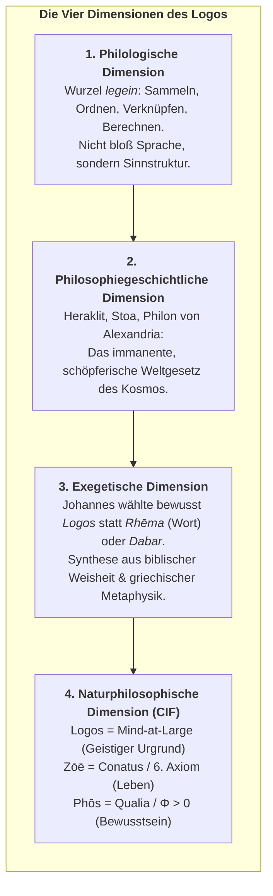
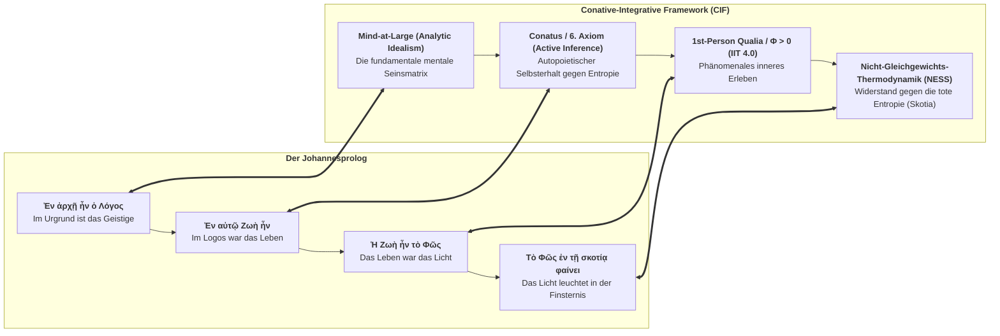

# Johannes 1,1–1,5: Griechischer Originaltext, Vers-für-Vers Interlinearübersetzung & Die ontologische Notwendigkeit des Begriffs „Logos“

> *„Ἐν ἀρχῇ ἦν ὁ λόγος, καὶ ὁ λόγος ἦν πρὸς τὸν θεόν, καὶ θεὸς ἦν ὁ λόγος.“*  
> *„In the beginning was the Logos, and the Logos was with God, and the Logos was God.“*

---

## 1. Vers-für-Vers Interlinearübersetzung (Griechisch – Englisch)

### Johannes 1,1
**Ἐν ἀρχῇ ἦν ὁ λόγος, καὶ ὁ λόγος ἦν πρὸς τὸν θεόν, καὶ θεὸς ἦν ὁ λόγος.**  
*In the beginning was the Logos, and the Logos was with God, and the Logos was God.*

---

### Johannes 1,2
**οὗτος ἦν ἐν ἀρχῇ πρὸς τὸν θεόν.**  
*This Logos was in the beginning with God.*

---

### Johannes 1,3
**πάντα δι’ αὐτοῦ ἐγένετο, καὶ χωρὶς αὐτοῦ ἐγένετο οὐδὲ ἕν, ὃ γέγονεν.**  
*All things came into being through the Logos, and without the Logos not even one thing came into being that has come into being.*

---

### Johannes 1,4
**ἐν αὐτῷ ζωὴ ἦν, καὶ ἡ ζωὴ ἦν τὸ φῶς τῶν ἀνθρώπων·**  
*In the Logos was life, and the life was the light of humanity;*

---

### Johannes 1,5
**καὶ τὸ φῶς ἐν τῇ σκοτίᾳ φαίνει, καὶ ἡ σκοτία αὐτὸ οὐ κατέλαβεν.**  
*And the light shines in the darkness, and the darkness did not overcome it.*

---

## 2. Fortlaufender Textfluss

### Griechischer Urtext (Novum Testamentum Graece / Nestle-Aland):
> **Ἐν ἀρχῇ ἦν ὁ λόγος, καὶ ὁ λόγος ἦν πρὸς τὸν θεόν, καὶ θεὸς ἦν ὁ λόγος. οὗτος ἦν ἐν ἀρχῇ πρὸς τὸν θεόν. πάντα δι’ αὐτοῦ ἐγένετο, καὶ χωρὶς αὐτοῦ ἐγένετο οὐδὲ ἕν, ὃ γέγονεν. ἐν αὐτῷ ζωὴ ἦν, καὶ ἡ ζωὴ ἦν τὸ φῶς τῶν ἀνθρώπων· καὶ τὸ φῶς ἐν τῇ σκοτίᾳ φαίνει, καὶ ἡ σκοτία αὐτὸ οὐ κατέλαβεν.**

### Englische Übersetzung (unter Beibehaltung von *Logos*):
> *In the beginning was the Logos, and the Logos was with God, and the Logos was God. This Logos was in the beginning with God. All things came into being through the Logos, and without the Logos not even one thing came into being that has come into being. In the Logos was life, and the life was the light of humanity; and the light shines in the darkness, and the darkness did not overcome it.*

---

## 3. Warum „Logos“ niemals mit „Wort“ übersetzt werden darf

Die traditionelle Übersetzung von **λόγος (Logos)** mit dem deutschen **„Wort“** (Martin Luther, 1522) oder dem englischen **„Word“** (King James Version, 1611) ist eine der verhängnisvollsten Verkürzungen der europäischen Geistes- und Religionsgeschichte. Sie degradiert ein kosmisches, ontologisches und geistiges Urprinzip zu einem bloßen akustischen oder grammatikalischen Lautgebilde.

Es gibt vier fundamentale Gründe – philologisch, philosophiegeschichtlich, theologisch und naturphilosophisch –, warum *Logos* unübersetzt als philosophischer Eigenbegriff stehen muss:

---

### 1. Die philologische Verengung: *Legein* ist mehr als Sprechen

Das altgriechische Substantiv **λόγος (logos)** leitet sich vom Verb **λέγειν (legein)** ab. Seine ursprüngliche indogermanische Wurzel bedeutet nicht „reden“, sondern:
* **sammeln, auflesen, zusammenfügen**
* **in Ordnung bringen, gliedern, zählen, berechnen** (vgl. *Logik*, *Logistik*, *Algorithmus*)
* **Rechenschaft ablegen, eine Relation/ein Verhältnis ausdrücken** (vgl. mathematisch: *Analogie*, Verhältnis zweier Größen)

Erst an nachgeordneter Stelle bedeutet *Logos* auch Rede, Ausspruch oder Erzählung. 

Wenn das Griechische ein bloß gesprochenes Einzelwort, eine Vokabel oder einen sprachlichen Laut meint, verwendet es das Wort **ῥῆμα (rhēma)** oder **ὄνομα (onoma)**. Der Verfasser des Johannesevangeliums hat sich jedoch dezidiert und präzise für **λόγος** entschieden. 

Ein „Wort“ ist ein vom Menschen erzeugtes Symbol; der **Logos** hingegen ist die **Sinn- und Ordnungsstruktur der Wirklichkeit selbst**, die allem Sprechen erst vorausgeht.

---

### 2. Die Philosophiegeschichte: Vom Weltgesetz zur Schöpfermatrix

Als der Johannesprolog um 90–100 n. Chr. in Ephesus – einer Hochburg der griechischen Philosophie – niedergeschrieben wurde, blickte der Begriff *Logos* bereits auf eine 600-jährige philosophische Reifung zurück. Kein gebildeter Zeitgenosse dachte bei *Logos* an ein Buchstabengebilde:

1. **Heraklit von Ephesos (ca. 535–475 v. Chr.):**  
   Heraklit führte den Logos als philosophischen Zentralbegriff ein. Inmitten des ewigen Wandels und des Flusses aller Dinge (*Panta rhei*) ist der Logos das **ewige, unvergängliche Gesetz des Maßes und der Ordnung**, das die Gegensätze in dynamischer Harmonie zusammenhält:  
   > *„Nicht mir, sondern dem Logos vernehmend ist es weise einzugestehen, dass alles Eins ist.“* (Heraklit, Fragment B 50).

2. **Die Stoa (Zenon, Chrysippos, Kleanthes, Seneca):**  
   Für die Stoiker ist der Logos die **aktive, göttliche Weltvernunft**, die die gesamte Materie durchdringt und belebt. Sie prägten den Begriff des **Logos Spermatikos (λόγος σπερματικός)** – der „keimhaften Vernunftkräfte“, die als schöpferische Organisationsprinzipien in allen Dingen wirken und die Evolution der Formen steuern.

3. **Philon von Alexandria (ca. 20 v. Chr. – 50 n. Chr.):**  
   Philon, der große jüdisch-hellenistische Philosoph, schlug die Brücke zwischen der hebräischen Tora und dem Platonismus. Für Philon ist der Logos:
   * Die **Ideenwelt des Geistes (*Kosmos Noētos*)**, der göttliche Bauplan des Universums.
   * Der **Erstgeborene Sohn Gottes**, die vermittelnde Schöpferkraft, durch die das transzendente, unendliche Eine in die sichtbare, materielle Welt hineinwirkt.

Als Johannes schreibt: *„Ἐν ἀρχῇ ἦν ὁ λόγος“*, greift er exakt diesen hochdifferenzierten metaphysischen Resonanzraum auf. Zu sagen „Im Anfang war das Wort“ tilgt diese gesamte Tiefe und macht den Prolog unverständlich.

---

### 3. Goethes Faust und das Ringen um die Übersetzung

Dass die Gleichsetzung von *Logos* mit *Wort* unzureichend ist, erkannte bereits **Johann Wolfgang von Goethe** in seinem *Faust I* (Studierzimmerszene). Faust versucht, den Johannesprolog ins Deutsche zu übertragen, und scheitert schrittweise am Begriff:

> *Geschrieben steht: „Im Anfang war das Wort!“*  
> *Hier stock ich schon! Wer hilft mir weiter fort?*  
> *Ich kann das Wort so hoch unmöglich schätzen,*  
> *Ich muß es anders übersetzen,*  
> *Wenn ich vom Geiste recht erleuchtet bin.*  
> *Geschrieben steht: Im Anfang war der Sinn.*  
> *Bedenke wohl die erste Zeile,*  
> *Daß deine Feder sich nicht übereile!*  
> *Ist es der Sinn, der alles wirkt und schafft?*  
> *Es sollte stehn: Im Anfang war die Kraft!*  
> *Doch, auch indem ich dieses niederschreibe,*  
> *Schon warnt mich was, daß ich dabei nicht bleibe.*  
> *Mir hilft der Geist! auf einmal seh ich Rat*  
> *Und schreibe getrost: Im Anfang war die Tat!*

Faust durchschreitet die Schichten des Logos:
1. **Wort** (Verbum / Symbol) $\to$ unzureichend statisch.
2. **Sinn** (Ratio / Bedeutung) $\to$ erfasst die intelligible Dimension, aber fehlt die Dynamik.
3. **Kraft** (Dynamis / Energie) $\to$ erfasst die Wirksamkeit, aber fehlt die Vernunftordnung.
4. **Tat** (Energeia / Praxis) $\to$ erfasst die Schöpfungshandlung, aber verliert das transzendente Sein.

Die Lösung des Dilemmas liegt darin, dass der **Logos alle vier Dimensionen gleichzeitig** umfasst: Er ist Ur-Sinn, Schöpfer-Kraft, strukturierte Ordnung und wirkende Wirklichkeit in einem.

---

### 4. Die naturphilosophische Synthese mit dem Conative-Integrative Framework (CIF)

Für ein zeitgemäßes Verständnis der Naturphilosophie – und als Herzstück des Buchprojekts *„Vom Anfang bis zum Ende“* – offenbart Johannes 1,1–5 eine verblüffende Isomorphie mit der modernen Physik des Geistes:

1. **Ἐν ἀρχῇ (En archē) – *Der Urgrund / Mind-at-Large*:**  
   *Archē* meint nicht den ersten Tick einer mechanischen Uhr beim Urknall, sondern das **zeitlose ontologische Fundament**. Bewusstsein entsteht nicht spät aus toten Atomen; der Geist (*Logos / Mind-at-Large*) ist das primäre Gewebe der Existenz.
2. **Ζωή (Zōē) – *Das Leben als Conatus (6. Axiom)*:**  
   Johannes verwendet nicht *Bios* (die äußere biologische Hülle, die zerfällt), sondern *Zōē* – den unzerstörbaren Urquell des Lebens. Im CIF ist *Zōē* der lebendige **Existenzwille (*Conatus*)**, der über Active Inference autopoietisch die Ordnung des Organismus bewahrt: $\mathbb{E}[\Phi(t+1) \mid \pi^*] \ge \Phi(t) > 0$.
3. **Τὸ Φῶς (To Phōs) – *Das Licht des Bewusstseins / Qualia*:**  
   Das Leben ist das Licht der Menschen: Erst wo autopoietische Alters entstehen, leuchtet das Universum von innen auf. Die phänomenale 1. Person (*Qualia, integrierte Information $\Phi$*) ist das Licht, das die leblose Finsternis erhellt.
4. **Ἡ Σκοτία (Hē Skotia) – *Die Entropie der toten Natur*:**  
   Die Finsternis ist der stumme, blinde thermische Zerfall (der 2. Hauptsatz der Thermodynamik). Und das Licht leuchtet in der Finsternis, *und die Finsternis hat es nicht überwältigt (ou katelaben)*: Das Leben und das Bewusstsein behaupten sich siegreich als anti-entropischer Strom im Kosmos.

---

### Fazit

Wer *Logos* mit *Wort* übersetzt, verliert das Universum. 

Im **Logos** begegnen sich antike Vernunftmetaphysik, christliche Mystik und modernste Philosophie des Geistes: Er ist das **schöpferische, selbst-integrierte Geist-Feld**, in dem wir leben, weben und sind – **vom Anfang bis zum Ende**.
