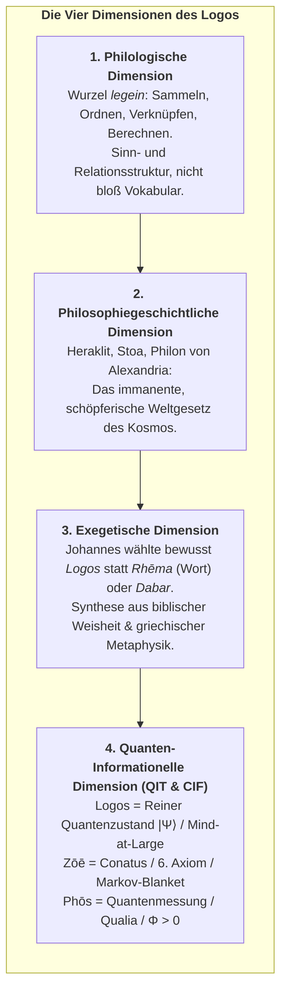
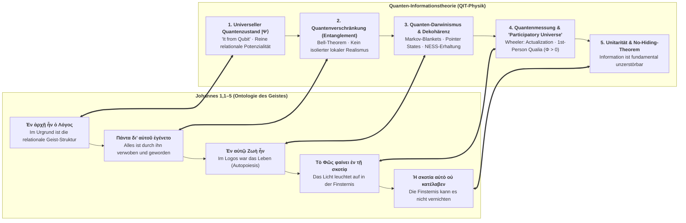

# Johannes 1,1–1,5: Griechischer Originaltext, Vers-für-Vers Interlinearübersetzung & Die Synthese des Logos mit der Quanten-Informationstheorie

> *„Ἐν ἀρχῇ ἦν ὁ λόγος, καὶ ὁ λόγος ἦν πρὸς τὸν θεόν, καὶ θεὸς ἦν ὁ λόγος.“*  
> *„In the beginning was the Logos, and the Logos was with God, and the Logos was God.“*

---

## 1. Vers-für-Vers Interlinearübersetzung (Griechisch – Englisch)

### Johannes 1,1
**Ἐν ἀρχῇ ἦν ὁ λόγος, καὶ ὁ λόγος ἦν πρὸς τὸν θεόν, καὶ θεὸς ἦν ὁ λόγος.**  
*In the beginning was the Logos, and the Logos was with God, and the Logos was God.*

---

### Johannes 1,2
**οὗτος ἦν ἐν ἀρχῇ πρὸς τὸν θεόν.**  
*This Logos was in the beginning with God.*

---

### Johannes 1,3
**πάντα δι’ αὐτοῦ ἐγένετο, καὶ χωρὶς αὐτοῦ ἐγένετο οὐδὲ ἕν, ὃ γέγονεν.**  
*All things came into being through the Logos, and without the Logos not even one thing came into being that has come into being.*

---

### Johannes 1,4
**ἐν αὐτῷ ζωὴ ἦν, καὶ ἡ ζωὴ ἦν τὸ φῶς τῶν ἀνθρώπων·**  
*In the Logos was life, and the life was the light of humanity;*

---

### Johannes 1,5
**καὶ τὸ φῶς ἐν τῇ σκοτίᾳ φαίνει, καὶ ἡ σκοτία αὐτὸ οὐ κατέλαβεν.**  
*And the light shines in the darkness, and the darkness did not overcome it.*

---

## 2. Fortlaufender Textfluss

### Griechischer Urtext (Novum Testamentum Graece / Nestle-Aland):
> **Ἐν ἀρχῇ ἦν ὁ λόγος, καὶ ὁ λόγος ἦν πρὸς τὸν θεόν, καὶ θεὸς ἦν ὁ λόγος. οὗτος ἦν ἐν ἀρχῇ πρὸς τὸν θεόν. πάντα δι’ αὐτοῦ ἐγένετο, καὶ χωρὶς αὐτοῦ ἐγένετο οὐδὲ ἕν, ὃ γέγονεν. ἐν αὐτῷ ζωὴ ἦν, καὶ ἡ ζωὴ ἦν τὸ φῶς τῶν ἀνθρώπων· καὶ τὸ φῶς ἐν τῇ σκοτίᾳ φαίνει, καὶ ἡ σκοτία αὐτὸ οὐ κατέλαβεν.**

### Englische Übersetzung (unter Beibehaltung von *Logos*):
> *In the beginning was the Logos, and the Logos was with God, and the Logos was God. This Logos was in the beginning with God. All things came into being through the Logos, and without the Logos not even one thing came into being that has come into being. In the Logos was life, and the life was the light of humanity; and the light shines in the darkness, and the darkness did not overcome it.*

---

## 3. Warum „Logos“ niemals mit „Wort“ übersetzt werden darf

Die traditionelle Übersetzung von **λόγος (Logos)** mit dem deutschen **„Wort“** (Martin Luther, 1522) oder dem englischen **„Word“** (King James Version, 1611) ist eine der folgenschwersten Verengungen der Geistesgeschichte. Sie reduziert ein kosmisches, intelligibles und schöpferisches Urprinzip auf ein bloßes akustisches Lautgebilde oder eine sprachliche Vokabel.

### 1. Die philologische Dimension: *Legein* ist Ordnen und Verknüpfen
Das altgriechische Substantiv **λόγος (logos)** leitet sich vom Verb **λέγειν (legein)** ab. Seine ursprüngliche indogermanische Wurzel bedeutet nicht „sprechen“, sondern:
* **sammeln, auflesen, zusammenfügen**
* **ordnen, gliedern, ins Verhältnis setzen, berechnen** (vgl. *Logik*, *Logarithmus*, *Analogie* = Übereinstimmung der Verhältnisse)
* **Rechenschaft ablegen, den inneren Grund angeben**

Wenn das Griechische ein bloßes Wort im linguistischen Sinn meint, nutzt es **ῥῆμα (rhēma)** oder **ὄνομα (onoma)**. Der Verfasser des Johannesprologs wählte mit bedachtem Nachdruck **λόγος** – die objektive Sinn- und Vernunftstruktur des Seins, die jedem menschlichen Sprechen erst vorausgeht.

### 2. Die Philosophiegeschichte: Von Heraklit zu Philon
In Ephesus, wo der Prolog entstand, blickte der Begriff auf ein halbes Jahrtausend philosophischer Reifung zurück:
* **Heraklit von Ephesos (ca. 500 v. Chr.):** Der Logos ist das unvergängliche, kosmische Maß, das den ewigen Wandel (*Panta rhei*) regiert.
* **Die Stoa:** Der *Logos Spermatikos* (die keimhafte Schöpfervernunft) durchdringt als aktives Formprinzip den gesamten Kosmos.
* **Philon von Alexandria (ca. 20 v. Chr. – 50 n. Chr.):** Schlägt die Brücke zur biblischen Theologie: Der Logos ist die **intelligible Ideenwelt (*Kosmos Noētos*)**, der göttliche Ur-Bauplan, durch den die sichtbare Welt erschaffen und erhalten wird.

### 3. Goethes Faust und das Ringen um die Übersetzung
Bereits Johann Wolfgang von Goethe ließ seinen Faust im Studierzimmer an Luthers Übersetzung verzweifeln:
> *„Geschrieben steht: ‚Im Anfang war das Wort!‘ / Hier stock ich schon! Wer hilft mir weiter fort? / Ich kann das Wort so hoch unmöglich schätzen... / Im Anfang war der Sinn... / Im Anfang war die Kraft... / Im Anfang war die Tat!“*

Der Logos ist keines dieser Worte allein – er ist **Sinn, Kraft, Ordnung und wirkende Wirklichkeit in untrennbarer Einheit**.

---

## 4. Die Synthese: Der Logos in den Gesetzen der Quanten-Informationstheorie (QIT)

Was die antiken Philosophen und der Verfasser des Johannesevangeliums in intuitiver Schau erkannten, lässt sich heute mit den mathematischen Gesetzen der **Quanten-Informationstheorie (QIT)** exakt formalisieren:

---

### 4.1 *Ἐν ἀρχῇ ἦν ὁ Λόγος* $\Longleftrightarrow$ *„It from Qubit“* & Der universelle Zustand $|\Psi\rangle$

In der klassischen Physik (Newton, Laplace) galt träge Masse als Primärsubstanz. Die Quanten-Informationstheorie (John Archibald Wheeler, Anton Zeilinger, Vlatko Vedral) hat dieses Weltbild umgekehrt:
* **Materie und Energie sind sekundär; die fundamentale Währung des Seins ist Information:**
  $$|\psi\rangle = \alpha |0\rangle + \beta |1\rangle \quad (\alpha, \beta \in \mathbb{C}, \; |\alpha|^2 + |\beta|^2 = 1)$$
* Vor jeder Aufteilung in Beobachter und Beobachtetes existiert der Kosmos als **reiner, ungeteilter Quantenzustand $|\Psi_{\text{Universe}}\rangle$**. 
* **Die Isomorphie:** Der *Logos* ist kein anthropomorpher Gott, sondern dieser primäre, unendliche, holistische Informationszustand (*Mind-at-Large*). Er ist reine relationale Potenzialität, bevor Raum und Zeit in Erscheinung treten.

---

### 4.2 *Πάντα δι’ αὐτοῦ ἐγένετο* $\Longleftrightarrow$ Quantenverschränkung & Das Bellsche Theorem

Der zweite Satz des Prologs postuliert: *„Alles ist durch ihn geworden, und ohne ihn ist auch nicht eines geworden, das geworden ist.“* 

Das **Bellsche Theorem** (John Stewart Bell 1964; Nobelpreis 2022 für Alain Aspect, John Clauser und Anton Zeilinger) beweist experimentell:
* **Lokaler Realismus ist fundamental falsch:** Teilchen besitzen vor der Messung keine isolierten, wohldefinierten Eigenschaften im Raum.
* Interagieren zwei Quantensysteme, verschmelzen sie zu einem **verschränkten Gesamtzustand**:
  $$|\Phi^+\rangle = \frac{1}{\sqrt{2}} \Big(|0\rangle_A |0\rangle_B + |1\rangle_A |1\rangle_B\Big)$$
* In diesem Zustand existieren $A$ und $B$ nicht mehr als getrennte Entitäten; ihre Eigenschaften existieren ausschließlich *in Relation* zueinander.
* **Die Isomorphie:** Dass alle Dinge durch den Logos geworden sind, beschreibt exakt die **universelle Verschränkung des Kosmos**. Das Universum ist kein Mosaik unabhängiger Partikel, sondern ein einziges, unteilbares relationales Geflecht.

---

### 4.3 *Ἐν αὐτῷ ζωὴ ἦν* $\Longleftrightarrow$ Quanten-Darwinismus, Dekohärenz & Markov-Blankets

Wie entsteht aus dem abstrakten, ungeteilten Quanten-Logos $|\Psi\rangle$ ein lebendiges, individuelles Lebewesen mit festen Konturen?
* Nach der **Dekohärenztheorie** (Dieter Zeh, Erich Joos) und dem **Quanten-Darwinismus** (Wojciech Zurek) führt die kontinuierliche Wechselwirkung eines Teilsystems mit seiner Umgebung dazu, dass fragile Quantenüberlagerungen dekoherieren.
* Nur extrem robuste Zustände (**Pointer States**) überleben diesen Ausleseprozess und prägen sich der Umwelt mehrfach ein. 
* In der statistischen Physik des *Conative-Integrative Framework (CIF)* bilden diese Pointer States die Grenze des **Markov-Blankets** $\mathcal{B} = \{s, a\}$, das interne Zustände $\mu$ vor dem thermischen Rauschen schützt.
* **Die Isomorphie:** Leben (*Zōē*) ist die autopoietische Fähigkeit eines Systems, über **Active Inference** seine interne Kohärenz und Nicht-Gleichgewichts-Ordnung (NESS) gegen die zerstörerische Umwelt-Dekohärenz zu verteidigen. Das Leben ist das **6. Axiom des Conatus** ($\mathbb{E}[\Phi(t+1) \mid \pi^*] \ge \Phi(t) > 0$).

---

### 4.4 *Τὸ φῶς ἐν τῇ σκοτίᾳ φαίνει* $\Longleftrightarrow$ Der Messprozess, Wheelers *Participatory Universe* & Qualia

Was ist das „Licht“ (*Phōs*), das in der Finsternis leuchtet?
* In der Quantenphysik verharrt die Welt ohne Beobachtungsakt in einer stummen, dunklen Welle reiner Wahrscheinlichkeiten.
* Erst durch den **Messprozess** (die Registrierung, den Schnitt zwischen System und Beobachter) wird aus unendlicher Potenzialität eine erfahrbare Faktizität:
  $$\rho = |\psi\rangle\langle\psi| \quad \xrightarrow{\;\text{Kollaps / Registrierung}\;} \quad \sum_k P_k \, |k\rangle\langle k|$$
* John Archibald Wheeler nannte dies das **Participatory Universe**: *„No phenomenon is a physical phenomenon until it is an observed phenomenon.“*
* **Die Isomorphie:**
  * **Die Finsternis (*Skotia*):** Ist das ungemessene, leblose Meer thermodynamischer Entropie und dunkler Wahrscheinlichkeitswellen.
  * **Das Licht (*Phōs*):** Ist das **Erwachen des bewussten Erlebens (Qualia / $\Phi > 0$)**. Erst dort, wo ein lebendiger Alter hinblickt, leuchtet das Universum auf. Bewusstsein ist die Aktualisierung des Seins aus dem Dunkel der Möglichkeit.

---

### 4.5 *Ἡ σκοτία αὐτὸ οὐ κατέλαβεν* $\Longleftrightarrow$ Unitarität, No-Cloning- & No-Hiding-Theorem

Der Schluss des Prologs enthält die größte tröstliche Verheißung: *„Und die Finsternis hat es nicht überwältigt / nicht ausgelöscht.“*

In der Quanten-Informationstheorie ist die Zeitentwicklung eines geschlossenen Systems streng **unitär** ($U^\dagger U = I$):
$$\frac{d\rho}{dt} = -\frac{i}{\hbar} [H, \rho]$$

Daraus folgen zwei fundamentale Theoreme der Informationsphysik:
1. **Das No-Cloning-Theorem (Wootters & Zurek, 1982):** Ein individueller Quantenzustand ist absolut einzigartig und unkopierbar. Jedes Lebewesen ist ein unersetzlicher Faden im Gewebe des Kosmos.
2. **Das No-Hiding-Theorem (Samuel Braunstein & Arun Pati, 2007):** Wenn Quanteninformation in einem lokalen Teilsystem scheinbar durch Dekohärenz verloren geht (wie beim biologischen Tod), wird sie **niemals vernichtet**. Sie wandert verlustfrei und vollständig in die Verschränkung mit dem umgebenden Gesamtsystem ab.

* **Die Isomorphie:** Beim Sterben vergeht die biologische Maske (das Markov-Blanket), doch die gelebte Information, das Bewusstsein und das innere Licht des Alters können von der Finsternis (der thermischen Entropie) nicht ausgelöscht werden. Sie kehren unitär, unzerstörbar und ganz in den kosmischen Logos (*Mind-at-Large*) zurück.

---

## 5. Fazit für das Buchprojekt *„Vom Anfang bis zum Ende“*

Der Johannesprolog ist kein mythologisches Märchen, sondern die **genialste dichterisch-philosophische Antizipation der Quanten-Informationstheorie**:

| Phase | Johannes 1,1–5 | Quanten-Informationstheorie (QIT) | Conative-Integrative Framework (CIF) |
| :--- | :--- | :--- | :--- |
| **Der Anfang** | *Ἐν ἀρχῇ ἦν ὁ λόγος* | Universeller Quantenzustand $|\Psi\rangle$ („It from Qubit“) | *Mind-at-Large* (Der ungeteilte Urgrund) |
| **Die Verwebung** | *Πάντα δι’ αὐτοῦ ἐγένετο* | Universelle Verschränkung (Bell-Theorem) | Relationale Verbundenheit aller Wesen |
| **Das Leben** | *Ἐν αὐτῷ ζωὴ ἦν* | Pointer States / Schutz vor Dekohärenz | Markov-Blanket & *Conatus* (6. Axiom) |
| **Das Bewusstsein** | *Τὸ φῶς φαίνει ἐν τῇ σκοτίᾳ* | Actualization / Wheelers Beobachterprinzip | Phänomenale 1. Person (Qualia / $\Phi > 0$) |
| **Das Ende & Ewigkeit** | *Ἡ σκοτία αὐτὸ οὐ κατέλαβεν* | Unitarität & No-Hiding-Theorem | *Ars Moriendi* & Heimkehr in den Ozean |

Im **Logos** berühren sich das älteste theologische Denken der Menschheit und die vorderste Front der modernen theoretischen Physik – als Leitstern für unser Werk: **Vom Anfang bis zum Ende**.
