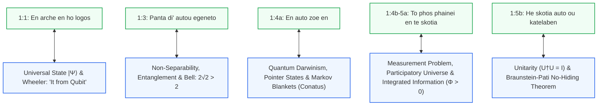

# John 1:1–1:5: Greek Original Text, Interlinear Translation & the Ontology of the Logos

### *Why Logos Must Not Be Translated as 'Word' and Its Isomorphism with Quantum Information Theory (QIT)*

**Author:** Thomas Riebl  
**Date:** September 5, 2026  
**Classification:** Philosophical Philology • Quantum Information Theory • Active Inference • Conative-Integrative Framework (CIF)

---

## 1. Verse-by-Verse Greek Original and Interlinear Translation

> **Translation Principle:**  
> The term **Logos (λόγος)** is deliberately preserved untranslated. Translating it as "Word" commits a category error, reducing a cosmic, generative, and relational matrix to mere human speech.

---

### Verse 1:1

$$\begin{array}{l}
\textbf{Ἐν} & \textbf{ἀρχῇ} & \textbf{ἦν} & \textbf{ὁ} & \textbf{λόγος,} \\
\text{En} & \text{archē} & \text{ēn} & \text{ho} & \text{logos,} \\
\text{[In]} & \text{[origin/principle]} & \text{[was]} & \text{[the]} & \textbf{[Logos],}
\end{array}$$

$$\begin{array}{l}
\textbf{καὶ} & \textbf{ὁ} & \textbf{λόγος} & \textbf{ἦν} & \textbf{πρὸς} & \textbf{τὸν} & \textbf{θεόν,} \\
\text{kai} & \text{ho} & \text{logos} & \text{ēn} & \text{pros} & \text{ton} & \text{theon,} \\
\text{[and]} & \text{[the]} & \textbf{[Logos]} & \text{[was]} & \text{[in intimate relation with]} & \text{[the]} & \text{[God],}
\end{array}$$

$$\begin{array}{l}
\textbf{καὶ} & \textbf{θεὸς} & \textbf{ἦν} & \textbf{ὁ} & \textbf{λόγος.} \\
\text{kai} & \text{theos} & \text{ēn} & \text{ho} & \text{logos.} \\
\text{[and]} & \text{[divine in nature]} & \text{[was]} & \text{[the]} & \textbf{[Logos].}
\end{array}$$

> **Syntactic Note:** In the third clause, $\theta\epsilon\grave{o}\varsigma$ stands without the definite article before the verb $\tilde{\eta}\nu$, functioning as a qualitative predicate: The Logos is divine in essence and nature, identical with ultimate reality.

---

### Verse 1:2

$$\begin{array}{l}
\textbf{οὗτος} & \textbf{ἦν} & \textbf{ἐν} & \textbf{ἀρχῇ} & \textbf{πρὸς} & \textbf{τὸν} & \textbf{θεόν.} \\
\text{Houtos} & \text{ēn} & \text{en} & \text{archē} & \text{pros} & \text{ton} & \text{theon.} \\
\text{[This one]} & \text{[was]} & \text{[in]} & \text{[origin/principle]} & \text{[in relation with]} & \text{[the]} & \text{[God].}
\end{array}$$

---

### Verse 1:3

$$\begin{array}{l}
\textbf{πάντα} & \textbf{δι’} & \textbf{αὐτοῦ} & \textbf{ἐγένετο,} \\
\text{Panta} & \text{di'} & \text{autou} & \text{egeneto,} \\
\text{[All things]} & \text{[through]} & \text{[it/him]} & \text{[came into being / emerged],}
\end{array}$$

$$\begin{array}{l}
\textbf{καὶ} & \textbf{χωρὶς} & \textbf{αὐτοῦ} & \textbf{ἐγένετο} & \textbf{οὐδὲ} & \textbf{ἕν} & \textbf{ὃ} & \textbf{γέγονεν.} \\
\text{kai} & \text{chōris} & \text{autou} & \text{egeneto} & \text{oude} & \text{hen} & \text{ho} & \text{gegonen.} \\
\text{[and]} & \text{[apart from]} & \text{[it/him]} & \text{[came into being]} & \text{[not even]} & \text{[one single thing]} & \text{[that]} & \text{[has come to be].}
\end{array}$$

---

### Verse 1:4

$$\begin{array}{l}
\textbf{ἐν} & \textbf{αὐτῷ} & \textbf{ζωὴ} & \textbf{ἦν,} \\
\text{en} & \text{autō} & \text{zōē} & \text{ēn,} \\
\text{[In]} & \text{[it/him]} & \text{[Life]} & \text{[was / resided],}
\end{array}$$

$$\begin{array}{l}
\textbf{καὶ} & \textbf{ἡ} & \textbf{ζωὴ} & \textbf{ἦν} & \textbf{τὸ} & \textbf{φῶς} & \textbf{τῶν} & \textbf{ἀνθρώπων·} \\
\text{kai} & \text{hē} & \text{zōē} & \text{ēn} & \text{to} & \text{phōs} & \text{tōn} & \text{anthrōpōn;} \\
\text{[and]} & \text{[the]} & \text{[Life]} & \text{[was]} & \text{[the]} & \text{[Light]} & \text{[of]} & \text{[human beings];}
\end{array}$$

---

### Verse 1:5

$$\begin{array}{l}
\textbf{καὶ} & \textbf{τὸ} & \textbf{φῶς} & \textbf{ἐν} & \textbf{τῇ} & \textbf{σκοτίᾳ} & \textbf{φαίνει,} \\
\text{kai} & \text{to} & \text{phōs} & \text{en} & \text{tē} & \text{skotia} & \text{phainei,} \\
\text{[and]} & \text{[the]} & \text{[Light]} & \text{[in]} & \text{[the]} & \text{[darkness]} & \text{[shines],}
\end{array}$$

$$\begin{array}{l}
\textbf{καὶ} & \textbf{ἡ} & \textbf{σκοτία} & \textbf{αὐτὸ} & \textbf{οὐ} & \textbf{κατέλαβεν.} \\
\text{kai} & \text{hē} & \text{skotia} & \text{auto} & \text{ou} & \text{katelaben.} \\
\text{[and]} & \text{[the]} & \text{[darkness]} & \text{[it]} & \text{[not]} & \text{[overcame / extinguished / engulfed].}
\end{array}$$

---

## 2. Continuous Reading Text

### Greek Original (Nestle-Aland 28)
> 1:1 Ἐν ἀρχῇ ἦν ὁ λόγος, καὶ ὁ λόγος ἦν πρὸς τὸν θεόν, καὶ θεὸς ἦν ὁ λόγος.  
> 1:2 οὗτος ἦν ἐν ἀρχῇ πρὸς τὸν θεόν.  
> 1:3 πάντα δι’ αὐτοῦ ἐγένετο, καὶ χωρὶς αὐτοῦ ἐγένετο οὐδὲ ἕν ὃ γέγονεν.  
> 1:4 ἐν αὐτῷ ζωὴ ἦν, καὶ ἡ ζωὴ ἦν τὸ φῶς τῶν ἀνθρώπων·  
> 1:5 καὶ τὸ φῶς ἐν τῇ σκοτίᾳ φαίνει, καὶ ἡ σκοτία αὐτὸ οὐ κατέλαβεν.

### Verse-by-Verse English Translation (Preserving the Logos)
> **1:1** In the beginning [in the foundational origin] was the **Logos**, and the **Logos** was in dynamic relation with God, and divine in essence was the **Logos**.  
> **1:2** This very one was in the beginning in dynamic relation with God.  
> **1:3** All things came into being through it, and apart from it not a single thing came into being that has come to be.  
> **1:4** In it was Life, and the Life was the Light of humanity.  
> **1:5** And the Light shines in the darkness, and the darkness did not overcome it.

---

## 3. Philological & Philosophical Treatise: Why Logos Must Not Be Translated as 'Word'

The historic translation of the Greek term **λόγος (logos)** into Latin as *verbum* (Jerome’s Vulgate), into German as *„Wort“* (Martin Luther), and into English as *„Word“* represents one of the most consequential reductions in intellectual history. It amputates the cosmological, mathematical, and metaphysical dimensions of the Greek concept, diminishing it to acoustic speech or linguistic signs.

```mermaid
graph TD
    subgraph Antike [Ancient Logos Concept]
        L1["Cosmic Ordering Principle (Heraclitus)"]
        L2["Generative Reason (Seminal Logos / Stoa)"]
        L3["Intelligible Matrix of Forms (Philo)"]
        L4["Mathematical Proportion & Relation (Euclid/Pythagoras)"]
    end

    subgraph Verengung [Linguistic Reduction]
        R1["Latin: Verbum"]
        R2["English: 'Word' / German: 'Wort'"]
    end

    subgraph Moderne [Quantum Informational Matrix]
        Q1["Universal Quantum State |Ψ⟩"]
        Q2["Wheeler: 'It from Qubit'"]
        Q3["Non-Local Entanglement Network"]
    end

    L1 & L2 & L3 & L4 -->|Reduced in translation| R1 & R2
    L1 & L2 & L3 & L4 <==>|True Mathematical Isomorphism| Q1 & Q2 & Q3

    classDef ancient fill:#f0fdf4,stroke:#16a34a,stroke-width:2px;
    classDef reduced fill:#fef2f2,stroke:#ef4444,stroke-width:1.5px;
    classDef modern fill:#eff6ff,stroke:#2563eb,stroke-width:2px;
    class L1,L2,L3,L4 ancient;
    class R1,R2 reduced;
    class Q1,Q2,Q3 modern;
```

### 1. Etymology and Greek Semantic Breadth
The noun $\lambda\acute{o}\gamma\omicron\varsigma$ derives from the verb $\lambda\acute{\epsilon}\gamma\omega$ (*legō*), which originally meant *to gather, arrange, order, count, and weave relations*.  
In classical Greek thought, *Logos* signifies:
- **Ratio and Proportion**: The mathematical relation between magnitudes (Euclid, Pythagoras).
- **Cosmic Law and Reason**: The immanent order that governs the universe (Heraclitus, Stoicism).
- **Meaning and Teleology**: The generative principle that imparts form (*eidos*) to formless matter (*hyle*).

To translate *Logos* as "Word" commits a category error: It confuses the medium of human speech with the ontological structure of the cosmos.

### 2. The Heraclitean Ur-Logos
For Heraclitus of Ephesus (c. 500 BCE), the Logos is the eternal, common ordering principle (*xynon*) that unifies cosmic opposites:
> *„Although this Logos holds forever, humans fail to comprehend it... Listening not to me, but to the Logos, it is wise to agree that all things are One (Hen Panta).“* (Fragment B 50)

The Logos here is not a verbal announcement; it is the **fundamental informational law** governing cosmic transformation.

### 3. The Stoic *Logos Spermatikos*
In Stoic physics (Zeno, Chrysippus), the cosmos is sustained by the *Logos*, conceptualized as *Pneuma*—an active, ordering principle that permeates inert matter:
- The **Logoi spermatikoi** (*seminal logoi*): The generative informational programs that direct the development, morphogenesis, and self-preservation of living organisms.

### 4. Philo of Alexandria: The Bridge to the Gospel of John
Philo of Alexandria (c. 20 BCE – 50 CE) synthesized the Hebrew *Dabar* (the creative divine command) with the Greek *Logos*. For Philo, the Logos is:
- The **Intelligible World** (*Kosmos Noetos*): The immaterial realm of ideas and physical laws serving as the blueprint for creation.
- The **Bond of the Universe** (*Desmos*): The non-local cohesion preventing cosmic disintegration into chaos.

### 5. Goethe’s Faust: The Inadequacy of "Word"
Johann Wolfgang von Goethe captured this linguistic inadequacy in *Faust I*:
> *„Geschrieben steht: ‚Im Anfang war das Wort!‘ / Hier stock ich schon! Wer hilft mir weiter fort? / Ich kann das Wort so hoch unmöglich schätzen... / Auf einmal seh ich Rat und schreibe getrost: Im Anfang war die Tat!“*

Goethe realized that "Word" was insufficient. Yet replacing it with "Deed" (*Tat*) merely replaces passive speech with mechanical action. The synthesis revealed by modern quantum information theory is: **In the beginning was the Logos—the relational informational code from which both action and matter arise.**

---

## 4. Isomorphism with Quantum Information Theory (QIT) & the CIF

The Prologue of John (1:1–1:5) exhibits an exact structural isomorphism with the axioms of modern Quantum Information Theory and the **Conative-Integrative Framework (CIF)**.

---

### 1. Verse 1:1 $\Longleftrightarrow$ Wheeler's *It from Qubit* & Universal Quantum State $|\Psi\rangle$
$$\text{„Ἐν ἀρχῇ ἦν ὁ λόγος...“} \Longleftrightarrow \text{Information as the Ontological Ground}$$

* **Physical Correspondence**:
  In classical physics, material particles are primary, and information is a secondary attribute. Quantum Information Theory inverts this ontology:
  As John Archibald Wheeler formulated in his paradigm **„It from Bit“** (generalized to **„It from Qubit“**), every physical entity (*it*) emerges from quantum measurements and binary relational answers.
* **The Logos as $|\Psi\rangle$**:
  The Logos is the primordial universal wavefunction $|\Psi\rangle$ (*Mind-at-Large*)—an uncollapsed, infinite-dimensional superposition containing all possible ontological configurations. Information precedes matter; matter is the physical manifestation of structured information.

---

### 2. Verse 1:3 $\Longleftrightarrow$ Entanglement, Non-Locality & Bell’s Theorem
$$\text{„πάντα δι’ αὐτοῦ ἐγένετο, καὶ χωρὶς αὐτοῦ ἐγένετο οὐδὲ ἕν...“} \Longleftrightarrow \text{Relational Holism}$$

* **Physical Correspondence**:
  Verse 1:3 asserts that no entity possesses isolated, self-subsistent existence outside the relational web of the Logos.
* **Violation of Bell's Inequality**:
  In local classical realism, objects exist with independent, definite values. In quantum mechanics, Bell's Theorem ($S \le 2\sqrt{2}$) proves that the universe is fundamentally non-separable.  
  Two entangled particles $A$ and $B$ are described by a joint non-factorizable state:
  $$|\psi_{AB}\rangle \neq |\psi_A\rangle \otimes |\psi_B\rangle$$
  Separated particles remain non-locally correlated without classical signal exchange. Creation is not an assembly of isolated parts; it is an entangled relational holism mediated through the Logos.

---

### 3. Verse 1:4a $\Longleftrightarrow$ Quantum Darwinism, Pointer States & Markov Blankets
$$\text{„ἐν αὐτῷ ζωὴ ἦν...“} \Longleftrightarrow \text{Non-Equilibrium Self-Preservation (Conatus)}$$

* **Physical Correspondence**:
  How does living, individual form (*Zōē*) emerge from a continuous quantum substrate?
* **Pointer States & Markov Blankets**:
  Wojciech Zurek’s theory of **Quantum Darwinism** demonstrates that the interaction Hamiltonian with the environment selects stable **Pointer States** $|\pi_i\rangle$ that resist decoherence:
  $$[H_{\mathrm{int}}, |\pi_i\rangle\langle\pi_i| \otimes \mathbb{I}_E] \approx 0$$
  As formulated in the **CIF (Axiom 6: Conatus)** and Karl Friston’s Active Inference, life constitutes a dissipative structure bounded by a **Markov Blanket** ($\mathcal{H}_B$). The blanket decouples internal states ($\mathcal{H}_I$) from environmental perturbations ($\mathcal{H}_E$), minimizing free energy ($F = U - TS \to \min$) to actively preserve low internal entropy. Life is the Logos localized into self-sustaining agency.

---

### 4. Verse 1:4b–1:5a $\Longleftrightarrow$ The Measurement Problem, Participatory Universe & $\Phi > 0$
$$\text{„καὶ ἡ ζωὴ ἦν τὸ φῶς... καὶ τὸ φῶς ἐν τῇ σκοτίᾳ φαίνει...“} \Longleftrightarrow \text{Qualia as Actualization}$$

* **Physical Correspondence**:
  Darkness ($\sigma\kappa\omicron\tau\acute{\iota}\alpha$) corresponds to uncollapsed quantum potentiality—the dark ocean of probability amplitudes where all trajectories coexist without conscious realization.
* **Light as First-Person Illumination ($\Phi > 0$)**:
  Light ($\phi\tilde{\omega}\varsigma$) is conscious observation. In Wheeler’s **Participatory Universe** and von Neumann’s quantum measurement framework, it is the subjective interaction that actualizes potentiality into concrete fact.
  Under the Integrated Information Theory (IIT) incorporated into the CIF, integrated information $\Phi > 0$ generates irreducibly unified qualitative experience (*Qualia*). Consciousness is the light that illuminates the dark quantum potential.

---

### 5. Verse 1:5b $\Longleftrightarrow$ Unitarity ($U^\dagger U = I$) & the Braunstein-Pati No-Hiding Theorem
$$\text{„καὶ ἡ σκοτία αὐτὸ οὐ κατέλαβεν.“} \Longleftrightarrow \text{Absolute Conservation of Experiential Information}$$

* **Philological Insight**:
  The Greek verb $\kappa\alpha\tau\alpha\lambda\alpha\mu\beta\acute{\alpha}\nu\omega$ (*katalambanō*) possesses profound dual semantics:
  1. *To comprehend / grasp* (epistemic).
  2. *To overpower / extinguish / swallow up* (ontological).
  The phrase asserts that darkness is powerless to extinguish the light.
* **The No-Hiding Theorem in Quantum Mechanics**:
  In quantum mechanics, time evolution is strictly **unitary**:
  $$U^\dagger U = \mathbb{I}$$
  The von Neumann entropy of the universe is invariant; quantum states can neither be duplicated (No-Cloning Theorem) nor destroyed (No-Deleting Theorem).
* **Braunstein-Pati No-Hiding Theorem (Physical Review Letters, 2007)**:
  Samuel Braunstein and Arun Pati proved that if quantum information disappears from a local subsystem via decoherence, it is **never lost or hidden in local correlations**. It is completely transferred into the global entanglement structure of the universe.
* **Existential & Ars Moriendi Consequence**:
  Biological death is the dissolution of the individual Markov Blanket ($\mathcal{H}_B \to 0$). However, because of unitarity and the No-Hiding Theorem, **the experiential information, memories, and qualia generated during life are physically indestructible**. They return to the universal Logos. Darkness cannot swallow the light; experiential reality is eternally woven into the cosmic quantum matrix.

---

## 5. Synoptic Matrix: John 1:1–1:5 vs. Quantum Information Theory

| John 1 Verse | Greek Core Term | Quantum Information Theory (QIT) & CIF | Physical & Metaphysical Significance |
| :--- | :--- | :--- | :--- |
| **1:1** | *Ἐν ἀρχῇ ἦν ὁ λόγος* | **Universal State $\|\Psi\rangle$ & Wheeler's *It from Qubit*** | Primacy of information over matter; the cosmic matrix of potentiality. |
| **1:3** | *Πάντα δι’ αὐτοῦ ἐγένετο* | **Quantum Entanglement & Non-Locality (Bell $2\sqrt{2} > 2$)** | Relational genesis: no isolated local realism; all entities are holistically entangled. |
| **1:4a** | *Ἐν αὐτῷ ζωὴ ἦν* | **Quantum Darwinism & Markov Blankets** | Decoherence resistance via Pointer States; active minimization of free energy (*Conatus*). |
| **1:4b–1:5a**| *Τὸ φῶς φαίνει ἐν τῇ σκοτίᾳ* | **Measurement Problem, Participatory Universe & $\Phi > 0$** | Actualization of probability waves via consciousness; 1st-person qualia illuminating the dark vacuum. |
| **1:5b** | *Ἡ σκοτία αὐτὸ οὐ κατέλαβεν* | **Unitarity ($U^\dagger U = \mathbb{I}$) & No-Hiding Theorem** | Strict information conservation: subjective experience is never erased at biological death. |

---

## 6. Conclusion: The Foundational Bedrock for *„Vom Anfang bis zum Ende“*

By re-establishing the ancient concept of the **Logos** in its full philological depth and demonstrating its exact isomorphism with the mathematical foundations of **Quantum Information Theory**, this work bridges the historical divide between ancient ontology and cutting-edge physics.

The Logos is neither an abstract theological dogma nor a human vocalization. It is:
1. The **universal informational matrix** ($|\Psi\rangle$),
2. The **relational entanglement** through which all things exist ($1:3$),
3. The **active Markov boundary** that shelters life against thermal decay ($1:4\text{a}$),
4. The **conscious light of qualia** that actualizes physical reality ($1:4\text{b}$), and
5. The **eternal conservation of experiential information** guaranteed by quantum unitarity ($1:5\text{b}$).

This synthesis provides the intellectual and spiritual compass for *„Vom Anfang bis zum Ende“*: From the primordial quantum potential through the conscious wave of life to the dignified return into the universal source.

---

## References

1. **Braunstein, S. L., & Pati, A. K.** (2007). *Quantum information cannot be completely hidden in correlations*. Physical Review Letters, 98(8), 080502.
2. **Fields, C., Friston, K., Glazebrook, J. F., & Levin, M.** (2022). *A free energy principle for generic quantum systems*. Progress in Biophysics and Molecular Biology, 173, 36–59.
3. **Friston, K.** (2019). *A free energy principle for a particular physics*. arXiv preprint arXiv:1906.10184.
4. **Nestle, E., & Aland, K.** (2012). *Novum Testamentum Graece* (28th revised edition). Deutsche Bibelgesellschaft, Stuttgart.
5. **Riebl, T.** (2026). *The Conative-Integrative Framework: A Formal Mathematical and Ontological Resolution of the Hard Problem of Consciousness and the Mind-Body Dualism*. Monograph, Amazon KDP.
6. **Tononi, G., Boly, M., Massimini, M., & Koch, C.** (2016). *Integrated information theory: from consciousness to its physical substrate*. Nature Reviews Neuroscience, 17(7), 450–461.
7. **Vedral, V.** (2010). *Decoding Reality: The Universe as Quantum Information*. Oxford University Press.
8. **von Weizsäcker, C. F.** (1985). *Aufbau der Physik*. Carl Hanser Verlag, München.
9. **Wheeler, J. A.** (1989). *Information, physics, quantum: The search for links*. Proceedings of the 3rd International Symposium on Foundations of Quantum Mechanics, Tokyo, 354–368.
10. **Zurek, W. H.** (2009). *Quantum Darwinism*. Nature Physics, 5(3), 181–188.
