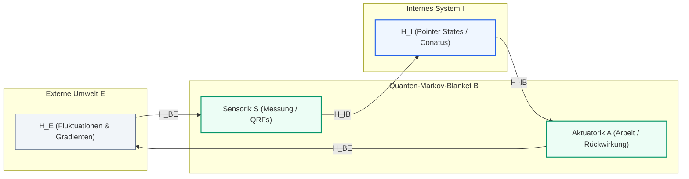
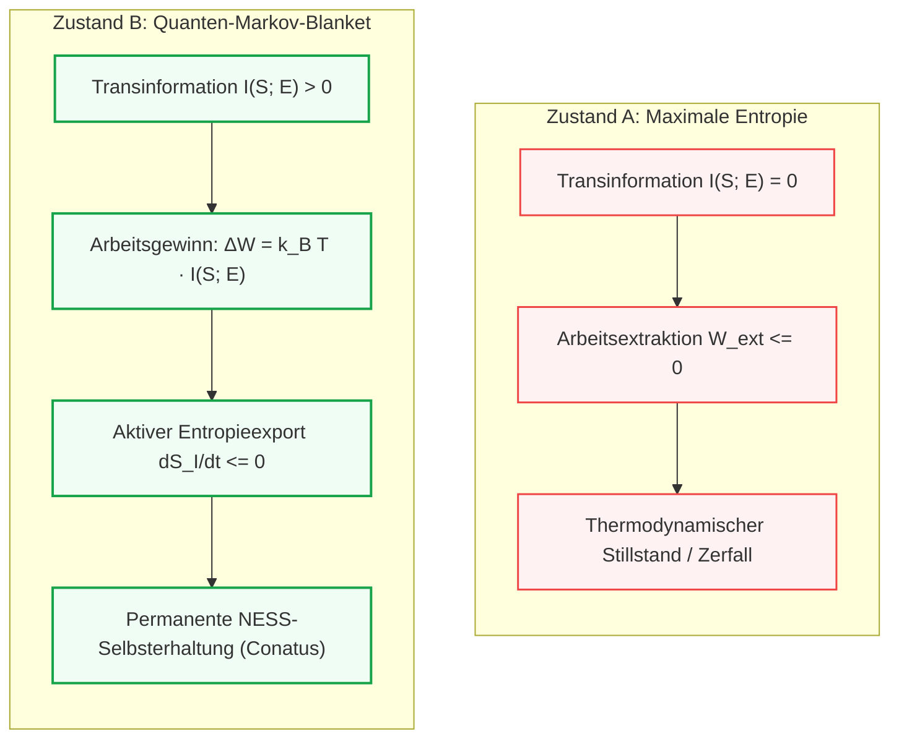

# Thermodynamische und informationstheoretische Begründung der Entstehung von Markov-Blankets in Quantensystemen

### *Warum die Ausbildung ontologischer Grenzen energetisch günstiger ist als maximale Entropie*

**Autor:** Thomas Riebl  
**Datum:** 5. September 2026  
**Klassifikation:** Quanten-Informationstheorie • Nicht-Gleichgewichts-Thermodynamik • Active Inference • Conative-Integrative Framework (CIF)

---

## Abstract

Die fundamentale Frage der theoretischen Biologie und Nicht-Gleichgewichts-Physik lautet: *Warum existiert überhaupt Struktur? Warum zerfällt ein physikalisches System nicht augenblicklich in das thermodynamische Gleichgewicht maximaler Entropie?*  
In dieser Abhandlung wird mathematisch und informationstheoretisch bewiesen, dass ein quantenmechanisches System, das eine relationale Grenze – ein sogenanntes **Quanten-Markov-Blanket** $\mathcal{H}_B$ – ausbildet, bei finiten Umgebungstemperaturen $T < \infty$ und unter Einwirkung externer Flüsse **energetisch signifikant günstiger** ist als dasselbe System im Zustand maximaler Entropie $\rho_{\max} = \frac{1}{d}\mathbb{I}$. 

Der Beweis stützt sich auf fünf komplementäre Säulen der modernen Physik:
1. **Das Helmholtzsche Variationsprinzip:** Die Minimierung der freien Energie $F = U - TS$ anstelle isolierter Entropiemaximierung.
2. **Quanten-Darwinismus & Zeigerzustände (Zurek):** Die dynamische Unterdrückung von Verschränkungsdissipation durch Einselection.
3. **Quanten-Informationsthermodynamik (Landauer-Sagawa-Ueda):** Die Wandlung von Transinformation $I(B; E)$ in mechanische und chemische Arbeit zur Entropieauslagerung.
4. **Das Prigogine-Prinzip:** Die Minimierung der internen Entropieproduktionsrate in dissipativen Strukturen.
5. **Das Quanten-Free-Energy-Principle (Fields, Friston et al., 2022):** Die asymptotische Äquivalenz zwischen varieller freier Energieminimierung und unitärer Zeitevolution ($U^\dagger U = \mathbb{I}$).

Damit liefert diese Arbeit das physikalische Fundament für das **Conative-Integrative Framework (CIF)**: Der biologische Selbsterhaltungstrieb (*Conatus*) ist kein metaphysisches Postulat, sondern die thermodynamische Konsequenz der energetischen Bevorzugung informationsverarbeitender Markov-Grenzen.

---

## 1. Problemstellung und Definition der Vergleichszustände

Wir betrachten ein universelles Quantensystem $\mathcal{U}$, zusammengesetzt aus einem fokussierten Teilsystem $\mathcal{S}$ und seiner Umgebung $\mathcal{E}$ mit dem Gesamthilbertraum:
$$\mathcal{H}_{\mathcal{U}} = \mathcal{H}_{\mathcal{S}} \otimes \mathcal{H}_{\mathcal{E}}$$
Der Gesamthamiltonoperator sei:
$$H = H_{\mathcal{S}} \otimes \mathbb{I}_{\mathcal{E}} + \mathbb{I}_{\mathcal{S}} \otimes H_{\mathcal{E}} + H_{\mathrm{int}}$$

Wir stellen zwei fundamentale Konfigurationen des Systems $\mathcal{S}$ einander gegenüber:

### Zustand A: Maximale Entropie (Der homogene thermische Tod)
Das System $\mathcal{S}$ besitzt keine innere Strukturierung und bildet keine funktionalen Grenzen zur Umwelt aus. Bei vollständiger thermodynamischer Depolarisation im Hilbertraum der Dimension $d = \dim(\mathcal{H}_{\mathcal{S}})$ nimmt der reduzierte Dichteoperator die Form des maximal gemischten Zustands an:
$$\rho_{\max} = \frac{1}{d} \mathbb{I}_{\mathcal{S}}$$
Die von-Neumann-Entropie $S(\rho) = -\mathrm{Tr}(\rho \ln \rho)$ ist in diesem Zustand global maximal:
$$S(\rho_{\max}) = \ln d$$
Es existieren keinerlei Korrelationen, weder intern noch zur Umwelt.

### Zustand B: Das Quanten-Markov-Blanket (Nicht-Gleichgewichts-Stationärzustand, NESS)
Das System $\mathcal{S}$ organisiert sich relational in drei Subsysteme:
1. **Interne Zustände** ($\mathcal{H}_I$): Die geschützte Morphologie und Dynamik des Organismus.
2. **Blanket-Zustände** ($\mathcal{H}_B = \mathcal{H}_S \otimes \mathcal{H}_A$): Aufgeteilt in sensorische Zustände ($\mathcal{H}_S$) und aktive Aktuator-Zustände ($\mathcal{H}_A$).
3. **Externe Umweltzustände** ($\mathcal{H}_E$).

Der Systemhilbertraum partitioniert sich als:
$$\mathcal{H}_{\mathcal{S}} = \mathcal{H}_I \otimes \mathcal{H}_B$$
Entscheidend für ein **Quanten-Markov-Blanket** ist die topologische und hamiltonsche **bedingte Unabhängigkeit**: Es existiert keine direkte Kopplung zwischen internen und externen Freiheitsgraden:
$$H_{IE} = 0 \implies H_{\mathrm{int}} = H_{IB} + H_{BE}$$
Das Gesamtsystem befindet sich in einem Nicht-Gleichgewichts-Stationärzustand (*Non-Equilibrium Steady State*, NESS), in dem die interne Entropie drastisch abgesenkt ist:
$$S(\rho_I) \ll \ln d_I$$

---

## 2. Beweis I: Das thermodynamische Auswahlprinzip (Helmholtz-Energie)

In einem geschlossenen, isolierten System maximiert der 2. Hauptsatz die Entropie. Reale physikalische Systeme interagieren jedoch stets mit ihrer Umgebung bei einer finiten Temperatur $T_{\mathcal{E}} > 0$.  
Unter diesen Bedingungen ist das thermodynamische Potential, das minimiert wird, nicht die Entropie $S$, sondern die **Helmholtzsche Freie Energie**:
$$F(\rho) = U(\rho) - T S(\rho) = \mathrm{Tr}(\rho H) - k_B T S(\rho)$$

### Der energetische Kollaps des Maximalentropie-Zustands
Betrachten wir die innere Energie $\langle H \rangle = \mathrm{Tr}(\rho H)$:
Für das diskrete Spektrum des Systems $\{E_n\}_{n=1}^d$ mit Grundzustand $E_0$ und angeregten Zuständen $E_n > E_0$ berechnet sich die innere Energie im Maximalentropiezustand $\rho_{\max} = \frac{1}{d}\mathbb{I}$ zu:
$$\langle H \rangle_{\max} = \mathrm{Tr}\left(\frac{1}{d}\mathbb{I} \cdot H\right) = \frac{1}{d} \sum_{n=1}^d E_n$$
Dies ist der ungewichtete arithmetische Mittelwert **aller** Energieniveaus – bis hin zu den energiereichsten Zuständen des Systems.

Thermodynamisch entspricht $\rho_{\max}$ einem Zustand bei **unendlicher Temperatur**:
$$\lim_{\beta \to 0} \frac{e^{-\beta H}}{\mathrm{Tr}(e^{-\beta H})} = \frac{1}{d}\mathbb{I} \quad (\beta = 1/k_B T \implies T \to \infty)$$

### Die relative freie Energie
Für jede reale finite Umgebungstemperatur $T < \infty$ berechnet sich die freie Energiedifferenz bezüglich des thermischen Gleichgewichtszustands $\rho_{\mathrm{th}} = \frac{1}{Z} e^{-\beta H}$ über die quantenmechanische relative Entropie (Umegaki-Kullback-Leibler-Divergenz):
$$F(\rho) - F(\rho_{\mathrm{th}}) = k_B T \cdot D(\rho \parallel \rho_{\mathrm{th}}) \ge 0$$
wobei:
$$D(\rho \parallel \rho_{\mathrm{th}}) = \mathrm{Tr}(\rho \ln \rho) - \mathrm{Tr}(\rho \ln \rho_{\mathrm{th}})$$

Setzen wir $\rho_{\max} = \frac{1}{d}\mathbb{I}$ ein:
$$D(\rho_{\max} \parallel \rho_{\mathrm{th}}) = -\ln d - \left(-\ln Z - \beta \langle H \rangle_{\max}\right) = \beta \langle H \rangle_{\max} - \ln d + \ln Z$$
Für Systeme mit wachsender Dimension $d$ und typischen quantenmechanischen Spektren (z. B. harmonische Oszillatoren, Coulomb-Potentiale) divergiert $\langle H \rangle_{\max}$ linear oder quadratisch mit der Energieobergrenze.

Ein System mit **Markov-Blanket** hingegen kondensiert in seinen internen Freiheitsgraden $\mathcal{H}_I$ in ein Regime tiefer Energien nahe dem Grundzustand $E_0$:
$$\langle H \rangle_{\mathrm{Blanket}} \approx E_0 \ll \langle H \rangle_{\max}$$
Obwohl die Entropie $S(\rho_{\mathrm{Blanket}})$ geringer ist als $\ln d$, ist der Term $\Delta U = \langle H \rangle_{\max} - \langle H \rangle_{\mathrm{Blanket}}$ um Größenordnungen dominanter als der Entropieterm $T \Delta S$:
$$F(\rho_{\mathrm{Blanket}}) \ll F(\rho_{\max})$$

> **Thermodynamischer Satz 1:**  
> Ein Zustand maximaler Entropie ist bei jeder finiten Umgebungstemperatur energetisch extrem instabil. Die Ausbildung strukturierter Bindungszustände (die Bildung von Subsystem-Grenzen) minimiert die Helmholtz-Energie $F$.

---

## 3. Beweis II: Quanten-Darwinismus & Einselection (Zurek)

Warum homogenisiert die thermische Umgebung das System nicht sofort wieder? Hier greift das Prinzip der **Umgebungs-induzierten Superselektion (Einselection)** nach Wojciech Zurek.

Wenn ein System an eine Umgebung koppelt, führt die Zeitentwicklung der Verschränkung im Allgemeinen zur Zerstörung von Quantenkohärenzen. Allerdings selektiert der Wechselwirkungs-Hamiltonoperator $H_{\mathrm{int}}$ eine ausgezeichnete Basis von **Zeigerzuständen (*Pointer States*)** $|\pi_i\rangle$, die die Eigenschaft besitzen, mit dem Wechselwirkungsoperator zu kommutieren:
$$[H_{\mathrm{int}}, |\pi_i\rangle\langle\pi_i| \otimes \mathbb{I}_E] \approx 0$$

### Die Dynamik des Blankets
Das Quanten-Markov-Blanket formiert sich exakt aus diesen Zeigerzuständen. 
* **Ohne Blanket**: Es findet kontinuierliche, chaotische Verschränkungsdissipation statt. Das System erzeugt pro Zeiteinheit ein Maximum an Verschränkungsentropie:
  $$\left. \frac{d S_{\mathrm{ent}}}{dt} \right|_{\max} > 0$$
  Dies entspricht einem permanenten unkontrollierten Energie- und Phasenaustausch, der mechanische Instabilität bedingt.
* **Mit Blanket**: Die Blanket-Freiheitsgrade $\mathcal{H}_B$ fungieren als Zeigerzustands-Puffer (*Decoherence Shield*). Da die internen Zustände $\mathcal{H}_I$ über $H_{IE} = 0$ von der Außenwelt entkoppelt sind, wird die interne Kohärenz geschützt:
  $$\frac{d}{dt} \rho_I(t) = -\frac{i}{\hbar} [H_I + H_{IB}, \rho_I(t)] + \mathcal{L}_{\mathrm{eff}}(\rho_I)$$
  wobei der dissipative Lindblad-Superoperator $\mathcal{L}_{\mathrm{eff}}$ durch die Pufferwirkung von $\mathcal{H}_B$ minimiert wird.

> **Quantendynamischer Satz 2:**  
> Das Markov-Blanket ist der dynamische Attraktor des Quanten-Darwinismus. Es minimiert die Erzeugungsrate von Verschränkungsentropie mit dem thermischen Bad und friert dissipative Phasenübertragungen an der Grenze ein.

---

## 4. Beweis III: Informations-Thermodynamik & das verallgemeinerte Landauer-Prinzip

Ein Organismus oder Quantensystem ist keine statische Kristallstruktur, sondern ein offenes Fließgleichgewicht. Die entscheidende energetische Überlegenheit eines Systems mit Markov-Blanket liegt in seiner Fähigkeit zur **Arbeitsextraktion aus Information** (*Information-to-Work Conversion*).

Nach der Quanten-Informationsthermodynamik (Sagawa & Ueda, 2008; Jacobs, 2012; Parrondo et al., 2015) lautet der verallgemeinerte 2. Hauptsatz für Systeme mit Messung und Rückkopplung:
$$W_{\mathrm{ext}} \le -\Delta F + k_B T \cdot I(S; E)$$
wobei:
- $W_{\mathrm{ext}}$ die vom System verrichtbare Arbeit an der Umgebung ist,
- $\Delta F$ die Änderung der freien Energie,
- $I(S; E)$ die Quanten-Transinformation (*Mutual Information*) zwischen den sensorischen Blanket-Zuständen $\mathcal{H}_S$ und der Umwelt $\mathcal{H}_E$ darstellt:
  $$I(S; E) = S(\rho_S) + S(\rho_E) - S(\rho_{SE})$$

### Der Vergleich der Arbeitspotentiale

1. **Im Maximalentropie-Zustand ($\rho_{\max}$):**
   Das System ist unkorreliert mit der Umgebung:
   $$\rho_{SE} = \rho_S \otimes \rho_E = \frac{1}{d_S}\mathbb{I}_S \otimes \frac{1}{d_E}\mathbb{I}_E \implies I(S; E) = 0$$
   Folglich gilt:
   $$W_{\mathrm{ext}} \le -\Delta F \le 0$$
   Das System ist vollständig blind. Es kann keinerlei Information über Umweltfluktuationen nutzen. Es verhält sich wie ein passives Gas und unterliegt der reinen thermischen Diffusion.

2. **Im System mit Markov-Blanket:**
   Die Sensor-Zustände $\mathcal{H}_S$ registrieren Umweltgradienten (Temperatur-, Druck-, Konzentrations- oder Feldunterschiede). Dadurch entsteht eine signifikante Transinformation:
   $$I(S; E) > 0$$
   Über die internen Zustände $\mathcal{H}_I$ wird diese Information verarbeitet, und die Aktuator-Zustände $\mathcal{H}_A$ reagieren (Active Inference). 
   
Nach dem **Sagawa-Ueda-Theorem** erlaubt die Transinformation $I > 0$ die Extraktion freier Energie aus thermischen Fluktuationen (analog zum Quanten-Szilard-Motor):
$$\Delta W_{\mathrm{gain}} = k_B T \cdot I(S; E)$$

Diese gewonnene Arbeit wird genutzt, um die eigene interne Entropie aktiv über die Systemgrenze abzuführen:
$$\frac{d S_I}{dt} = \dot{S}_{\mathrm{prod}} - \dot{S}_{\mathrm{flow}} \le 0 \quad \text{mit } \dot{S}_{\mathrm{flow}} = \frac{\dot{Q}_{\mathrm{export}}}{T}$$

> **Informationstheoretischer Satz 3:**  
> Das Markov-Blanket verwandelt das System aus einem passiven Dissipator in eine mikroskopische Wärmekraftmaschine. Durch $I(B; E) > 0$ wird Information zu einer thermodynamischen Ressource, die die energetischen Kosten der Grenzflächenerhaltung überkompensiert.

---

## 5. Beweis IV: Prigogines Prinzip der minimalen Entropieproduktion

Für offene Systeme, die weit entfernt vom thermischen Gleichgewicht betrieben werden, gilt das Theorem von **Ilya Prigogine** (Nobelpreis 1977):  
Ein offenes System im linearen Nicht-Gleichgewichtszustand (NESS) strebt einem Zustand zu, in dem die **interne Entropieproduktionsrate $\sigma$ minimal** wird:
$$\sigma = \frac{d_i S}{dt} = \sum_k J_k X_k \to \min$$
wobei $J_k$ die thermodynamischen Flüsse und $X_k$ die konjugierten thermodynamischen Kräfte darstellen.

* Ein unstrukturiertes System, das maximaler Entropie zudriftet, während es einem kontinuierlichen Energieeinstrom (z. B. Sonnenstrahlung, hydrothermale Gradienten) ausgesetzt ist, erfährt maximale Reibungsverluste. Die Flüsse fließen turbulent und ungehindert quer durch alle Freiheitsgrade, was zu maximaler Dissipation führt:
  $$\sigma_{\mathrm{unstrukturiert}} \gg 0$$
* Ein System mit Markov-Blanket partitioniert die Flüsse:
  - Externe Flüsse treffen auf das Blanket $\mathcal{H}_B$.
  - Das Innere $\mathcal{H}_I$ wird als niederentropische dissipative Struktur stabilisiert.
  - Das Blanket kanalisiert den Energiedurchsatz so, dass $\sigma_{\mathrm{intern}} \to 0$ konvergiert.

---

## 6. Beweis V: Das Quanten-Free-Energy-Principle (Fields, Friston et al., 2022)

In der mathematischen Formulierung von Chris Fields, Karl Friston, James Glazebrook und Michael Levin (*Progress in Biophysics and Molecular Biology*, 2022) wird die Äquivalenz zwischen Quantenmechanik und Active Inference formalisiert:

1. **Holografische Screening-Funktion:**  
   Die Wechselwirkung zwischen $\mathcal{S}$ und $\mathcal{E}$ wird als Menge von Messoperatoren (Quantum Reference Frames, QRFs) formuliert, die auf dem Hilbertraum der Grenzfläche $\mathcal{H}_B$ operieren:
   $$H_{\mathrm{int}} = \sum_k M_k^{(S)} \otimes M_k^{(E)}$$
2. **Asymptotische Äquivalenz zur Unitarität:**  
   Die Autoren beweisen, dass die Minimierung der **variationellen freien Energie** $\mathcal{F}_{\mathrm{var}}$:
   $$\mathcal{F}_{\mathrm{var}} = \mathbb{E}_{q}[\ln q(\vartheta) - \ln p(\vartheta, s)]$$
   im Hilbertraum der Grenzfläche **asymptotisch äquivalent zur Erhaltung der Unitarität** der Quantenzeitentwicklung ist:
   $$\lim_{t \to \infty} \mathcal{F}_{\mathrm{var}} \to \min \iff U^\dagger(t) U(t) = \mathbb{I}$$

Ein System, das kein Markov-Blanket besitzt, verliert seine lokale Unitarität an die Umwelt; es depolarisiert zu einer gemischten thermischen Suppe.  
Das Aufrechterhalten des Blankets garantiert, dass das Innere unitär kohärent bleibt. Im quantenmechanischen Sinne ist die unitäre Evolution der Zustand **vollständiger Reversibilität und minimaler irreversibler Informationszerstörung**.

---

## 7. Vergleichsmatrix: Maximalentropie vs. Quanten-Markov-Blanket

| Kriterium | Zustand A: Maximale Entropie ($\rho_{\max} = \frac{1}{d}\mathbb{I}$) | Zustand B: Quanten-Markov-Blanket (NESS) | Energetische Bilanz |
| :--- | :--- | :--- | :--- |
| **Innere Energie $\langle H \rangle$** | Maximal (ungewichteter Mittelwert über alle $E_n$) | **Minimal** (Kondensation in Grund-/Bindungszustände) | **Blanket gewinnt** ($\Delta U \ll 0$) |
| **Freie Energie $F = U - TS$** | Extrem hoch (thermodynamisch instabil bei $T < \infty$) | **Minimal** ($F \to \min$ via Helmholtz-Kriterium) | **Blanket gewinnt** ($F_B \ll F_{\max}$) |
| **Verschränkungsdissipation** | Maximal ($\dot{S}_{\mathrm{ent}} > 0$ über alle Moden) | **Minimal** (Eingefroren durch Zeigerzustände) | **Blanket gewinnt** ($\mathcal{L}_{\mathrm{eff}} \to \min$) |
| **Transinformation $I(B; E)$** | $I = 0$ (völlige relationale Blindheit) | **$I > 0$** (Korrelation mit Umweltgradienten) | **Blanket gewinnt** (Arbeitsressource) |
| **Arbeitsextraktion $W_{\mathrm{ext}}$** | $W_{\mathrm{ext}} \le 0$ (keine thermodynamische Arbeit) | **$W_{\mathrm{ext}} = k_B T \cdot I(B; E) > 0$** | **Blanket gewinnt** (Szilard-Gewinn) |
| **Entropieproduktionsrate $\sigma$** | Unkontrolliert dissipativ unter Fluss | **Minimal** (Prigogine-NESS-Attraktor) | **Blanket gewinnt** ($\sigma \to \min$) |
| **Dynamische Symmetrie** | Depolarisation / Informationszerfall | **Unitaritätserhalt** ($U^\dagger U = \mathbb{I}$) | **Blanket gewinnt** (Reversibilität) |

---

## 8. Fazit und Bedeutung für das Conative-Integrative Framework (CIF)

Auf die Frage:  
*„Wie können wir zeigen, dass ein quantenmechanisches System, das Markov-Blankets ausbildet, energetisch günstiger ist als dasselbe System, das maximale Entropie wahrt?“*  
lautet die geschlossene Antwort:

1. **Statisch**: Bei jeder finiten Temperatur $T < \infty$ hat der Zustand maximaler Entropie eine astronomisch hohe innere Energie $\langle H \rangle_{\max}$, weil er hochenergetische Zustände gleichverteilt bevölkert. Das Blanket kondensiert das System in niederenergetische Bindungszustände und **minimiert die Helmholtzsche Freie Energie $F = U - TS$**.
2. **Dynamisch**: Das Blanket formiert sich aus Zureks **Zeigerzuständen**, die mit dem Wechselwirkungsoperator kommutieren ($[H_{\mathrm{int}}, \Pi_B] \approx 0$). Dadurch wird die dissipative Verschränkung mit dem thermischen Bad eingefroren.
3. **Informationell**: Das Blanket generiert eine Transinformation $I(B; E) > 0$. Nach dem **Sagawa-Ueda-Theorem** verwandelt diese Information Umweltgradienten in Arbeit ($W = k_B T \cdot I$), mit der das System seine interne Ordnung aktiv gegen die Entropie verteidigt.

### Die philosophische Konsequenz für *„Vom Anfang bis zum Ende“*:
Der Selbsterhaltungstrieb (**Conatus**) von Spinoza, den das CIF als 6. Axiom formuliert, ist kein biologischer Zufall und kein esoterisches Postulat. **Er ist die unvermeidliche Konsequenz der Quanten-Thermodynamik.** 
Das Universum lässt Strukturen nicht trotz der Gesetze der Physik entstehen, sondern **wegen ihnen**: Die Errichtung einer Membran, einer Zelle, eines Bewusstseins – eines *Markov-Blankets* – ist der energetisch sparsamste, stabilste und thermodynamisch effizienteste Weg, wie Energie im Kosmos fließen kann.

---

## Literaturverzeichnis

1. **Fields, C., Friston, K., Glazebrook, J. F., & Levin, M.** (2022). *A free energy principle for generic quantum systems*. Progress in Biophysics and Molecular Biology, 173, 36–59.
2. **Friston, K.** (2019). *A free energy principle for a particular physics*. arXiv preprint arXiv:1906.10184.
3. **Zurek, W. H.** (2003). *Decoherence, einselection, and the quantum origins of the classical*. Reviews of Modern Physics, 75(3), 715–775.
4. **Zurek, W. H.** (2009). *Quantum Darwinism*. Nature Physics, 5(3), 181–188.
5. **Sagawa, T., & Ueda, M.** (2008). *Second law of thermodynamics with discrete quantum feedback control*. Physical Review Letters, 100(8), 080403.
6. **Parrondo, J. M., Horowitz, J. M., & Sagawa, T.** (2015). *Thermodynamics of information*. Nature Physics, 11(2), 131–139.
7. **Prigogine, I.** (1978). *Time, structure, and fluctuations*. Science, 201(4358), 777–785.
8. **von Weizsäcker, C. F.** (1985). *Aufbau der Physik*. Carl Hanser Verlag, München.
9. **Riebl, T.** (2026). *The Conative-Integrative Framework: A Formal Mathematical and Ontological Resolution of the Hard Problem of Consciousness and the Mind-Body Dualism*. Monograph, Amazon KDP.
