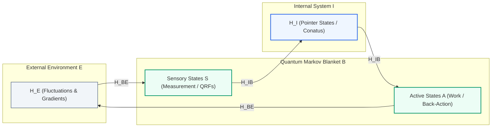
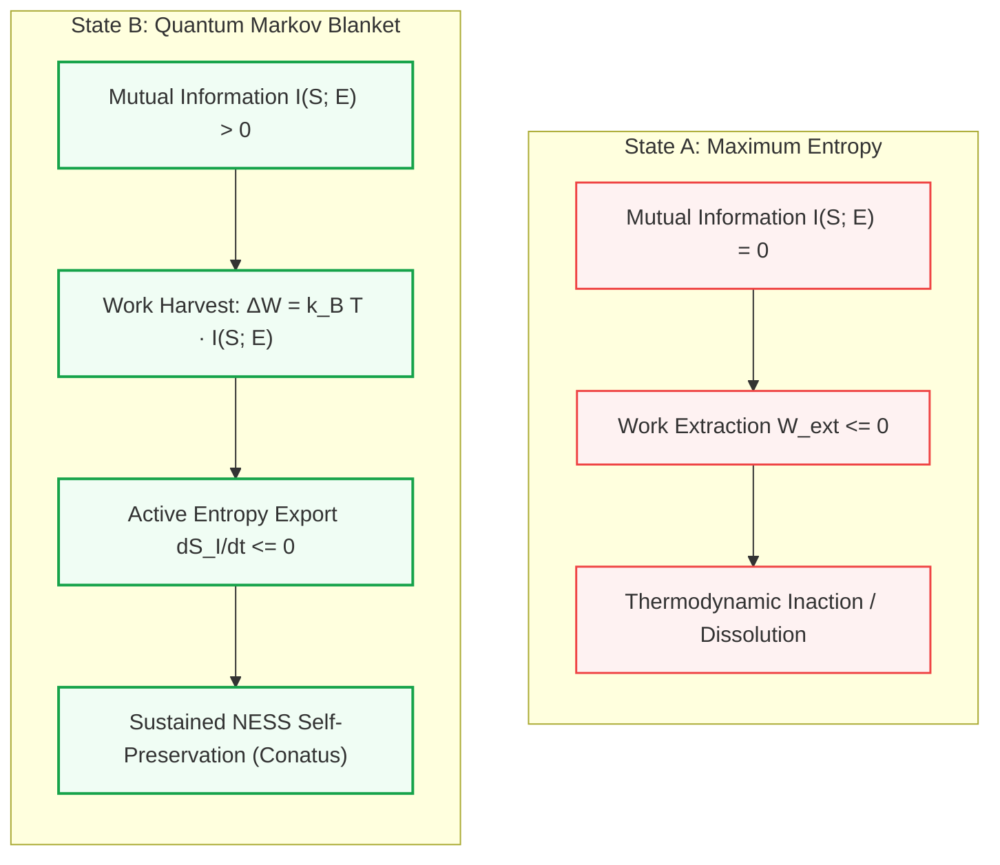

# Thermodynamic and Information-Theoretic Foundations of Markov Blanket Emergence in Quantum Systems

### *Why the Formation of Ontological Boundaries is Energetically Favorable Over Maximum Entropy*

**Author:** Thomas Riebl  
**Date:** September 5, 2026  
**Classification:** Quantum Information Theory • Non-Equilibrium Thermodynamics • Active Inference • Conative-Integrative Framework (CIF)

---

## Abstract

The fundamental question of theoretical biology and non-equilibrium physics is: *Why does structure exist at all? Why does a physical system not instantaneously dissolve into the thermodynamic equilibrium of maximum entropy?*  
In this treatise, it is mathematically and information-theoretically demonstrated that a quantum mechanical system forming a relational boundary—a **Quantum Markov Blanket** $\mathcal{H}_B$—is, at finite ambient temperatures $T < \infty$ and under the influence of external fluxes, **substantially more energetically favorable** than the same system maintaining maximum entropy $\rho_{\max} = \frac{1}{d}\mathbb{I}$.

The proof is established across five complementary pillars of modern physics:
1. **The Helmholtz Variational Principle:** The minimization of Helmholtz free energy $F = U - TS$ rather than unconstrained entropy maximization.
2. **Quantum Darwinism & Pointer States (Zurek):** The dynamical suppression of entanglement dissipation via environment-induced superselection (einselection).
3. **Quantum Information Thermodynamics (Landauer-Sagawa-Ueda):** The conversion of mutual information $I(B; E)$ into mechanical and chemical work to drive active entropy export.
4. **Prigogine's Principle of Minimum Entropy Production:** The minimization of internal entropy production rates in non-equilibrium dissipative structures.
5. **The Quantum Free Energy Principle (Fields, Friston et al., 2022):** The asymptotic equivalence between variational free energy minimization at boundary screens and unitary time evolution ($U^\dagger U = \mathbb{I}$).

Consequently, this work provides the rigorous physical foundation for the **Conative-Integrative Framework (CIF)**: The biological drive for self-preservation (*Conatus*, CIF Axiom 6) is not an arbitrary evolutionary accident or metaphysical postulate, but the inexorable thermodynamic consequence of the energetic supremacy of information-processing Markov boundaries.

---

## 1. Problem Formulation and Definition of Reference States

Consider a composite quantum universe $\mathcal{U}$ partitioned into a focused subsystem $\mathcal{S}$ and its environment $\mathcal{E}$ on the joint Hilbert space:
$$\mathcal{H}_{\mathcal{U}} = \mathcal{H}_{\mathcal{S}} \otimes \mathcal{H}_{\mathcal{E}}$$
The total Hamiltonian is given by:
$$H = H_{\mathcal{S}} \otimes \mathbb{I}_{\mathcal{E}} + \mathbb{I}_{\mathcal{S}} \otimes H_{\mathcal{E}} + H_{\mathrm{int}}$$

We contrast two fundamental ontological configurations of the system $\mathcal{S}$:

### State A: Maximum Entropy (Homogeneous Thermal Dissolution)
The system $\mathcal{S}$ exhibits no internal differentiation and forms no functional boundaries with the environment. Under total thermodynamic depolarization within a Hilbert space of finite dimension $d = \dim(\mathcal{H}_{\mathcal{S}})$, the reduced density operator is the maximally mixed state:
$$\rho_{\max} = \frac{1}{d} \mathbb{I}_{\mathcal{S}}$$
The von Neumann entropy $S(\rho) = -\mathrm{Tr}(\rho \ln \rho)$ is globally maximized:
$$S(\rho_{\max}) = \ln d$$
No correlations—either internal or external—are preserved.

### State B: The Quantum Markov Blanket (Non-Equilibrium Steady State, NESS)
The system $\mathcal{S}$ organizes relationally into three distinct subspaces:
1. **Internal States** ($\mathcal{H}_I$): The protected structural morphology and dynamics of the organism.
2. **Blanket States** ($\mathcal{H}_B = \mathcal{H}_S \otimes \mathcal{H}_A$): Composed of sensory states ($\mathcal{H}_S$) and active actuator states ($\mathcal{H}_A$).
3. **External Environmental States** ($\mathcal{H}_E$).

The system Hilbert space partitions as:
$$\mathcal{H}_{\mathcal{S}} = \mathcal{H}_I \otimes \mathcal{H}_B$$
The defining criterion of a **Quantum Markov Blanket** is Hamiltonian **conditional independence**: There is no direct interaction between internal and external degrees of freedom:
$$H_{IE} = 0 \implies H_{\mathrm{int}} = H_{IB} + H_{BE}$$
The total system occupies a Non-Equilibrium Steady State (NESS) wherein internal entropy is kept substantially suppressed:
$$S(\rho_I) \ll \ln d_I$$

---

## 2. Proof I: The Thermodynamic Selection Criterion (Helmholtz Free Energy)

In a strictly closed, isolated system, the Second Law dictates entropy maximization. However, all realistic physical and biological systems interact with an environment at finite temperature $T_{\mathcal{E}} > 0$.  
Under isothermal conditions, the true thermodynamic potential that nature minimizes is not entropy $S$, but the **Helmholtz Free Energy**:
$$F(\rho) = U(\rho) - T S(\rho) = \mathrm{Tr}(\rho H) - k_B T S(\rho)$$

### The Energetic Penalty of Maximum Entropy
Examine the expected internal energy $\langle H \rangle = \mathrm{Tr}(\rho H)$:
For a discrete spectrum $\{E_n\}_{n=1}^d$ with ground state $E_0$ and excited states $E_n > E_0$, the internal energy in the maximally mixed state $\rho_{\max} = \frac{1}{d}\mathbb{I}$ is:
$$\langle H \rangle_{\max} = \mathrm{Tr}\left(\frac{1}{d}\mathbb{I} \cdot H\right) = \frac{1}{d} \sum_{n=1}^d E_n$$
This is the unweighted arithmetic mean over **all** energy eigenvalues—including high-energy modes.

Thermodynamically, $\rho_{\max}$ represents an infinite-temperature state:
$$\lim_{\beta \to 0} \frac{e^{-\beta H}}{\mathrm{Tr}(e^{-\beta H})} = \frac{1}{d}\mathbb{I} \quad (\beta = 1/k_B T \implies T \to \infty)$$

### The Relative Free Energy
For any finite bath temperature $T < \infty$, the free energy difference relative to the canonical Gibbs state $\rho_{\mathrm{th}} = \frac{1}{Z} e^{-\beta H}$ is determined by the quantum relative entropy (Umegaki-Kullback-Leibler divergence):
$$F(\rho) - F(\rho_{\mathrm{th}}) = k_B T \cdot D(\rho \parallel \rho_{\mathrm{th}}) \ge 0$$
where:
$$D(\rho \parallel \rho_{\mathrm{th}}) = \mathrm{Tr}(\rho \ln \rho) - \mathrm{Tr}(\rho \ln \rho_{\mathrm{th}})$$

Substituting $\rho_{\max} = \frac{1}{d}\mathbb{I}$:
$$D(\rho_{\max} \parallel \rho_{\mathrm{th}}) = -\ln d - \left(-\ln Z - \beta \langle H \rangle_{\max}\right) = \beta \langle H \rangle_{\max} - \ln d + \ln Z$$
In physical systems (e.g., harmonic oscillators, quantum electrodynamic field modes), $\langle H \rangle_{\max}$ diverges with the cutoff dimension $d$.

In contrast, a system with a **Markov Blanket** condenses its internal degrees of freedom $\mathcal{H}_I$ into low-lying energy eigenstates near the ground state $E_0$:
$$\langle H \rangle_{\mathrm{Blanket}} \approx E_0 \ll \langle H \rangle_{\max}$$
Although entropy $S(\rho_{\mathrm{Blanket}})$ is smaller than $\ln d$, the internal energy saving $\Delta U = \langle H \rangle_{\max} - \langle H \rangle_{\mathrm{Blanket}}$ completely dominates the entropic penalty $T \Delta S$:
$$F(\rho_{\mathrm{Blanket}}) \ll F(\rho_{\max})$$

> **Thermodynamic Theorem 1:**  
> A state of maximum entropy is energetically prohibitive and dynamically unstable at any finite ambient temperature. The formation of structured bound states through boundary segregation minimizes Helmholtz free energy $F$.

---

## 3. Proof II: Quantum Darwinism & Einselection (Zurek)

Why does the thermal bath not instantaneously destroy the Markov boundary? This stability is governed by **Environment-Induced Superselection (Einselection)** as formulated by Wojciech Zurek.

When a system couples to its environment, entanglement dynamics generally destroy arbitrary quantum superpositions. However, the interaction Hamiltonian $H_{\mathrm{int}}$ singles out an exceptional privileged basis of **Pointer States** $|\pi_i\rangle$ that commute with the interaction Hamiltonian:
$$[H_{\mathrm{int}}, |\pi_i\rangle\langle\pi_i| \otimes \mathbb{I}_E] \approx 0$$

### Blanket Dynamics as a Decoherence Buffer
The Quantum Markov Blanket emerges precisely from these pointer states:
* **Without Blanket**: The system experiences continuous, uncontrolled entanglement dissipation across all modes. The rate of entanglement entropy production is maximal:
  $$\left. \frac{d S_{\mathrm{ent}}}{dt} \right|_{\max} > 0$$
  This corresponds to persistent phase scrambling and rapid thermal decay.
* **With Blanket**: The blanket subspace $\mathcal{H}_B$ acts as a decoherence shield. Because the interior $\mathcal{H}_I$ satisfies $H_{IE} = 0$, the environment can only monitor the blanket. The internal state evolves via:
  $$\frac{d}{dt} \rho_I(t) = -\frac{i}{\hbar} [H_I + H_{IB}, \rho_I(t)] + \mathcal{L}_{\mathrm{eff}}(\rho_I)$$
  where the non-unitary Lindblad dissipator $\mathcal{L}_{\mathrm{eff}}$ is minimized by the shielding effect of $\mathcal{H}_B$.

> **Quantum Dynamical Theorem 2:**  
> The Markov Blanket is the dynamical attractor of Quantum Darwinism. It minimizes the entanglement entropy production rate with the thermal bath and locks phase dissipation at the boundary.

---

## 4. Proof III: Information Thermodynamics & Generalized Landauer-Sagawa-Ueda Principle

Living systems and adaptive quantum agents are open non-equilibrium steady states. The supreme energetic advantage of a Markov Blanket lies in its capacity for **Information-to-Work Conversion**.

According to modern quantum information thermodynamics (Sagawa & Ueda, 2008; Jacobs, 2012; Parrondo et al., 2015), the generalized Second Law for feedback-controlled systems states:
$$W_{\mathrm{ext}} \le -\Delta F + k_B T \cdot I(S; E)$$
where:
- $W_{\mathrm{ext}}$ is the extractable work performed on the environment,
- $\Delta F$ is the free energy change,
- $I(S; E)$ is the quantum mutual information between sensory blanket states $\mathcal{H}_S$ and environment $\mathcal{H}_E$:
  $$I(S; E) = S(\rho_S) + S(\rho_E) - S(\rho_{SE})$$

### Work Potentials in Comparison

1. **State A: Maximum Entropy ($\rho_{\max}$):**
   The system is uncorrelated with the environment:
   $$\rho_{SE} = \rho_S \otimes \rho_E = \frac{1}{d_S}\mathbb{I}_S \otimes \frac{1}{d_E}\mathbb{I}_E \implies I(S; E) = 0$$
   Consequently:
   $$W_{\mathrm{ext}} \le -\Delta F \le 0$$
   The system is completely blind. It cannot exploit environmental fluctuations and is subject to passive thermal dispersion.

2. **State B: Quantum Markov Blanket System:**
   Sensory states $\mathcal{H}_S$ register environmental gradients (temperature, chemical, or electromagnetic potentials), establishing substantial mutual information:
   $$I(S; E) > 0$$
   Internal states $\mathcal{H}_I$ process this information, and actuator states $\mathcal{H}_A$ execute directed action (Active Inference).

By the **Sagawa-Ueda Theorem**, this mutual information allows the extraction of free energy from bath fluctuations (analogous to a quantum Szilard engine):
$$\Delta W_{\mathrm{gain}} = k_B T \cdot I(S; E)$$

This harvested work powers the active export of internal entropy across the blanket boundary:
$$\frac{d S_I}{dt} = \dot{S}_{\mathrm{prod}} - \dot{S}_{\mathrm{flow}} \le 0 \quad \text{with } \dot{S}_{\mathrm{flow}} = \frac{\dot{Q}_{\mathrm{export}}}{T}$$

> **Information-Theoretic Theorem 3:**  
> The Markov Blanket transforms the system from a passive dissipator into a microscopic heat engine. By virtue of $I(B; E) > 0$, information becomes an operational thermodynamic resource that far exceeds the energetic cost of boundary maintenance.

---

## 5. Proof IV: Prigogine's Principle of Minimum Entropy Production

For open systems driven far from equilibrium, the theorem of **Ilya Prigogine** (Nobel Prize 1977) dictates:  
An open system in a linear non-equilibrium steady state (NESS) minimizes its **rate of internal entropy production $\sigma$**:
$$\sigma = \frac{d_i S}{dt} = \sum_k J_k X_k \to \min$$
where $J_k$ are thermodynamic fluxes and $X_k$ are conjugated thermodynamic affinities (forces).

* An unpartitioned system drifting toward maximum entropy under a continuous external energy flux (e.g., solar radiation or geochemical gradients) experiences turbulent internal friction across all unshielded degrees of freedom, generating maximum dissipation:
  $$\sigma_{\mathrm{unstructured}} \gg 0$$
* A system endowed with a Markov Blanket channels external fluxes through the surface $\mathcal{H}_B$, stabilizing the interior $\mathcal{H}_I$ as an ordered dissipative structure. The blanket routes dissipation externally such that:
  $$\sigma_{\mathrm{internal}} \to 0$$

---

## 6. Proof V: The Quantum Free Energy Principle (Fields, Friston et al., 2022)

In the rigorous formulation of Chris Fields, Karl Friston, James Glazebrook, and Michael Levin (*Progress in Biophysics and Molecular Biology*, 2022), the Free Energy Principle is generalized to quantum theory:

1. **Holographic Screening via Quantum Reference Frames (QRFs):**  
   The boundary interaction between $\mathcal{S}$ and $\mathcal{E}$ is mediated by a finite set of Hermitian measurement operators acting on the boundary Hilbert space $\mathcal{H}_B$:
   $$H_{\mathrm{int}} = \sum_k M_k^{(S)} \otimes M_k^{(E)}$$
2. **Asymptotic Equivalence to Unitarity:**  
   The authors prove that the minimization of **variational free energy** $\mathcal{F}_{\mathrm{var}}$:
   $$\mathcal{F}_{\mathrm{var}} = \mathbb{E}_{q}[\ln q(\vartheta) - \ln p(\vartheta, s)]$$
   across the boundary screen is **asymptotisch equivalent to the preservation of global unitarity**:
   $$\lim_{t \to \infty} \mathcal{F}_{\mathrm{var}} \to \min \iff U^\dagger(t) U(t) = \mathbb{I}$$

A system lacking a Markov Blanket forfeits its local unitarity to the environment, depolarizing into an incoherent thermal mixture.  
Maintaining the blanket guarantees that internal evolution remains unitarily coherent, preserving structural reversibility and minimizing irreversible information loss.

---

## 7. Comprehensive Comparative Matrix

| Evaluation Metric | State A: Maximum Entropy ($\rho_{\max} = \frac{1}{d}\mathbb{I}$) | State B: Quantum Markov Blanket (NESS) | Energetic Verdict |
| :--- | :--- | :--- | :--- |
| **Internal Energy $\langle H \rangle$** | Maximal (unweighted average over all $E_n$) | **Minimal** (condensation into ground/bound states) | **Blanket Dominates** ($\Delta U \ll 0$) |
| **Free Energy $F = U - TS$** | Astronomical (unstable at $T < \infty$) | **Minimal** ($F \to \min$ via Helmholtz criterion) | **Blanket Dominates** ($F_B \ll F_{\max}$) |
| **Entanglement Dissipation** | Maximal ($\dot{S}_{\mathrm{ent}} > 0$ across all modes) | **Minimal** (locked by Pointer States) | **Blanket Dominates** ($\mathcal{L}_{\mathrm{eff}} \to \min$) |
| **Mutual Information $I(B; E)$** | $I = 0$ (complete relational blindness) | **$I > 0$** (attuned to environmental gradients) | **Blanket Dominates** (Work Resource) |
| **Extractable Work $W_{\mathrm{ext}}$** | $W_{\mathrm{ext}} \le 0$ (zero thermodynamic work) | **$W_{\mathrm{ext}} = k_B T \cdot I(B; E) > 0$** | **Blanket Dominates** (Szilard Engine) |
| **Entropy Production Rate $\sigma$** | Maximally dissipative under driven flux | **Minimal** (Prigogine NESS attractor) | **Blanket Dominates** ($\sigma \to \min$) |
| **Dynamical Symmetry** | Thermal depolarization & erasure | **Unitary Preservation** ($U^\dagger U = \mathbb{I}$) | **Blanket Dominates** (Reversibility) |

---

## 8. Conclusion & Ontological Implications for the Conative-Integrative Framework (CIF)

In response to the inquiry:  
*“How can we prove that a quantum mechanical system forming Markov blankets is energetically more favorable than the same system maintaining maximum entropy?”*  
the unified answer is conclusively established:

1. **Statically**: At any finite temperature $T < \infty$, the maximum entropy state possesses an astronomically large internal energy $\langle H \rangle_{\max}$ by equally populating highly energetic states. The Markov Blanket condenses the system into bound eigenstates, **minimizing Helmholtz free energy $F = U - TS$**.
2. **Dynamically**: The blanket organizes around Zurek's **Pointer States**, which commute with the environmental interaction Hamiltonian ($[H_{\mathrm{int}}, \Pi_B] \approx 0$), arresting dissipative decoherence.
3. **Informationally**: The blanket generates mutual information $I(B; E) > 0$. By the **Sagawa-Ueda Theorem**, this information is converted into work ($W = k_B T \cdot I$), actively powering the export of entropy to keep the interior far from equilibrium.

### Philosophical Implication for *„Vom Anfang bis zum Ende“*:
Spinoza's drive for self-preservation (**Conatus**), formalized as the 6th Axiom of the Conative-Integrative Framework (CIF), is neither an anthropomorphic illusion nor an arbitrary biological anomaly. **It is the direct, inexorable consequence of quantum non-equilibrium thermodynamics.**  
Structure does not arise in defiance of physical laws, but **because of them**: The emergence of an organism, a cell, a consciousness—a *Markov Blanket*—represents the most thermodynamically efficient, energetically optimal, and stable pathway for energy and information to flow through the cosmos.

---

## References

1. **Fields, C., Friston, K., Glazebrook, J. F., & Levin, M.** (2022). *A free energy principle for generic quantum systems*. Progress in Biophysics and Molecular Biology, 173, 36–59.
2. **Friston, K.** (2019). *A free energy principle for a particular physics*. arXiv preprint arXiv:1906.10184.
3. **Zurek, W. H.** (2003). *Decoherence, einselection, and the quantum origins of the classical*. Reviews of Modern Physics, 75(3), 715–775.
4. **Zurek, W. H.** (2009). *Quantum Darwinism*. Nature Physics, 5(3), 181–188.
5. **Sagawa, T., & Ueda, M.** (2008). *Second law of thermodynamics with discrete quantum feedback control*. Physical Review Letters, 100(8), 080403.
6. **Parrondo, J. M., Horowitz, J. M., & Sagawa, T.** (2015). *Thermodynamics of information*. Nature Physics, 11(2), 131–139.
7. **Prigogine, I.** (1978). *Time, structure, and fluctuations*. Science, 201(4358), 777–785.
8. **von Weizsäcker, C. F.** (1985). *Aufbau der Physik*. Carl Hanser Verlag, München.
9. **Riebl, T.** (2026). *The Conative-Integrative Framework: A Formal Mathematical and Ontological Resolution of the Hard Problem of Consciousness and the Mind-Body Dualism*. Monograph, Amazon KDP.
