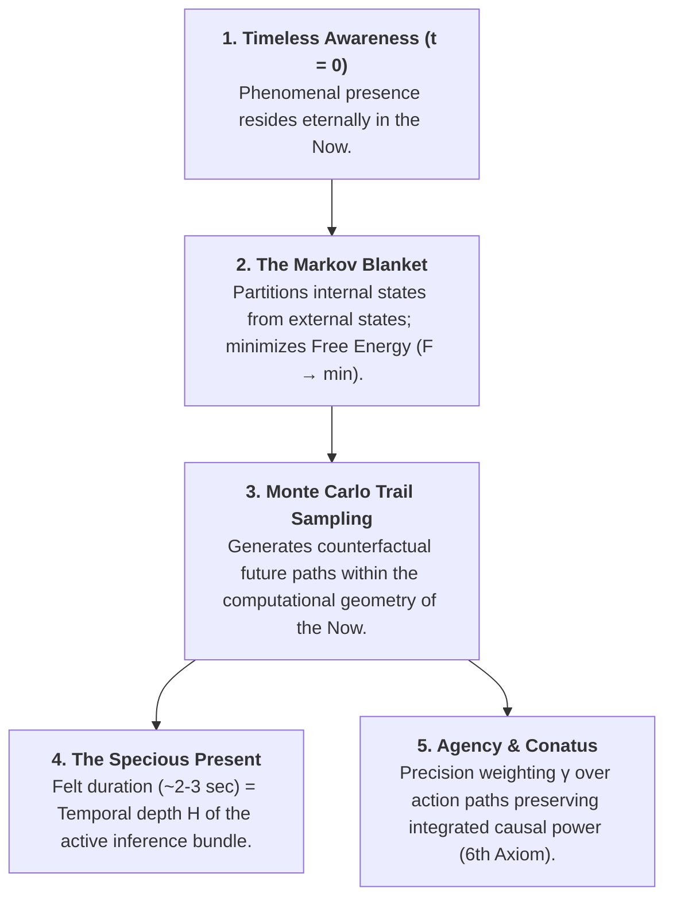

# Monte Carlo Trails in Active Inference: Simulation, Mathematical Mechanics & the Ontology of Book 2

> *"The future does not exist as an external, pre-fabricated physical container. It is an ensemble of stochastic Monte Carlo trails actively sampled by the Markov blanket in the dimensionless present. The phenomenal sensation of temporal duration—the Specious Present—is precisely the temporal depth $H$ of this active inference bundle."*  
> — **Thomas Riebl**, *The Conative-Integrative Framework*

---

## 1. Visual & Programmatic Architecture: The Monte Carlo Trail Ensemble

Within the **Conative-Integrative Framework (CIF)**, we have developed and executed a rigorous stochastic simulation demonstrating how an active inference agent generates, evaluates, and selects counterfactual future trajectories under sensory noise and environmental perturbations.

* 💻 **Simulation Script:** [`simulate_monte_carlo_trails.py`](file:///home/thr/Documents/active-inference-phi-network/scripts/simulate_monte_carlo_trails.py)
* 📓 **Interactive Jupyter Notebook:** [`Monte_Carlo_Trails_Active_Inference.ipynb`](file:///home/thr/Documents/active-inference-phi-network/notebooks/Monte_Carlo_Trails_Active_Inference.ipynb)
* 🖼️ **Generated High-Resolution Figure:** [`monte_carlo_trails_simulation.png`](file:///home/thr/Documents/active-inference-phi-network/images/monte_carlo_trails_simulation.png)

```
┌────────────────────────────────────────────────────────────────────────────────────────┐
│                        STRUCTURE OF THE 300 DPI PUBLICATION FIGURE                     │
├────────────────────────────────────────┬───────────────────────────────────────────────┤
│ PANEL A (Left, primary):               │ PANEL B (Top Right):                          │
│ The Bundle of 60 Monte Carlo Trails    │ KDE Distribution of Expected Free Energy      │
│                                        │ G(π) across candidate trails                  │
│ • Red marker: State s₀ at t = 0        │ • Minimum G (best trail) indicated            │
│ • Grey lines: 60 stochastic trails     ├───────────────────────────────────────────────┤
│ • Blue band: 68% ensemble confidence   │ PANEL C (Bottom Right):                       │
│ • Green dashed: Homeostatic target s*  │ Softmax Selection Probabilities P(π) ~ σ(-γG) │
│ • Blue trajectory: Selected trail π*   │ • Blue bar (#1) dominates selection           │
│                                        │ • Ranked by fitness of top candidate policies │
└────────────────────────────────────────┴───────────────────────────────────────────────┘
```


### Simulation Dynamics & Empirical Findings:
1. **Perturbed Initial State ($s_0 = 3.5$, red marker):** The system begins displaced from its preferred homeostatic equilibrium ($s^* = 0.0$).
2. **The Stochastic Pathfinder Ensemble ($N = 60$ trails, horizon $H = 25$):** In the immediate present ($t = 0$), the agent projects 60 counterfactual action paths, subject to environmental and sensory fluctuations $\epsilon \sim \mathcal{N}(0, \sigma^2)$ with $\sigma = 0.35$.
3. **Entropy Resistance & Homeostatic Convergence:** Despite continuous stochastic perturbations, the ensemble distribution (light blue 68% confidence ribbon) converges decisively toward the homeostatic attractor ($s^* = 0.0$).
4. **Softmax Policy Selection (Panels B & C):** The policy path minimizing Expected Free Energy $\mathbf{G}(\pi)$ is prioritized via the precision-weighted Boltzmann operator ($\gamma = 2.5$).

---

## 2. Mathematical Formulation & Variational Mechanics

### A. Formal Definition of a Monte Carlo Trail
A Monte Carlo trail $\tau$ is a discrete path in phase space spanning the temporal planning horizon $H$:
$$\tau \equiv \big( s_0, u_0, s_1, u_1, \dots, s_H \big)$$
where $u_t \in \mathcal{U}$ represents control actions and $s_t \in \mathcal{S}$ denotes hidden system states.

### B. Expected Free Energy (EFE) Functional
Each candidate policy trail $\pi = (u_0, u_1, \dots, u_{H-1})$ is evaluated by its cumulative epistemic and pragmatic fitness:

$$\mathbf{G}(\pi) = \sum_{\tau=1}^H \underbrace{\mathcal{D}_{\mathrm{KL}}\big(Q(s_\tau \mid \pi) \,\|\, P(s_\tau)\big)}_{\text{\textbf{Pragmatic Value (Homeostatic Conatus)}}} + \underbrace{\mathbb{E}_{Q}\big[\mathcal{H}[P(o_\tau \mid s_\tau)]\big]}_{\text{\textbf{Epistemic Value (Ambiguity Reduction)}}}$$

* **Pragmatic Value (Extrinsic):** Minimizes divergence between predicted sensory outcomes and prior preferences $P(s_\tau)$, enforcing autopoietic self-preservation in accordance with the 6th Axiom ($\mathbb{E}[\Delta \Phi] \ge 0$).
* **Epistemic Value (Intrinsic):** Maximizes information gain regarding ambiguous environmental parameters, driving adaptive exploration.

### C. Boltzmann / Softmax Selection Rule
Policy probabilities are computed via the softmax normalization over precision-weighted negative expected free energies:

$$P(\pi) = \sigma\big(-\gamma \mathbf{G}(\pi)\big) = \frac{\exp\big(-\gamma \mathbf{G}(\pi)\big)}{\sum_{\pi'} \exp\big(-\gamma \mathbf{G}(\pi')\big)}$$

### D. Action Precision $\gamma$ (Inverse Temperature) as Cognitive Governor
* **$\gamma \to \infty$ (Brittle Determinism):** The agent exclusively exploits the single lowest-cost path. In unstable or highly non-stationary environments, this rigid behavior causes catastrophic collapse upon encountering unmodeled perturbations.
* **$\gamma \to 0$ (Thermal Diffusion):** All candidate trails receive equal probability; intentionality dissolves into thermodynamic maximum entropy.
* **Biological Correlate:** In biological nervous systems, $\gamma$ is modulated by ascending neuromodulatory systems (dopamine and norepinephrine). High perceived predictive confidence increases $\gamma$, while heightened environmental volatility lowers $\gamma$ to trigger exploratory Monte Carlo sampling.

---

## 3. Ontological Integration into Book 2: *From Beginning to End*

The Monte Carlo trail formulation is not merely an engineering heuristic; it provides the **physical and informational foundation for the ontology of mind, time, and agency**:



### 1. The Resolution of the *Specious Present*
* **The Paradox:** If reality exists solely in the dimensionless instant ($t = 0$), why do conscious beings experience a felt temporal duration spanning approximately $2-3$ seconds?
* **The Solution:** The Markov blanket does not process instantaneous sensory inputs in isolation. Instead, it sustains a **dense superposition of counterfactual Monte Carlo trails simultaneously in present memory**. What phenomenology terms the *Specious Present* is literally the **temporal depth $H$ of the generative model's active inference fan**.

### 2. The Nature of Conscious Agency (Free Will & Conatus)
In the *Conative-Integrative Framework*, agency is neither supernatural intervention nor fatalistic illusion:
> **Conscious agency is the capacity of an autopoietic system to actively weight its Monte Carlo trail sampling such that integrated causal power is sustained across time:**
> $$\mathbb{E}\big[\Phi(t+1) \;\big|\; \pi^*\big] \ge \Phi(t) \quad (\Phi > 0)$$
The living organism actively resists thermodynamic decay by selectively amplifying trajectories that preserve its structural integrity and causal integration.

### 3. Dissolution of Existential Anxiety: Stoic Equanimity (*Amor Fati*)
* Pathological anxiety arises from an ontological error: mistaking an internally generated, high-risk Monte Carlo trail for an inevitable objective reality.
* **The Stoic Insight:**  
  A catastrophic counterfactual projection is not reality; it is merely an **unweighted sample in the generative model's present phase space**.  
  In the actual Now, the catastrophe does not exist. The rational agent executes the optimal action in the present ($u_0 = \pi^*[0]$) and regards all stochastic fluctuations with unshakeable equanimity.

---

## 4. Comprehensive Academic References & Relevant Literature

1. **Fountas, Z., Sajid, N., Mediano, P. A. M., & Friston, K. (2020).**  
   *Deep active inference agents using Monte-Carlo methods.*  
   *Advances in Neural Information Processing Systems (NeurIPS 2020)*, 33, 11662–11675.  
   *(Introduces Monte Carlo tree search and stochastic trajectory sampling into deep active inference).*

2. **Da Costa, L., Parr, T., Sajid, N., Veselic, S., Neacsu, V., & Friston, K. (2020).**  
   *Active inference on discrete state-spaces: A synthesis.*  
   *Journal of Mathematical Psychology*, 99, 102447.  
   *(Foundational mathematical formulation of discrete POMDP categorical sampling, likelihood tensors, and policy inference).*

3. **Friston, K., FitzGerald, T., Rigoli, F., Schwartenbeck, P., & Pezzulo, G. (2017).**  
   *Active inference: A process theory.*  
   *Neural Computation*, 29(1), 1–49.  
   *(Comprehensive formulation of Expected Free Energy $G$, epistemic value, and precision-weighted policy selection).*

4. **Parr, T., & Friston, K. J. (2018).**  
   *The anatomy of choice: Active inference and agency.*  
   *Cognitive Neuroscience*, 9(1-2), 11–27.  
   *(Formalizes intentional agency through counterfactual policy search over extended temporal horizons).*

5. **Gershman, S. J. (2019).**  
   *The generative adversary in brain and machine.*  
   *Trends in Cognitive Sciences*, 23(1), 8–17.  
   *(The neural sampling hypothesis: the brain as a stochastic Monte Carlo sampler of posterior probability distributions).*

6. **Tononi, G., Albantakis, L., Boly, M., Massimini, M., & Koch, C. (2023).**  
   *Integrated information theory (IIT) 4.0: Formulating the properties of phenomenal existence in physical terms.*  
   *PLOS Computational Biology*, 19(10), e1011465.  
   *(Formal physical and mathematical properties of cause-effect structures and integrated information $\Phi$).*

7. **Husserl, E. (1928).**  
   *Vorlesungen zur Phänomenologie des inneren Zeitbewusstseins.* (M. Heidegger, Ed.). Halle a. d. S.: Max Niemeyer.  
   *(Phenomenological architecture of temporal experience: Retention, Primal Impression, and Protention).*

8. **James, W. (1890).**  
   *The Principles of Psychology.* New York: Henry Holt and Company.  
   *(Original formulation of the 'Specious Present' as the felt duration of conscious experience).*

9. **Metzinger, T. (2003).**  
   *Being No One: The Self-Model Theory of Subjectivity.* Cambridge, MA: MIT Press.  
   *(Analysis of phenomenal temporal windows and the virtual simulation of selfhood in conscious brains).*

10. **Spinoza, B. (1677).**  
    *Ethica Ordine Geometrico Demonstrata.*  
    *(Proposition 6 & 7, Part III: Conatus sese conservandi—the striving by which each thing endeavors to persevere in its being).*

11. **Spira, R. (2017).**  
    *The Nature of Consciousness: Essays on the Unity of Mind and Matter.* Oxford: Sahaja Publications.  
    *(Non-dual epistemology of the radical present and the illusory nature of psychological time).*

12. **Riebl, T. (2026).**  
    *The Conative-Integrative Framework (CIF): Time, Temporal Depth & Consciousness.*  
    *Repository: [https://github.com/Thriebl/time-and-consciousness](https://github.com/Thriebl/time-and-consciousness).*

---

## Tool Attribution & Colophon

> **Tooling Colophon:**  
> This theoretical treatise, simulation methodology, and scientific synthesis were conceptualized and authored by **Thomas Riebl** (Luxembourg) as part of **The Conative-Integrative Framework (CIF)** and **Book 2 (*From Beginning to End*)**.  
> The conceptual formulation, mathematical modeling, simulation scripts, vector diagrams, and multi-format document compilation (Word `.docx`, Print-Ready A4 Portrait PDF, and Jupyter Notebooks) were developed with the assistance of **Google Gemini (Antigravity Advanced Agentic Coding System)** (September 2026).

---

### Vault & Repository References
* **Repository (Active Inference Phi Network):** [`https://github.com/Thriebl/active-inference-phi-network`](https://github.com/Thriebl/active-inference-phi-network)
* **Repository (Time & Consciousness):** [`https://github.com/Thriebl/time-and-consciousness`](https://github.com/Thriebl/time-and-consciousness)
* **Vault Archive:** [`/home/thr/Documents/ThRNotes/03-professional/braindumps/`](file:///home/thr/Documents/ThRNotes/03-professional/braindumps/)
